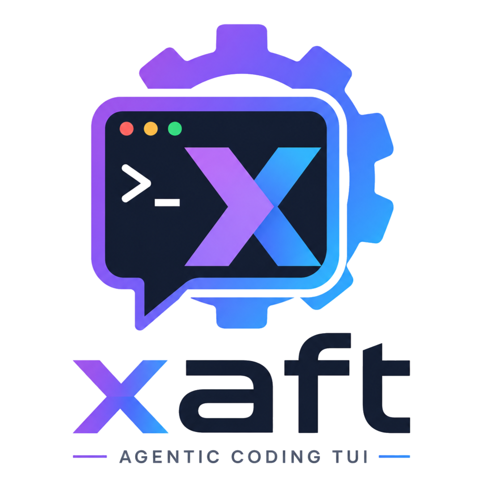

# xaft

**A next-generation autonomous Rust-native coding agent runtime.**

<p align="center">
  
</p>

```bash
cargo install xaft   # or build from source — see Quick start below
```


[Architecture](docs/guides/architecture.md) · [Quickstart](docs/guides/quickstart.md) · [CLI Reference](docs/reference/cli.md) · [Contributing](CONTRIBUTING.md)

---

## What it does

xaft is a production-grade, Rust-native runtime for autonomous coding agents.
It plans, executes, verifies, and delivers code changes — with full
transactional safety, real-time observability, and multi-agent orchestration.

Give it a task in plain English. It reads your codebase, formulates a plan,
edits files, runs tests, and commits the result. Every mutation is reversible.
Every action is observable. Every agent is accountable.

```bash
xaft run "Add error handling to all public functions in src/api/"
```

### Key capabilities

| Feature | Description |
|---|---|
| **Autonomous execution** | Plan → Code → Verify → Commit pipeline with multi-agent handoff (Planner → Coder → QA → Fixer) |
| **Transactional safety** | Git worktree isolation per session, fuzzy-anchor file edits, path-traversal protection, approval gates |
| **Multi-agent orchestration** | `HandoffOrchestrator`, dynamic `AgentRegistry`, inter-agent delegation via `HandoffTool` |
| **Real-time observability** | SignalBus event system, live TUI dashboard, structured tracing, cost tracking |
| **Streaming architecture** | Zero-copy token streaming, tokio async runtime, lock-free signal emission |
| **Modes** | Safe → Plan → Yolo cycle with agenthicc-compatible aliases (yolo/ask/guard/review) |
| **Extensibility** | Trait-based tool system, plugin architecture, MCP integration, custom planners |
| **Reversibility** | Git worktree per session, auto-commit on success, rollback on failure |
| **Session persistence** | Durable SQLite sessions, per-agent conversations, `--resume` with transcript replay |
| **Memory** | Session/project/global tiers with recall/remember/summarize/forget tools |

---

## Quick start

### Requirements

- Rust 1.86 or newer (edition 2024 workspace)
- An LLM provider: Anthropic (default), OpenAI, Ollama, or LiteLLM

### Build from source

```bash
git clone https://github.com/jymchng/xaft
cd xaft
cargo build --workspace
```

The `xaft` binary lands in `target/debug/xaft` (or use `cargo run --`).

### Configure a provider

```bash
# Anthropic (default)
export ANTHROPIC_API_KEY="sk-ant-..."

# OpenAI
xaft config set execution.provider openai
xaft config set execution.model gpt-4o

# Ollama (no API key needed)
xaft config set execution.provider ollama
xaft config set execution.model llama3.2
```

Configuration persists in `~/.config/xaft/xaft.toml` or `.xaft/xaft.toml`.
See the [configuration guide](docs/guides/configuration.md) for precedence.

### Run your first task

```bash
xaft run "Add error handling to all public functions in src/api/"
```

- Add `--dry-run` to plan without executing.
- Add `--headless` for a stdin JSON-lines interface (CI/CD pipelines).
- Launch with no task to type into the interactive TUI.

### Interactive TUI

```bash
xaft               # launch with no task — type your task in the input bar
xaft "Fix the type error in src/"   # or provide a task and watch it execute
```

- `/` command picker · `@` file mention picker · `$` skill picker · `#` history
- Shift+Tab cycles modes Safe → Plan → Yolo
- `/cost` (`/usage`) shows token/cost; `/config` shows resolved config
- `--resume <session-id>` replays the newest 20 turns with a `Loading transcript…` label

---

## Screenshots

<div align="center">


</div>

---

## Why xaft

Existing coding agents are either closed-source SaaS products or thin wrappers
around LLM APIs. xaft is neither. It is a **runtime** — a systems-level
execution engine purpose-built for autonomous code modification.

| Concern | xaft Approach |
|---------|---------------|
| **Safety** | Transactional workspace, git worktree isolation, approval gates, path traversal protection |
| **Observability** | SignalBus event system, real-time TUI dashboard, structured tracing, cost tracking |
| **Orchestration** | Multi-agent handoff (Planner → Coder → QA → Fixer), dynamic agent registry |
| **Reversibility** | Git worktree per session, auto-commit on success, full rollback on failure |
| **Extensibility** | Trait-based tool system, plugin architecture, MCP integration, custom planners |
| **Performance** | Zero-copy streaming, tokio async runtime, lock-free signal emission |

---

## Architecture

```text
crates/
├── xaft-tui        # Conversational streaming terminal renderer
├── xaft-runtime    # Core runtime, event loop, provider factory, orchestration
├── xaft-cli        # CLI entry point + command dispatch
├── xaft-tools      # fs/git/shell tools + dynamic factory + registry
├── xaft-agent      # Agent loop: streaming, signals, plan mode
├── xaft-agents     # Planner/Coder/QA/Fixer named agents + registry
├── xaft-config     # Typed config, TOML load/merge, hot-reload watcher
├── xaft-session    # Durable session + conversation persistence
├── xaft-memory     # Memory tools
└── xaft-skills     # Loadable agent knowledge files
```

The runtime is event-driven: three concurrent tasks (runtime loop, terminal
event reader, tick spawner) feed a single `mpsc` channel; the TUI render loop
drains it and repaints — single-threaded, lock-free. See
[Architecture](docs/guides/architecture.md).

---

## Documentation

- [Quickstart](docs/guides/quickstart.md) — install, configure, first task
- [Architecture](docs/guides/architecture.md) — event-driven runtime, crate map
- [Configuration](docs/guides/configuration.md) — TOML, env overrides, hot reload
- [Modes](docs/guides/modes.md) — Safe → Plan → Yolo cycle and aliases
- [TUI](docs/guides/tui.md) — triggers, paste, approvals, resume, telemetry
- [Workflows](docs/guides/workflows.md) — plan → code → verify → commit
- [Tools](docs/guides/tools.md) — filesystem, git, shell, dynamic tools
- [Memory](docs/guides/memory.md) — tiers and memory tools
- [Security](docs/guides/security.md) — approval gates, sandboxing
- [Reference: CLI](docs/reference/cli.md) · [Reference: kernel](docs/reference/kernel.md) · [Reference: storage](docs/reference/storage.md)

---

## Contributing

See [CONTRIBUTING.md](CONTRIBUTING.md) and the
[contributing guide](docs/contributing.md). Please read `CLAUDE.md` and
`AGENTS.md` before opening a PR.

## License

Licensed under either of Apache License, Version 2.0 or MIT license at your
option (see [LICENSE](LICENSE) and [LICENSE-APACHE](LICENSE-APACHE)).
