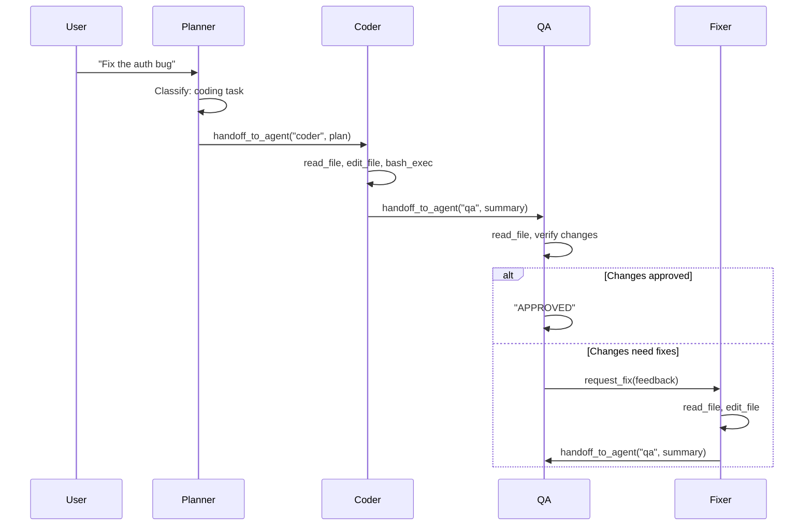
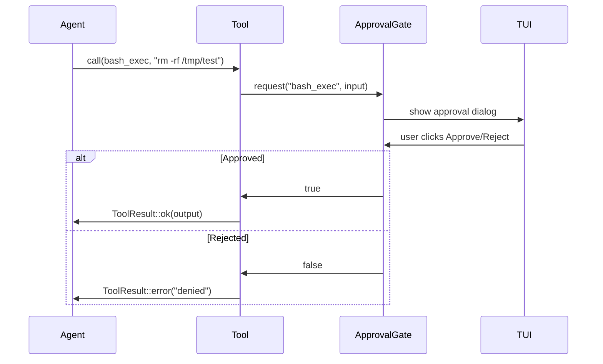
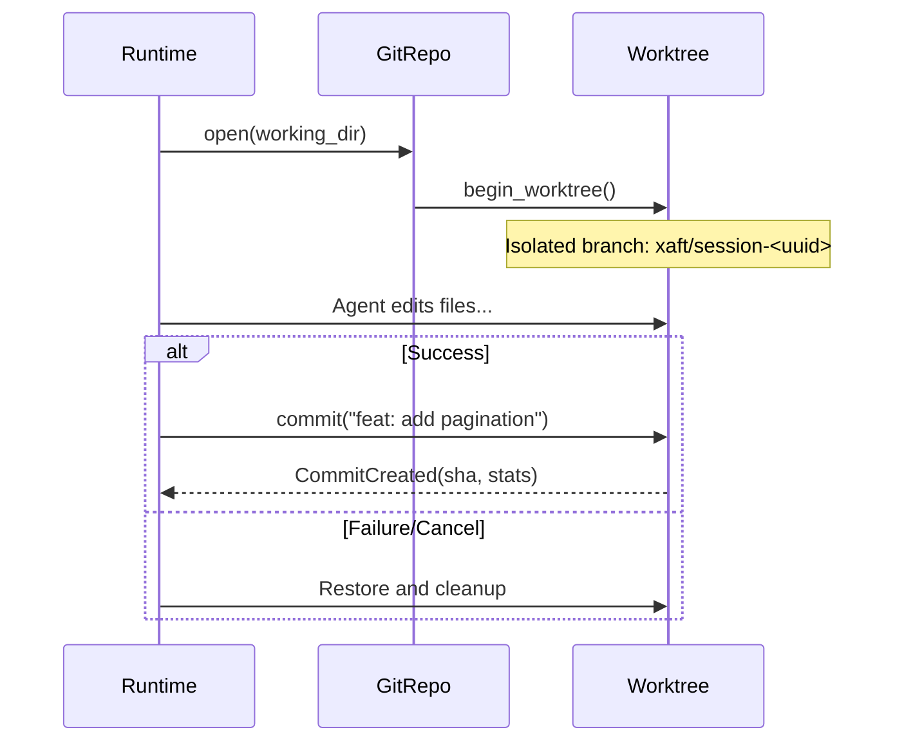

<div align="center">


**A next-generation autonomous Rust-native coding agent runtime.**

[](https://www.rust-lang.org/)
[](#license)
[](https://crates.io)

[Architecture](docs/architecture/) · [Getting Started](docs/getting-started/) · [API Reference](docs/internals/) · [Contributing](docs/contributing/)

</div>

---

xaft is a production-grade, Rust-native runtime for autonomous coding agents. It plans, executes, verifies, and delivers code changes — with full transactional safety, real-time observability, and multi-agent orchestration.

Give it a task in plain English. It reads your codebase, formulates a plan, edits files, runs tests, and commits the result. Every mutation is reversible. Every action is observable. Every agent is accountable.

```bash
xaft run "Add error handling to all public functions in src/api/"
```

---

## Why xaft

Existing coding agents are either closed-source SaaS products or thin wrappers around LLM APIs. xaft is neither. It is a **runtime** — a systems-level execution engine purpose-built for autonomous code modification.

| Concern | xaft Approach |
|---------|---------------|
| **Safety** | Transactional workspace, git worktree isolation, approval gates, path traversal protection |
| **Observability** | SignalBus event system, real-time TUI dashboard, structured tracing, cost tracking |
| **Orchestration** | Multi-agent handoff (Planner → Coder → QA → Fixer), dynamic agent registry |
| **Reversibility** | Git worktree per session, auto-commit on success, full rollback on failure |
| **Extensibility** | Trait-based tool system, plugin architecture, MCP integration, custom planners |
| **Performance** | Zero-copy streaming, tokio async runtime, lock-free signal emission |

---

## Screenshots

<div align="center">


</div>

---

## Features

### Autonomous Execution

- **Plan → Code → Verify → Commit** pipeline with multi-agent handoff
- Planner classifies tasks as informational (direct answer) or coding (full workflow)
- Coder reads, edits, and verifies changes; QA reviews; Fixer addresses feedback
- Up to 14 handoffs with automatic cycle detection

### Transactional Safety

- Git worktree isolation per session — your working tree is never modified directly
- `FileEditor` with fuzzy anchor matching and atomic commit semantics
- Path traversal protection on all file operations
- Shell command sandboxing with configurable execution policy
- Three-tier approval system: per-tool confirmation, TUI approval dialogs, auto-approve gates

### Multi-Agent Orchestration

- `HandoffOrchestrator` coordinates Planner, Coder, QA, and Fixer agents
- `AgentRegistry` for dynamic agent definition and tool assignment
- `HandoffTool` for inter-agent delegation with allowed-target validation
- `RequestFixTool` for QA-to-Fixer escalation

### Real-Time Observability

- `SignalBus` — type-safe, broadcast-based event system
- `EventBridge` — bridges runtime signals to TUI events
- Live token/cost dashboard with per-agent breakdown
- Inline diff viewer for file modifications
- Agent activity tracker with status indicators
- Structured tracing with file-based log rotation

### Streaming Architecture

- Zero-copy `StreamEvent` pipeline from LLM provider to consumer
- `tokio::select! { biased }` with cancellation token priority
- `ChannelSink` / `CollectSink` / `NopSink` for flexible stream routing
- `TokenStreamRenderer` for progressive text display

### Configuration

- Six-layer precedence: CLI → env → session → project → global → defaults
- Deep merge with `null` preservation semantics
- Environment variable interpolation (`${VAR}`) in config files
- Model alias resolution through provider config
- Hot-reload via `ConfigWatcher` with tokio watch channel
- Agent presets with tool allow/deny glob patterns

### Session Persistence

- SQLite-backed session and conversation stores (WAL mode)
- Session resumption with full conversation history re-seeding
- `SessionManager` with cascading delete (session + conversation + metadata)
- Session expiry and bulk purge

### TUI

- Ratatui-based terminal UI with crossterm backend
- Dynamic layout solver with pane focus management
- Conversation pane with streaming text, agent markers, and tool call indicators
- Approval overlay for interactive tool confirmation
- Keyboard-driven workflow with configurable keybindings
- Three themes: dark, light, solarized

### Provider Abstraction

- `LlmProvider` trait with streaming support
- Built-in Anthropic and OpenAI providers
- `FallbackProvider` with retry logic and rate limit handling
- `CostedProvider` wrapping for transparent cost tracking
- OpenAI-compatible provider for Ollama, Together, OpenRouter, etc.
- Five-tier API key resolution chain

### Tool System

- `Tool` trait with typed inputs, cancellation, and confirmation hooks
- `ErasedTool` for dynamic dispatch (trait object erasure)
- `ToolRegistry` with builder pattern for role-based tool sets
- Built-in tools: `read_file`, `write_file`, `edit_file`, `list_files`, `grep`, `bash_exec`, `git_status`, `git_diff`, `git_log`
- `requires_confirmation()` per-tool for approval gate integration

---

## Architecture

```
xaft (binary)
 └── XaftRuntime::bootstrap(config)
       ├── ProviderFactory → CostedProvider(FallbackProvider(Anthropic/OpenAI))
       ├── FsWorkspaceStore       — reads/writes files in working_dir
       ├── GitRepo                — optional branch isolation (auto-commit on success)
       ├── ToolRegistry
       │     ├── read_file, write_file, edit_file, list_files, grep
       │     ├── bash_exec
       │     └── git_status, git_diff, git_log
       ├── HandoffOrchestrator
       │     ├── Planner  — classifies task, answers inline or hands off to Coder
       │     ├── Coder    — reads, edits, verifies, hands off to QA
       │     ├── QA       — reviews code, APPROVED or request_fix
       │     └── Fixer    — addresses feedback, hands off to QA
       └── SignalBus → TuiApp (when interactive)
```

### Crate Topology

```
xaft (binary)
 ├── xaft-cli       — argument parsing, dispatch, tracing init
 ├── xaft-config    — config loading, validation, hot-reload
 ├── xaft-runtime   — XaftRuntime, orchestrator, session store, providers
 ├── xaft-agent     — XaftAgent, PlanModeAgent, lifecycle hooks, signals
 ├── xaft-tools     — file/git/shell tool implementations
 ├── xaft-tui       — Ratatui TUI: streaming, approval, dashboard
 └── xaft-session   — SQLite-backed session persistence
```

### Dependency Graph (agtrs framework)

xaft builds on the `agtrs` framework — a lower-level agent runtime layer:

```
agtrs-runtime       — Agent executor, LLM abstraction, SignalBus, Tool trait
agtrs-anthropic     — Anthropic Claude streaming provider
agtrs-openai        — OpenAI / compatible streaming provider
agtrs-providers-router — Provider routing and fallback
agtrs-git           — Git worktree manager
agtrs-shell         — Sandboxed shell executor
agtrs-workspace     — Transactional file editor
agtrs-store         — SQLite/JSON persistence layer
```

---

## Installation

### From source

```bash
git clone https://github.com/your-org/xaft.git
cd xaft
cargo build --release -p xaft

# Binary at target/release/xaft
```

### Prerequisites

| Requirement | Version |
|-------------|---------|
| Rust | >= 1.86 (edition 2024) |
| An LLM API key | Anthropic or OpenAI-compatible |

---

## Quick Start

### 1. Configure a provider

Create `.xaft.toml` in your project root:

```toml
[provider.anthropic]
type        = "anthropic"
api_key_env = "ANTHROPIC_API_KEY"

[agent.default]
provider  = "anthropic"
model     = "claude-3-5-sonnet-20241022"
max_turns = 25
```

Set your API key:

```bash
export ANTHROPIC_API_KEY="sk-ant-..."
```

### 2. Run a task

```bash
cd /path/to/my-project

# Autonomous coding task
xaft run "Add pagination to the /users API endpoint"

# Dry-run — plan without executing
xaft run --dry-run "Refactor the auth module to use async/await"

# Headless mode for CI/CD
xaft run --headless "Fix the failing tests in tests/integration/"

# With cost limit
xaft run --max-cost 0.50 "Rewrite the README"
```

### 3. Interactive TUI

```bash
# Launch with no task — type your task in the input bar
xaft

# Or provide a task and watch it execute
xaft run "Add type annotations to all functions in src/"
```

The TUI shows a live conversation pane, agent activity tracker, token/cost dashboard, inline diffs, and approval dialogs.

---

## Usage

```
xaft [OPTIONS] <COMMAND>

Commands:
  run          Run an agent on a coding task
  config       Manage configuration (show, init, validate, presets)
  session      List, show, resume, or cancel sessions
  completions  Generate shell completions (bash, zsh, fish, etc.)
  version      Show version information

Options:
  -h, --help     Print help
  -V, --version  Print version
```

### Run options

```
xaft run [OPTIONS] [TASK]

Args:
  [TASK]  Natural language task description

Model / Provider:
  -m, --model <MODEL>        Override LLM model
  --provider <PROVIDER>      Override LLM provider
  -a, --agent <PRESET>       Use named agent preset

Execution:
  --max-turns <N>            Override max agent turns
  --temperature <T>          Override sampling temperature [0.0–2.0]
  --dry-run                  Plan without executing
  -y, --auto-approve         Auto-approve all confirmations
  --dangerously-skip-permissions  Skip ALL approval gates

Session:
  -s, --session <ID>         Resume a session by ID
  -c, --config <PATH>        Path to config file
  --project-dir <DIR>        Override project root

Output:
  --headless                 Disable TUI (CI/scripting mode)
  --json                     Structured JSON output (implies --headless)
  --log-level <LEVEL>        Override log level
  --no-telemetry             Disable telemetry for this run
```

---

## Streaming Example

Every `xaft run` streams events from the LLM provider through the `SignalBus` to the TUI. In headless mode, text deltas print to stdout:

```bash
$ xaft run --headless "Explain the architecture of src/runtime.rs"

[planner] Analyzing task...
[planner] This is an informational task — answering directly.

The runtime.rs module implements XaftRuntime, the primary entry point
for agent execution. It bootstraps the SignalBus, session store, and
provider factory, then coordinates the full agent lifecycle...

Session completed. Tokens: 1,247 in / 892 out. Cost: $0.03.
```

In TUI mode, the same stream renders progressively in the conversation pane with agent markers, tool call indicators, and the token dashboard updating in real time.

---

## Agent Orchestration Example

The default workflow is a four-agent handoff pipeline:



---

## Configuration

### Precedence (highest wins)

| Priority | Source | Location |
|----------|--------|----------|
| 1 | CLI flags | `xaft run --model … --provider …` |
| 2 | Environment variables | `XAFT_*` vars |
| 3 | Session overrides | `~/.xaft/sessions/<id>/config.toml` |
| 4 | Project config | `.xaft.toml` or `.xaft/xaft.toml` (walked up from cwd) |
| 5 | User global config | `~/.config/xaft/xaft.toml` |
| 6 | Built-in defaults | Always present |

### Full config example

```toml
[core]
log_level = "info"
data_dir  = "~/.xaft"
telemetry = false

[provider.anthropic]
type        = "anthropic"
api_key_env = "ANTHROPIC_API_KEY"
base_url    = "https://api.anthropic.com"
max_retries = 3
timeout_secs = 120

[provider.openai]
type        = "openai"
api_key_env = "OPENAI_API_KEY"
base_url    = "https://api.openai.com/v1"

[provider.local]
type     = "openai-compatible"
base_url = "http://localhost:11434/v1"
api_key  = "ollama"

[agent.default]
provider      = "anthropic"
model         = "claude-3-5-sonnet-20241022"
max_turns     = 25
temperature   = 1.0
allowed_tools = ["*"]
denied_tools  = []

[agent.fast]
provider    = "openai"
model       = "gpt-4o-mini"
max_turns   = 10
temperature = 0.5

[guardrail]
file_destruction = true
secret_leakage   = true
cost_limit       = false
command_approval = false

[guardrail.cost_limit_config]
max_spend              = 1.00
max_tokens_per_request = 65536
warn_at_percent        = 80

[tui]
theme      = "dark"
mouse      = true
timestamps = false

[tui.layout]
conversation_width = 70
sidebar_width      = 30
```

### Environment variables

| Variable | Effect |
|----------|--------|
| `XAFT_MODEL` | Override `agent.default.model` |
| `XAFT_PROVIDER` | Override `agent.default.provider` |
| `XAFT_CORE__LOG_LEVEL` | Override `core.log_level` |
| `XAFT_CORE__DATA_DIR` | Override `core.data_dir` |
| `XAFT_ANTHROPIC_API_KEY` | Set Anthropic API key |
| `XAFT_OPENAI_API_KEY` | Set OpenAI API key |
| `XAFT_AGENT_<NAME>__MODEL` | Override any agent's model |
| `XAFT_PROVIDER_<NAME>__API_KEY` | Override any provider's API key |

Pattern: `XAFT_<SECTION>__<KEY>` works for any config path. Uppercase, hyphens → underscores.

---

## Safety Model

xaft treats autonomous code modification as a systems safety problem.

### Defense in Depth

```
Layer 1: ExecutionPolicy       — blocks rm, dd, sudo at the shell level
Layer 2: ApprovalGate          — per-tool confirmation via TUI dialog
Layer 3: Git worktree isolation — changes go to a branch, never HEAD
Layer 4: Path traversal guard  — rejects ../etc/passwd on all file ops
Layer 5: Cost limits           — session-level spend caps
Layer 6: Secret leakage        — detects and redacts API keys in output
```

### Approval Flow



---

## Observability

### SignalBus Events

| Signal | Emitted When |
|--------|-------------|
| `XaftLlmCallStarting` | Before each LLM call (agent name, call index) |
| `ModelCallComplete` | After each LLM response (tokens, cost, duration) |
| `ToolCallStarted` | Tool execution begins |
| `ToolCallComplete` | Tool execution finishes |
| `XaftAgentOutput` | Agent produces non-empty text output |
| `XaftCommitCreated` | Git auto-commit on success |
| `XaftPlanCreated` | Plan generated by planner |
| `FileEditsCommitted` | File write/edit committed to workspace |
| `ToolPendingApproval` | Tool awaiting approval gate decision |
| `AgentRunComplete` | Agent finishes execution |
| `AgentCancelled` | Agent cancelled by user or timeout |

### Debug Logging

When the TUI is active, tracing output is redirected to:

```
~/.xaft/debug-<pid>.log
```

Override with `XAFT_CORE__DATA_DIR` or `[core] data_dir` in config.

---

## Session Management

```bash
# List sessions for current project
xaft session list

# Show session details
xaft session show <id>

# Resume a suspended session
xaft session resume <id>

# Cancel a running session
xaft session cancel <id>
```

Sessions persist in SQLite (`~/.xaft/sessions.db` + `~/.xaft/conversations.db`). Resumption re-seeds the conversation store with full prior history.

---

## MCP Integration

xaft supports Model Context Protocol for tool interoperability:

```toml
[mcp.server]
enabled   = true
transport = "http+sse"
host      = "127.0.0.1"
port      = 8765

[mcp.client]
name      = "external-tools"
transport = "stdio"
command   = "npx"
args      = ["@anthropic/mcp-server-filesystem", "/workspace"]
```

---

## Plugin Architecture

```toml
[plugins]
search_paths   = ["~/.xaft/plugins"]
allow_dynamic  = false
allow_wasm     = false

[plugins.security]
require_signature    = true
unsigned_capabilities = ["tool:read"]
```

---

## TUI Overview

```
┌──────────────────────────────────────────────────────────┐
│  Conversation                              │ Agent Activity│
│                                            │               │
│  [planner] Analyzing task...               │  ● planner    │
│  [planner] This is a coding task.          │  ○ coder      │
│                                            │  ○ qa         │
│  [coder] Reading src/lib.rs...             │  ○ fixer      │
│  [coder] Editing src/lib.rs...             │               │
│  [coder] Running cargo test...             │───────────────│
│                                            │ Token Dashboard│
│  [qa] Reviewing changes...                 │  In:  12,447  │
│  [qa] APPROVED                             │  Out: 8,892   │
│                                            │  Cost: $0.34  │
├────────────────────────────────────────────┤───────────────│
│  > Fix the auth bug in src/auth.rs         │               │
├────────────────────────────────────────────┴───────────────┤
│  ● Planning │ claude-3-5-sonnet │ $0.34 │ 3 turns │ main   │
└─────────────────────────────────────────────────────────────┘
```

### Keybindings

| Key | Action |
|-----|--------|
| `Enter` | Submit task / Approve |
| `Esc` | Cancel / Blur input |
| `Tab` | Cycle focus between panes |
| `j/k` | Scroll conversation |
| `y/n` | Approve/Reject approval dialog |
| `q` | Quit (when idle) |
| `Ctrl+C` | Force quit |

---

## Tool System

| Tool | Scope | Confirmation | Description |
|------|-------|-------------|-------------|
| `read_file` | read | No | Read file with optional line range and line numbers |
| `list_files` | read | No | List workspace files with prefix/suffix filtering |
| `grep` | read | No | Search file contents with case-sensitive/insensitive matching |
| `write_file` | write | No* | Create or overwrite a file entirely |
| `edit_file` | write | No* | Fuzzy anchor block replacement with occurrence control |
| `bash_exec` | shell | **Yes** | Execute shell commands in sandboxed environment |
| `git_status` | git | No | Show working tree status |
| `git_diff` | git | No | Show unstaged/staged changes |
| `git_log` | git | No | Show commit history |

\* Write tools are transactional — the workspace commit workflow handles atomicity. The approval gate controls when write operations reach the filesystem.

---

## Planner System

xaft uses a two-phase planning approach:

1. **OneShotPlanner** — Single-pass plan generation for straightforward tasks
2. **IterativeRefinementPlanner** — Multi-pass refinement with escalation policy

Escalation policies control when the planner upgrades from one-shot to iterative:

| Policy | Behavior |
|--------|----------|
| `OnEmptyPlan` | Escalate if one-shot produces no steps |
| `OnFewerThan(n)` | Escalate if one-shot produces fewer than n steps |
| `Never` | Never escalate |
| `Always` | Always use iterative refinement |

---

## Git Integration

xaft integrates git at the session level:

1. On task start: `GitRepo::open()` + `begin_worktree()` creates an isolated branch
2. All agent edits happen in the worktree — your HEAD is untouched
3. On success: `WorktreeGuard::commit()` auto-commits with a descriptive message
4. On failure/cancellation: worktree is cleaned up, branch removed
5. `XaftCommitCreated` signal emitted with SHA, message, and diff stats



---

## Extension Points

### Adding a Custom Tool

```rust
use agtrs_runtime::tool::{Tool, ToolContext, ToolResult};

pub struct MyTool {
    // your state
}

#[async_trait]
impl Tool for MyTool {
    type Inputs = serde_json::Value;
    type Output = ToolResult;

    fn name(&self) -> &str { "my_tool" }
    fn description(&self) -> &str { "Does something custom" }
    fn schema(&self) -> serde_json::Value { /* JSON schema */ }

    fn requires_confirmation(&self) -> bool { false }

    async fn call(&self, input: Self::Inputs, ctx: &ToolContext)
        -> Result<Self::Output, AgtrsError>
    {
        // Your implementation
        Ok(ToolResult::ok("done", &ctx.tool_use_id))
    }
}
```

### Adding a Custom Agent

```rust
use xaft_agent::builder::AgentBuilder;
use xaft_agent::config::XaftAgentConfig;

let agent = AgentBuilder::new("my-agent")
    .role(AgentRole::Custom("analyst".into()))
    .system_prompt("You are a code analyst...")
    .tools(vec![read_tool, grep_tool])
    .max_turns(10)
    .stream_sink(sink)
    .signals(signal_bus)
    .build();
```

### Adding a Custom Provider

Implement the `LlmProvider` trait from `agtrs-runtime` and register it with `ProviderFactory`.

---

## Development

```bash
# Build
cargo build --release -p xaft

# Test all crates
cargo test --workspace

# Test a specific crate
cargo test -p xaft-runtime

# Run with verbose tracing
RUST_LOG=xaft=debug,agtrs_runtime=debug xaft run "my task"

# Format + lint
cargo fmt -- --check
cargo clippy --workspace
```

---

## Roadmap

- [ ] HTTP/WebSocket streaming API for IDE integration
- [ ] Real-time streaming text in TUI between turns
- [ ] MCP tool registration for external tool servers
- [ ] WASM plugin sandbox
- [ ] Multi-session parallel execution
- [ ] Axum integration for headless agent hosting
- [ ] Enhanced memory system with RAG
- [ ] Custom workflow DSL for non-standard pipelines
- [ ] Metrics export (Prometheus/OpenTelemetry)

---

## Contributing

See [Contributing Guide](docs/contributing/) for:

- Codebase navigation and architectural invariants
- Coding conventions (async, error handling, tracing, testing)
- How to add tools, agents, providers, and workflows safely
- Testing patterns and integration test requirements

---

## License

Licensed under either of Apache License, Version 2.0 or MIT license at your option.
