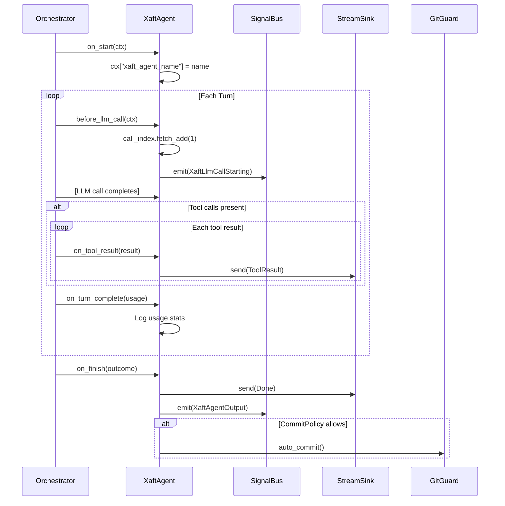

# XaftAgent

The `XaftAgent` is the default agent implementation in the xaft runtime. It is a fully featured, production-grade agent that handles the complete lifecycle of an LLM-driven task: from initial prompt construction through iterative tool-calling loops to final commit and cleanup. This page documents the agent's structure, its `Agent` trait lifecycle hooks, commit policies, and signal emission patterns.

## Structure

The `XaftAgent` struct carries all the state and configuration needed for a single task execution:

```rust
pub struct XaftAgent {
    name: String,
    config: AgentConfig,
    tools: ToolRegistry,
    git_guard: GitGuard,
    commit_policy: CommitPolicy,
    stream_sink: Box<dyn StreamSink>,
    signals: SignalBus,
    call_index: AtomicUsize,
}
```

| Field | Purpose |
|---|---|
| `name` | Human-readable agent name, used in logging and signal metadata |
| `config` | Agent configuration including model parameters, system prompt, and turn limits |
| `tools` | The merged read-only and write tool registry available to this agent |
| `git_guard` | Enforces git safety rules — prevents commits to protected branches, enforces worktree isolation |
| `commit_policy` | Determines when the agent auto-commits its changes |
| `stream_sink` | The sink that receives streaming events during execution |
| `signals` | The signal bus for emitting and receiving runtime events |
| `call_index` | Atomic counter tracking the number of LLM calls made, used for unique event identification |

The `call_index` is particularly noteworthy. It is an `AtomicUsize` that is incremented at the start of every LLM call, providing a monotonically increasing call identifier that is unique within a single agent execution. This identifier is included in the `XaftLlmCallStarting` signal and the `ModelCallComplete` signal, allowing consumers to correlate starting and completion events for the same call. The atomicity of the counter ensures correct behavior even if the agent's hooks are invoked from multiple Tokio tasks (which can happen during concurrent tool execution).

## Agent Trait Lifecycle

The `XaftAgent` implements the `Agent` trait, which defines the lifecycle hooks that the orchestrator calls during execution. Each hook has a specific purpose and contract, and understanding them is essential for anyone building custom agent implementations or debugging agent behavior.



### on_start(ctx: &mut AgentContext)

The `on_start` hook is called once, before the first LLM call. It sets the `xaft_agent_name` key in the agent context, which is then available to the system prompt template and to any tools that need to identify which agent is running. This context value propagates through the entire execution pipeline, appearing in log lines, signal metadata, and session records.

The agent context is a type-erased key-value store (`HashMap<String, serde_json::Value>`) that is shared between the orchestrator and the agent. Setting values in `on_start` makes them available for the entire execution, while values set in other hooks are only available for the current turn. The `xaft_agent_name` is set in `on_start` precisely because it should be available from the first turn.

### before_llm_call(ctx: &mut AgentContext)

The `before_llm_call` hook is called before every LLM call in the turn loop. It performs two actions:

1. **Increments the call index**: `call_index.fetch_add(1, Ordering::SeqCst)` atomically increments the counter and returns the previous value. The returned value is used as the call identifier for this LLM call. The `SeqCst` ordering ensures that the increment is visible to all tasks before the signal is emitted.

2. **Emits the `XaftLlmCallStarting` signal**: This signal carries the call index, the agent name, and a snapshot of the current context. It is consumed by the tool-call logger (to record the start of a call for timing analysis) and by any custom monitoring systems that need to track call frequency and latency in real time.

The `before_llm_call` hook is also the extension point for implementing custom per-call behavior — for example, injecting dynamic context that changes between calls, or implementing rate limiting at the agent level. Subclasses of `XaftAgent` (like `PlanModeAgent`) override this hook to add planning-specific behavior.

### on_tool_result(result: &ToolResult)

The `on_tool_result` hook is called after each tool execution completes. It forwards the `ToolResult` to the `StreamSink`, which delivers it to the event loop and ultimately to the consumer (CLI, API, or test harness). The forwarding is unconditional — every tool result is sent to the sink, regardless of whether it succeeded or failed.

The hook does not modify the tool result before forwarding it. This is a deliberate design choice: the agent's role at this point is to observe and relay, not to filter or transform. Any modification of tool results (for example, sanitizing sensitive output or truncating excessively long results) is handled by the tool itself, not by the agent hook. This separation keeps the agent's hook logic simple and predictable.

However, the hook does provide an opportunity for the agent to update its internal state based on the tool result. For example, the `git_guard` may be notified of file edits so it can track which files have been modified and enforce commit policies accordingly. This state update is side-effect-free from the stream consumer's perspective — it does not change the content of the forwarded event.

### on_turn_complete(usage: &TurnUsage)

The `on_turn_complete` hook is called at the end of each turn (after all tool results for the turn have been processed). It logs the turn's token usage statistics — input tokens, output tokens, and tool call count — at the `info` level. This log output is the primary way to monitor agent progress during a long-running task, especially in headless mode where there is no interactive display.

The usage statistics are also accumulated in the agent's internal counters, which are included in the `XaftAgentOutput` signal emitted at the end of the run. This allows post-hoc analysis of token consumption patterns across turns, which is useful for optimizing prompt design and tool usage.

### on_finish(outcome: &AgentOutcome)

The `on_finish` hook is called once, after the turn loop terminates. It performs three final actions:

1. **Sends `Done` to the stream sink**: This signals to the event loop that the agent has completed its work. The `Done` event includes a summary of the outcome — success or failure, the number of turns executed, and any message the agent produced.

2. **Emits `XaftAgentOutput` signal**: This signal carries the full agent output, including the final response text, the accumulated usage statistics, the list of files modified, and the session ID. It is consumed by the session persistence layer (to record the outcome in the session store) and by any custom post-processing systems that need to act on the agent's output (for example, a CI system that parses the output to determine test results).

3. **Conditionally auto-commits**: If the `CommitPolicy` allows it (see below), the agent calls `git_guard.auto_commit()` to commit the worktree changes. The commit message is constructed from the task description and a summary of the changes made. The commit includes metadata (the session ID, agent name, and call count) in a trailer format that is machine-parseable but does not clutter the commit message for human readers.

## CommitPolicy

The `CommitPolicy` controls when the agent automatically commits its changes to the git worktree. It has three variants:

| Variant | Behavior |
|---|---|
| `Never` | Never auto-commit. The agent's changes remain in the worktree as uncommitted modifications. The user must manually review and commit the changes. |
| `OnSuccess` | Auto-commit only when the agent's outcome is successful. If the agent fails or is cancelled, the changes are left uncommitted (and the worktree is restored by the runtime). |
| `Always` | Auto-commit regardless of outcome. Even if the agent fails, its changes are committed. This is useful for "save my work" scenarios where the user wants to preserve intermediate progress even from failed runs. |

The default policy is `OnSuccess`, which provides the best balance of convenience and safety. `Never` is appropriate for review-first workflows where a human must approve every change. `Always` is appropriate for long-running tasks where the cost of losing intermediate work outweighs the risk of committing incomplete or incorrect changes.

The commit is performed through the `GitGuard`, which enforces additional safety rules beyond the commit policy:

- **Protected branch check**: The guard refuses to commit if the current branch matches a protected branch pattern (for example, `main`, `release/*`). This prevents accidental direct commits to branches that should only receive changes through pull requests.
- **Worktree isolation**: The guard verifies that the commit is being made in a worktree, not in the main working tree. This ensures that the agent's changes are isolated and can be rolled back without affecting the main tree.
- **Commit message validation**: The guard rejects commit messages that are empty or that match a configured "junk message" pattern, preventing meaningless commits from polluting the git history.

## Signal Emission Summary

The `XaftAgent` emits the following signals during its lifecycle:

| Signal | When | Payload |
|---|---|---|
| `XaftLlmCallStarting` | `before_llm_call` | Call index, agent name, context snapshot |
| `ModelCallComplete` | Via `CostedProvider` after each LLM call | Model, tokens, cost, latency |
| `FileEdited` | Via write tools when files are modified | File path, diff, agent name |
| `XaftAgentOutput` | `on_finish` | Full output, usage, modified files, session ID |

These signals are the primary integration point for external systems. A monitoring dashboard can subscribe to `ModelCallComplete` to display real-time cost, a CI system can subscribe to `XaftAgentOutput` to capture the agent's final result, and a file watcher can subscribe to `FileEdited` to trigger builds or tests on changed files.

## Thread Safety and Concurrency

The `XaftAgent` is designed to be used from a single Tokio task at a time — the orchestrator's task. However, several of its fields are thread-safe by design to support the specific concurrency patterns that arise during agent execution:

- `call_index` is `AtomicUsize` because `before_llm_call` may be called from a different task than `on_tool_result` in certain orchestrator configurations.
- `signals` is the `SignalBus`, which is internally synchronized and safe to use from any task.
- `stream_sink` is `Box<dyn StreamSink>`, which must be `Send + Sync`. The sink implementations (`ChannelSink`, `CollectSink`) use internal synchronization.

The `tools` and `git_guard` fields are not thread-safe, but they are only accessed from the orchestrator's task, so no synchronization is needed. The `config` field is immutable after construction.
