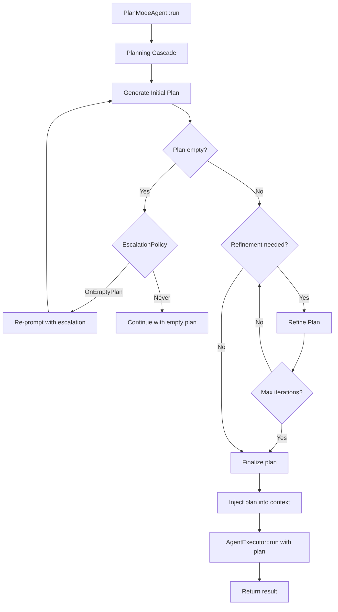

# Plan Mode Agent

The `PlanModeAgent` is a decorator-style agent that wraps an inner `XaftAgent` and adds a planning phase before the main execution. Instead of immediately diving into tool calls, the `PlanModeAgent` first generates a structured plan, validates it, optionally refines it through additional LLM calls, and then delegates to the inner agent's `AgentExecutor::run()` method with the plan injected into the agent context. This two-phase approach produces more reliable, coherent task execution, especially for complex multi-step tasks where a naive agentic loop might miss dependencies or execute steps in the wrong order.

## Architecture

The `PlanModeAgent` follows the decorator pattern: it implements the `Agent` trait by delegating most operations to the inner `XaftAgent`, but overrides the `run()` method to insert the planning cascade before the execution phase.



## Structure

```rust
pub struct PlanModeAgent {
    inner: XaftAgent,
    plan_config: PlanConfig,
    resolve_ctx: ResolveContext,
}
```

| Field | Purpose |
|---|---|
| `inner` | The underlying `XaftAgent` that executes the planned task |
| `plan_config` | Configuration for the planning phase — model override, max refinement iterations, escalation policy, and whether to inject the plan into the agent's context |
| `resolve_ctx` | A resolution context that provides additional information for plan generation — the workspace state, the agent's tool capabilities, and any project-specific conventions |

## Planning Cascade

The planning cascade is the core algorithm of the `PlanModeAgent`. It proceeds through three stages: initial plan generation, plan refinement, and plan injection. Each stage has specific semantics and configuration options that control its behavior.

### Stage 1: Initial Plan Generation

The cascade begins by constructing a planning prompt that asks the LLM to produce a structured plan for the task. The planning prompt includes:

- **The task description**: The original task from the `RunRequest`.
- **The workspace state**: A summary of the files and directories in the working directory, produced by the `resolve_ctx`. This gives the LLM context about the codebase it will be operating on.
- **The tool capabilities**: A list of tools available to the agent, with brief descriptions of each tool's purpose and parameters. This helps the LLM produce a plan that is actually executable — a plan that references a tool the agent doesn't have is useless.
- **The plan format**: A structured format (typically a numbered list with optional sub-steps) that the LLM should use for the plan. The format is specified in the system prompt and is validated after generation.

The planning prompt is sent to the LLM using the same provider chain as the main execution, but with a potentially different model. The `plan_config.model_override` field allows the planning phase to use a more capable (and more expensive) model for planning, while the execution phase uses a faster (and cheaper) model. This is a common optimization: Claude 3.5 Sonnet for planning, Claude 3 Haiku for execution.

### Stage 2: Plan Refinement and Escalation

After the initial plan is generated, the cascade evaluates its quality and optionally refines it. The evaluation criteria are controlled by the `EscalationPolicy`:

| Policy | Behavior |
|---|---|
| `OnEmptyPlan` | Escalate only if the LLM produces no plan at all (for example, if it responds with a refusal or an empty string). This is the default policy. |
| `OnFewerThan(n)` | Escalate if the plan contains fewer than `n` steps. This catches cases where the LLM oversimplifies a complex task. |
| `Never` | Never escalate. Accept the plan as-is, even if it is empty or trivially short. |
| `Always` | Always escalate. Force at least one refinement iteration regardless of plan quality. |

When escalation is triggered, the `PlanModeAgent` re-prompts the LLM with an escalation message that includes the original plan (if any) and a directive to produce a more detailed or more complete plan. The escalation prompt is carefully designed to avoid the "just add more steps" anti-pattern — it asks the LLM to consider edge cases, dependencies between steps, and rollback strategies, rather than simply making the plan longer.

The refinement loop runs for a maximum of `plan_config.max_refinement_iterations` iterations (default: 2). Each iteration evaluates the refined plan against the same escalation criteria. If the plan passes after refinement, the cascade proceeds to injection. If the plan still fails after all refinement iterations, the cascade proceeds with the best available plan and logs a warning — it does not fail the entire task just because the plan is suboptimal.

### Stage 3: Plan Injection

The final stage of the cascade injects the finalized plan into the agent context, making it available to the inner `XaftAgent` during execution. The injection mechanism depends on the `plan_config.no_plan_injection` flag:

- **`no_plan_injection = false` (default)**: The plan is added to the agent context under the `xaft_plan` key as a structured JSON value. It is also included in the system prompt as a formatted section, so the LLM sees the plan at the beginning of every turn. This ensures the agent follows the plan consistently, even across many turns.
- **`no_plan_injection = true`**: The plan is generated and validated, but not injected into the context. This mode is useful for "plan-only" runs where the user wants to see the plan without executing it (similar to `dry_run`, but specifically for the planning phase). The plan is still emitted as an `XaftAgentOutput` signal so it can be captured and displayed.

After injection, the `PlanModeAgent` delegates to `AgentExecutor::run()` with the inner `XaftAgent`, passing the enriched context. From this point forward, the execution proceeds exactly as it would for a non-planning agent — the plan is just additional context that the LLM uses to guide its decisions.

## EscalationPolicy Deep Dive

The `EscalationPolicy` is the key differentiator between a planning agent that produces robust, well-thought-out plans and one that produces trivial or empty plans. The policy is evaluated after every plan generation attempt (including refinement iterations), and it determines whether the cascade should re-prompt the LLM.

### OnEmptyPlan

This is the safest default. An empty plan is almost always wrong — it means the LLM either didn't understand the task, refused to generate a plan, or encountered a formatting error. Re-prompting with an explicit "please produce a plan" directive usually produces a valid plan on the second attempt. If the second attempt also produces an empty plan, the cascade gives up and proceeds without a plan, which effectively falls back to the standard agentic loop behavior.

### OnFewerThan(n)

This policy catches the common failure mode where the LLM produces a superficial plan with only one or two steps for a task that clearly requires more. The threshold `n` should be calibrated based on the expected complexity of the tasks — for a codebase with many interdependent modules, `OnFewerThan(3)` might be appropriate, while for simpler tasks, `OnFewerThan(2)` is sufficient.

The refinement prompt for this policy specifically asks the LLM to decompose high-level steps into sub-steps and to consider prerequisite steps that might have been omitted. For example, a plan that says "1. Fix the bug" would be refined into "1. Identify the root cause by reading the failing test, 2. Read the relevant source files, 3. Implement the fix, 4. Run the tests to verify."

### Never

This policy accepts whatever plan the LLM produces, including an empty plan. It is useful for cases where the planning phase is advisory rather than mandatory — the agent should try to follow a plan if one is available, but should not waste time and tokens refining one if the initial attempt is weak.

### Always

This policy forces at least one refinement iteration, which is useful for tasks where the initial plan is often inadequate (for example, tasks that require deep understanding of a large codebase). The refinement iteration typically produces a significantly better plan because the LLM has already "thought through" the task once and can now focus on filling gaps and improving the structure.

## Delegation to AgentExecutor

After the planning cascade completes, the `PlanModeAgent` calls `AgentExecutor::run()` with the inner `XaftAgent` and the enriched context. The `AgentExecutor` is not aware that a planning phase occurred — it simply drives the agent through its turn loop as usual. The plan is just additional context that the LLM uses to guide its decisions.

This delegation model has an important implication: the agent is not required to follow the plan. The plan is a suggestion, not a constraint. The LLM may deviate from the plan if it encounters unexpected situations — for example, a build error that requires a different approach than the one planned. This flexibility is essential for real-world tasks, where the optimal execution path often becomes clear only after the agent starts exploring the codebase.

However, the plan does provide a strong bias toward the planned approach. The plan is included in the system prompt, which means it is present at every turn and influences every LLM decision. In practice, agents with plans produce more coherent, structured execution than agents without plans, especially for tasks with many interdependent steps.

## Interaction with CommitPolicy

The `PlanModeAgent`'s commit behavior is determined by the inner `XaftAgent`'s `CommitPolicy`. The planning agent does not add any commit logic of its own — it delegates all commit decisions to the inner agent's `on_finish` hook. This means that if the inner agent has `CommitPolicy::OnSuccess`, the auto-commit only happens if the execution phase succeeds, regardless of whether the planning phase produced a good plan.

This design is intentional: the planning phase is purely informational and does not produce any filesystem changes, so there is nothing to commit during planning. Only the execution phase produces changes, and only the execution phase's outcome should determine whether those changes are committed.
