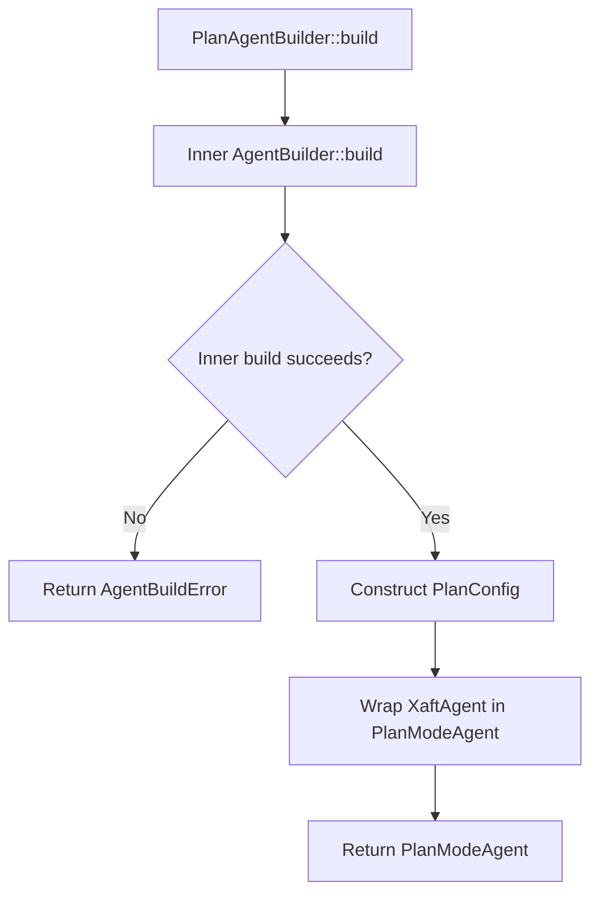

# Agent Builders

The `AgentBuilder` and `PlanAgentBuilder` provide fluent, type-safe APIs for constructing agent instances. They implement the builder pattern with method chaining, allowing callers to configure an agent incrementally without dealing with the complexity of direct struct construction. This page documents both builders in full detail, including their API surface, validation rules, and the relationship between the two builder types.

## AgentBuilder

The `AgentBuilder` constructs a `XaftAgent`. It is the primary way to create an agent in application code, and it is also used internally by the runtime during the agent preset resolution phase of `run_task()`.

### API Surface

```rust
impl AgentBuilder {
    pub fn new(name: impl Into<String>) -> Self;
    pub fn role(self, role: impl Into<String>) -> Self;
    pub fn tools(self, tools: ToolRegistry) -> Self;
    pub fn commit_policy(self, policy: CommitPolicy) -> Self;
    pub fn stream_sink(self, sink: Box<dyn StreamSink>) -> Self;
    pub fn signals(self, bus: SignalBus) -> Self;
    pub fn max_turns(self, max: usize) -> Self;
    pub fn config(self, config: AgentConfig) -> Self;
    pub fn git_guard(self, guard: GitGuard) -> Self;
    pub fn build(self) -> Result<XaftAgent, AgentBuildError>;
}
```

### Construction and Defaults

The `AgentBuilder::new(name)` constructor creates a builder with the given agent name and sensible defaults for all other fields:

| Field | Default Value | Notes |
|---|---|---|
| `role` | `"assistant"` | The agent's role, used in the system prompt template |
| `tools` | Empty `ToolRegistry` | No tools available until explicitly set |
| `commit_policy` | `CommitPolicy::OnSuccess` | Auto-commit on successful completion |
| `stream_sink` | `NopSink` | Discards all events — suitable for testing or fire-and-forget execution |
| `signals` | `SignalBus::new(0)` | A disconnected bus that drops all signals — not useful for production; must be explicitly set |
| `max_turns` | `50` | A generous default that accommodates most tasks without runaway loops |
| `config` | `AgentConfig::default()` | Default model parameters, system prompt, and behavior flags |
| `git_guard` | `GitGuard::default()` | Default safety rules (protected branches, worktree enforcement) |

The defaults are chosen to be safe and functional for the most common use case: a single agent running interactively against a git repository. For headless or CI use cases, the caller will need to override the `stream_sink` and `commit_policy` at minimum.

### Method Chaining Semantics

Every configuration method consumes `self` and returns a new `Self`, enabling method chaining. This is the standard Rust builder pattern. Because the methods take ownership of `self`, the builder cannot be accidentally shared between threads or reused after `build()` is called — the Rust ownership system enforces this at compile time.

```rust
let agent = AgentBuilder::new("code-editor")
    .role("You are an expert code editor.")
    .tools(read_tools.merge(write_tools))
    .commit_policy(CommitPolicy::OnSuccess)
    .stream_sink(Box::new(ChannelSink::new(tx)))
    .signals(runtime.signal_bus().clone())
    .max_turns(30)
    .build()?;
```

### Validation in build()

The `build()` method performs comprehensive validation before constructing the `XaftAgent`. The following checks are applied:

1. **Name non-empty**: The agent name must not be empty. An empty name would produce confusing log output and signal metadata.

2. **Max turns > 0**: The `max_turns` value must be at least 1. A value of 0 would prevent the agent from executing any turns, which is almost certainly a configuration error.

3. **Tools non-empty** (warning only): If the tool registry is empty, a warning is logged but the build succeeds. An agent with no tools can still generate text responses, which is useful for "chat" agents that answer questions without modifying the filesystem.

4. **Signals bus connected** (warning only): If the signal bus has a capacity of 0 (the default), a warning is logged. A disconnected bus means no signals are emitted, which makes debugging and monitoring impossible. In testing scenarios, this warning can be suppressed.

5. **Config consistency**: The `AgentConfig` is validated for internal consistency — for example, if the config specifies a thinking budget but the model does not support thinking, a warning is logged.

If any validation check fails with an error (not a warning), `build()` returns `AgentBuildError` with a descriptive message. Warnings are logged but do not prevent construction.

### AgentBuildError Variants

| Variant | Condition |
|---|---|
| `EmptyName` | The agent name is empty or whitespace-only |
| `InvalidMaxTurns` | `max_turns` is 0 |
| `ConfigError` | The `AgentConfig` is internally inconsistent |

## PlanAgentBuilder

The `PlanAgentBuilder` wraps an `AgentBuilder` and adds planning-specific configuration. It follows the same fluent pattern but introduces additional methods for controlling the planning cascade.

### API Surface

```rust
impl PlanAgentBuilder {
    pub fn new(name: impl Into<String>) -> Self;
    pub fn role(self, role: impl Into<String>) -> Self;
    pub fn tools(self, tools: ToolRegistry) -> Self;
    pub fn commit_policy(self, policy: CommitPolicy) -> Self;
    pub fn stream_sink(self, sink: Box<dyn StreamSink>) -> Self;
    pub fn signals(self, bus: SignalBus) -> Self;
    pub fn max_turns(self, max: usize) -> Self;
    pub fn escalation_policy(self, policy: EscalationPolicy) -> Self;
    pub fn max_refinement_iterations(self, max: usize) -> Self;
    pub fn no_plan_injection(self, no_inject: bool) -> Self;
    pub fn resolve_ctx(self, ctx: ResolveContext) -> Self;
    pub fn build(self) -> Result<PlanModeAgent, AgentBuildError>;
}
```

### Delegation Pattern

The `PlanAgentBuilder` internally holds an `AgentBuilder` and delegates all common configuration methods to it. When `build()` is called, it first calls `AgentBuilder::build()` to construct the inner `XaftAgent`, then wraps it in a `PlanModeAgent` with the planning-specific configuration.



This delegation pattern ensures that all validation rules from `AgentBuilder` are applied to the inner agent, without duplicating the validation logic in `PlanAgentBuilder`. It also means that any future additions to `AgentBuilder`'s API are automatically available in `PlanAgentBuilder` without code changes.

### Planning-Specific Methods

#### escalation_policy(policy: EscalationPolicy)

Sets the escalation policy for the planning cascade. The default is `EscalationPolicy::OnEmptyPlan`, which triggers a re-prompt only if the initial plan is empty. See [Plan Mode Agent](./02-plan-mode.md#escalationpolicy-deep-dive) for a detailed discussion of each policy variant and when to use it.

The escalation policy is one of the most important tuning parameters for the `PlanModeAgent`. Setting it too aggressively (for example, `Always` with a high `max_refinement_iterations`) wastes tokens on unnecessary refinement. Setting it too loosely (`Never`) risks executing a plan that is fundamentally flawed. The default `OnEmptyPlan` is a safe starting point that catches the most common failure mode without over-engineering the refinement process.

#### max_refinement_iterations(max: usize)

Sets the maximum number of refinement iterations in the planning cascade. The default is 2, which means the LLM gets up to 3 chances to produce a plan (1 initial + 2 refinements). Setting this to 0 disables refinement entirely — the initial plan is used as-is, regardless of its quality.

Increasing `max_refinement_iterations` improves plan quality at the cost of additional LLM calls and tokens. Each refinement call uses the same model as the initial planning call, so the cost increase is proportional to the number of iterations. For most tasks, 1-2 refinement iterations is sufficient — beyond that, the improvements are marginal and the LLM tends to "settle" on a plan rather than producing meaningfully better refinements.

#### no_plan_injection(no_inject: bool)

Controls whether the finalized plan is injected into the agent context before execution. When `true`, the plan is generated and validated but not injected — the agent executes without knowledge of the plan. When `false` (the default), the plan is injected both as a context value and as a section in the system prompt.

Setting `no_plan_injection(true)` is useful for two scenarios:

1. **Plan-only mode**: The user wants to see what the agent would do without actually doing it. The plan is emitted as an `XaftAgentOutput` signal and can be displayed to the user, but the agent's execution is not guided by the plan.

2. **Comparative evaluation**: The user wants to compare the behavior of agents with and without plans on the same task, to measure the impact of planning on execution quality.

#### resolve_ctx(ctx: ResolveContext)

Sets the resolution context that provides workspace state and project-specific information for plan generation. The `ResolveContext` is typically constructed by the runtime during `run_task()` from the `FsWorkspaceStore` and the working directory's structure. It includes:

- **File tree**: A summary of the files and directories in the workspace, limited to a configurable depth to avoid overwhelming the LLM with context.
- **Language detection**: The primary programming languages in the workspace, inferred from file extensions.
- **Project conventions**: Any project-specific configuration files (for example, `Cargo.toml`, `package.json`, `pyproject.toml`) that provide hints about the project's build system, dependencies, and structure.
- **Git status**: The current branch, any uncommitted changes, and the list of recently modified files.

The resolution context is critical for producing high-quality plans. Without it, the LLM must rely on generic heuristics about the workspace, which leads to plans that reference non-existent files or propose steps that are incompatible with the project's build system. The resolve context grounds the planning prompt in the specific reality of the workspace, producing plans that are both more accurate and more executable.

### Build Validation

In addition to the validation performed by the inner `AgentBuilder`, the `PlanAgentBuilder` performs the following checks:

1. **max_refinement_iterations sanity**: If `max_refinement_iterations` is greater than 10, a warning is logged. More than 10 refinement iterations is almost certainly a configuration error — the LLM will not produce meaningful improvements after 3-4 iterations.

2. **EscalationPolicy consistency**: If `escalation_policy` is `Never` and `max_refinement_iterations` is greater than 0, a warning is logged. Setting a non-zero refinement count with a `Never` escalation policy means refinement will never be triggered, making the iteration count meaningless.

3. **resolve_ctx presence**: If no `resolve_ctx` is set, a warning is logged. Planning without a resolution context produces lower-quality plans, because the LLM lacks information about the workspace. The build still succeeds — the resolve context defaults to an empty context that provides no workspace information.

## Composability and Extension

Both builders are designed for composability. The `AgentBuilder` can be used directly to create `XaftAgent` instances for simple, non-planning workflows. The `PlanAgentBuilder` wraps the `AgentBuilder` for planning workflows. And custom builder types can be created by following the same pattern: wrap an `AgentBuilder`, add domain-specific configuration methods, and delegate to the inner builder in `build()`.

This composability is what allows the xaft runtime to support multiple agent types — `XaftAgent`, `PlanModeAgent`, and future custom agents — without duplicating the builder infrastructure. Each agent type gets a builder that inherits the common configuration API and adds its own domain-specific methods, providing a consistent and discoverable API surface across all agent types.
