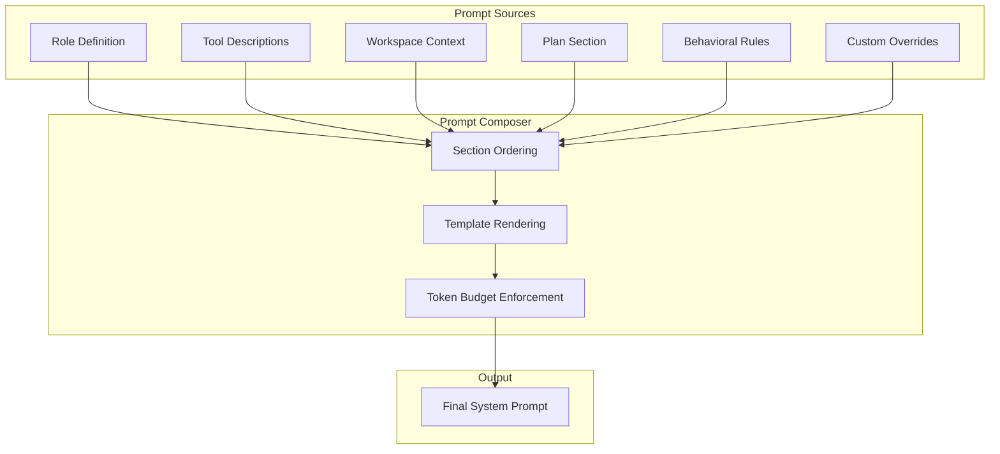

# System Prompts and Prompt Composition

The system prompt is the single most influential input to the agent's behavior. It defines the agent's identity, capabilities, constraints, and decision-making framework. Xaft uses a composable, layered prompt system that assembles the final system prompt from multiple sources — the agent's role definition, the tool descriptions, the workspace context, and the plan (if any). This page documents how prompts are constructed, composed, and injected into the agent's execution context.

## Prompt Architecture Overview

The system prompt is not a single static string. It is assembled at runtime from a sequence of prompt sections, each contributed by a different subsystem. The sections are concatenated in a defined order, with clear delimiters that allow the LLM to distinguish between them. This compositional approach ensures that each subsystem can evolve its prompt contribution independently without breaking the contributions of other subsystems.



## Prompt Sections

Each section of the system prompt serves a specific purpose and is contributed by a specific subsystem. The sections are ordered from most stable (rarely changes between tasks) to most dynamic (changes every turn).

### Section 1: Role Definition

The role definition is the most fundamental part of the system prompt. It is set via `AgentBuilder::role()` and defines who the agent is, what it is capable of, and how it should approach its work. A well-crafted role definition is essential for producing consistent, high-quality agent behavior.

The role definition typically includes:

- **Identity**: "You are an expert code editor named Xaft."
- **Capabilities**: "You can read, write, and edit files. You can execute shell commands. You can search the codebase."
- **Behavioral guidelines**: "Make minimal, targeted changes. Prefer editing over rewriting. Always verify your changes by running tests or linters."
- **Constraints**: "Never modify files outside the workspace. Never commit directly to protected branches."

The role definition is the only section that the user directly controls. All other sections are generated automatically by the runtime based on the agent's configuration and the workspace state. This means that the role definition is the primary lever for customizing agent behavior — a different role definition produces a fundamentally different agent, even with the same tools and configuration.

### Section 2: Tool Descriptions

The tool descriptions section is generated automatically from the agent's tool registry. For each tool, the section includes the tool's name, a natural-language description of what the tool does, and a structured description of its input parameters (typically in JSON Schema format). This section is what enables the LLM to call tools correctly — without it, the LLM would not know what tools are available or how to format tool calls.

The tool descriptions are rendered in a consistent format that the LLM has been trained on (or fine-tuned for). The format varies slightly between providers — Anthropic uses a different tool description format than OpenAI — and the rendering layer handles this translation automatically. The agent code never needs to worry about provider-specific formatting; it simply registers tools with their descriptions, and the rendering layer produces the correct output for the active provider.

Tool descriptions are included in the system prompt rather than in the user message because they are constant across turns — the tool set does not change during execution. Including them in the system prompt ensures they are present in every LLM call, without consuming per-turn token budget.

### Section 3: Workspace Context

The workspace context section provides the LLM with information about the current state of the workspace. It is generated from the `ResolveContext` and includes:

- **File tree**: A structured listing of the workspace's files and directories, truncated to a configurable depth to stay within token budget.
- **Language and framework detection**: The primary languages and frameworks detected in the workspace, based on file extensions and configuration files.
- **Git status**: The current branch, any staged or unstaged changes, and the list of recently modified files.
- **Environment information**: The operating system, shell, and any relevant environment variables.

The workspace context is crucial for grounding the agent's actions in reality. Without it, the agent might attempt to read files that don't exist, run commands that aren't available, or propose changes that conflict with the project's structure. The workspace context is regenerated at the start of each task (not each turn), which means it may become stale during long-running tasks if the workspace changes significantly. This is an acceptable trade-off — regenerating the context every turn would be expensive and would consume a large number of tokens.

### Section 4: Plan Section (PlanModeAgent only)

When a `PlanModeAgent` is used and `no_plan_injection` is `false`, the finalized plan is included as a dedicated section in the system prompt. The plan section includes:

- **The plan itself**: The numbered list of steps generated during the planning cascade.
- **Plan metadata**: The number of refinement iterations, the escalation policy that was applied, and any warnings about plan quality.
- **Execution directive**: A directive that instructs the agent to follow the plan while remaining flexible — "Follow this plan, but adapt if you discover that a step is incorrect or if a better approach becomes apparent."

The plan section is placed after the workspace context so that the LLM can interpret the plan in light of the workspace state. This ordering matters: if the plan references specific files or directories, the LLM should see the file tree before the plan, so it can validate that the referenced paths exist. If the plan references a path that does not appear in the file tree, the LLM is more likely to notice and adjust its approach.

### Section 5: Behavioral Rules

The behavioral rules section encodes the runtime's safety and quality constraints. These rules are not user-configurable — they are hard-coded into the runtime to prevent the agent from producing harmful or undesirable output. The rules include:

- **File scope constraints**: Never read or write files outside the workspace directory.
- **Command safety**: Never execute commands that could irreversibly modify the system (e.g., `rm -rf /`, `sudo`).
- **Permission respect**: Always wait for approval before executing write tools, unless auto-approve is enabled.
- **Token budget awareness**: If the agent is approaching its turn or token limit, it should summarize its progress and produce a partial result rather than silently running out of turns.

These rules are included in every system prompt, regardless of the agent's configuration. They are non-negotiable safety boundaries that apply to all agent types and all execution modes. Users who want to relax these constraints (for example, to allow `sudo` commands) must use the `dangerously_skip_permissions` flag, which disables the behavioral rules entirely. The flag's name is intentionally alarming to discourage casual use.

### Section 6: Custom Overrides

The custom overrides section allows users to append additional instructions to the system prompt without modifying the role definition or the behavioral rules. This is useful for project-specific instructions — for example, "always use conventional commits" or "prefer functional style over imperative style in TypeScript."

Custom overrides are specified in the agent configuration as a list of strings. They are appended to the end of the system prompt, after all other sections. This ordering gives them the highest priority in the LLM's attention, because the end of the system prompt is typically given more weight than the beginning (the "recency bias" of transformer models). This means custom overrides can effectively override earlier sections — for example, a custom override that says "ignore the commit message format specified above" would likely take precedence over the format specified in the behavioral rules.

This is an intentional design choice: custom overrides are the escape hatch for users who need to override default behavior. The system trusts the user to use this power responsibly, and the `dangerously_skip_permissions` flag is not required for custom overrides (because they are just text, not permission changes).

## Template Rendering

Each prompt section is rendered from a template that supports variable interpolation. The template engine uses a simple `{{variable}}` syntax that is familiar and easy to debug. Variables are resolved from the agent context, which is populated by the runtime and by the agent's lifecycle hooks.

For example, the role template might include:

```
You are {{xaft_agent_name}}, an AI coding assistant.
Your workspace is located at {{xaft_working_dir}}.
The current date is {{xaft_current_date}}.
```

The template engine resolves `{{xaft_agent_name}}` from the context value set by `on_start()`, `{{xaft_working_dir}}` from the `RunRequest`, and `{{xaft_current_date}}` from the system clock. If a variable is not found in the context, the engine leaves the placeholder as-is and logs a warning — it does not fail the prompt construction.

## Token Budget Enforcement

The final step of prompt composition is token budget enforcement. The total system prompt must fit within the model's context window, minus the space reserved for the conversation history and the model's response. The composer calculates the token count of each section (using the model's tokenizer) and truncates sections if the total exceeds the budget.

Truncation follows a priority order: custom overrides are never truncated (they are user-specified and important), then workspace context (truncated by reducing the file tree depth), then plan section (truncated by removing lower-priority steps), then tool descriptions (truncated by removing less-frequently-used tools), then role definition (truncated last, because it is the most important section). Behavioral rules are never truncated — they are safety-critical and must always be present in full.

When truncation occurs, a warning is logged with the section name and the number of tokens removed. This helps users understand why the agent might be missing context — for example, if the file tree was truncated to depth 1, the agent might not know about files in deeply nested directories.

## Prompt Caching

For providers that support prompt caching (for example, Anthropic's cache control feature), the composer marks the stable sections — role definition, tool descriptions, and behavioral rules — as cacheable. These sections change infrequently (typically only between tasks), so the provider can cache them and avoid reprocessing them on every LLM call. This can reduce latency by 30-50% and cost by 20-40% for long-running tasks with many turns.

The workspace context and plan sections are not marked as cacheable, because they may change between tasks. The custom overrides section is marked as cacheable because it is specified at construction time and does not change during execution.

Prompt caching is a transparent optimization — the composer sets the cache control headers, and the provider handles the caching logic. The agent and the event loop are unaware of caching; they see the same stream of events regardless of whether the prompt was served from cache or processed fresh.
