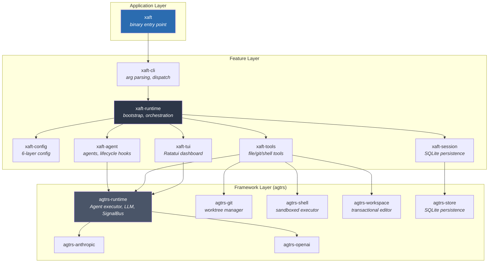
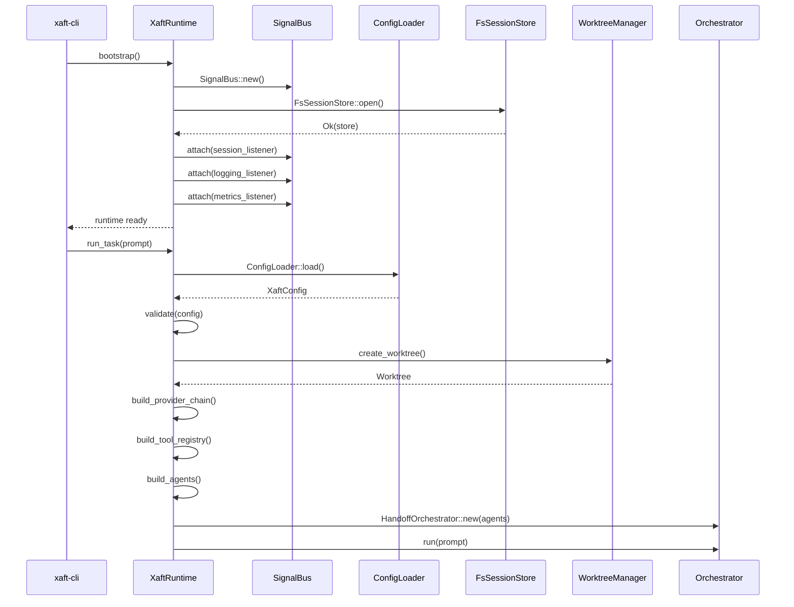
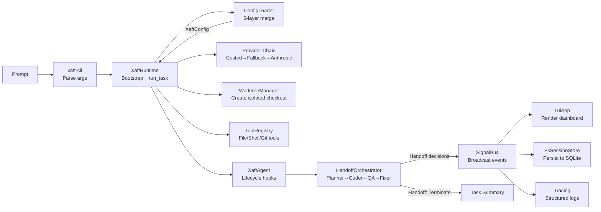

# Architecture Overview

xaft is a seven-crate Rust workspace that implements a multi-agent coding runtime on top of the `agtrs` framework. This page provides the big-picture view: how the crates relate to each other, where the abstraction boundaries fall, and what happens when you invoke a task from the CLI. Subsequent pages drill into individual crates and the full dependency graph.

## Crate Topology

The xaft workspace is organized into three layers: a thin binary entry point, a set of mid-level feature crates, and the `agtrs` framework crates that provide the foundational abstractions. No crate in a higher layer depends on a crate in a lower layer—dependencies flow strictly downward.



The **Application Layer** contains only the `xaft` binary crate—a thin wrapper that calls `xaft_cli::run()` and exits. It exists solely to produce the `xaft` executable; all logic lives in the feature and framework layers.

The **Feature Layer** is where xaft-specific behavior lives. These crates import framework primitives and compose them into the coding-agent product. Each crate has a single, well-defined responsibility, and no feature crate depends on another feature crate without going through the runtime crate first. This prevents circular dependencies and keeps the module graph acyclic.

The **Framework Layer** comprises the `agtrs` crates. These are general-purpose agent-building primitives that have no knowledge of xaft's existence. They could be used to build an entirely different agent system. xaft depends on them but never extends them—xaft wraps their types in its own types rather than implementing xaft traits on `agtrs` structs.

## Abstraction Boundaries

The most important abstraction boundaries in xaft are the interfaces between the feature layer and the framework layer. These boundaries are enforced by Rust's module privacy rules: framework types are re-exported through feature-crate public APIs only when necessary, and feature crates never reach into framework internals.

### Runtime ↔ Framework

The `xaft-runtime` crate is the only feature crate that directly depends on multiple framework crates simultaneously. It serves as the integration point where `agtrs-runtime`, `agtrs-git`, `agtrs-workspace`, `agtrs-shell`, and `agtrs-store` are wired together. Other feature crates depend on at most one or two framework crates, keeping their coupling minimal.

This design means that if a framework crate's API changes, the blast radius is limited: `agtrs-workspace` changes affect `xaft-tools` and `xaft-runtime`, but not `xaft-agent` or `xaft-tui`. The runtime crate absorbs the integration complexity so that other crates can remain focused.

### Agent ↔ Runtime

The `xaft-agent` crate defines agent types (`XaftAgent`, `PlanModeAgent`) that implement `agtrs_runtime::Agent`. The runtime crate creates and configures these agents, but it never reaches into their internal state. Agents communicate with the runtime exclusively through the `SignalBus` and the `Handoff` enum returned at the end of each turn. This is a deliberate choice: it allows the agent crate to evolve its planning strategies and lifecycle hooks without requiring changes to the orchestration logic.

### Tools ↔ Agent

The `xaft-tools` crate builds a `ToolRegistry` (a `HashMap<String, Box<dyn Tool>>`) that is passed to agents at construction time. Agents invoke tools by name through the `Tool` trait's `execute()` method—they have no knowledge of whether a tool is backed by `agtrfs-shell`, `agtrfs-workspace`, or pure Rust logic. This means new tools can be added to the registry without modifying any agent code.

### TUI ↔ Runtime

The TUI crate has no direct dependency on the runtime crate at the type level. Instead, it subscribes to `SignalBus` events via the `EventBridge` and renders them. This means the TUI is fully decoupled from the runtime's internal state machine—it simply renders whatever events arrive. If the runtime adds a new signal type, the TUI will ignore it until a rendering handler is added, but nothing will break.

## Bootstrap Sequence

The bootstrap sequence is the chain of operations that runs between CLI invocation and the first agent turn. Understanding this sequence is essential for debugging startup failures and for understanding the order in which side effects occur.



The bootstrap sequence is designed to be idempotent where possible. If `FsSessionStore::open()` finds an existing database, it validates the schema and applies any pending migrations rather than recreating it. If the worktree already exists (from a previous interrupted session), the worktree manager verifies it is clean and reuses it.

## Event Loop Architecture

The core event loop in `xaft-runtime` is built on `tokio::select!{biased}`, which polls multiple futures in priority order. The bias ensures that cancellation signals are always processed before new work is accepted:

```rust
tokio::select! {
    biased;

    // Highest priority: cancellation (Ctrl+C, session timeout)
    _ = cancel_token.cancelled() => {
        emit!(TaskCancelled);
        break;
    }

    // Approval gate responses from the TUI
    decision = approval_rx.recv() => {
        process_approval(decision);
    }

    // Agent turn completions from the orchestrator
    handoff = orchestrator.next_turn() => {
        process_handoff(handoff);
    }

    // Signal bus events for persistence and logging
    event = signal_bus.recv() => {
        persist_event(event);
    }
}
```

The `biased` modifier is critical. Without it, `tokio::select!` would choose randomly among ready futures, which could mean a new agent turn starts before a cancellation signal is processed. With `biased`, the cancellation token is always checked first, guaranteeing that xaft can shut down promptly even if the LLM provider is mid-stream.

The event loop runs on a single tokio task. The TUI, terminal reader, and tick spawner run on separate tasks, communicating with the event loop through the `SignalBus` and oneshot channels. This separation ensures that the event loop is never blocked by terminal I/O or rendering.

## Data Flow: Prompt to Result

This diagram shows the complete data flow for a single task, from the user's prompt to the final result:



The key insight is that the `SignalBus` sits at the center of the data flow as a fan-out point. The orchestrator and agents produce events; the TUI, session store, and logging system consume them. No consumer knows about any other consumer. This is what makes the system extensible: adding a new consumer (a Prometheus metrics exporter, a webhook notifier) requires only a new `SignalBus` listener, with zero changes to any existing code.

## Error Handling Strategy

xaft follows a disciplined error handling strategy that distinguishes between recoverable and fatal errors:

- **Recoverable errors** (LLM rate limits, tool execution failures, approval denials) are returned as `Result::Err` and handled by the caller—usually by retrying with backoff or reporting the error to the LLM so it can try a different approach. The `FallbackProvider` handles provider-level errors automatically by switching to the secondary provider.

- **Fatal errors** (invalid configuration, missing API keys, corrupt SQLite database) are reported immediately and cause xaft to exit with a non-zero code and a clear error message. These are not retried because they indicate a problem that requires human intervention.

- **Signal bus errors** (`RecvError::Lagged`) are logged but not treated as fatal. The broadcast channel has a bounded capacity, and if a consumer falls behind (e.g., the TUI is slow to render), old events are dropped. This is acceptable because signals are informational, not transactional—the session store writes events directly, not through the bus.

## Concurrency Model

xaft uses a multi-task concurrency model with clear ownership boundaries:

| Task | Responsibility | Communication |
|------|---------------|---------------|
| **Main task** | Event loop, orchestrator turns | `SignalBus`, `oneshot` channels |
| **TUI render task** | 60fps terminal rendering | `TuiEvent` channel from `EventBridge` |
| **Terminal reader task** | Keyboard input | `oneshot` for approvals, channel for keys |
| **Config watcher** (optional) | File system watch for config hot-reload | `SignalBus::emit(ConfigChanged)` |

Tasks never share mutable state directly. All inter-task communication goes through `tokio::sync` primitives: `broadcast` for the signal bus, `oneshot` for approval responses, and `mpsc` for TUI events. This eliminates data races by construction—the Rust compiler enforces that no `&mut` reference is shared across tasks.

The cancellation token (`tokio_util::sync::CancellationToken`) is the universal shutdown signal. When the user presses `q` in the TUI or sends SIGINT, the token is cancelled, and all tasks observe this through their `select!` branches and exit cleanly.
