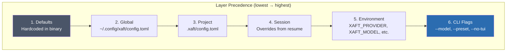
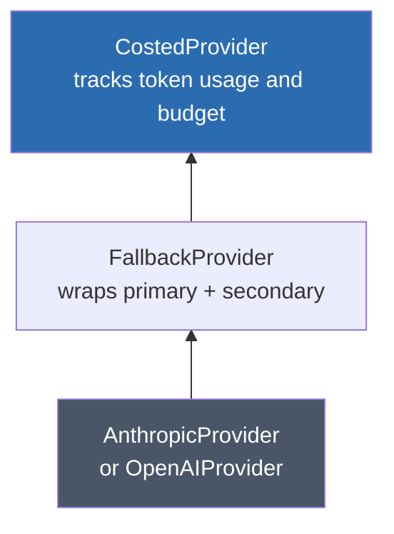

# Crate Map

This page provides a detailed reference for every crate in the xaft workspace. For each crate, we cover its single responsibility, public API surface, key types and traits, inter-crate interaction contracts, and the framework crates it depends on. This is the reference you reach for when you need to know *where* a particular type lives, *who* constructs it, and *how* it crosses crate boundaries.

## `xaft` (binary)

**Responsibility:** Binary entry point. Parses no arguments, performs no I/O. Delegates immediately to `xaft_cli`.

The `xaft` binary crate exists because Cargo requires an executable to have its own crate. Its `main()` function is exactly three lines: it calls `xaft_cli::run()`, maps the result to an exit code, and returns. No logic should be added here—if you are tempted to put something in `main()`, it almost certainly belongs in `xaft-cli` or `xaft-runtime`.

### Public API

```rust
fn main() -> ExitCode;
```

### Dependencies

| Crate | Why |
|-------|-----|
| `xaft-cli` | The only dependency. All behavior flows through `xaft_cli::run()`. |

---

## `xaft-cli`

**Responsibility:** Command-line argument parsing, subcommand dispatch, and tracing initialization. This is the first crate that does real work after the binary starts.

`xaft-cli` uses `clap` with the `derive` macro to define the CLI structure. It supports four subcommands: `run` (execute a task), `sessions` (list, show, resume), `config` (show resolved configuration), and `completions` (generate shell completions). After parsing, it initializes the `tracing` subscriber with either a compact formatter (headless mode) or a no-op subscriber (TUI mode, where the TUI handles display).

The dispatch function is a match on the `CliCommand` enum. Each variant calls into `xaft-runtime` or `xaft-session` as appropriate. The dispatch function also sets up the `CancellationToken` and the SIGINT handler so that Ctrl+C triggers graceful shutdown.

### Public API

```rust
/// Main entry point. Called by the binary crate's main().
pub fn run() -> Result<(), CliError>;

/// Resolved CLI command after parsing.
pub enum CliCommand {
    Run { prompt: String, model: Option<String>, no_tui: bool, dry_run: bool, preset: Option<String> },
    Sessions { action: SessionAction },
    Config { action: ConfigAction },
    Completions { shell: Shell },
}
```

### Key Types

| Type | Description |
|------|-------------|
| `CliCommand` | Enum of all subcommands with their parsed arguments |
| `CliError` | Error type covering parse failures, missing keys, and runtime errors |
| `RunArgs` | Arguments specific to the `run` subcommand |

### Dependencies

| Crate | Why |
|-------|-----|
| `xaft-runtime` | Delegates `run` subcommand execution |
| `xaft-session` | Delegates `sessions` subcommand |
| `xaft-config` | Delegates `config` subcommand |
| `clap` | Argument parsing |
| `tracing` | Structured logging initialization |

---

## `xaft-config`

**Responsibility:** Configuration loading, validation, and hot-reload. Implements the six-layer precedence system with deep merge semantics.

The `ConfigLoader` is the central type. It reads configuration from six sources in precedence order and merges them into a single `XaftConfig`. The merge is deep: nested tables are merged recursively, and scalar values from higher-precedence layers replace those from lower layers. This means a project-level config can override the model without losing the global default for the provider.

Hot-reload is optional and file-system-based. When enabled, a `notify`-based watcher monitors the project config file (`.xaft/config.toml`). If the file changes, the watcher reads the new content, validates it, and emits a `ConfigChanged` signal on the `SignalBus`. Consumers that hold an `Arc<XaftConfig>` are expected to subscribe to this signal and swap their reference. The runtime crate coordinates this swap at the orchestrator level.

### Public API

```rust
/// Load configuration by merging all six layers.
pub fn load() -> Result<XaftConfig, ConfigError>;

/// Load with an explicit override map (used by CLI flags).
pub fn load_with_overrides(overrides: HashMap<String, Value>) -> Result<XaftConfig, ConfigError>;

/// Validate a resolved configuration for internal consistency.
pub fn validate(config: &XaftConfig) -> Result<(), ConfigError>;

/// Start watching the project config file for changes.
pub fn watch_config_file(path: &Path, bus: &SignalBus) -> Result<WatchGuard, ConfigError>;
```

### Key Types

| Type | Description |
|------|-------------|
| `XaftConfig` | Fully resolved configuration. Contains `ProviderConfig`, `AgentConfig`, `ApprovalConfig`, `SessionConfig` |
| `ConfigLoader` | Stateful loader that knows the paths of all six config layers |
| `ConfigLayer` | Enum: `Defaults`, `Global`, `Project`, `Session`, `Env`, `Cli` |
| `ConfigError` | Validation and parse errors with layer attribution |
| `WatchGuard` | RAII guard that stops the file watcher when dropped |

### Configuration Layers



Each layer is deserialized from TOML (or parsed from env vars / CLI flags) into a partial `XaftConfig` where every field is `Option`. The `merge()` function walks both structs recursively, replacing `None` values in the target with `Some` values from the source, and overwriting `Some` values in the target with `Some` values from the source. This produces a fully-resolved `XaftConfig` with no `Option` fields remaining.

### Dependencies

| Crate | Why |
|-------|-----|
| `agtrs-runtime` | `SignalBus` for emitting `ConfigChanged` signals |
| `serde` / `toml` | Deserialization |
| `notify` | File system watching for hot-reload |

---

## `xaft-runtime`

**Responsibility:** The integration crate. Bootstraps the runtime, constructs the provider chain, builds agents and tool registries, creates worktrees, and drives the orchestrator. This is the crate that knows how all the pieces fit together.

`XaftRuntime` is the top-level type. Its `bootstrap()` method creates the `SignalBus`, opens the `FsSessionStore`, and attaches listeners. Its `run_task()` method resolves the agent preset, builds the provider chain (`CostedProvider` → `FallbackProvider` → concrete provider), creates a workspace store, opens a git worktree, builds the tool registry, instantiates agents, assembles the `HandoffOrchestrator`, and runs it to completion.

This crate is the most coupled in the workspace—it depends on every other feature crate and many framework crates. This is by design: the runtime absorbs coupling so that other crates can remain focused on their single responsibility.

### Public API

```rust
/// Bootstrap the runtime: create signal bus, session store, attach listeners.
pub fn bootstrap() -> Result<XaftRuntime, RuntimeError>;

/// Run a coding task with the given prompt.
pub fn run_task(runtime: &XaftRuntime, prompt: &str, config: &XaftConfig) -> Result<TaskResult, RuntimeError>;

/// The runtime handle, holding the signal bus and session store.
pub struct XaftRuntime {
    signal_bus: SignalBus,
    session_store: FsSessionStore,
    cancel_token: CancellationToken,
}
```

### Key Types

| Type | Description |
|------|-------------|
| `XaftRuntime` | Top-level runtime handle |
| `TaskResult` | Summary of a completed task: files changed, tokens used, duration |
| `RuntimeError` | Errors during bootstrap or task execution |
| `ProviderFactory` | Constructs the provider chain from config |

### Provider Chain Construction

The provider chain is built by `ProviderFactory::build()`, which reads the `ProviderConfig` and assembles the chain bottom-up:



- **AnthropicProvider / OpenAIProvider** — Concrete HTTP clients that implement `LLMProvider`. They handle API authentication, request serialization, response parsing, and streaming.
- **FallbackProvider** — Wraps two providers (primary and secondary). If the primary returns a transient error (rate limit, 5xx), the fallback provider retries with the secondary. If both fail, the error propagates.
- **CostedProvider** — Wraps any `LLMProvider` and tracks cumulative token usage. If a budget is configured, it returns an error when the budget is exceeded, preventing runaway costs.

### Dependencies

| Crate | Why |
|-------|-----|
| `xaft-config` | Reads resolved configuration |
| `xaft-agent` | Constructs agents |
| `xaft-tools` | Builds tool registry |
| `xaft-session` | Manages session persistence |
| `xaft-tui` | Launches TUI (optional, feature-gated) |
| `agtrs-runtime` | `Agent`, `LLMProvider`, `SignalBus`, `HandoffOrchestrator` |
| `agtrs-anthropic` | `AnthropicProvider` |
| `agtrs-openai` | `OpenAIProvider` |
| `agtrs-git` | `WorktreeManager` |
| `agtrs-workspace` | `WorkspaceStore`, `TransactionalEditor` |

---

## `xaft-agent`

**Responsibility:** Agent implementations, lifecycle hooks, plan-mode strategies, and the `ApprovalGate` trait. Defines how agents behave during a turn and how they decide to hand off.

The two primary agent types are `XaftAgent` and `PlanModeAgent`. Both implement `agtrs_runtime::Agent`, which requires a `run_turn()` method that takes a conversation history and returns a `TurnResult` containing the LLM response, any tool calls, and a `Handoff` decision.

### `XaftAgent`

`XaftAgent` is the standard agent. It has five lifecycle hooks that fire at specific points during a turn:

```rust
pub trait AgentHooks: Send + Sync {
    fn on_start(&self, ctx: &mut TurnContext);
    fn before_llm_call(&self, ctx: &mut TurnContext, request: &mut LlmRequest);
    fn on_tool_result(&self, ctx: &mut TurnContext, result: &ToolResult);
    fn on_turn_complete(&self, ctx: &mut TurnContext) -> Handoff;
    fn on_finish(&self, ctx: &TurnContext);
}
```

Hooks are injected at construction time via the `XaftAgentBuilder`. The builder pattern allows fine-grained control over which hooks are active—different agent presets (Planner, Coder, QA, Fixer) install different hook sets. For example, the Coder agent installs a hook that auto-retries failed file writes, while the QA agent installs a hook that captures test output for the `Handoff` summary.

### `PlanModeAgent`

`PlanModeAgent` wraps a `XaftAgent` and adds a two-stage planning cascade. Before the inner agent takes any action, the planner generates a plan:

1. **OneShotPlanner** — Sends the prompt to the LLM with a planning-focused system prompt and asks for a complete step-by-step plan. If the plan passes validation (all steps are actionable, no ambiguities), it is passed to the inner agent as context.

2. **IterativeRefinementPlanner** — If the one-shot plan is incomplete, this planner runs a loop: generate a partial plan, identify gaps, and ask the LLM to fill them. The loop runs up to a configured maximum (default: 3 iterations).

This cascade is transparent to the orchestrator—the `PlanModeAgent` still implements `Agent`, and its `run_turn()` method internally runs the planning phase before delegating to the inner agent.

### Approval Gate

The `ApprovalGate` trait controls whether tool executions are allowed to proceed:

```rust
pub trait ApprovalGate: Send + Sync {
    fn request_approval(&self, tool_call: &ToolCall) -> ApprovalDecision;
}

pub enum ApprovalDecision {
    Approve,
    Deny,
    Timeout,
}
```

Two implementations are provided:

- **`TuiApprovalGate`** — Sends the tool call to the TUI dashboard and waits on a `oneshot::Receiver<ApprovalDecision>` with a 120-second timeout. The TUI renders the tool call details and waits for the user to press Enter (approve) or Escape (deny). If the timeout expires, `Timeout` is returned, which is treated as a denial.

- **`AutoApproveGate`** — Returns `Approve` immediately for every tool call. Used in headless mode and CI. This gate is dangerous for untrusted prompts because it allows the agent to execute arbitrary shell commands without oversight.

### Public API

```rust
pub struct XaftAgent { /* ... */ }
pub struct XaftAgentBuilder { /* ... */ }
pub struct PlanModeAgent { /* ... */ }

pub trait AgentHooks: Send + Sync { /* ... */ }
pub trait ApprovalGate: Send + Sync { /* ... */ }

pub struct TuiApprovalGate { /* ... */ }
pub struct AutoApproveGate;

pub enum Handoff {
    Continue,
    Delegate { target: String, context: Value },
    Terminate { summary: String },
}
```

### Dependencies

| Crate | Why |
|-------|-----|
| `agtrs-runtime` | `Agent` trait, `SignalBus`, `LLMProvider`, `Tool` trait |
| `xaft-config` | Reads agent preset configuration (indirectly, via runtime) |

---

## `xaft-tools`

**Responsibility:** Tool implementations for file I/O, git operations, and shell execution. Each tool implements `agtrs_runtime::Tool`.

The tool registry is built by `build_registry()`, which creates a `HashMap<String, Box<dyn Tool>>` containing all available tools. The registry is passed to agents at construction time, and agents invoke tools by name through the `Tool::execute()` method.

### Tool Inventory

| Tool Name | Framework Backend | Description | Modifies Files? |
|-----------|-------------------|-------------|-----------------|
| `ReadFile` | `agtrs-workspace` | Read file contents with optional line range | No |
| `WriteFile` | `agtrs-workspace` | Create or overwrite a file (transactional) | Yes |
| `EditFile` | `agtrs-workspace` | Apply a search-and-replace edit (transactional) | Yes |
| `ShellExec` | `agtrs-shell` | Execute a shell command in a sandboxed subprocess | Possibly |
| `GitStatus` | `agtrs-git` | Show working tree status | No |
| `GitDiff` | `agtrs-git` | Show unstaged changes | No |
| `GitLog` | `agtrs-git` | Show commit history | No |
| `Grep` | Pure Rust (`grep-regex`) | Search file contents by pattern | No |
| `ListDir` | Pure Rust (`std::fs`) | List directory contents | No |

Tools that modify files (`WriteFile`, `EditFile`, `ShellExec`) go through the `ApprovalGate` before execution. Tools that are read-only (`ReadFile`, `GitStatus`, `GitDiff`, `GitLog`, `Grep`, `ListDir`) bypass the approval gate entirely—they have no side effects.

The `ShellExec` tool uses `agtrs-shell`'s sandboxed executor, which runs commands in a subprocess with resource limits (max CPU time, max memory, restricted network access). The sandbox is configurable via the `ShellSandboxConfig` in the resolved `XaftConfig`.

### Public API

```rust
/// Build the complete tool registry with the given workspace and config.
pub fn build_registry(
    workspace: &WorkspaceStore,
    config: &ShellSandboxConfig,
) -> ToolRegistry;

/// Type alias for the tool registry.
pub type ToolRegistry = HashMap<String, Box<dyn Tool>>;

// Individual tool types (all implement agtrs_runtime::Tool)
pub struct ReadFile { /* ... */ }
pub struct WriteFile { /* ... */ }
pub struct EditFile { /* ... */ }
pub struct ShellExec { /* ... */ }
pub struct GitStatus { /* ... */ }
pub struct GitDiff { /* ... */ }
pub struct GitLog { /* ... */ }
pub struct Grep { /* ... */ }
pub struct ListDir { /* ... */ }
```

### Dependencies

| Crate | Why |
|-------|-----|
| `agtrs-runtime` | `Tool` trait definition |
| `agtrs-workspace` | `TransactionalEditor` for file operations |
| `agtrs-shell` | Sandboxed shell command execution |
| `agtrs-git` | Git operations (status, diff, log) |

---

## `xaft-tui`

**Responsibility:** Ratatui-based interactive terminal UI. Displays streaming LLM responses, tool call logs, token counters, and approval prompts.

The `TuiApp` spawns three concurrent tokio tasks:

1. **Runtime loop task** — Runs the xaft runtime and processes agent turns. This is the same event loop described in the architecture overview, but it runs inside the TUI's task tree so that cancellation is coordinated.

2. **Terminal reader task** — Captures keyboard events using `crossterm` and forwards them as `KeyEvent` messages. The approval gate's oneshot channels are resolved here: Enter sends `Approve`, Escape sends `Deny`.

3. **Tick spawner task** — Emits a `Tick` event every 16.67ms (60fps). The TUI uses this to schedule redraws. The tick rate is configurable but 60fps is the default because it matches the refresh rate of most terminals.

The `EventBridge` is the glue between the `SignalBus` and the TUI. It subscribes to all signal types and converts them into `TuiEvent` enum variants:

| SignalBus Event | TuiEvent Variant | TUI Panel |
|----------------|------------------|-----------|
| `LlmCallStarted` | `LlmStreamingStarted` | Response panel (show spinner) |
| `LlmCallCompleted` | `LlmStreamingComplete` | Response panel (show response) |
| `ToolCallRequested` | `ToolCallPending` | Tool log panel |
| `ToolResultReady` | `ToolCallComplete` | Tool log panel |
| `ApprovalRequired` | `ApprovalNeeded` | Approval panel (prompt user) |
| `TurnComplete` | `AgentTurnEnded` | Status bar |
| `TaskComplete` | `TaskFinished` | Summary panel |

### Public API

```rust
/// Launch the TUI application. Blocks until the task completes or the user quits.
pub fn run_tui(runtime: XaftRuntime, prompt: &str, config: &XaftConfig) -> Result<TaskResult, TuiError>;

/// Event bridge that subscribes to SignalBus and forwards as TuiEvents.
pub struct EventBridge { /* ... */ }

/// Events consumed by the TUI rendering loop.
pub enum TuiEvent {
    LlmStreamingStarted,
    LlmStreamingComplete { content: String, tokens: u32 },
    ToolCallPending { tool: String, args: Value },
    ToolCallComplete { tool: String, result: String },
    ApprovalNeeded { tool: String, diff: Option<String> },
    ApprovalDecided { decision: ApprovalDecision },
    AgentTurnEnded { agent: String, handoff: Handoff },
    TaskFinished { result: TaskResult },
    Tick,
    Key(KeyEvent),
    Quit,
}
```

### Dependencies

| Crate | Why |
|-------|-----|
| `agtrs-runtime` | `SignalBus` subscription for event bridging |
| `xaft-runtime` | Runtime execution and cancellation |
| `xaft-agent` | `ApprovalDecision` type |
| `ratatui` | Terminal rendering framework |
| `crossterm` | Terminal input/output |

---

## `xaft-session`

**Responsibility:** SQLite-backed session persistence and conversation history. Provides the `FsSessionStore` that records every event durably.

The `FsSessionStore` wraps `agtrs-store`'s SQLite primitives with xaft-specific schema and query logic. It opens the database at `.xaft/sessions.db`, enables WAL mode, and creates three tables: `sessions`, `messages`, and `tool_calls`. The store registers a `SignalBus` listener that writes events as they arrive, ensuring that the database is always up-to-date even if xaft crashes mid-task.

Session resume works by reading the `messages` table for a given session ID and reconstructing the conversation history as a `Vec<Message>`. This history is passed to the agent as the initial context, so the agent can continue seamlessly from where it left off.

### Public API

```rust
/// Open or create the session database.
pub fn open(path: &Path) -> Result<FsSessionStore, SessionError>;

/// Create a new session and return its ID.
pub fn create_session(&self, prompt: &str) -> Result<SessionId, SessionError>;

/// Append a message to the session's conversation history.
pub fn append_message(&self, session: SessionId, message: &Message) -> Result<(), SessionError>;

/// Load the full conversation history for a session.
pub fn load_history(&self, session: SessionId) -> Result<Vec<Message>, SessionError>;

/// List all sessions with metadata.
pub fn list_sessions(&self) -> Result<Vec<SessionSummary>, SessionError>;

/// Update session status (Running, Completed, Failed, Cancelled).
pub fn update_status(&self, session: SessionId, status: SessionStatus) -> Result<(), SessionError>;

/// RAII handle to the session database.
pub struct FsSessionStore { /* ... */ }

/// Unique session identifier (UUID v4).
pub type SessionId = String;

/// Session metadata for listing.
pub struct SessionSummary {
    pub id: SessionId,
    pub prompt: String,
    pub created_at: DateTime<Utc>,
    pub status: SessionStatus,
    pub token_count: u64,
}
```

### Database Schema

```sql
CREATE TABLE sessions (
    id          TEXT PRIMARY KEY,
    prompt      TEXT NOT NULL,
    created_at  TEXT NOT NULL,
    status      TEXT NOT NULL DEFAULT 'running',
    token_count INTEGER NOT NULL DEFAULT 0
);

CREATE TABLE messages (
    id          INTEGER PRIMARY KEY AUTOINCREMENT,
    session_id  TEXT NOT NULL REFERENCES sessions(id),
    role        TEXT NOT NULL,  -- 'system', 'user', 'assistant', 'tool'
    content     TEXT NOT NULL,
    timestamp   TEXT NOT NULL,
    token_count INTEGER
);

CREATE TABLE tool_calls (
    id          INTEGER PRIMARY KEY AUTOINCREMENT,
    session_id  TEXT NOT NULL REFERENCES sessions(id),
    message_id  INTEGER REFERENCES messages(id),
    tool_name   TEXT NOT NULL,
    arguments   TEXT NOT NULL,  -- JSON
    result      TEXT,           -- JSON
    approved    INTEGER NOT NULL DEFAULT 0,  -- 0=pending, 1=approved, 2=denied, 3=timeout
    duration_ms INTEGER
);
```

### Dependencies

| Crate | Why |
|-------|-----|
| `agtrs-store` | SQLite connection pool, migration runner, WAL mode setup |
| `agtrs-runtime` | `SignalBus` for subscribing to events, `Message` type |
| `rusqlite` | Low-level SQLite bindings (via `agtrs-store`) |
