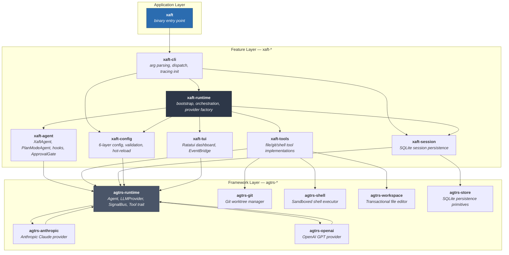
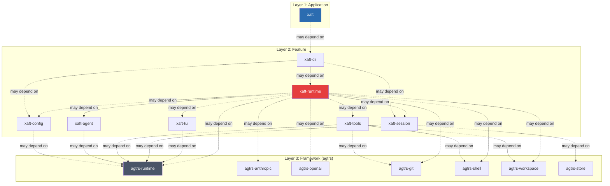

# Dependency Graph

This page presents the full dependency structure of the xaft workspace as a Mermaid diagram, followed by a coupling analysis that identifies which crates are tightly coupled, which are isolated, and where the layer boundaries fall. Understanding this graph is essential for evaluating the blast radius of a change, planning refactors, and enforcing architectural invariants in CI.

## Full Workspace Dependency Graph

The graph below shows every crate-to-crate dependency in the xaft workspace, including framework crates. Arrows point from the dependent crate to the crate it depends on (direction of `use`). External crate dependencies (e.g., `tokio`, `serde`, `clap`) are omitted for clarity—only intra-workspace edges are shown.

## Dependency Matrix

The table below enumerates every intra-workspace dependency. A `●` in a cell means the row crate depends on the column crate. This matrix is the ground truth for the coupling analysis that follows.

| ↓ Depends on → | xaft | xaft-cli | xaft-config | xaft-runtime | xaft-agent | xaft-tools | xaft-tui | xaft-session | agtrs-runtime | agtrs-anthropic | agtrs-openai | agtrs-git | agtrs-shell | agtrs-workspace | agtrs-store |
|---|---|---|---|---|---|---|---|---|---|---|---|---|---|---|---|
| **xaft** | | ● | | | | | | | | | | | | | |
| **xaft-cli** | | | ● | ● | | | | ● | | | | | | | |
| **xaft-config** | | | | | | | | | ● | | | | | | |
| **xaft-runtime** | | | ● | | ● | ● | ● | ● | ● | ● | ● | ● | ● | ● | |
| **xaft-agent** | | | | | | | | | ● | | | | | | |
| **xaft-tools** | | | | | | | | | ● | | | ● | ● | ● | |
| **xaft-tui** | | | | | | | | | ● | | | | | | |
| **xaft-session** | | | | | | | | | ● | | | | | | ● |

## Layer Boundaries

The workspace enforces a strict three-layer architecture. Dependencies may flow downward within the same layer or to any lower layer, but **never upward**. Violating this rule introduces circular dependencies and makes the crate graph unresolvable.

### Layer Rules

1. **Layer 1 → Layer 2 only.** The `xaft` binary depends only on `xaft-cli`. It never directly imports from any other feature or framework crate.

2. **Layer 2 → Layer 2 and Layer 3.** Feature crates may depend on other feature crates and on framework crates. However, feature-to-feature dependencies must form a DAG—no cycles. Currently, `xaft-runtime` is the only feature crate that depends on multiple other feature crates; all others depend on `xaft-runtime` only indirectly (through the CLI).

3. **Layer 3 → Layer 3 only.** Framework crates depend only on other framework crates. They have zero knowledge of xaft feature crates. This is enforced by the workspace `Cargo.toml`, which places `agtrs-*` crates in a separate dependency scope.

4. **No upward dependencies.** A lower-layer crate never imports from a higher-layer crate. `agtrs-runtime` does not know about `XaftAgent`. `xaft-agent` does not know about `XaftRuntime`. This is the single most important invariant in the architecture.

## Coupling Analysis

Coupling measures how many other crates a given crate is connected to, both as a dependent (fan-out) and as a dependency (fan-in). High fan-in crates are stable interfaces that many crates rely on; changes to them have wide blast radius. High fan-out crates are integration points that absorb complexity; they are harder to change in isolation but easier to replace wholesale.

### Fan-In (Crate is depended upon by)

| Crate | Fan-In | Depended Upon By |
|-------|--------|-----------------|
| `agtrs-runtime` | **6** | xaft-config, xaft-runtime, xaft-agent, xaft-tools, xaft-tui, xaft-session |
| `xaft-runtime` | **2** | xaft-cli, xaft-tui |
| `xaft-cli` | **1** | xaft |
| `agtrs-store` | **1** | xaft-session |
| `agtrs-git` | **1** | xaft-tools |
| `agtrs-shell` | **1** | xaft-tools |
| `agtrs-workspace` | **1** | xaft-tools |
| `agtrs-anthropic` | **1** | xaft-runtime |
| `agtrs-openai` | **1** | xaft-runtime |

`agtrs-runtime` is the most depended-upon crate in the workspace. It defines the `Agent` trait, the `Tool` trait, the `SignalBus`, and the `LLMProvider` interface—core abstractions that every feature crate needs. This high fan-in is expected and desirable: these are stable interfaces that change rarely, and when they do change, the impact is systematic and well-understood. The `SignalBus` in particular is a foundational type that appears in every crate except the binary; any change to its API would require updates across the entire feature layer.

### Fan-Out (Crate depends upon)

| Crate | Fan-Out | Depends On |
|-------|---------|-----------|
| `xaft-runtime` | **8** | xaft-config, xaft-agent, xaft-tools, xaft-session, xaft-tui, agtrs-runtime, agtrs-anthropic, agtrs-openai, agtrs-git, agtrs-shell, agtrs-workspace |
| `xaft-tools` | **4** | agtrs-runtime, agtrs-git, agtrs-shell, agtrs-workspace |
| `xaft-cli` | **3** | xaft-config, xaft-runtime, xaft-session |
| `xaft-session` | **2** | agtrs-runtime, agtrs-store |
| `xaft-config` | **1** | agtrs-runtime |
| `xaft-agent` | **1** | agtrs-runtime |
| `xaft-tui` | **1** | agtrs-runtime |
| `xaft` | **1** | xaft-cli |

`xaft-runtime` has the highest fan-out by a wide margin. It depends on eight other crates—every feature crate and five framework crates. This makes it the integration nexus of the workspace, the single point where all the pieces are assembled. This is a deliberate architectural choice: by concentrating integration complexity in one crate, we keep the other feature crates focused and loosely coupled. The tradeoff is that `xaft-runtime` is the hardest crate to modify in isolation; any significant change requires understanding its interactions with all eight dependencies.

### Coupling Hotspots

Based on the fan-in and fan-out analysis, three coupling hotspots deserve attention:

1. **`agtrs-runtime` ↔ `xaft-runtime`** — The strongest coupling in the workspace. `xaft-runtime` imports more types from `agtrs-runtime` than from any other crate: `SignalBus`, `Agent`, `LLMProvider`, `HandoffOrchestrator`, `Tool`, `TurnContext`, `TurnResult`, and `Handoff`. Any breaking change in `agtrs-runtime` will require immediate updates in `xaft-runtime`, and likely cascading updates in `xaft-agent` and `xaft-tools` as well.

2. **`xaft-runtime` ↔ feature crates** — `xaft-runtime` depends on five feature crates simultaneously. This means a change to any feature crate's public API might require changes in `xaft-runtime`. The mitigating factor is that feature crates expose narrow public APIs (see the [Crate Map](02-crate-map.md)), so the surface area for breakage is small.

3. **`agtrs-runtime` as a shared dependency** — Six feature crates depend on `agtrs-runtime`. This means they all share the same version of `SignalBus`, `Agent`, and `Tool`. If `agtrs-runtime` needs to be upgraded, all six crates must be upgraded together. This is managed by the workspace `Cargo.toml`, which pins a single version of `agtrs-runtime` for all members.

## Dependency Direction Invariants

The following invariants are enforced by the workspace structure and should be verified in CI (e.g., with `cargo tree` assertions or a custom lint):

| Invariant | Rationale |
|-----------|-----------|
| No feature crate depends on `xaft` (binary) | The binary is a leaf, not a library |
| No `agtrs-*` crate depends on any `xaft-*` crate | Framework must remain xaft-agnostic |
| No cycle exists among feature crates | Cycles would make the workspace unresolvable |
| `xaft-agent` does not depend on `xaft-tools` | Agents invoke tools by name, not by type |
| `xaft-tui` does not depend on `xaft-runtime` directly | TUI communicates via `SignalBus` only |
| `xaft-session` does not depend on `xaft-config` | Session persistence is config-agnostic |

The last three invariants are particularly important because they prevent the formation of "dependency diamonds" where two crates both depend on a third but also depend on each other. For example, `xaft-agent` invokes tools through the `Tool` trait from `agtrs-runtime`, not through concrete types from `xaft-tools`. This means the agent crate can be compiled and tested without the tools crate, and new tools can be added without recompiling the agent crate.

## Impact Analysis Guide

When evaluating a change to any crate, use this table to determine the blast radius:

| If you change... | Minimum blast radius | Maximum blast radius |
|-------------------|---------------------|---------------------|
| `agtrs-runtime` public API | All 6 feature crates that depend on it | Entire workspace |
| `xaft-runtime` public API | `xaft-cli` (direct dependent) | `xaft-cli`, `xaft-tui` |
| `xaft-agent` public API | `xaft-runtime` only | `xaft-runtime` |
| `xaft-tools` public API | `xaft-runtime` only | `xaft-runtime` |
| `xaft-config` public API | `xaft-cli`, `xaft-runtime` | `xaft-cli`, `xaft-runtime` |
| `xaft-session` public API | `xaft-cli`, `xaft-runtime` | `xaft-cli`, `xaft-runtime` |
| `xaft-tui` public API | `xaft-runtime` only | `xaft-runtime` |
| `agtrs-git` / `agtrs-shell` / `agtrs-workspace` | `xaft-tools` | `xaft-tools`, `xaft-runtime` |
| `agtrs-store` | `xaft-session` | `xaft-session`, `xaft-runtime` |

The "maximum blast radius" column accounts for transitive dependencies through `xaft-runtime`. For example, changing `agtrs-git`'s public API directly affects `xaft-tools`, which is used by `xaft-runtime`. If the change requires `xaft-runtime` to call `xaft-tools` differently, then `xaft-runtime` is also affected. However, if the change is internal (same public API, different implementation), `xaft-runtime` is unaffected.

This is why maintaining narrow public APIs in the feature crates is so important: it limits the maximum blast radius even when transitive dependencies are involved. A one-method trait is easier to keep stable than a ten-method struct with public fields.
