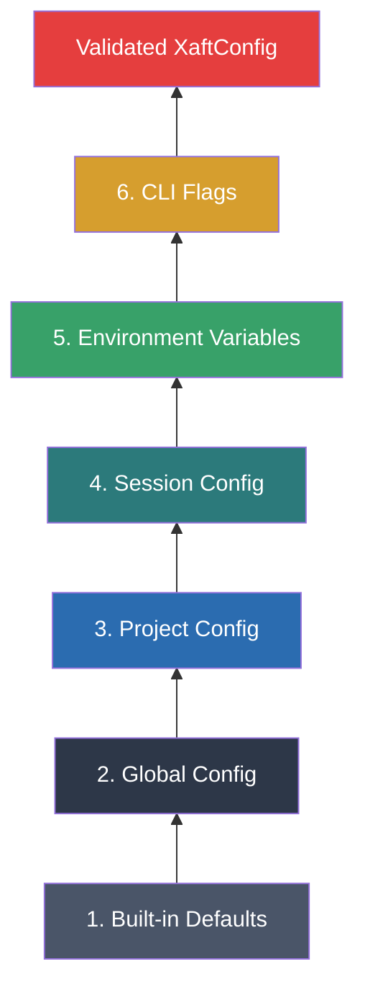

# Configuration System Overview

The xaft configuration system is a six-layer, precedence-ordered loading pipeline that assembles the final runtime configuration from multiple sources. Each layer can override or extend the values provided by lower-precedence layers, and the system supports deep merging of nested objects, environment variable interpolation, and runtime hot-reloading. The design balances sensible defaults with per-project customization, allowing teams to share baseline configurations while enabling individual developers to override specific settings for their workflow.

## The Six-Layer Precedence Model

Configuration values are loaded from six sources, in order of increasing precedence. When multiple sources provide the same value, the highest-precedence source wins. This model follows the industry-standard pattern used by tools like ESLint, Prettier, and Terraform, where broad defaults are progressively refined by more specific sources.



### Layer 1: Built-in Defaults

Every configuration field has a hardcoded default value defined in the `Default` implementation of its struct. These defaults represent the "works out of the box" experience — a new user can run xaft without any configuration file and get a functional setup with the Anthropic provider, a reasonable agent preset, and safe guardrails. The defaults are chosen to be conservative: they prefer safety over convenience (e.g., file destruction requires approval by default) and quality over speed (e.g., the default model is the most capable one available).

### Layer 2: Global Configuration

The global configuration file is located at `~/.config/xaft/config.toml` (or the platform equivalent). It contains the user's personal preferences that apply across all projects: API keys, preferred theme, default model, and personal guardrail settings. The global config is the appropriate place for settings that rarely change per project, such as the API key for the user's preferred provider or the default TUI theme.

### Layer 3: Project Configuration

The project configuration file is located at `.xaft/config.toml` in the project's root directory. It contains project-specific settings: which agents are available, which tools are permitted, project-specific guardrails (e.g., "don't modify files in the `generated/` directory"), and MCP server configurations. The project config can be checked into version control, allowing teams to share a consistent configuration across all contributors. It is the primary mechanism for encoding project-specific knowledge about how xaft should behave in a given codebase.

### Layer 4: Session Configuration

Session-level configuration is loaded when a session is created, typically from a session-specific config file or from parameters passed programmatically. This layer allows individual sessions to override project settings — for example, a session that focuses on refactoring might use a different agent preset than one that focuses on bug fixing. Session configs are stored in the session record and persist across session resumption.

### Layer 5: Environment Variables

Environment variables provide a convenient way to override specific settings without modifying configuration files. They are particularly useful for secrets (API keys) and for CI/CD environments where config files may not be available. Environment variables are mapped to configuration fields using a `XAFT_` prefix and a double-underscore separator for nesting: e.g., `XAFT_PROVIDER__ANTHROPIC__API_KEY` maps to `provider.anthropic.api_key`. Environment variables have higher precedence than all file-based configuration, ensuring that they can override any setting.

### Layer 6: CLI Flags

Command-line flags are the highest-precedence configuration source. They are specified on the `xaft` command line and override all other sources. CLI flags are parsed using `clap` and mapped to configuration fields. They are most commonly used for one-off overrides: e.g., `xaft --model gpt-4o` to use a different model for a single session, or `xaft --no-approval` to disable approval gates temporarily. Because CLI flags are the most specific and intentional configuration source, they take absolute precedence.

## Deep Merge Semantics

When multiple configuration layers provide values for the same field, the system performs a deep merge rather than a simple replacement. The merge rules are:

- **Scalars** (strings, numbers, booleans): The higher-precedence value replaces the lower-precedence value entirely. There is no partial replacement of strings or arithmetic on numbers.
- **Arrays**: The higher-precedence array replaces the lower-precedence array entirely. There is no element-wise merge — this is intentional, as merging arrays element-by-element would produce ambiguous results (e.g., should two arrays of allowed tools be unioned or intersected?).
- **Objects** (tables/maps): Objects are merged recursively. If both layers provide a value for the same key, the merge algorithm recurses into the nested objects. If only one layer provides a key, that key is used directly.
- **Null values**: A null value in a higher-precedence layer preserves the value from the lower-precedence layer. This is the "null preserves base" rule, which allows higher layers to selectively override individual fields without needing to repopulate the entire nested object. For example, a project config can override just the `model` field of an agent preset while preserving all other fields from the global config by setting only `model` and leaving the rest as null.

```mermaid
flowchart LR
    subgraph Lower Layer
        A1[model: "claude-3-opus"]
        A2[temperature: 0.7]
        A3[max_turns: 20]
    end

    subgraph Higher Layer
        B1[model: "gpt-4o"]
        B2[temperature: null]
        B3[max_turns: null]
    end

    subgraph Merged Result
        C1[model: "gpt-4o"]
        C2[temperature: 0.7]
        C3[max_turns: 20]
    end

    A1 --> C1
    B1 --> C1
    A2 --> C2
    B2 -.->|null preserves| C2
    A3 --> C3
    B3 -.->|null preserves| C3
```

## Environment Variable Interpolation

Configuration values can contain `${ENV_VAR}` placeholders that are expanded at load time. For example:

```toml
[provider.anthropic]
api_key = "${ANTHROPIC_API_KEY}"
```

When this configuration is loaded, the `${ANTHROPIC_API_KEY}` placeholder is replaced with the value of the `ANTHROPIC_API_KEY` environment variable. If the variable is not set, the placeholder is replaced with an empty string, and a validation error is raised if the field is required. Interpolation is performed after all layers have been merged but before validation, ensuring that the final resolved values are checked for correctness.

The interpolation syntax supports default values using the `${ENV_VAR:-default}` pattern. If the environment variable is not set, the default value is used instead. This is useful for fields that have a reasonable default but can be overridden via the environment:

```toml
[core]
data_dir = "${XAFT_DATA_DIR:-~/.xaft}"
```

Interpolation is recursive — if an environment variable's value itself contains `${...}` placeholders, those are also expanded. The recursion depth is limited to 10 levels to prevent infinite loops caused by circular variable references.

## ConfigLoader Pipeline

The `ConfigLoader` orchestrates the six-layer loading process. Its `load(cli)` method proceeds through the following steps:

1. **Load Defaults**: Construct the default `XaftConfig` using `Default::default()`.
2. **Load Global Config**: Read and parse `~/.config/xaft/config.toml`. If the file doesn't exist, skip this step.
3. **Load Project Config**: Read and parse `.xaft/config.toml` from the current directory. If the file doesn't exist, skip this step.
4. **Load Session Config**: If a session ID is provided, load the session-specific config from the session store.
5. **Apply Environment Variables**: Read `XAFT_*` environment variables and construct a partial config from them.
6. **Apply CLI Flags**: Extract CLI flag values and construct a partial config from them.
7. **Deep Merge**: Merge all layers in precedence order (defaults → global → project → session → env → CLI).
8. **Interpolate**: Expand `${ENV_VAR}` placeholders in all string values.
9. **Validate**: Run the `validate()` function to check all invariants and return the final `XaftConfig`.

Each step produces a partial `XaftConfig` that is merged into the accumulator. The `ConfigLoader` uses the `serde` deserialization framework with `toml` as the primary format, ensuring that all configuration files are type-checked and structurally valid before merging.
