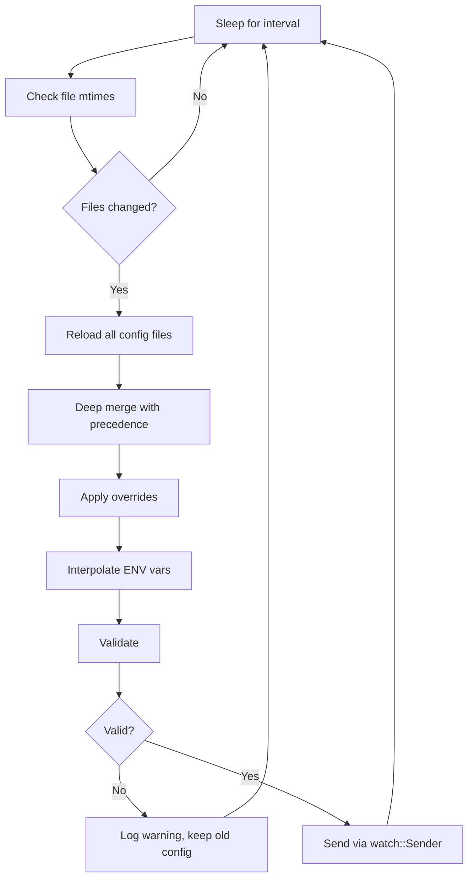

# Configuration Hot-Reload

The xaft configuration system supports hot-reloading — the ability to detect changes to configuration files at runtime and apply them without restarting the session. This is implemented by the `ConfigWatcher` type, which monitors specified file paths for modifications and publishes updated configurations through a `tokio::sync::watch` channel. Hot-reload enables rapid iteration on agent presets, guardrail settings, and TUI themes without the overhead of restarting sessions and re-establishing conversation context.

## ConfigWatcher

### spawn()

The `ConfigWatcher::spawn()` method creates a new watcher that monitors a set of file paths for changes. Its signature is:

```rust
pub fn spawn(
    initial: XaftConfig,
    paths: Vec<PathBuf>,
    overrides: ConfigOverrides,
    interval: Duration,
) -> (watch::Receiver<XaftConfig>, JoinHandle<()>)
```

**Parameters:**

- `initial`: The initial configuration, fully loaded and validated. This is the configuration that will be used until the first file change is detected.
- `paths`: A list of file paths to monitor. Typically, this includes the global config path (`~/.config/xaft/config.toml`) and the project config path (`.xaft/config.toml`).
- `overrides`: Configuration overrides that are always applied on top of the file-based configuration. These typically include CLI flags and environment variable mappings, which should not be overridden by file changes.
- `interval`: The polling interval for checking file modifications. The default is 5 seconds. Shorter intervals provide faster reload but increase filesystem I/O.

**Returns:**

- A `watch::Receiver<XaftConfig>` that consumers can use to receive updated configurations. The receiver always holds the most recent configuration.
- A `JoinHandle<()>` for the background watcher task. The task runs until the receiver is dropped.

### Watcher Task Implementation

The watcher task runs an infinite loop that performs the following steps on each iteration:

1. **Sleep**: Wait for the configured interval (default: 5 seconds). This polling-based approach was chosen over filesystem notification APIs (e.g., `inotify`, `FSEvents`) for cross-platform compatibility and simplicity.

2. **Check Modification Times**: For each monitored path, check the file's `mtime` (modification time) using `std::fs::metadata()`. If any file has been modified since the last check, proceed to reload. If no files have changed, skip to the next iteration.

3. **Reload Files**: Read and parse all configuration files using the same `ConfigLoader` pipeline. This ensures that reload follows the same precedence rules and merge semantics as the initial load.

4. **Apply Overrides**: Re-apply the `overrides` parameter on top of the reloaded configuration. This ensures that CLI flags and environment variables retain their higher precedence even after a file change.

5. **Interpolate**: Expand `${ENV_VAR}` placeholders in the reloaded values. Environment variable values are re-read at reload time, so changes to environment variables between reloads are reflected.

6. **Validate**: Run the `validate()` function on the merged, interpolated configuration. If validation fails, the reload is aborted — the previous configuration continues to be used — and a warning is logged with the validation error details. This prevents a malformed config file from breaking a running session.

7. **Publish**: If validation succeeds, send the new configuration through the `watch::Sender`. The `watch` channel is a single-slot channel — the most recent value always overwrites the previous one — so consumers always see the latest configuration.



## Consumer-Side Integration

Components that depend on configuration use the `watch::Receiver` to stay synchronized with the latest settings. The integration pattern varies by component:

### Runtime Event Loop

The event loop checks the receiver at the start of each iteration using `rx.has_changed()`. If the configuration has changed, it calls `rx.borrow_and_update()` to get the new configuration and applies any immediate changes (e.g., updating rate limits, switching models). Some configuration changes require more substantial action (e.g., changing the agent preset mid-session), and these are deferred to the next task to avoid disrupting the current agent's execution.

### TUI

The TUI checks the configuration receiver on every tick (every 16ms). Theme changes are applied immediately — the next render frame uses the updated theme colors. Layout changes are applied on the next resize or re-render. Keybinding changes take effect immediately for the next key event.

### Guardrails

The guardrail engine holds a reference to the configuration receiver and reads the current guardrail settings before each tool approval decision. This ensures that changes to guardrail rules (e.g., adding a new command to the auto-approve list) take effect immediately without requiring a session restart.

## Hot-Reloadable vs. Non-Hot-Reloadable Settings

Not all configuration changes can be safely applied at runtime. The following table categorizes settings by their reloadability:

| Setting | Hot-Reloadable | Reason |
|---------|---------------|--------|
| Theme | Yes | Visual change only; no state impact |
| Keybindings | Yes | Input mapping change; no state impact |
| Layout proportions | Yes | Visual change; layout recomputed on next render |
| Guardrail rules | Yes | Checked before each tool call |
| Agent system_prompt | Yes | Applied on next agent turn |
| Agent model | Partial | Applied on next LLM call; mid-stream calls are not interrupted |
| Provider API key | Partial | Applied on next API call; in-flight calls use the old key |
| Provider base_url | No | Requires new HTTP client; deferred to next session |
| Core data_dir | No | Filesystem paths are bound at startup |
| MCP server/client config | No | Process lifecycle changes; deferred to next session |
| Plugin config | No | Loaded at startup; requires restart |

For non-hot-reloadable settings, the `ConfigWatcher` still publishes the updated configuration, but the consuming components ignore changes to these fields and log a message indicating that the change will take effect on the next session.

## Error Handling During Reload

Reload errors are handled gracefully to ensure that a broken configuration file does not disrupt a running session:

- **Parse Error**: If a configuration file contains invalid TOML syntax, the reload is aborted and a warning is logged with the parse error location (line and column). The previous configuration continues to be used.
- **Type Error**: If a field has the wrong type (e.g., a string where a number is expected), the reload is aborted and a warning is logged with the field path and expected type.
- **Validation Error**: If the merged configuration fails validation, the reload is aborted and a warning is logged with the specific validation rule that was violated.
- **File Read Error**: If a configuration file cannot be read (e.g., due to permissions), the reload is aborted and a warning is logged. The previous configuration continues to be used.

In all error cases, the `watch::Receiver` retains the last valid configuration, ensuring that consumers always have a consistent, valid configuration to work with. The watcher continues monitoring files and will attempt to reload again on the next interval, so transient errors (e.g., a file being temporarily unavailable during a save) are self-correcting.

## Performance Considerations

The polling-based approach has minimal performance impact because:

1. **Filesystem Stats Are Cheap**: Checking `mtime` via `std::fs::metadata()` is a fast syscall that does not read file contents. On modern filesystems, it typically completes in microseconds.

2. **Full Reload Is Rare**: Configuration files change infrequently during a session. Most polling cycles detect no changes and skip the reload step entirely.

3. **Watch Channel Is Zero-Cost When Unchanged**: The `watch::Receiver::has_changed()` method is an atomic compare-and-swap that returns `false` without any allocation or copying when the configuration hasn't changed.

4. **Watch Channel Is Bounded**: The `watch` channel holds exactly one value, so there is no risk of unbounded memory growth from queued updates. When multiple file changes occur within a single polling interval, only the final state is published, coalescing intermediate states.

The default 5-second polling interval provides a good balance between responsiveness and overhead. For environments where configuration changes are more frequent (e.g., during active development of agent presets), the interval can be reduced to 1 second. For production environments where configuration rarely changes, it can be increased to 30 seconds or more.
