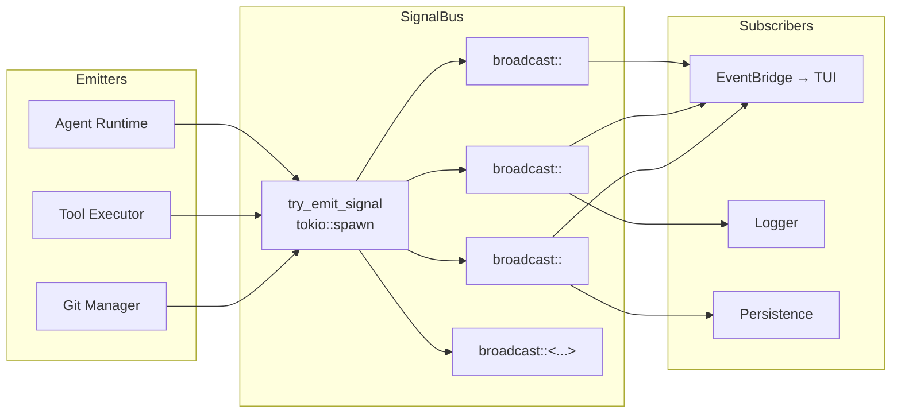

# SignalBus Architecture

The `SignalBus` is xaft's centralized, type-safe event distribution system. It provides a publish-subscribe model where producers emit strongly-typed signals and consumers subscribe to specific signal types. The SignalBus decouples signal producers (the agent runtime, tool execution, git operations) from signal consumers (the TUI, logging, persistence), allowing each subsystem to evolve independently without creating direct dependencies between them. The design is inspired by the event bus pattern common in distributed systems, adapted for use within a single tokio runtime.

## Core Design

### Broadcast-Based Distribution

The `SignalBus` is built on `tokio::sync::broadcast` channels. Each signal type gets its own broadcast channel, created lazily on first use. When a signal is emitted, it is sent to the corresponding broadcast channel, and all active subscribers receive a copy. Broadcast channels were chosen over `mpsc` channels for two reasons: first, they support multiple consumers natively (each subscriber gets its own copy of every signal), and second, they provide backpressure semantics that are appropriate for event distribution — slow consumers can be lagged without blocking the producer.

The broadcast channel capacity is configurable per signal type, with a default of 256 messages. If a subscriber falls behind by more than the channel capacity, it receives a `RecvError::Lagged` notification and must handle the gap. In practice, this rarely occurs because the TUI's `EventBridge` consumes signals promptly, and other subscribers (logging, persistence) are lightweight.

### Type-Safe Subscriptions

The SignalBus uses Rust's type system to ensure that subscribers only receive signals of the type they expect. The `on::<T>(handler).await` method subscribes to signals of type `T` and calls the provided handler for each one. The `subscribe::<T>().await` method returns a `broadcast::Receiver<T>` that the caller can poll manually. Both methods use the `std::any::TypeId` of `T` to look up or create the appropriate broadcast channel.

```rust
// Type-safe subscription example
signal_bus.on::<XaftCommitCreated>(|signal| {
    println!("Commit created: {}", signal.hash);
}).await;

// Manual receiver example
let mut rx = signal_bus.subscribe::<XaftCommitCreated>().await;
while let Ok(signal) = rx.recv().await {
    handle_commit(signal);
}
```

The type-safe approach eliminates runtime casting errors and provides compile-time guarantees that signal handlers receive the correct type. It also enables IDE autocompletion and documentation for signal fields, improving the developer experience for contributors extending the signal system.

## Signal Types

Signals are divided into two namespaces: `xaft`-level signals (domain-specific events defined by the xaft runtime) and `agtrs`-level signals (lower-level events defined by the agent runtime framework). This separation allows the agtrs framework to be used independently of xaft while still providing the event infrastructure that xaft needs.

### xaft-Level Signals

These signals represent high-level domain events in the xaft runtime:

| Signal | Fields | Emitted When |
|--------|--------|--------------|
| `XaftLlmCallStarting` | `agent_name`, `model`, `prompt_tokens` (estimated) | An LLM API call is about to be made |
| `XaftCommitCreated` | `hash`, `branch`, `summary`, `files_changed` | A git commit is created in the worktree |
| `XaftPlanCreated` | `plan_id`, `steps`, `agent_name` | The planner agent produces a plan |
| `XaftPlanEmpty` | `agent_name`, `reason` | The planner determines no action is needed |
| `XaftAgentOutput` | `agent_name`, `content`, `is_streaming` | An agent produces text output |

### agtrs-Level Signals

These signals represent lower-level events from the agent runtime framework:

| Signal | Fields | Emitted When |
|--------|--------|--------------|
| `ModelCallStarted` | `request_id`, `model`, `provider`, `timestamp` | An LLM API request is sent |
| `ModelCallComplete` | `request_id`, `model`, `usage` (input/output tokens), `latency_ms`, `cost_usd` | An LLM API response is received |
| `ToolCallStarted` | `tool_name`, `params`, `request_id` | A tool begins execution |
| `ToolCallComplete` | `tool_name`, `result_summary`, `success`, `duration_ms` | A tool finishes execution |
| `ToolPendingApproval` | `tool_name`, `params`, `request_id`, `risk_level` | A tool is waiting for user approval |
| `AgentRunComplete` | `agent_name`, `final_message`, `turn_count`, `total_tokens` | An agent finishes its run |
| `AgentCancelled` | `agent_name`, `reason` | An agent is cancelled |
| `FileEditsCommitted` | `files`, `agent_name`, `commit_hash` | File edits are committed to the worktree |

## Signal Emission Pattern

### try_emit_signal()

The `try_emit_signal()` function is the primary mechanism for emitting signals. It uses `tokio::spawn` for fire-and-forget semantics, ensuring that the signal emitter never blocks on the signal distribution. The implementation is approximately:

```rust
async fn try_emit_signal<T: Clone + Send + 'static>(
    bus: &SignalBus,
    signal: T,
) {
    let bus = bus.clone();
    tokio::spawn(async move {
        if let Err(e) = bus.emit(signal).await {
            tracing::warn!("Signal emission failed: {}", e);
        }
    });
}
```

The fire-and-forget pattern has several important properties:

1. **Non-Blocking**: The emitter spawns a task and immediately continues. It does not wait for subscribers to process the signal, and it does not wait for the broadcast send to complete. This ensures that signal emission never introduces latency into the critical path (e.g., between receiving an LLM response and processing the next turn).

2. **Error Tolerance**: If no subscribers exist for a signal type, or if all subscribers have been dropped, the `emit()` call returns an error. This error is logged as a warning but does not propagate to the emitter, which would be inappropriate for a fire-and-forget pattern.

3. **Ordered Within Type**: While signals of different types may be delivered out of order (because each type has its own broadcast channel), signals of the same type are delivered in emission order. This preserves causal ordering within a signal type — e.g., `ToolCallStarted` for a given tool is always received before `ToolCallComplete`.

4. **No Delivery Guarantee Across Types**: There is no ordering guarantee between different signal types. A `ModelCallComplete` signal might arrive before a `ToolCallStarted` signal that was emitted earlier, if they are of different types. Subscribers that need cross-type ordering must implement their own synchronization.



## Subscription Patterns

### One-Shot Handler (on::<T>)

The `on` method registers an async handler that is called for every signal of type `T`. The handler runs in a spawned task and does not block other subscribers. This is the simplest subscription pattern and is suitable for side-effect-only consumers like logging:

```rust
signal_bus.on::<XaftCommitCreated>(|signal| {
    info!("Commit {} on branch {}", signal.hash, signal.branch);
}).await;
```

### Stream Consumer (subscribe::<T>)

The `subscribe` method returns a `broadcast::Receiver<T>` that the caller can integrate into a `select!` loop or other async control flow. This pattern is used by the `EventBridge`, which needs to multiplex signals from multiple types into a single channel for the TUI:

```rust
let mut rx = signal_bus.subscribe::<ModelCallComplete>().await;
loop {
    tokio::select! {
        signal = rx.recv() => { /* forward to TUI */ },
        _ = cancel.cancelled() => { break; },
    }
}
```

### Filtered Subscription

Subscribers can filter signals by inspecting the signal's fields. For example, a persistence layer that only cares about `AgentRunComplete` signals for specific agents can check the `agent_name` field in its handler. The SignalBus does not provide built-in filtering — all subscribers of a given type receive all signals of that type — to keep the implementation simple and avoid the complexity of filter expression parsing and evaluation.

## Lifecycle Management

The `SignalBus` is created at session startup and shared across all subsystems via `Arc`. When the session ends, the `SignalBus` is dropped, which closes all broadcast channels. Subscribers that are still listening receive a `RecvError::Closed`, which they use as a signal to shut down. This graceful shutdown mechanism ensures that no signals are lost between the session ending and the subscribers terminating.

The `SignalBus` is designed to be long-lived within a session but not across sessions. Each session gets its own `SignalBus` instance, ensuring that signals from one session don't leak into another. This is particularly important for the `EventBridge`, which must not forward signals from a previous session to the current TUI.
