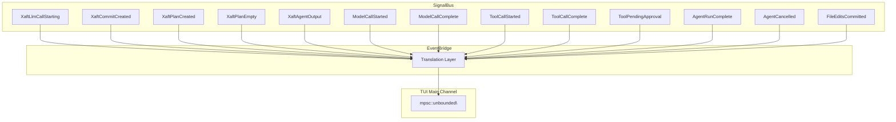

# EventBridge: SignalBus to TuiEvent Mapping

The `EventBridge` is the adapter layer that translates `SignalBus` signals into `TuiEvent` variants, bridging the gap between the runtime's type-safe signal system and the TUI's unified event enum. Without the EventBridge, the TUI would need to subscribe to every signal type individually and maintain separate handler logic for each one — a fragile approach that would require updating the TUI every time a new signal type is added. The EventBridge centralizes this translation in a single, well-defined module, ensuring that the TUI's event model stays stable even as the signal system evolves.

## Architecture

The EventBridge is spawned as a background `tokio` task during `run_inner()`. It holds a clone of the `SignalBus`, an unbounded `mpsc::Sender<TuiEvent>` that writes to the TUI's main event channel, and a `CancellationToken` for graceful shutdown. The bridge subscribes to all signal types on the `SignalBus` and, for each received signal, converts it to the appropriate `TuiEvent` variant and sends it through the channel.



## Signal-to-TuiEvent Mapping

The following table defines the complete mapping from `SignalBus` signal types to `TuiEvent` variants. Each mapping includes any data transformation that occurs during translation.

| Signal | TuiEvent | Data Transformation |
|--------|----------|-------------------|
| `XaftLlmCallStarting` | `LlmCallStarting` | Extract `agent_name`, `model`; estimate prompt token count from input length |
| `ModelCallStarted` | `LlmCallStarting` | (Deduplicated with `XaftLlmCallStarting`; only one `LlmCallStarting` is sent per API call) |
| `ModelCallComplete` | `LlmCallComplete` | Extract `usage.input_tokens`, `usage.output_tokens`, `cost_usd`, `latency_ms` |
| `XaftAgentOutput` | `AgentOutput` | Pass through `content` and `is_streaming` flag |
| `AgentRunComplete` | `RunComplete` | Extract `final_message`, `turn_count`, `total_tokens` |
| `AgentCancelled` | `Cancelled` | Extract `reason` string |
| `ToolCallStarted` | `ToolStarted` | Extract `tool_name`, `params` summary |
| `ToolCallComplete` | `ToolCompleted` | Extract `tool_name`, `success`, `result_summary` |
| `ToolPendingApproval` | `ToolPendingApproval` | Extract `tool_name`, `params`, `request_id`, `risk_level` |
| `XaftCommitCreated` | `CommitCreated` | Extract `hash`, `branch`, `summary`, `files_changed` count |
| `FileEditsCommitted` | `FileEditsCommitted` | Extract `files` list, `agent_name` |

### Signal Deduplication

Some events are represented at both the `xaft` level and the `agtrs` level. For example, an LLM call trigger produces both an `XaftLlmCallStarting` signal (xaft-level) and a `ModelCallStarted` signal (agtrs-level). The EventBridge deduplicates these overlapping signals to avoid sending redundant `TuiEvent` variants to the TUI. Deduplication is based on the signal's temporal proximity — if two signals of the same "logical event" arrive within a 50ms window, only one `TuiEvent` is emitted. This window-based deduplication is simple but effective, since signals from the same logical event are always emitted within a few microseconds of each other.

The deduplication is implemented using a small in-memory cache of recently emitted `TuiEvent` types. Before sending a new `TuiEvent`, the EventBridge checks whether an identical event type was sent within the last 50ms. If so, the duplicate is dropped. This cache is keyed by the `TuiEvent` variant (not by the event's data), so two `LlmCallStarting` events for different agents would both be emitted, while two `LlmCallStarting` events for the same API call would be deduplicated.

## EventBridge Task Implementation

The EventBridge runs as a single `tokio::spawn` task that uses `tokio::select!` to multiplex all signal subscriptions. The high-level structure is:

```rust
tokio::spawn(async move {
    let mut llm_starting = bus.subscribe::<XaftLlmCallStarting>().await;
    let mut llm_complete = bus.subscribe::<ModelCallComplete>().await;
    let mut agent_output = bus.subscribe::<XaftAgentOutput>().await;
    let mut run_complete = bus.subscribe::<AgentRunComplete>().await;
    let mut agent_cancelled = bus.subscribe::<AgentCancelled>().await;
    let mut tool_started = bus.subscribe::<ToolCallStarted>().await;
    let mut tool_complete = bus.subscribe::<ToolCallComplete>().await;
    let mut tool_approval = bus.subscribe::<ToolPendingApproval>().await;
    let mut commit_created = bus.subscribe::<XaftCommitCreated>().await;
    let mut file_edits = bus.subscribe::<FileEditsCommitted>().await;

    loop {
        tokio::select! {
            Ok(sig) = llm_starting.recv() => {
                let _ = tx.send(TuiEvent::LlmCallStarting { ... });
            }
            Ok(sig) = llm_complete.recv() => {
                let _ = tx.send(TuiEvent::LlmCallComplete { ... });
            }
            // ... other signal types ...
            _ = cancel.cancelled() => break,
        }
    }
});
```

Each branch of the `select!` receives a signal, transforms it into a `TuiEvent`, and sends it through the unbounded channel. The `tx.send()` call is non-blocking because the channel is unbounded — it always succeeds immediately, regardless of whether the receiver is actively consuming. This is important because the EventBridge must not apply backpressure to the SignalBus; if it did, a slow TUI render loop could cause the SignalBus to lag, which would affect all subscribers (not just the TUI).

## Error Handling in the EventBridge

The EventBridge handles several categories of errors gracefully:

- **Lagged Receiver**: If the EventBridge falls behind a broadcast channel (receiving `RecvError::Lagged`), it logs a warning with the number of missed signals and continues. Missed signals are not re-fetched — the TUI simply doesn't display the corresponding events. This is acceptable because the TUI is a visual aid, not a persistence layer, and missing a few intermediate events (e.g., a token stream burst) does not affect the correctness of the session.

- **Channel Closed**: If the TUI's main channel sender is closed (meaning the TUI has shut down), the EventBridge exits its loop. This is the expected shutdown path when the user quits the TUI.

- **Cancellation**: If the `CancellationToken` is fired, the `select!` exits the `cancelled()` branch and the EventBridge task ends. This is the expected shutdown path when the session is cancelled.

- **Send Failure**: If `tx.send()` fails (which should never happen with an unbounded channel, but could occur if the receiver is dropped), the error is silently ignored. The EventBridge does not retry failed sends because the signal is already "in the past" — retrying would only add latency without improving the user experience.

## Performance Characteristics

The EventBridge is designed to be a lightweight, low-latency adapter. Its performance characteristics are:

- **Latency**: Signal-to-TuiEvent translation adds less than 1 microsecond per event. The dominant latency is the `mpsc::unbounded::send()` call, which is O(1) and typically completes in under 100 nanoseconds.
- **Throughput**: The EventBridge can process thousands of signals per second without falling behind. The bottleneck is never the bridge itself — it's the TUI's render loop, which processes events at approximately 60 FPS (one per 16ms tick).
- **Memory**: The EventBridge holds no buffer of its own. It immediately forwards each signal to the TUI's channel. Memory usage is dominated by the `mpsc` channel's internal buffer, which grows proportionally to the rate of signal emission minus the rate of TUI consumption.
- **CPU**: The `select!` macro uses epoll-based I/O multiplexing, which is O(1) in the number of monitored channels. The EventBridge consumes negligible CPU when no signals are being emitted.

## Extending the EventBridge

When a new signal type is added to the `SignalBus`, the EventBridge must be updated to subscribe to it and translate it into a `TuiEvent`. The steps are:

1. Add a new `TuiEvent` variant in the TUI module.
2. Add a subscription to the new signal type in the EventBridge's `select!` loop.
3. Implement the translation logic from the signal's fields to the `TuiEvent` variant's fields.
4. Add a handler for the new `TuiEvent` variant in the TUI's main render loop.

This four-step process is straightforward and follows the existing patterns in the codebase. The key design constraint is that the EventBridge must never perform expensive computation or I/O — all heavy processing should be deferred to the TUI's main loop, which runs on the single render thread. The EventBridge's job is purely translation and forwarding, keeping it fast and predictable.
