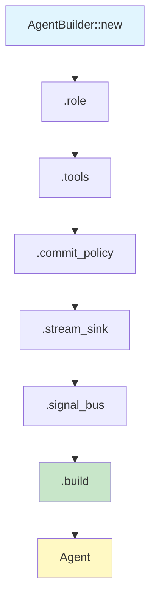
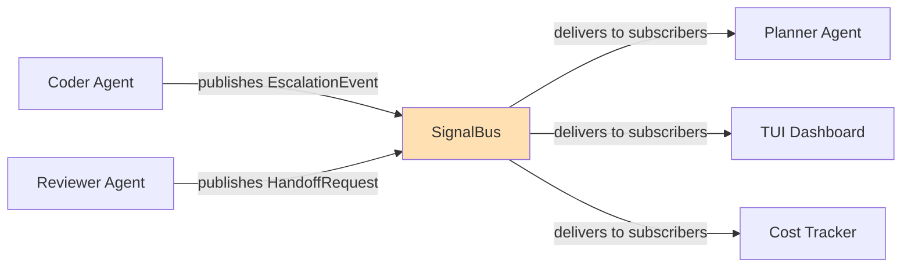

# Building a Custom Agent from Scratch

This tutorial walks through creating a fully configured custom agent using the `AgentBuilder` API in `xaft-agent`. You will learn how to assign a role, select tools, configure commit policies, attach a stream sink, and wire into the signal bus. By the end, you will have a production-ready agent definition that can be registered with the runtime and participate in multi-agent workflows.

---

## Overview

An agent in xaft is the fundamental unit of autonomous behavior. Each agent encapsulates a system prompt (its "role"), a set of tools it can invoke, a commit policy governing when it writes to the workspace, and connectivity to the streaming and signaling infrastructure. The `AgentBuilder` provides a type-safe, consumption-semantics API that enforces required configuration at compile time — you cannot build an agent without specifying its role, for example, because the `build()` method is only available after the role has been set.

The builder pattern used here follows the consuming builder idiom: each method call consumes `self` and returns a new `AgentBuilder` with the updated state. This means that once you call `build()`, the builder is consumed and cannot be reused. This design prevents accidental mutation of a partially-constructed agent and ensures that all required fields are validated before the agent enters the runtime.



---

## Step 1: Creating the Builder

Every agent begins with `AgentBuilder::new()`. This creates a blank builder with sensible defaults for optional fields — the commit policy defaults to `CommitPolicy::OnSuccess`, the tool set is empty, and no stream sink or signal bus is attached. You must provide at minimum a role before calling `build()`.

```rust
use xaft_agent::AgentBuilder;

let builder = AgentBuilder::new()
    .name("code-reviewer");
```

The `name` method is optional but strongly recommended. Agent names appear in log spans, TUI panels, and handoff messages. Without a name, the runtime assigns a generated identifier like `agent-0x7f3a`, which is far less useful for debugging. Names must be unique within an `AgentRegistry`; attempting to register two agents with the same name returns a `RegistryError::DuplicateName`.

---

## Step 2: Assigning a Role

The role defines the agent's system prompt and behavioral constraints. This is the single required field on the builder. The role is not just a string — it is a `Role` struct that bundles the system prompt with optional behavioral flags like `auto_approve`, `max_iterations`, and `escalation_threshold`.

```rust
use xaft_agent::{AgentBuilder, Role, CommitPolicy};

let role = Role::builder()
    .system_prompt(
        "You are a senior code reviewer. Analyze the diff, identify bugs, \
         security vulnerabilities, and style violations. Suggest fixes \
         but do not modify files directly. When you find critical issues, \
         escalate to the planner agent."
    )
    .max_iterations(25)
    .auto_approve_read_only(true)
    .escalation_threshold(3) // escalate after 3 critical findings
    .build();

let builder = AgentBuilder::new()
    .name("code-reviewer")
    .role(role);
```

The `max_iterations` field prevents runaway agent loops. Each time the agent makes an LLM call and receives a tool-use response, that counts as one iteration. When the limit is reached, the agent emits an `AgentEvent::IterationLimitReached` event and stops. This is a critical safety mechanism in production deployments where unbounded LLM calls can quickly escalate costs.

The `auto_approve_read_only` flag is a convenience that automatically approves any tool call flagged as read-only by the `ApprovalGate`. Read-only operations like reading files or listing directories skip the approval prompt, reducing friction while still requiring explicit approval for destructive operations like file writes or shell command execution.

The `escalation_threshold` configures how many critical findings the agent must accumulate before it triggers an escalation. When the threshold is reached, the agent publishes an `EscalationEvent` on the signal bus, which the planner or another supervising agent can subscribe to. This mechanism enables agents to communicate urgency without tight coupling.

---

## Step 3: Selecting Tools

Tools define what actions the agent can take. You register tools from a `ToolRegistry` — typically one that has been pre-populated with the built-in tool set and any custom tools your application provides. The builder accepts a `Vec<Arc<dyn Tool>>`, but you can also pass a `ToolRegistry` reference and select tools by name.

```rust
use xaft_tools::ToolRegistry;
use std::sync::Arc;

let registry = ToolRegistry::builder()
    .register_builtin_tools()
    .register(my_custom_tool())
    .build();

let builder = AgentBuilder::new()
    .name("code-reviewer")
    .role(role)
    .tools(vec![
        registry.get("read_file").expect("read_file must exist"),
        registry.get("search_files").expect("search_files must exist"),
        registry.get("list_directory").expect("list_directory must exist"),
        my_custom_tool(), // register custom tool directly
    ]);
```

Tool selection has important security implications. The agent can only invoke tools that are in its tool set — if a tool is not registered, the LLM may request it, but the runtime will reject the tool call with a `ToolError::NotRegistered` error, which is fed back to the agent as an error observation. This design ensures that even if an LLM hallucinates a tool name, it cannot escape its sandbox.

When selecting tools, consider the principle of least privilege. A code reviewer does not need `write_file` or `run_shell` — providing only read-only tools enforces the role's constraint at the infrastructure level, not just at the prompt level. Prompt-level constraints can be circumvented by prompt injection; tool-level constraints cannot.

---

## Step 4: Configuring the Commit Policy

The commit policy determines when and how the agent's changes are committed to the workspace's version control. xaft supports several policies, each appropriate for different agent roles:

| Policy | Behavior | Use Case |
|--------|----------|----------|
| `CommitPolicy::OnSuccess` | Commit after each successful tool call that modifies the workspace | General-purpose coding agents |
| `CommitPolicy::Manual` | Never auto-commit; the user must approve each commit via the TUI | High-risk operations, destructive changes |
| `CommitPolicy::Batch` | Accumulate changes and commit once at the end of the agent's turn | Bulk refactoring agents |
| `CommitPolicy::Never` | Never commit, even on user request | Read-only review agents |

```rust
let builder = AgentBuilder::new()
    .name("code-reviewer")
    .role(role)
    .tools(tool_set)
    .commit_policy(CommitPolicy::Never); // reviewer never modifies files
```

For a coding agent that modifies files, `OnSuccess` provides the best balance of safety and convenience. Each atomic change is committed with an auto-generated message describing the tool call, making it trivial to `git revert` individual changes. The commit message includes the agent name, tool name, and a truncated summary of the tool's input parameters.

The `Batch` policy is useful for agents that perform multi-step refactoring where intermediate states may be inconsistent. For example, a rename refactoring agent might update imports in one step, then rename the symbol in another. Committing after each step would leave the workspace in a broken state if the agent is interrupted. With `Batch`, all changes are committed together only after the agent signals completion.

When `Manual` policy is active, each commit request is routed through the `ApprovalGate`. The user sees the proposed diff in the TUI and can approve, reject, or edit the commit message. This is the safest policy but requires active human oversight, which reduces throughput for routine operations.

---

## Step 5: Attaching a Stream Sink

The stream sink receives `StreamEvent` instances emitted by the agent during execution. These events include token-by-token LLM output, tool call invocations and results, approval requests, and lifecycle events. The default sink routes events to the TUI, but you can provide a custom sink for headless operation, logging, or integration with external systems.

```rust
use xaft_runtime::{ChannelSink, StreamEvent};

// Option A: Use the built-in channel sink
let (tx, rx) = tokio::sync::broadcast::channel(256);
let sink = ChannelSink::new(tx);

// Option B: Implement a custom sink
struct LoggingSink {
    logger: slog::Logger,
}

#[async_trait]
impl StreamSink for LoggingSink {
    async fn send(&self, event: StreamEvent) -> Result<(), StreamError> {
        match &event {
            StreamEvent::Token(token) => {
                slog::info!(self.logger, "token"; "text" => &token.text);
            }
            StreamEvent::ToolCall { name, input } => {
                slog::info!(self.logger, "tool_call"; "name" => name, "input" => ?input);
            }
            StreamEvent::ToolResult { name, output } => {
                slog::info!(self.logger, "tool_result"; "name" => name, "output" => ?output);
            }
            _ => {}
        }
        Ok(())
    }
}

let builder = AgentBuilder::new()
    .name("code-reviewer")
    .role(role)
    .tools(tool_set)
    .commit_policy(CommitPolicy::Never)
    .stream_sink(Arc::new(sink));
```

The `ChannelSink` wraps a `tokio::sync::broadcast::Sender`, which allows multiple consumers to subscribe to the event stream simultaneously. This is important because the TUI, the cost tracker, and any external integrations all need to observe events independently. The broadcast channel has a configurable capacity; if a consumer falls behind and the channel fills up, older events are dropped. This is by design — the streaming pipeline prioritizes low latency over guaranteed delivery of every token. For audit-grade logging, use a custom sink that writes to durable storage.

Custom sinks must implement the `StreamSink` trait, which has a single async method `send`. The runtime calls `send` for each event and does not block on the result — if the sink is slow, it will be called concurrently via `tokio::spawn`. However, sinks that consistently lag will accumulate backpressure. If your sink performs expensive I/O (like writing to a remote API), consider buffering events internally and flushing asynchronously.

---

## Step 6: Connecting to the Signal Bus

The signal bus is the publish-subscribe backbone that enables inter-agent communication without direct coupling. Agents publish typed signals (like `EscalationEvent`, `HandoffRequest`, or `StatusUpdate`) and subscribe to signals from other agents. The signal bus is implemented as an `Arc<SignalBus>` shared across all agents in a runtime.

```rust
use xaft_runtime::SignalBus;

let signal_bus = Arc::new(SignalBus::new());

// The reviewer subscribes to handoff requests targeting it
signal_bus.subscribe::<HandoffRequest>("code-reviewer", |req| {
    // This callback fires when another agent hands off to us
    tracing::info!(
        agent = "code-reviewer",
        from = %req.from_agent,
        reason = %req.reason,
        "Received handoff request"
    );
    HandoffResponse::Accept
});

let builder = AgentBuilder::new()
    .name("code-reviewer")
    .role(role)
    .tools(tool_set)
    .commit_policy(CommitPolicy::Never)
    .stream_sink(Arc::new(sink))
    .signal_bus(signal_bus.clone());
```

Signal bus subscriptions are typed. When you subscribe to `HandoffRequest`, you only receive events of that type. Internally, the bus uses a `HashMap<TypeId, Vec<Subscriber>>` to route events efficiently. This design avoids the overhead of deserializing events that a subscriber doesn't care about — each subscriber's filter is evaluated before the event is cloned and dispatched.

The signal bus also supports wildcard subscriptions for monitoring agents. The TUI, for example, subscribes to all signal types from all agents to render the real-time dashboard. Wildcard subscribers receive every event, so they should be lightweight — any heavy processing should be offloaded to a task.



---

## Step 7: Building and Registering the Agent

After configuring all components, call `build()` to construct the `Agent` instance. This method validates the builder state and returns a `Result<Agent, AgentBuildError>`. The most common validation errors are:

- `AgentBuildError::MissingRole` — you forgot to call `.role()`
- `AgentBuildError::EmptyToolSet` — the agent has no tools (this is a warning-level error that can be suppressed with `.allow_no_tools()`)
- `AgentBuildError::DuplicateTool` — two tools with the same name were registered

```rust
let agent = builder.build()?;

// Register with the runtime
use xaft_runtime::AgentRegistry;

let mut registry = AgentRegistry::new();
registry.register(agent)?;

// Or register with the runtime directly
runtime.register_agent(agent).await?;
```

Once registered, the agent is available for handoff and can be activated by the workflow engine. The runtime owns the agent via an `Arc<Mutex<Agent>>`, ensuring safe concurrent access from the TUI thread, the LLM streaming task, and any signal bus callbacks.

---

## Complete Example

Here is the full, compilable example combining all the steps above. This creates a code-reviewer agent with read-only tools, no auto-commit, a logging stream sink, and signal bus integration:

```rust
use std::sync::Arc;
use xaft_agent::{AgentBuilder, Role, CommitPolicy};
use xaft_runtime::{ChannelSink, SignalBus, StreamEvent, StreamSink};
use xaft_tools::ToolRegistry;

#[tokio::main]
async fn main() -> Result<(), Box<dyn std::error::Error>> {
    // 1. Define the role
    let role = Role::builder()
        .system_prompt(
            "You are a senior code reviewer. Analyze diffs, identify bugs, \
             security vulnerabilities, and style violations. Suggest fixes \
             but do not modify files. Escalate critical issues to the planner."
        )
        .max_iterations(25)
        .auto_approve_read_only(true)
        .escalation_threshold(3)
        .build();

    // 2. Build the tool registry with only read-only tools
    let registry = ToolRegistry::builder()
        .register_builtin_tools()
        .build();

    let tools = vec![
        registry.get("read_file").unwrap(),
        registry.get("search_files").unwrap(),
        registry.get("list_directory").unwrap(),
    ];

    // 3. Create a channel-based stream sink
    let (tx, mut rx) = tokio::sync::broadcast::channel(256);
    let sink = ChannelSink::new(tx);

    // 4. Create the signal bus
    let signal_bus = Arc::new(SignalBus::new());
    signal_bus.subscribe::<HandoffRequest>("code-reviewer", |req| {
        tracing::info!(from = %req.from_agent, "Handoff accepted");
        HandoffResponse::Accept
    });

    // 5. Build the agent
    let agent = AgentBuilder::new()
        .name("code-reviewer")
        .role(role)
        .tools(tools)
        .commit_policy(CommitPolicy::Never)
        .stream_sink(Arc::new(sink))
        .signal_bus(signal_bus.clone())
        .build()?;

    // 6. Consume the stream in a background task
    let mut stream_rx = rx.resubscribe();
    tokio::spawn(async move {
        while let Ok(event) = stream_rx.recv().await {
            match event {
                StreamEvent::Token(t) => print!("{}", t.text),
                StreamEvent::ToolCall { name, .. } => {
                    println!("\n[tool: {}]", name);
                }
                _ => {}
            }
        }
    });

    // 7. Register and run
    let mut runtime = xaft_runtime::Runtime::builder()
        .agent(agent)
        .signal_bus(signal_bus)
        .build()
        .await?;

    runtime.run().await?;
    Ok(())
}
```

This example demonstrates the full lifecycle of agent creation, from role definition through signal bus attachment. Each component is independently configurable and testable, following xaft's compositional architecture. The consuming builder pattern ensures that misconfigured agents fail at build time rather than at runtime, and the typed signal bus provides safe inter-agent communication without coupling agents to each other's implementation details.
