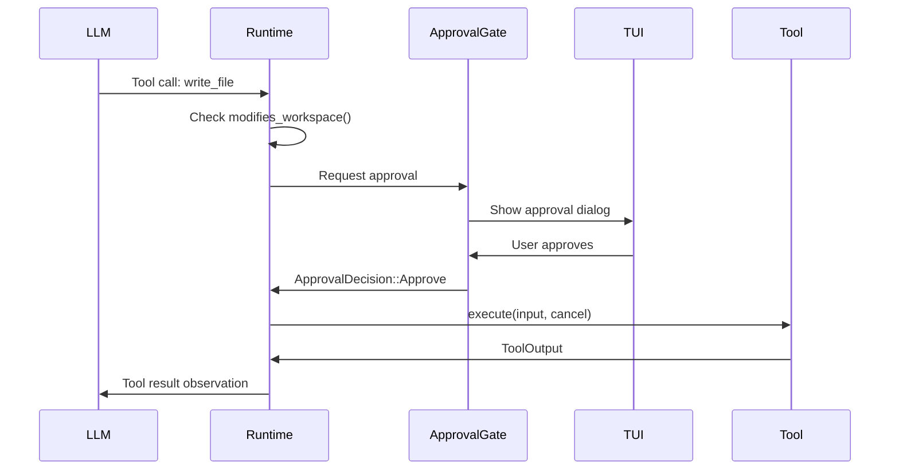

# Implementing a Custom Tool

This tutorial covers implementing a custom tool using the `Tool` trait in `xaft-tools`. You will learn how to define the tool's JSON schema, handle cancellation, propagate errors, register the tool in a `ToolRegistry`, and integrate with the approval gate system. Tools are the primary mechanism by which agents interact with the outside world — every file read, shell command, or API call flows through a tool implementation.

---

## The Tool Trait

The `Tool` trait is the core abstraction that every tool must implement. It defines the tool's identity, its input and output schemas, its execution logic, and its interaction with the cancellation and approval subsystems. The trait uses async methods, so implementations must be `Send + Sync` to work within the tokio runtime.

```rust
#[async_trait]
pub trait Tool: Send + Sync {
    /// The unique name of the tool. Must be lowercase, snake_case, and unique
    /// within a ToolRegistry. This name appears in LLM tool-use requests and
    /// in the TUI's tool approval panel.
    fn name(&self) -> &str;

    /// A human-readable description of what the tool does. This description is
    /// included in the tool definition sent to the LLM, so its quality directly
    /// affects whether the LLM chooses the right tool for a given task. Be
    /// specific about preconditions, side effects, and error cases.
    fn description(&self) -> &str;

    /// The JSON Schema for the tool's input parameters. This schema is sent to
    /// the LLM as part of the tool definition and is also used by the runtime
    /// to validate inputs before execution. Use the `schemars` crate to derive
    /// schemas automatically from your input struct.
    fn input_schema(&self) -> serde_json::Value;

    /// Whether this tool modifies the workspace. Read-only tools bypass the
    /// approval gate when the agent's `auto_approve_read_only` flag is set.
    fn modifies_workspace(&self) -> bool;

    /// Execute the tool with the given input. The input is a JSON value that
    /// has already been validated against `input_schema`. Implementations
    /// should deserialize the input, perform the operation, and return a
    /// structured output. The `cancel` token is checked cooperatively —
    /// long-running operations should poll it periodically.
    async fn execute(
        &self,
        input: serde_json::Value,
        cancel: tokio_util::sync::CancellationToken,
    ) -> Result<ToolOutput, ToolError>;
}
```

The `ToolOutput` struct wraps the result of a tool execution. It carries both a human-readable summary (shown in the TUI) and a structured JSON payload (consumed by the agent and potentially by downstream tools). This dual representation is important because the LLM needs structured data to reason about, while the human operator needs readable text to make approval decisions.

The `ToolError` enum is the standard error type for tool execution. It has variants for invalid input, cancellation, permission denial, and arbitrary internal errors. The runtime maps these variants to appropriate behaviors: `ToolError::Cancelled` triggers a graceful agent shutdown, `ToolError::PermissionDenied` routes through the approval gate, and `ToolError::Internal` is reported to the agent as an error observation.

---

## Defining the Input Schema

Tool inputs are defined as serializable structs with `#[derive(JsonSchema)]`. The `schemars` crate generates a JSON Schema from the struct definition, which serves double duty: it tells the LLM what parameters to provide, and it validates incoming tool calls at the runtime level before execution begins.

```rust
use schemars::JsonSchema;
use serde::{Deserialize, Serialize};

/// Input parameters for the HTTP request tool.
#[derive(Debug, Clone, Serialize, Deserialize, JsonSchema)]
pub struct HttpRequestInput {
    /// The URL to send the request to. Must be a valid HTTP or HTTPS URL.
    pub url: String,

    /// The HTTP method. Defaults to GET if not specified.
    #[serde(default = "default_method")]
    pub method: HttpMethod,

    /// Request headers as key-value pairs.
    #[serde(default)]
    pub headers: std::collections::HashMap<String, String>,

    /// Request body. Only used for POST, PUT, and PATCH methods.
    #[serde(default)]
    pub body: Option<String>,

    /// Maximum time to wait for a response, in seconds. Defaults to 30.
    #[serde(default = "default_timeout")]
    pub timeout_secs: u64,
}

#[derive(Debug, Clone, Serialize, Deserialize, JsonSchema)]
#[serde(rename_all = "UPPERCASE")]
pub enum HttpMethod {
    Get,
    Post,
    Put,
    Patch,
    Delete,
    Head,
}

fn default_method() -> HttpMethod { HttpMethod::Get }
fn default_timeout() -> u64 { 30 }
```

Schema quality matters more than you might expect. The LLM uses the field names, types, and doc comments to decide what values to provide. A field called `url` with doc comment "The URL to send the request to" will produce better tool calls than a field called `u` with no documentation. The `serde` attributes (`default`, `rename_all`) are respected by `schemars`, so your Rust serialization logic and your JSON Schema stay in sync automatically.

When defining schemas, be opinionated about defaults. The `timeout_secs` field defaults to 30 seconds, which prevents the LLM from accidentally specifying a zero timeout or omitting the field entirely and hanging the agent indefinitely. Every optional field should have a sensible default that works in the common case.

---

## Implementing the Tool

With the input schema defined, you can implement the `Tool` trait. The implementation below shows a complete HTTP request tool with cancellation support, timeout handling, and proper error propagation.

```rust
use xaft_tools::{Tool, ToolOutput, ToolError};
use async_trait::async_trait;

pub struct HttpRequestTool {
    client: reqwest::Client,
}

impl HttpRequestTool {
    pub fn new() -> Self {
        let client = reqwest::Client::builder()
            .timeout(std::time::Duration::from_secs(120)) // hard upper bound
            .build()
            .expect("failed to build HTTP client");
        Self { client }
    }
}

#[async_trait]
impl Tool for HttpRequestTool {
    fn name(&self) -> &str {
        "http_request"
    }

    fn description(&self) -> &str {
        "Send an HTTP request to a specified URL and return the response \
         status, headers, and body. Supports GET, POST, PUT, PATCH, DELETE, \
         and HEAD methods. The request timeout defaults to 30 seconds but \
         can be configured. Does not follow redirects by default."
    }

    fn input_schema(&self) -> serde_json::Value {
        schemars::schema_for!(HttpRequestInput).into()
    }

    fn modifies_workspace(&self) -> bool {
        false // HTTP requests are side-effect-free from the workspace perspective
    }

    async fn execute(
        &self,
        input: serde_json::Value,
        cancel: tokio_util::sync::CancellationToken,
    ) -> Result<ToolOutput, ToolError> {
        // Deserialize and validate input
        let params: HttpRequestInput = serde_json::from_value(input)
            .map_err(|e| ToolError::InvalidInput(e.to_string()))?;

        // Build the request
        let mut request = match params.method {
            HttpMethod::Get => self.client.get(&params.url),
            HttpMethod::Post => self.client.post(&params.url),
            HttpMethod::Put => self.client.put(&params.url),
            HttpMethod::Patch => self.client.patch(&params.url),
            HttpMethod::Delete => self.client.delete(&params.url),
            HttpMethod::Head => self.client.head(&params.url),
        };

        for (key, value) in &params.headers {
            request = request.header(key.as_str(), value.as_str());
        }

        if let Some(body) = &params.body {
            request = request.body(body.clone());
        }

        request = request.timeout(std::time::Duration::from_secs(params.timeout_secs));

        // Execute with cancellation
        let response = tokio::select! {
            biased;

            _ = cancel.cancelled() => {
                tracing::info!(tool = "http_request", "Cancelled during request");
                return Err(ToolError::Cancelled);
            }

            result = request.send() => {
                result.map_err(|e| {
                    if e.is_timeout() {
                        ToolError::Timeout(format!(
                            "Request to {} timed out after {}s",
                            params.url, params.timeout_secs
                        ))
                    } else if e.is_connect() {
                        ToolError::Internal(format!(
                            "Connection failed: {}", e
                        ))
                    } else {
                        ToolError::Internal(e.to_string())
                    }
                })?
            }
        };

        // Extract response data
        let status = response.status().as_u16();
        let headers: std::collections::HashMap<String, String> = response
            .headers()
            .iter()
            .map(|(k, v)| (k.to_string(), v.to_str().unwrap_or("<binary>").to_string()))
            .collect();

        let body_text = response.text().await
            .map_err(|e| ToolError::Internal(format!("Failed to read body: {}", e)))?;

        let output = HttpResponse {
            status,
            headers,
            body: body_text,
        };

        Ok(ToolOutput::new(
            format!("HTTP {} — status {}", params.url, status),
            serde_json::to_value(&output)
                .map_err(|e| ToolError::Internal(e.to_string()))?,
        ))
    }
}

#[derive(Serialize)]
struct HttpResponse {
    status: u16,
    headers: std::collections::HashMap<String, String>,
    body: String,
}
```

---

## Cancellation Handling

Cancellation is cooperative in xaft. The runtime passes a `CancellationToken` to every tool execution, and the tool must check this token at appropriate points. The `tokio::select! { biased }` pattern is the idiomatic way to race the tool's work against cancellation. The `biased` modifier ensures that the cancellation branch is checked first, so cancellation is always responsive even if the work future is also ready.

There are three patterns for cancellation depending on the tool's runtime characteristics:

**1. Single async operation** — Use `tokio::select!` as shown above. This is appropriate for tools that perform one blocking operation (like an HTTP request or a file read) that can be interrupted by tokio's cancellation mechanism.

**2. Multi-step operations** — Check `cancel.is_cancelled()` between steps. This is appropriate for tools that perform a sequence of operations where each step is fast but the total work can be long. For example, a tool that processes a directory tree should check the token between files.

```rust
async fn execute(&self, input: Value, cancel: CancellationToken) -> Result<ToolOutput, ToolError> {
    let params: BatchInput = serde_json::from_value(input)?;
    let mut results = Vec::new();

    for item in &params.items {
        // Check cancellation between iterations
        if cancel.is_cancelled() {
            return Err(ToolError::Cancelled);
        }
        results.push(self.process_item(item).await?);
    }

    Ok(ToolOutput::new("batch complete", serde_json::to_value(results)?))
}
```

**3. Fire-and-forget spawn** — For tools that spawn background tasks, propagate the cancellation token into the spawned task. The runtime will cancel the token when the agent shuts down, which signals the background task to clean up.

```rust
async fn execute(&self, input: Value, cancel: CancellationToken) -> Result<ToolOutput, ToolError> {
    let cancel_clone = cancel.clone();
    tokio::spawn(async move {
        loop {
            if cancel_clone.is_cancelled() {
                break;
            }
            // do periodic work
            tokio::time::sleep(Duration::from_secs(10)).await;
        }
    });
    Ok(ToolOutput::new("background task started", Value::Null))
}
```

---

## Error Handling

Tool errors follow a structured hierarchy that the runtime maps to specific behaviors. The `ToolError` enum provides the following variants:

| Variant | Runtime Behavior | Use Case |
|---------|-----------------|----------|
| `InvalidInput` | Error observation sent to agent; agent may retry with corrected input | Malformed JSON, missing required fields |
| `Cancelled` | Agent receives graceful shutdown signal; no error observation | User cancelled, runtime shutting down |
| `PermissionDenied` | Routed through `ApprovalGate` for user approval | File writes, shell commands, network access |
| `Timeout` | Error observation sent to agent; includes timeout duration | HTTP requests, long-running computations |
| `NotFound` | Error observation sent to agent; agent may try alternatives | File not found, directory does not exist |
| `Internal` | Error observation sent to agent; includes error message | Unexpected failures, I/O errors |

The key design principle is that errors are not just failures — they are information that the agent can reason about. When a `ToolError::NotFound` is returned, the agent receives an observation like "File `src/main.rs` not found" and can decide whether to search for the file in a different location, create it, or ask the user. This is why the error messages should be specific and actionable.

Never panic inside a tool. Panics bypass the error handling pipeline and crash the runtime. Even for "impossible" conditions, return `ToolError::Internal` with a descriptive message. The runtime catches panics at the task boundary using `tokio::spawn` and `JoinError`, but relying on this mechanism is unreliable and loses diagnostic context.

---

## Registration in ToolRegistry

Once implemented, register the tool in a `ToolRegistry` so the runtime can discover and invoke it. The `ToolRegistryBuilder` provides a fluent API for constructing registries with both built-in and custom tools.

```rust
use xaft_tools::ToolRegistry;
use std::sync::Arc;

let registry = ToolRegistry::builder()
    // Register all built-in tools (read_file, write_file, run_shell, etc.)
    .register_builtin_tools()
    // Register custom tools
    .register(Arc::new(HttpRequestTool::new()))
    .register(Arc::new(MyOtherCustomTool::new()))
    .build();

// Verify registration
assert!(registry.get("http_request").is_some());
assert!(registry.get("read_file").is_some());

// List all available tools
for tool in registry.list() {
    println!("{}: {}", tool.name(), tool.description());
}
```

The `ToolRegistry` is an `Arc`-friendly, immutable collection once built. Tools are stored as `Arc<dyn Tool>` and cannot be added or removed after construction. This immutability is intentional — it prevents a tool from being unexpectedly unavailable mid-session, which would violate the agent's contract with the LLM (the tool definitions sent in the first request must remain valid throughout the conversation).

If you need dynamic tool sets (for example, tools that depend on the workspace type), build different registries for different configurations and select the appropriate one at runtime based on the session's workspace type.

---

## Approval Gate Integration

The approval gate is the security boundary between autonomous agent behavior and human oversight. When a tool returns `ToolError::PermissionDenied`, or when a tool is flagged as modifying the workspace and the agent's `auto_approve_read_only` policy does not apply, the runtime routes the tool call through the approval gate before execution.

```rust
use xaft_tools::{Tool, ApprovalGate, ApprovalDecision};

pub struct DestructiveTool;

#[async_trait]
impl Tool for DestructiveTool {
    fn modifies_workspace(&self) -> bool {
        true // This flag triggers approval gate review
    }

    // ... other methods ...

    async fn execute(
        &self,
        input: serde_json::Value,
        cancel: tokio_util::sync::CancellationToken,
    ) -> Result<ToolOutput, ToolError> {
        // The approval gate has already been checked before this method
        // is called. If we reach this point, the user has approved the
        // operation (or auto-approve is configured).

        // Perform the destructive operation
        self.do_destructive_thing().await
    }
}
```

The approval gate flow works as follows:

1. The LLM requests a tool call (e.g., `write_file` with path `/etc/config.yaml`)
2. The runtime checks the tool's `modifies_workspace()` flag
3. If the tool modifies the workspace and is not auto-approved, the runtime publishes an `ApprovalRequest` on the signal bus
4. The TUI (or any `ApprovalGate` subscriber) receives the request and presents it to the user
5. The user's decision (Approve, Reject, or ApproveAll) is sent back via a oneshot channel
6. Only after approval does the runtime call `execute()`



The `ApproveAll` decision is a session-level override that auto-approves all subsequent requests from the same tool for the duration of the session. This is useful when the user trusts a particular operation and does not want to be prompted repeatedly (e.g., during a bulk file refactoring). The approval state is tracked per-tool per-session in the `SessionStore`, so `ApproveAll` decisions do not persist across sessions.

---

## Complete Example

Here is the full, self-contained implementation of the `HttpRequestTool`:

```rust
use std::collections::HashMap;
use async_trait::async_trait;
use schemars::JsonSchema;
use serde::{Deserialize, Serialize};
use xaft_tools::{Tool, ToolOutput, ToolError};

#[derive(Debug, Clone, Serialize, Deserialize, JsonSchema)]
pub struct HttpRequestInput {
    pub url: String,
    #[serde(default = "default_method")]
    pub method: HttpMethod,
    #[serde(default)]
    pub headers: HashMap<String, String>,
    #[serde(default)]
    pub body: Option<String>,
    #[serde(default = "default_timeout")]
    pub timeout_secs: u64,
}

#[derive(Debug, Clone, Serialize, Deserialize, JsonSchema)]
#[serde(rename_all = "UPPERCASE")]
pub enum HttpMethod { Get, Post, Put, Patch, Delete, Head }

fn default_method() -> HttpMethod { HttpMethod::Get }
fn default_timeout() -> u64 { 30 }

pub struct HttpRequestTool { client: reqwest::Client }

impl HttpRequestTool {
    pub fn new() -> Self {
        Self {
            client: reqwest::Client::builder()
                .timeout(std::time::Duration::from_secs(120))
                .build()
                .expect("HTTP client construction should not fail"),
        }
    }
}

#[async_trait]
impl Tool for HttpRequestTool {
    fn name(&self) -> &str { "http_request" }

    fn description(&self) -> &str {
        "Send an HTTP request to a URL. Returns status, headers, and body. \
         Supports GET, POST, PUT, PATCH, DELETE, HEAD. Configurable timeout."
    }

    fn input_schema(&self) -> serde_json::Value {
        schemars::schema_for!(HttpRequestInput).into()
    }

    fn modifies_workspace(&self) -> bool { false }

    async fn execute(
        &self,
        input: serde_json::Value,
        cancel: tokio_util::sync::CancellationToken,
    ) -> Result<ToolOutput, ToolError> {
        let params: HttpRequestInput = serde_json::from_value(input)
            .map_err(|e| ToolError::InvalidInput(e.to_string()))?;

        let mut req = match params.method {
            HttpMethod::Get => self.client.get(&params.url),
            HttpMethod::Post => self.client.post(&params.url),
            HttpMethod::Put => self.client.put(&params.url),
            HttpMethod::Patch => self.client.patch(&params.url),
            HttpMethod::Delete => self.client.delete(&params.url),
            HttpMethod::Head => self.client.head(&params.url),
        };

        for (k, v) in &params.headers {
            req = req.header(k.as_str(), v.as_str());
        }
        if let Some(body) = &params.body {
            req = req.body(body.clone());
        }
        req = req.timeout(std::time::Duration::from_secs(params.timeout_secs));

        let resp = tokio::select! {
            biased;
            _ = cancel.cancelled() => return Err(ToolError::Cancelled),
            r = req.send() => r.map_err(|e| ToolError::Internal(e.to_string()))?,
        };

        let status = resp.status().as_u16();
        let headers: HashMap<String, String> = resp.headers().iter()
            .map(|(k, v)| (k.to_string(), v.to_str().unwrap_or("<binary>").to_string()))
            .collect();
        let body = resp.text().await
            .map_err(|e| ToolError::Internal(e.to_string()))?;

        Ok(ToolOutput::new(
            format!("HTTP {} → {}", params.url, status),
            serde_json::json!({ "status": status, "headers": headers, "body": body }),
        ))
    }
}
```

This implementation demonstrates all the key patterns: schema-driven input validation, cooperative cancellation via `tokio::select!`, structured error propagation, and clear separation between the human-readable summary and the machine-parseable output. By following these patterns consistently across your custom tools, you ensure that the agent can reason about errors, the TUI can display meaningful information, and the cancellation mechanism remains responsive even during long-running operations.
