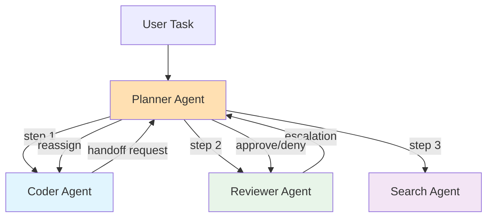
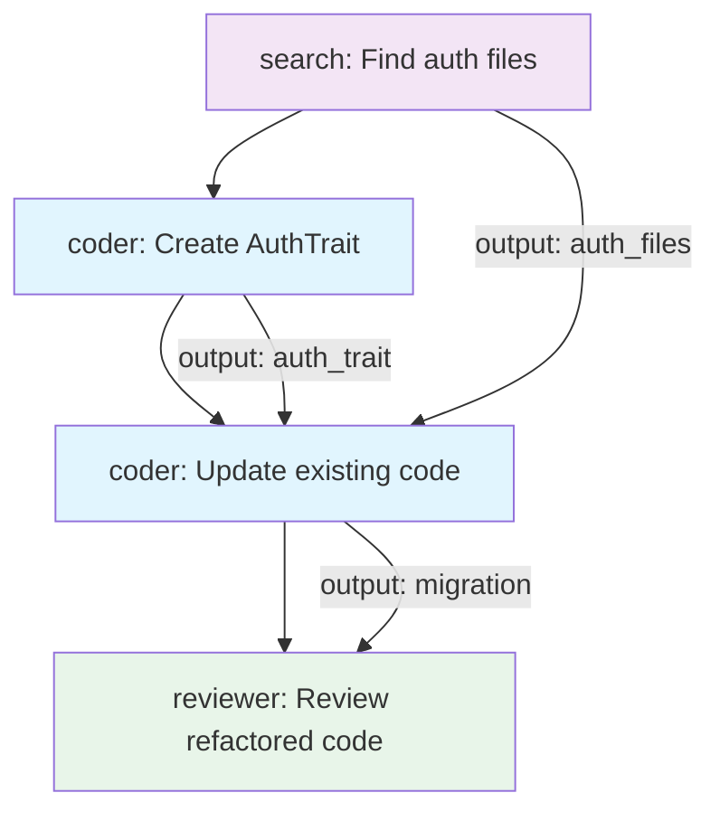

# Building a Custom Planner

This tutorial explains how to implement a custom planner in xaft. The planner is the supervisory agent that decomposes high-level tasks into steps, assigns work to specialized agents, handles escalations, and manages the overall workflow. You will learn how to build a custom planner using `PlanAgentBuilder`, define escalation policies, inject plans programmatically, and configure the `PlanModeAgent` that orchestrates multi-agent execution.

---

## The Planner's Role

The planner sits at the top of the agent hierarchy. While worker agents like the coder, reviewer, and researcher focus on specific domains, the planner maintains a global view of the task, decides which agent should handle each step, monitors progress, and intervenes when things go wrong. In xaft, the planner is itself an agent — it uses the same `Agent` trait and `AgentBuilder` infrastructure — but it has additional capabilities provided by the `PlanModeAgent` wrapper.

The separation between the planner and worker agents is not just organizational — it is a security boundary. The planner has authority to hand off work between agents, approve escalations, and modify the plan. Worker agents cannot perform handoffs independently; they must request them through the signal bus, and the planner decides whether to honor the request. This design prevents a confused deputy attack where a prompt injection into a worker agent could cause it to hand off to a more privileged agent.



---

## Building with PlanAgentBuilder

The `PlanAgentBuilder` extends `AgentBuilder` with planner-specific configuration. It wraps the standard agent builder and adds fields for escalation policies, plan templates, and handoff authorization rules. Like `AgentBuilder`, it uses consuming semantics — each method returns a new builder, and `build()` consumes it.

```rust
use xaft_agent::{PlanAgentBuilder, EscalationPolicy, HandoffRule};
use xaft_runtime::AgentRegistry;

// First, create the agent registry with all worker agents
let mut registry = AgentRegistry::new();
registry.register(coder_agent)?;
registry.register(reviewer_agent)?;
registry.register(search_agent)?;

// Build the planner
let planner = PlanAgentBuilder::new()
    .name("planner")
    .role(Role::builder()
        .system_prompt(
            "You are the planning agent. Decompose the user's task into steps, \
             assign each step to the most appropriate worker agent, and monitor \
             progress. When a worker escalates, decide whether to reassign, \
             retry with different parameters, or ask the user for guidance."
        )
        .max_iterations(50) // planners need more iterations
        .build()
    )
    .agent_registry(registry)
    .escalation_policy(EscalationPolicy::AutoReassign {
        max_retries: 2,
        fallback_agent: "coder".to_string(),
    })
    .handoff_rules(vec![
        HandoffRule::allow("coder", "reviewer"),
        HandoffRule::allow("reviewer", "coder"),
        HandoffRule::deny("search", "coder"), // search cannot hand off to coder
        HandoffRule::allow_any("planner"),     // planner can hand off to anyone
    ])
    .build()?;
```

The `escalation_policy` defines what happens when a worker agent encounters a situation it cannot handle. The `AutoReassign` policy attempts to reassign the task to a different agent, up to `max_retries` times, before falling back to a designated agent. Other policies include `AskUser` (which pauses execution and waits for human input) and `Abort` (which terminates the current task and reports failure).

The `handoff_rules` define a directed graph of permitted handoffs between agents. This is a critical security control — without explicit rules, any agent could hand off to any other agent, potentially bypassing the planner's oversight. The rules are evaluated at handoff time; if a handoff violates a deny rule, the handoff request is rejected and the requesting agent receives an error observation explaining why.

---

## Escalation Policies

Escalation policies determine how the planner responds when a worker agent signals that it is stuck, has encountered an error it cannot resolve, or has found something that requires human judgment. xaft provides several built-in policies and supports custom implementations via the `EscalationPolicy` trait.

### Built-in Policies

**AutoReassign** — The planner automatically reassigns the task to a different agent. The planner uses the escalation reason to select a more appropriate agent. For example, if a coder agent escalates with reason "security vulnerability found", the planner might reassign to a security-focused agent. After `max_retries` failed reassignments, the task is assigned to the `fallback_agent`.

**AskUser** — The planner pauses execution and presents the escalation to the user via the TUI. The user can provide guidance, approve a specific action, or cancel the task. This policy is appropriate for high-stakes decisions where the planner lacks sufficient context to act autonomously.

**Abort** — The planner terminates the current task and reports the escalation as a failure. This is the most conservative policy and is appropriate for workflows where errors must be escalated to a human operator outside the xaft system.

**Cascade** — The planner applies a sequence of policies: first attempt auto-reassign, then ask the user, then abort. Each step is tried only if the previous step fails. This policy provides a graceful degradation path for production workflows.

### Custom Escalation Policy

You can implement custom escalation policies by implementing the `EscalationPolicy` trait:

```rust
use xaft_agent::{EscalationPolicy, EscalationContext, EscalationDecision};
use async_trait::async_trait;

/// A custom policy that logs escalations to an external system
/// before auto-reassigning.
pub struct LoggingEscalationPolicy {
    inner: Box<dyn EscalationPolicy>,
    webhook_url: String,
    client: reqwest::Client,
}

impl LoggingEscalationPolicy {
    pub fn new(webhook_url: String) -> Self {
        Self {
            inner: Box::new(EscalationPolicy::auto_reassign(2, "coder")),
            webhook_url,
            client: reqwest::Client::new(),
        }
    }
}

#[async_trait]
impl EscalationPolicy for LoggingEscalationPolicy {
    async fn decide(&self, context: &EscalationContext) -> EscalationDecision {
        // Log the escalation to an external system
        let _ = self.client.post(&self.webhook_url)
            .json(&serde_json::json!({
                "agent": context.agent_name(),
                "reason": context.reason(),
                "severity": context.severity(),
                "timestamp": chrono::Utc::now().to_rfc3339(),
            }))
            .send()
            .await;

        // Delegate to the inner policy for the actual decision
        self.inner.decide(context).await
    }
}
```

The `EscalationContext` provides rich information about the escalation: the agent that escalated, the reason, the severity level, the current plan step, and the conversation history leading up to the escalation. This context enables policies to make informed decisions — for example, a policy could inspect the conversation history to determine whether the agent has already tried the obvious solutions before deciding to reassign.

---

## Plan Injection

Plan injection allows you to programmatically provide a pre-built plan to the planner, bypassing the LLM's planning step. This is useful when you have a known workflow (like a CI/CD pipeline) and want the planner to follow a specific sequence of steps rather than generating a plan from scratch.

```rust
use xaft_agent::{Plan, PlanStep, StepStatus};

let plan = Plan::new(
    "Refactor authentication module",
    vec![
        PlanStep::new("search", "Find all files that import the auth module")
            .with_output_key("auth_files"),
        PlanStep::new("coder", "Create a new AuthTrait in src/auth/mod.rs")
            .with_dependencies([])  // no dependencies — can run immediately
            .with_output_key("auth_trait"),
        PlanStep::new("coder", "Update existing code to use AuthTrait")
            .with_dependencies(["auth_trait"])  // depends on the previous step
            .with_output_key("migration"),
        PlanStep::new("reviewer", "Review the refactored code for correctness")
            .with_dependencies(["migration"])
            .with_output_key("review"),
    ]
);

// Inject the plan into the planner
let planner = PlanAgentBuilder::new()
    .name("planner")
    .role(role)
    .agent_registry(registry)
    .initial_plan(plan)  // inject the plan
    .build()?;
```

Each `PlanStep` specifies the target agent, the task description, dependencies on other steps, and an output key that subsequent steps can reference. The planner executes steps in dependency order — a step cannot start until all its dependencies have completed successfully. If a dependency fails, the planner applies the escalation policy to decide what to do.

The `output_key` mechanism allows steps to pass data to each other without coupling. When a step completes, its output is stored in the plan's output map under its key. Subsequent steps can reference these outputs using the syntax `{{output_key}}` in their task descriptions, which the planner replaces with the actual output values before dispatching the step. This templating system enables dynamic plan composition where later steps adapt based on earlier results.



---

## PlanModeAgent Configuration

The `PlanModeAgent` is the runtime wrapper that manages the planner's execution lifecycle. It handles plan state persistence, step dispatching, dependency resolution, and result collection. You configure it via the `PlanModeAgentConfig` struct, which controls how the planner interacts with the runtime.

```rust
use xaft_agent::{PlanModeAgent, PlanModeAgentConfig, PlanPersistence};

let config = PlanModeAgentConfig {
    // How to handle step failures
    on_step_failure: StepFailurePolicy::RetryWithEscalation {
        max_retries: 2,
        escalation_policy: EscalationPolicy::cascade(
            EscalationPolicy::auto_reassign(1, "coder"),
            EscalationPolicy::ask_user(),
        ),
    },

    // Whether to persist plan state across sessions
    persistence: PlanPersistence::SessionBacked {
        store_key: "plan_state".to_string(),
    },

    // Whether to allow dynamic plan modification
    allow_plan_modification: true,

    // Maximum concurrent steps (1 = strictly sequential)
    max_concurrent_steps: 1,

    // Timeout for individual steps
    step_timeout: std::time::Duration::from_secs(300),
};

let plan_agent = PlanModeAgent::new(planner, config);
```

The `on_step_failure` policy is the most important configuration option. It determines what happens when a step fails — the agent returns an error, the tool execution times out, or the agent reaches its iteration limit. The `RetryWithEscalation` policy first retries the step with the same agent, then applies the escalation policy if retries are exhausted. This two-tier approach handles both transient failures (network errors, temporary file locks) and fundamental problems (wrong agent for the task, missing information).

The `max_concurrent_steps` setting controls parallelism. When set to 1, steps execute strictly in dependency order with no parallelism. When set higher, steps that have no dependency relationship can execute concurrently. For example, if step A and step B have no dependencies on each other, they can run in parallel when `max_concurrent_steps >= 2`. This is particularly useful for independent research tasks where multiple search agents can explore different aspects of a problem simultaneously.

The `step_timeout` is a hard deadline for each step. If a step does not complete within the timeout, the `CancellationToken` is triggered, and the step is marked as failed with a `Timeout` error. This prevents a single slow step from blocking the entire plan indefinitely. The timeout should be generous enough to accommodate the longest expected step, but not so long that a stuck agent wastes time and money.

---

## Dynamic Plan Modification

When `allow_plan_modification` is enabled, the planner can modify the plan during execution based on observations from worker agents. This is the key capability that separates a truly intelligent planner from a simple workflow engine. The planner can add new steps, remove steps, reorder steps, and change the target agent for a step.

```rust
// The planner can modify the plan through tool calls
// (when given the plan_management tool)

use xaft_tools::{Tool, ToolOutput, ToolError};

pub struct PlanManagementTool {
    plan_state: Arc<Mutex<PlanState>>,
}

#[async_trait]
impl Tool for PlanManagementTool {
    fn name(&self) -> &str { "manage_plan" }

    fn description(&self) -> &str {
        "Modify the current execution plan. Add, remove, reorder, or reassign \
         steps. Use this when worker agent results indicate the plan needs to \
         be adjusted."
    }

    fn modifies_workspace(&self) -> bool { false }

    async fn execute(
        &self,
        input: serde_json::Value,
        _cancel: CancellationToken,
    ) -> Result<ToolOutput, ToolError> {
        let action: PlanAction = serde_json::from_value(input)?;
        let mut state = self.plan_state.lock().await;

        match action {
            PlanAction::AddStep { after, step } => {
                state.insert_step_after(&after, step)?;
            }
            PlanAction::RemoveStep { step_id } => {
                state.remove_step(&step_id)?;
            }
            PlanAction::Reassign { step_id, new_agent } => {
                state.reassign_step(&step_id, &new_agent)?;
            }
        }

        Ok(ToolOutput::new(
            "Plan updated",
            serde_json::to_value(&*state)?,
        ))
    }
}
```

Dynamic plan modification introduces complexity and risk. If the planner modifies a plan while steps are executing, the modifications must not invalidate the dependency graph — you cannot remove a step that another step depends on, for example. The `PlanState` struct enforces these invariants: `remove_step` returns an error if the step has dependents, and `insert_step_after` validates that the resulting graph is still a DAG. These checks prevent the planner from creating circular dependencies or orphaned steps.

---

## Complete Example

Here is a full example that creates a planner with custom escalation, a pre-built plan, and `PlanModeAgent` configuration:

```rust
use std::sync::Arc;
use xaft_agent::{
    PlanAgentBuilder, Plan, PlanStep, PlanModeAgent, PlanModeAgentConfig,
    EscalationPolicy, Role, StepFailurePolicy, PlanPersistence,
};
use xaft_runtime::AgentRegistry;

#[tokio::main]
async fn main() -> Result<(), Box<dyn std::error::Error>> {
    // Build worker agents
    let mut registry = AgentRegistry::new();
    registry.register(build_coder_agent()?)?;
    registry.register(build_reviewer_agent()?)?;
    registry.register(build_search_agent()?)?;

    // Define the plan
    let plan = Plan::new(
        "Security audit of authentication module",
        vec![
            PlanStep::new("search", "Find all authentication-related files")
                .with_output_key("auth_files"),
            PlanStep::new("reviewer", "Review auth files for security vulnerabilities")
                .with_dependencies(["auth_files"])
                .with_output_key("security_review"),
            PlanStep::new("coder", "Fix identified security issues")
                .with_dependencies(["security_review"])
                .with_output_key("fixes"),
            PlanStep::new("reviewer", "Verify that fixes are correct and complete")
                .with_dependencies(["fixes"])
                .with_output_key("verification"),
        ],
    );

    // Build the planner
    let planner = PlanAgentBuilder::new()
        .name("planner")
        .role(Role::builder()
            .system_prompt(
                "You are the planning agent for a security audit. Decompose tasks, \
                 assign work, monitor progress, and handle escalations."
            )
            .max_iterations(50)
            .build()
        )
        .agent_registry(registry)
        .escalation_policy(EscalationPolicy::cascade(
            EscalationPolicy::auto_reassign(2, "coder"),
            EscalationPolicy::ask_user(),
        ))
        .initial_plan(plan)
        .build()?;

    // Configure PlanModeAgent
    let config = PlanModeAgentConfig {
        on_step_failure: StepFailurePolicy::RetryWithEscalation {
            max_retries: 2,
            escalation_policy: EscalationPolicy::ask_user(),
        },
        persistence: PlanPersistence::SessionBacked {
            store_key: "security_audit_plan".to_string(),
        },
        allow_plan_modification: true,
        max_concurrent_steps: 1,
        step_timeout: std::time::Duration::from_secs(600),
    };

    let plan_agent = PlanModeAgent::new(planner, config);

    // Register with the runtime
    let mut runtime = xaft_runtime::Runtime::builder()
        .agent(plan_agent.into_agent())
        .build()
        .await?;

    runtime.run().await?;
    Ok(())
}

fn build_coder_agent() -> Result<Agent, AgentBuildError> { /* ... */ }
fn build_reviewer_agent() -> Result<Agent, AgentBuildError> { /* ... */ }
fn build_search_agent() -> Result<Agent, AgentBuildError> { /* ... */ }
```

This example demonstrates the full lifecycle of planner creation: defining a multi-step plan with dependencies, configuring escalation policies for resilience, and wrapping the planner in a `PlanModeAgent` that manages execution. The dependency graph ensures that steps execute in the correct order, the escalation policy handles failures gracefully, and the `PlanModeAgent` configuration provides the runtime parameters that control timeouts, concurrency, and persistence.
