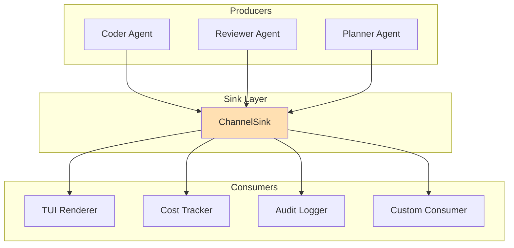

# Integrating with the Streaming Pipeline

This tutorial explains how to integrate with xaft's streaming pipeline, which carries real-time events from agents and tools to consumers like the TUI, logging systems, and external integrations. You will learn how `ChannelSink` works, how to consume `StreamEvent` instances, and how to build a fully custom `StreamSink` implementation for specialized use cases.

---

## Streaming Architecture Overview

The streaming pipeline in xaft is a publish-subscribe system built on top of `tokio::sync::broadcast`. Every agent publishes events to a shared sink, and multiple consumers can subscribe independently. This architecture provides several key properties: consumers do not block producers (if a consumer is slow, it misses events rather than delaying the agent), multiple consumers can observe the same events simultaneously (the TUI and the cost tracker both need token events), and the system degrades gracefully under load (dropping old events is preferable to blocking the LLM stream).

The pipeline consists of three layers: the producer (agent/tool), the sink (routing and buffering), and the consumer (TUI, logger, or custom handler). Events flow downward through these layers, and each layer can transform, filter, or enrich the event stream.



---

## The StreamEvent Enum

`StreamEvent` is the core data type of the streaming pipeline. Every observable occurrence in the agent runtime — LLM token emission, tool invocation, approval requests, agent lifecycle transitions — is represented as a variant of this enum. The enum is `Clone + Send + Sync`, which is required because broadcast channels clone each event for every subscriber.

```rust
#[derive(Debug, Clone, Serialize)]
pub enum StreamEvent {
    /// A single token from the LLM's response stream. Tokens arrive
    /// one at a time as the LLM generates them, enabling real-time
    /// display in the TUI.
    Token(TokenEvent),

    /// The LLM has requested a tool call. This event fires before
    /// the approval gate is consulted, so it represents intent
    /// rather than execution.
    ToolCall {
        name: String,
        input: serde_json::Value,
        call_id: String,
    },

    /// A tool has completed execution. The output includes both
    /// the human-readable summary and the structured JSON payload.
    ToolResult {
        name: String,
        output: ToolOutput,
        call_id: String,
        duration: std::time::Duration,
    },

    /// The approval gate is requesting user decision. The consumer
    /// should present the approval dialog and send the response
    /// back via the oneshot channel.
    ApprovalRequest {
        tool_name: String,
        input: serde_json::Value,
        response_tx: tokio::sync::oneshot::Sender<ApprovalDecision>,
    },

    /// An agent lifecycle event: started, paused, completed, or errored.
    AgentLifecycle {
        agent_name: String,
        event: AgentLifecycleEvent,
    },

    /// A handoff event: one agent is transferring control to another.
    Handoff {
        from: String,
        to: String,
        reason: String,
    },

    /// The agent has reached its iteration limit and is stopping.
    IterationLimitReached {
        agent_name: String,
        iterations: usize,
    },

    /// Cost tracking update: the LLM call consumed tokens.
    ModelCallComplete {
        model: String,
        input_tokens: u64,
        output_tokens: u64,
        cost_usd: f64,
    },

    /// A custom event for application-specific data.
    Custom {
        tag: String,
        data: serde_json::Value,
    },
}
```

The `TokenEvent` variant deserves special attention because it is the highest-frequency event type. A typical LLM response generates 20-80 tokens per second, so the streaming pipeline must handle this throughput without introducing perceptible latency in the TUI. The broadcast channel's capacity (default 256) is sized to buffer approximately 3-5 seconds of token events, giving slow consumers a reasonable window before events are dropped.

The `ApprovalRequest` variant includes a `oneshot::Sender` for the response. This is the only event that requires a response from the consumer — all other events are fire-and-forget. The oneshot channel creates a direct backchannel between the approval consumer (typically the TUI) and the runtime, bypassing the broadcast channel. If the oneshot sender is dropped without sending a response (for example, if the TUI crashes), the runtime treats this as a rejection and cancels the tool call.

The `ModelCallComplete` event is emitted after every LLM API call completes. It carries the token counts and cost, which the cost tracker aggregates into session-level totals. This event is also useful for monitoring LLM usage patterns and detecting anomalous spending (e.g., an agent stuck in a loop that makes repeated API calls).

---

## ChannelSink

`ChannelSink` is the default sink implementation that ships with xaft-runtime. It wraps a `tokio::sync::broadcast::Sender<StreamEvent>` and implements the `StreamSink` trait. When an agent emits an event, the `ChannelSink` sends it through the broadcast channel, and all active subscribers receive a clone.

```rust
use xaft_runtime::{ChannelSink, StreamEvent, StreamSink};
use async_trait::async_trait;

/// Create a channel sink with a configurable buffer capacity.
pub fn create_sink(capacity: usize) -> (ChannelSink, broadcast::Receiver<StreamEvent>) {
    let (tx, rx) = tokio::sync::broadcast::channel(capacity);
    let sink = ChannelSink::new(tx);
    (sink, rx)
}

// Usage in agent construction
let (sink, rx) = create_sink(512);
let agent = AgentBuilder::new()
    .name("my-agent")
    .role(role)
    .tools(tools)
    .stream_sink(Arc::new(sink))
    .build()?;
```

The broadcast channel has an important property: if a receiver falls behind (its buffer fills up), the channel drops the oldest unread messages and the receiver receives a `RecvError::Lagged(n)` indicating how many messages were missed. This is the correct behavior for a real-time streaming system — it is better to skip stale tokens than to accumulate unbounded memory or block the producer. However, consumers that require lossless delivery (like audit loggers) should use a custom sink that writes directly to durable storage rather than relying on the broadcast channel.

The capacity parameter should be tuned based on the consumer's processing speed and the expected event rate. For the TUI, which consumes events at screen refresh rate (typically 30-60 Hz), a capacity of 256-512 is sufficient. For audit loggers that write to disk, a larger capacity (1024-4096) provides more buffering for disk I/O spikes. For external API consumers, the capacity depends on the network latency and should be generous enough to handle transient failures.

---

## Consuming StreamEvent

The most common pattern for consuming events is to spawn a background task that loops on `recv()` and dispatches based on the event type. The `broadcast::Receiver::recv()` method is async and will block until a new event is available, making it efficient for background tasks.

```rust
use tokio::sync::broadcast;

async fn consume_stream(mut rx: broadcast::Receiver<StreamEvent>) {
    loop {
        match rx.recv().await {
            Ok(event) => match event {
                StreamEvent::Token(token) => {
                    // Render token to stdout (for headless mode)
                    print!("{}", token.text);
                }
                StreamEvent::ToolCall { name, input, .. } => {
                    println!("\n[calling tool: {}]", name);
                    if let Some(pretty) = serde_json::to_string_pretty(&input).ok() {
                        println!("  input: {}", pretty);
                    }
                }
                StreamEvent::ToolResult { name, output, duration, .. } => {
                    println!(
                        "\n[tool result: {} ({:.1}ms)]",
                        name,
                        duration.as_secs_f64() * 1000.0
                    );
                    println!("  {}", output.summary());
                }
                StreamEvent::ApprovalRequest { tool_name, input, response_tx } => {
                    // In headless mode, auto-approve read-only operations
                    let is_read_only = tool_name.starts_with("read_")
                        || tool_name.starts_with("search_")
                        || tool_name.starts_with("list_");
                    
                    let decision = if is_read_only {
                        ApprovalDecision::Approve
                    } else {
                        println!("\n[approval required: {}]", tool_name);
                        // In a real implementation, you would read user input
                        ApprovalDecision::Reject
                    };
                    
                    let _ = response_tx.send(decision);
                }
                StreamEvent::ModelCallComplete { model, cost_usd, .. } => {
                    eprintln!(
                        "[cost: {} — ${:.4}]",
                        model, cost_usd
                    );
                }
                StreamEvent::AgentLifecycle { agent_name, event } => {
                    println!("[{}: {:?}]", agent_name, event);
                }
                _ => {}
            },
            Err(broadcast::error::RecvError::Lagged(n)) => {
                eprintln!("[stream: {} events dropped]", n);
            }
            Err(broadcast::error::RecvError::Closed) => {
                break; // Channel closed, agent has terminated
            }
        }
    }
}
```

This consumer pattern handles all the edge cases of broadcast channels: it processes events in order, reports lag events (so you can monitor whether the consumer is keeping up), and exits cleanly when the channel closes. The lag reporting is particularly important in production — if you see frequent lag events, it indicates that the consumer is too slow and you should either increase the channel capacity or optimize the consumer's processing.

For the `ApprovalRequest` handling, note the `let _ = response_tx.send(decision)` — the send is fallible because the runtime might have already cancelled the approval request (for example, if the user pressed Ctrl+C). Dropping the response sender without sending is also valid and is treated as a rejection by the runtime.

---

## Building a Custom StreamSink

While `ChannelSink` is suitable for most use cases, you may need a custom `StreamSink` for specialized requirements: writing events to a database, forwarding events to an external API, or implementing a custom buffering strategy. The `StreamSink` trait is minimal — it has a single async method — so implementing it is straightforward.

```rust
use xaft_runtime::{StreamSink, StreamEvent, StreamError};
use async_trait::async_trait;

/// A sink that writes all events to a JSONL file (one JSON object per line).
/// This is useful for audit logging, replay debugging, and post-hoc analysis.
pub struct JsonlFileSink {
    path: std::path::PathBuf,
    buffer: Vec<StreamEvent>,
    flush_interval: std::time::Duration,
}

impl JsonlFileSink {
    pub fn new(path: impl Into<std::path::PathBuf>) -> Self {
        Self {
            path: path.into(),
            buffer: Vec::with_capacity(64),
            flush_interval: std::time::Duration::from_secs(5),
        }
    }

    async fn flush_buffer(&mut self) -> Result<(), std::io::Error> {
        use tokio::io::AsyncWriteExt;
        
        let mut file = tokio::fs::OpenOptions::new()
            .create(true)
            .append(true)
            .open(&self.path)
            .await?;
        
        for event in self.buffer.drain(..) {
            let line = serde_json::to_string(&event)
                .unwrap_or_else(|_| "{}".to_string());
            file.write_all(line.as_bytes()).await?;
            file.write_all(b"\n").await?;
        }
        
        file.flush().await?;
        Ok(())
    }
}

#[async_trait]
impl StreamSink for JsonlFileSink {
    async fn send(&self, event: StreamEvent) -> Result<(), StreamError> {
        // Note: In a real implementation, you would need interior mutability
        // (e.g., Arc<Mutex<Vec<StreamEvent>>>) since StreamSink::send takes &self.
        // This example simplifies for clarity.
        self.buffer.push(event);
        
        if self.buffer.len() >= 64 {
            self.flush_buffer().await
                .map_err(|e| StreamError::WriteFailed(e.to_string()))?;
        }
        
        Ok(())
    }
}
```

In practice, custom sinks need interior mutability because `StreamSink::send` takes `&self`, not `&mut self`. This is a deliberate design choice — sinks are shared across agents via `Arc`, and `&mut self` would require a `Mutex` at the call site, adding latency. Instead, sinks should use internal synchronization (`Arc<Mutex<>>` or `Arc<RwLock<>>`) to manage their mutable state.

Here is a more realistic implementation using `Arc<Mutex<>>`:

```rust
use std::sync::Arc;
use tokio::sync::Mutex;

pub struct JsonlFileSink {
    inner: Arc<Mutex<JsonlFileSinkInner>>,
}

struct JsonlFileSinkInner {
    path: std::path::PathBuf,
    buffer: Vec<StreamEvent>,
}

impl JsonlFileSink {
    pub fn new(path: impl Into<std::path::PathBuf>) -> Self {
        Self {
            inner: Arc::new(Mutex::new(JsonlFileSinkInner {
                path: path.into(),
                buffer: Vec::with_capacity(64),
            })),
        }
    }
}

#[async_trait]
impl StreamSink for JsonlFileSink {
    async fn send(&self, event: StreamEvent) -> Result<(), StreamError> {
        let mut inner = self.inner.lock().await;
        inner.buffer.push(event);
        
        if inner.buffer.len() >= 64 {
            inner.flush().await
                .map_err(|e| StreamError::WriteFailed(e.to_string()))?;
        }
        
        Ok(())
    }
}
```

The choice of `tokio::sync::Mutex` over `std::sync::Mutex` is intentional. The standard mutex should not be held across `.await` points, and our `flush()` method is async. The tokio mutex is safe to hold across await points, though it has slightly higher overhead due to its async-aware implementation. Since the `send()` method is called on every event (potentially hundreds of times per second), the lock should be held for the minimum possible time — buffer the event and release the lock, then flush in a separate task.

---

## Multiplexing Sinks

For production deployments, you typically want multiple sinks active simultaneously: one for the TUI, one for audit logging, and one for cost tracking. The `MultiSink` combinator wraps multiple sinks and fans out events to all of them:

```rust
use xaft_runtime::{StreamSink, StreamEvent, StreamError};

pub struct MultiSink {
    sinks: Vec<Arc<dyn StreamSink>>,
}

impl MultiSink {
    pub fn new(sinks: Vec<Arc<dyn StreamSink>>) -> Self {
        Self { sinks }
    }
}

#[async_trait]
impl StreamSink for MultiSink {
    async fn send(&self, event: StreamEvent) -> Result<(), StreamError> {
        // Send to all sinks concurrently
        let futures: Vec<_> = self.sinks
            .iter()
            .map(|sink| sink.send(event.clone()))
            .collect();
        
        let results = futures::future::join_all(futures).await;
        
        // Report the first error, but don't stop other sinks
        for result in results {
            if let Err(e) = result {
                tracing::warn!("Sink error: {}", e);
            }
        }
        
        Ok(())
    }
}

// Usage
let multi_sink = MultiSink::new(vec![
    Arc::new(ChannelSink::new(tui_tx)),
    Arc::new(JsonlFileSink::new("audit.jsonl")),
    Arc::new(CostTrackingSink::new(cost_accumulator)),
]);

let agent = AgentBuilder::new()
    .name("my-agent")
    .role(role)
    .tools(tools)
    .stream_sink(Arc::new(multi_sink))
    .build()?;
```

The `MultiSink` sends events to all sinks concurrently using `futures::future::join_all`. This is important because a slow sink should not delay event delivery to other sinks. If one sink fails (for example, the JSONL file sink encounters a disk error), the other sinks continue operating normally. The error is logged but not propagated, because a failure in an auxiliary sink should not crash the agent.

This design principle — that sink failures are non-fatal — is a key architectural decision in xaft. The primary sink (the one feeding the TUI) is always a `ChannelSink`, and its failure would indicate a systemic problem (like an OOM condition). Auxiliary sinks are best-effort and should never block or crash the agent. If you need guaranteed delivery, implement it within the sink itself (for example, by writing to a local file and shipping it asynchronously to a remote server).

---

## Complete Example: Headless Agent with JSONL Logging

This complete example creates a headless agent (no TUI) that logs all events to a JSONL file. It demonstrates creating a custom sink, consuming events, and running the agent without interactive input.

```rust
use std::sync::Arc;
use xaft_agent::{AgentBuilder, Role, CommitPolicy};
use xaft_runtime::{StreamSink, StreamEvent, StreamError, Runtime};
use xaft_tools::ToolRegistry;
use tokio::sync::Mutex;
use async_trait::async_trait;

// --- Custom JSONL Sink ---

struct JsonlSinkInner {
    file: tokio::fs::File,
}

struct JsonlSink {
    inner: Arc<Mutex<JsonlSinkInner>>,
}

impl JsonlSink {
    async fn new(path: &str) -> std::io::Result<Self> {
        let file = tokio::fs::OpenOptions::new()
            .create(true)
            .append(true)
            .open(path)
            .await?;
        Ok(Self {
            inner: Arc::new(Mutex::new(JsonlSinkInner { file })),
        })
    }
}

#[async_trait]
impl StreamSink for JsonlSink {
    async fn send(&self, event: StreamEvent) -> Result<(), StreamError> {
        let mut inner = self.inner.lock().await;
        use tokio::io::AsyncWriteExt;
        let line = serde_json::to_string(&event)
            .unwrap_or_else(|_| "{}".to_string());
        inner.file.write_all(line.as_bytes()).await
            .map_err(|e| StreamError::WriteFailed(e.to_string()))?;
        inner.file.write_all(b"\n").await
            .map_err(|e| StreamError::WriteFailed(e.to_string()))?;
        Ok(())
    }
}

// --- Main ---

#[tokio::main]
async fn main() -> Result<(), Box<dyn std::error::Error>> {
    let sink = Arc::new(JsonlSink::new("agent-session.jsonl").await?);

    let role = Role::builder()
        .system_prompt("You are a helpful coding assistant.")
        .max_iterations(20)
        .auto_approve_read_only(true)
        .build();

    let registry = ToolRegistry::builder()
        .register_builtin_tools()
        .build();

    let agent = AgentBuilder::new()
        .name("headless-coder")
        .role(role)
        .commit_policy(CommitPolicy::OnSuccess)
        .stream_sink(sink)
        .build()?;

    let mut runtime = Runtime::builder()
        .agent(agent)
        .build()
        .await?;

    runtime.run().await?;
    Ok(())
}
```

This example shows the complete pipeline from event production to durable storage. The `JsonlSink` writes every event to a JSONL file, creating an audit trail that can be replayed, analyzed, or ingested by downstream tools. The JSONL format is chosen because it is line-delimited (easy to process with standard Unix tools like `grep` and `jq`), append-friendly (new events can be added without rewriting the file), and self-describing (each line is a complete JSON object with the event type and data).
