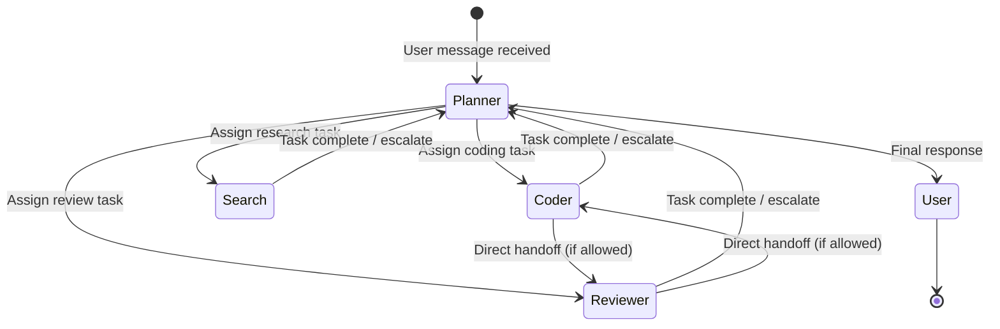

# Workflow Orchestration

This tutorial explains how to define custom workflows in xaft using the `AgentRegistry`, dynamic handoff, and `WorkflowConfig::Dynamic`. Workflows determine which agent is active at any given time, how agents transfer control, and what happens when a task requires multiple agents to collaborate. You will learn how to configure handoff rules, implement dynamic routing, and build a custom workflow engine.

---

## Workflow Fundamentals

A workflow in xaft is the control flow structure that governs how agents participate in a session. At its simplest, a workflow is a single agent that handles the entire task from start to finish. At its most complex, a workflow involves multiple agents that hand off control based on the task's evolving requirements, with a planner agent coordinating the overall effort.

The workflow engine sits between the runtime and the agents. When the runtime receives a user message, it consults the workflow to determine which agent should handle it. When an agent decides to hand off, the workflow validates the handoff, transfers control, and notifies the new agent. When an agent completes its task, the workflow decides what happens next — whether to return control to the user, hand off to another agent, or terminate the session.



---

## AgentRegistry

The `AgentRegistry` is the central catalog of agents available in a session. It maps agent names to `Arc<Agent>` instances and provides lookup, enumeration, and validation methods. Every workflow begins with an `AgentRegistry` that has been populated with the agents that will participate in the session.

```rust
use xaft_runtime::AgentRegistry;
use std::sync::Arc;

let mut registry = AgentRegistry::new();

// Register agents by name
registry.register(coder_agent)?;
registry.register(reviewer_agent)?;
registry.register(search_agent)?;
registry.register(planner_agent)?;

// The registry is immutable once consumed by the runtime
let registry = registry.freeze();
```

The `freeze()` method consumes the mutable registry and returns an immutable version. This is a deliberate design choice — once the runtime has started, agents cannot be added or removed, because the workflow engine relies on a stable set of agents for handoff validation. If you need dynamic agent sets (for example, loading plugins at runtime), you must restart the session with a new registry.

The registry also provides introspection methods that the workflow engine uses to make routing decisions:

```rust
// Check if an agent exists
assert!(registry.contains("coder"));

// Get agent metadata
let agent = registry.get("coder").expect("coder must exist");
println!("Agent: {} — {}", agent.name(), agent.role().system_prompt().lines().next().unwrap());

// List all agents
for (name, agent) in registry.iter() {
    println!("{}: {} tools, commit policy {:?}",
        name,
        agent.tools().len(),
        agent.commit_policy()
    );
}

// Validate that all handoff targets exist
let handoff_targets = ["coder", "reviewer", "search"];
for target in &handoff_targets {
    assert!(registry.contains(target), "Missing agent: {}", target);
}
```

The registry's immutability after freezing has an important implication for testing: you can build a registry with mock agents, freeze it, and pass it to the runtime without worrying about the mock agents being replaced. This makes it safe to share the registry across multiple test cases that run concurrently.

---

## Handoff Rules

Handoff rules define the directed graph of permitted control transfers between agents. Without handoff rules, any agent could transfer control to any other agent at any time, which creates two problems: security (a compromised agent could hand off to a privileged agent) and predictability (the user cannot reason about which agent is handling their request).

```rust
use xaft_agent::HandoffRule;

let rules = vec![
    // The planner can hand off to any agent
    HandoffRule::allow_any("planner"),
    
    // The coder can hand off to the reviewer for code review
    HandoffRule::allow("coder", "reviewer"),
    
    // The reviewer can hand off back to the coder for fixes
    HandoffRule::allow("reviewer", "coder"),
    
    // The search agent can hand off to the coder to implement findings
    HandoffRule::allow("search", "coder"),
    
    // Explicit denys take precedence over allows
    HandoffRule::deny("search", "reviewer"),  // search cannot hand off directly to reviewer
    
    // No other handoffs are allowed
    // (agents not mentioned in any rule cannot hand off)
];
```

Handoff rules are evaluated at handoff time using a two-step process. First, the engine collects all rules that match the source agent. Then, it checks deny rules first (deny takes precedence over allow). If no deny rule matches, it checks allow rules. If no allow rule matches, the handoff is rejected with a `HandoffError::NotPermitted` error, and the requesting agent receives an error observation.

The `allow_any` rule is a convenience that permits handoffs from the specified agent to any target. It is typically used for the planner, which needs unrestricted handoff authority. However, `allow_any` does not override explicit deny rules — if there is a deny rule for a specific target, it still takes precedence. This allows you to grant broad authority while maintaining specific restrictions: `allow_any("planner")` combined with `deny("planner", "destroyer")` lets the planner hand off to any agent except the destructive one.

When an agent wants to hand off, it publishes a `HandoffRequest` on the signal bus:

```rust
use xaft_runtime::{SignalBus, HandoffRequest, HandoffResponse};

// Inside the coder agent's execution
let request = HandoffRequest {
    from_agent: "coder".to_string(),
    to_agent: "reviewer".to_string(),
    reason: "Code changes complete, requesting review".to_string(),
    context: serde_json::json!({
        "files_changed": ["src/auth.rs", "src/session.rs"],
        "lines_added": 47,
        "lines_removed": 12,
    }),
};

let response = signal_bus.publish_and_await(request).await?;

match response {
    HandoffResponse::Accept => {
        // Control transfers to the reviewer
        // The coder's turn ends
    }
    HandoffResponse::Deny(reason) => {
        // Handoff was rejected — continue as the coder
        tracing::warn!("Handoff denied: {}", reason);
    }
    HandoffResponse::Redirect(target) => {
        // The workflow engine suggests a different agent
        tracing::info!("Redirected to: {}", target);
    }
}
```

The `publish_and_await` method is a synchronous request-response pattern built on top of the signal bus. It publishes the handoff request and waits for a response via a oneshot channel. This means the agent blocks until the workflow engine (or the planner) responds. The timeout for this wait is configurable; if it expires, the handoff is treated as denied, and the agent continues its current turn.

---

## WorkflowConfig::Dynamic

The `WorkflowConfig` enum defines the workflow strategy for a session. xaft supports three modes:

| Mode | Description | Use Case |
|------|-------------|----------|
| `SingleAgent` | One agent handles everything | Simple tasks, single-purpose agents |
| `StaticPlan` | A fixed plan with pre-assigned steps | Known workflows like CI/CD pipelines |
| `Dynamic` | The planner decides which agent to activate at each step | Complex tasks requiring adaptive routing |

The `Dynamic` mode is the most powerful and the most commonly used for multi-agent sessions. In this mode, the planner agent receives each user message and decides which worker agent should handle it, based on the task's requirements and the current state of the session.

```rust
use xaft_runtime::{WorkflowConfig, DynamicWorkflowConfig};

let workflow = WorkflowConfig::Dynamic(DynamicWorkflowConfig {
    // The agent that receives user messages and makes routing decisions
    coordinator: "planner".to_string(),
    
    // Handoff rules
    handoff_rules: rules,
    
    // Whether the coordinator can delegate to itself
    allow_self_handoff: false,
    
    // Maximum handoff depth (prevents infinite handoff loops)
    max_handoff_depth: 5,
    
    // What happens when no agent is available for a task
    on_no_available_agent: NoAgentPolicy::AskUser,
    
    // Whether to preserve conversation context across handoffs
    preserve_context: true,
    
    // How to format the handoff context for the receiving agent
    context_formatter: ContextFormatter::default(),
});
```

The `max_handoff_depth` parameter prevents a pathological condition where agents hand off in a cycle (coder → reviewer → coder → reviewer → ...). Each handoff increments a depth counter, and when the counter reaches the limit, the handoff is rejected with a `HandoffError::MaxDepthExceeded` error. The planner receives this error and must decide how to break the cycle — typically by handling the task itself or asking the user for guidance.

The `preserve_context` flag controls whether the receiving agent sees the full conversation history from the previous agent or just the handoff context. When `true`, the receiving agent inherits the entire conversation, which allows it to understand the full context of the task. When `false`, the receiving agent only sees the handoff message, which is a summary of what the previous agent was doing and why it handed off. The `false` mode is useful when the conversation history is very long and would consume too many tokens, or when the previous agent's conversation contains sensitive information that the receiving agent should not see.

---

## Dynamic Routing Logic

The dynamic routing logic is implemented by the planner agent itself, not by the workflow engine. The workflow engine's job is to validate handoffs, enforce rules, and manage the control transfer. The planner's job is to decide which agent should be active. This separation of concerns means that the routing logic can be as simple or as complex as the planner's system prompt dictates.

Here is an example of a planner prompt that implements dynamic routing:

```rust
let planner_role = Role::builder()
    .system_prompt(
        r#"You are the planning agent. Your job is to route tasks to the appropriate worker agent.

Available agents:
- coder: Writes and modifies code. Use for implementing features, fixing bugs, refactoring.
- reviewer: Reviews code for bugs, security issues, and style violations. Use after the coder makes changes.
- search: Searches the codebase and documentation. Use for finding files, understanding code structure, researching APIs.

Routing rules:
1. If the user asks to write or modify code, hand off to the coder.
2. If the user asks to review code or find issues, hand off to the reviewer.
3. If the user asks to search for something, hand off to the search agent.
4. If the user asks a general question, answer it yourself.
5. After the coder completes changes, always hand off to the reviewer for verification.
6. If the reviewer finds issues, hand off to the coder for fixes.

When handing off, provide clear context about what the agent should do and any relevant information from the conversation."#
    )
    .max_iterations(50)
    .build();
```

This prompt encodes the routing logic in natural language, which the LLM interprets at runtime. This approach is flexible — you can modify the routing behavior by editing the prompt without changing any code — but it is also non-deterministic. The LLM might not always follow the routing rules perfectly, especially in ambiguous cases. For production systems that require deterministic routing, consider implementing a custom routing function that the planner delegates to via a tool call.

---

## Building a Custom Workflow Engine

For advanced use cases, you can implement a custom workflow engine by implementing the `WorkflowEngine` trait. This gives you full control over routing decisions, handoff validation, and state transitions. A custom engine is appropriate when you need deterministic routing, complex state machines, or integration with external orchestration systems.

```rust
use xaft_runtime::{
    WorkflowEngine, WorkflowState, RoutingDecision,
    HandoffRequest, HandoffResponse, AgentRegistry,
};
use async_trait::async_trait;

/// A state-machine workflow that enforces a specific sequence:
/// Search → Code → Review → Complete
pub struct PipelineWorkflow {
    registry: Arc<AgentRegistry>,
    state: Arc<Mutex<PipelineState>>,
}

#[derive(Debug, Clone, Copy, PartialEq)]
enum PipelineStage {
    Search,
    Code,
    Review,
    Complete,
}

struct PipelineState {
    stage: PipelineStage,
    search_results: Option<serde_json::Value>,
    code_output: Option<serde_json::Value>,
}

impl PipelineWorkflow {
    pub fn new(registry: Arc<AgentRegistry>) -> Self {
        Self {
            registry,
            state: Arc::new(Mutex::new(PipelineState {
                stage: PipelineStage::Search,
                search_results: None,
                code_output: None,
            })),
        }
    }
}

#[async_trait]
impl WorkflowEngine for PipelineWorkflow {
    /// Determine which agent should handle the next step.
    async fn route(&self, _message: &str, _history: &[ChatMessage]) -> RoutingDecision {
        let state = self.state.lock().await;
        match state.stage {
            PipelineStage::Search => RoutingDecision::Agent("search".to_string()),
            PipelineStage::Code => RoutingDecision::Agent("coder".to_string()),
            PipelineStage::Review => RoutingDecision::Agent("reviewer".to_string()),
            PipelineStage::Complete => RoutingDecision::Complete,
        }
    }

    /// Called when an agent completes its current task.
    async fn on_agent_complete(
        &self,
        agent_name: &str,
        result: &AgentResult,
    ) -> Result<(), WorkflowError> {
        let mut state = self.state.lock().await;
        
        match (state.stage, agent_name) {
            (PipelineStage::Search, "search") => {
                state.search_results = Some(result.output().clone());
                state.stage = PipelineStage::Code;
            }
            (PipelineStage::Code, "coder") => {
                state.code_output = Some(result.output().clone());
                state.stage = PipelineStage::Review;
            }
            (PipelineStage::Review, "reviewer") => {
                state.stage = PipelineStage::Complete;
            }
            _ => {
                return Err(WorkflowError::UnexpectedAgent {
                    expected: format!("{:?}", state.stage),
                    actual: agent_name.to_string(),
                });
            }
        }
        
        Ok(())
    }

    /// Validate a handoff request.
    async fn validate_handoff(&self, request: &HandoffRequest) -> HandoffResponse {
        // In pipeline mode, handoffs are only allowed to the next stage
        let state = self.state.lock().await;
        let expected_target = match state.stage {
            PipelineStage::Search => "search",
            PipelineStage::Code => "coder",
            PipelineStage::Review => "reviewer",
            PipelineStage::Complete => return HandoffResponse::Deny("Pipeline complete".to_string()),
        };
        
        if request.to_agent == expected_target {
            HandoffResponse::Accept
        } else {
            HandoffResponse::Redirect(expected_target.to_string())
        }
    }
}
```

This pipeline workflow enforces a strict sequence of stages. Each agent must complete before the next one starts, and agents cannot skip stages or go backwards. This is appropriate for regulated workflows where the sequence is mandated (for example, a compliance workflow that requires search, implementation, and audit in that order). The `Redirect` response tells the requesting agent which agent it should target instead, guiding it toward the correct pipeline stage.

The `WorkflowEngine` trait is the most flexible integration point in the workflow system. You can implement any routing logic you need — round-robin load balancing across multiple coder agents, priority-based routing that prefers faster models for simple tasks, or even integration with external job queues. The trait's async methods allow you to make network calls to external services for routing decisions, enabling integration with systems like Kubernetes for agent scheduling.

---

## Complete Example

```rust
use std::sync::Arc;
use xaft_agent::*;
use xaft_runtime::*;

#[tokio::main]
async fn main() -> Result<(), Box<dyn std::error::Error>> {
    // Build agents
    let registry = AgentRegistry::new()
        .register(build_search_agent()?)?
        .register(build_coder_agent()?)?
        .register(build_reviewer_agent()?)?
        .register(build_planner_agent()?)?
        .freeze();

    // Configure dynamic workflow
    let workflow = WorkflowConfig::Dynamic(DynamicWorkflowConfig {
        coordinator: "planner".to_string(),
        handoff_rules: vec![
            HandoffRule::allow_any("planner"),
            HandoffRule::allow("coder", "reviewer"),
            HandoffRule::allow("reviewer", "coder"),
            HandoffRule::allow("search", "coder"),
            HandoffRule::deny("search", "reviewer"),
        ],
        allow_self_handoff: false,
        max_handoff_depth: 5,
        on_no_available_agent: NoAgentPolicy::AskUser,
        preserve_context: true,
        context_formatter: ContextFormatter::default(),
    });

    let runtime = Runtime::builder()
        .agent_registry(registry)
        .workflow(workflow)
        .build()
        .await?;

    runtime.run().await?;
    Ok(())
}
```

This example demonstrates the complete workflow configuration pipeline: building an agent registry, defining handoff rules, configuring the dynamic workflow, and passing everything to the runtime builder. The workflow engine uses the planner as the coordinator, enforces handoff rules for security, limits handoff depth to prevent cycles, and preserves conversation context across agent transitions for coherent multi-agent collaboration.
