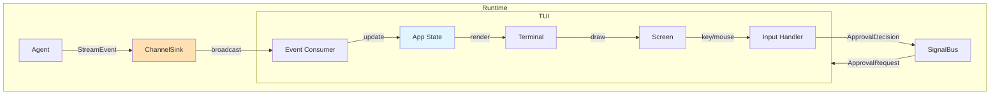

# Customizing the TUI

This tutorial covers customizing the terminal user interface (TUI) in xaft. You will learn how to configure themes, remap keybindings, adjust the layout, and define custom panel configurations. The TUI is built on top of `ratatui` and runs in an alternate screen buffer, providing a rich interactive experience for monitoring and controlling agent sessions.

---

## TUI Architecture

The TUI is a separate crate (`xaft-tui`) that communicates with the runtime through the streaming pipeline and signal bus. It subscribes to `StreamEvent` instances for rendering and publishes user actions (key presses, mouse clicks, approval decisions) back to the runtime. This decoupled architecture means the TUI can be replaced entirely without modifying the runtime — for example, you could build a web-based UI that consumes the same event stream.

The TUI runs in a dedicated tokio task that performs the render loop. Each frame, it reads pending events from the stream, updates the application state, and redraws the terminal. The frame rate is capped at 60 FPS (configurable) to avoid consuming excessive CPU when the terminal is idle. The render loop uses double buffering via `ratatui`'s `Terminal` type, which ensures flicker-free updates.



---

## Theme Configuration

Themes control the visual appearance of the TUI: colors, text styles, border styles, and progress indicators. Themes are defined in the `[tui.theme]` section of `xaft.toml` and are loaded at startup. The default theme is designed for dark terminals, but you can create custom themes for light terminals, accessibility needs, or personal preference.

```toml
# xaft.toml

[tui.theme]
# Base color scheme
background = "#1e1e2e"
foreground = "#cdd6f4"
cursor = "#f5e0dc"

# Semantic colors
primary = "#89b4fa"       # Agent names, active elements
secondary = "#a6adc8"     # Labels, secondary text
success = "#a6e3a1"       # Tool success, completed steps
warning = "#f9e2af"       # Pending approvals, warnings
error = "#f38ba8"         # Errors, failed steps
info = "#89dceb"          # Informational text

# Agent-specific colors (used in the agent panel)
[tui.theme.agents]
coder = "#89b4fa"
reviewer = "#a6e3a1"
planner = "#f9e2af"
search = "#cba6f7"

# Text styles
[tui.theme.styles]
agent_name = "bold"
tool_call = "italic"
error_message = "bold red"
token_stream = "dim"
```

Colors are specified as hex strings (`#RRGGBB`) and are resolved to terminal colors at render time. The TUI supports 24-bit true color when the terminal advertises it (via the `COLORTERM=truecolor` environment variable). When true color is not available, colors are downsampled to the nearest 256-color or 16-color palette entry. This automatic fallback ensures the TUI looks acceptable even on limited terminals.

The semantic color system (primary, secondary, success, warning, error, info) is used throughout the TUI codebase instead of hardcoded colors. This means that changing the theme's `error` color affects every error display in the TUI — tool errors, agent errors, and system errors all use the same semantic color. This consistency makes the TUI feel cohesive and makes theme customization predictable.

For accessibility, you can define high-contrast themes that meet WCAG AAA contrast ratios:

```toml
[tui.theme]
background = "#000000"
foreground = "#ffffff"
primary = "#ffff00"
success = "#00ff00"
error = "#ff0000"
warning = "#ff8800"
info = "#00ffff"
```

---

## Keybinding Configuration

Keybindings map keyboard input to TUI actions. The default keybindings follow vim-style conventions (h/j/k/l for navigation, Enter for confirm, Esc for cancel), but you can remap any key to any action. Keybindings are defined in the `[tui.keybindings]` section of `xaft.toml`.

```toml
[tui.keybindings]
# Navigation
scroll_up = "k"
scroll_down = "j"
scroll_left = "h"
scroll_right = "l"
page_up = "Ctrl+u"
page_down = "Ctrl+d"
goto_top = "g"
goto_bottom = "G"

# Agent control
toggle_pause = "p"
cancel_agent = "Ctrl+c"
submit_input = "Enter"

# Approval
approve = "y"
reject = "n"
approve_all = "a"

# View
toggle_help = "?"
toggle_agent_panel = "Tab"
toggle_cost_panel = "$"
zoom_in = "+"
zoom_out = "-"

# Session
new_session = "Ctrl+n"
quit = "Ctrl+q"
```

Keybindings are parsed at startup using a custom parser that supports modifier combinations (`Ctrl+c`, `Alt+Enter`), function keys (`F1` through `F12`), and special keys (`Escape`, `Tab`, `Backspace`). Invalid keybindings produce a warning log and fall back to the default binding for that action.

The keybinding system supports multiple bindings for the same action by specifying a comma-separated list:

```toml
[tui.keybindings]
scroll_up = "k, Up"
scroll_down = "j, Down"
submit_input = "Enter, Ctrl+m"
```

This is useful for providing both vim-style and arrow-key navigation simultaneously, or for supporting different keyboard layouts. The first matching binding is used for display purposes (e.g., the help screen shows "k" rather than "Up" for scroll_up when both are bound).

---

## Layout Configuration

The TUI layout defines how panels are arranged on the screen. The default layout has three panels: a main conversation area (center), an agent status panel (left), and a cost/activity panel (right). You can customize the panel arrangement, sizes, and visibility.

```toml
[tui.layout]
# Layout direction: "horizontal" or "vertical"
direction = "horizontal"

# Panel sizes as percentages of total width/height
# The last panel gets the remaining space
[[tui.layout.panels]]
id = "agent_status"
size = 20          # 20% of screen width
min_size = 15      # minimum 15 columns
visible = true
resizable = true

[[tui.layout.panels]]
id = "conversation"
size = 60          # 60% of screen width
min_size = 40
visible = true
resizable = true

[[tui.layout.panels]]
id = "cost_activity"
size = 20          # 20% of screen width
min_size = 15
visible = true
resizable = false
```

Panels are identified by their `id`, which must match one of the built-in panel types or a custom panel registered by a plugin. The built-in panel types are:

| Panel ID | Description |
|----------|-------------|
| `conversation` | Main conversation view with token stream and tool results |
| `agent_status` | Agent list with current state, iteration count, and last activity |
| `cost_activity` | Token usage, cost tracking, and recent activity log |
| `approval` | Pending approval requests with approve/reject buttons |
| `file_diff` | Real-time diff view showing workspace changes |
| `help` | Keybinding reference and command palette |

The `min_size` parameter prevents panels from becoming too small to be useful when the terminal window is resized. If the terminal is too small to accommodate all panels at their minimum sizes, the rightmost/bottommost panels are hidden automatically and reappear when the window is enlarged.

The `resizable` flag controls whether the user can resize the panel interactively (by pressing `Ctrl+Left/Right` to adjust the split point). Disabling resize for a panel locks it at its configured size, which is useful for panels with fixed-width content like the cost tracker.

---

## Custom Panel Configuration

For advanced customization, you can define custom panels that display application-specific information. Custom panels are implemented in Rust by implementing the `Panel` trait and registering them with the TUI builder. This is an advanced feature that requires building xaft from source with your custom panel code.

```rust
use xaft_tui::{Panel, PanelContext, PanelResult};
use ratatui::Frame;

pub struct SessionInfoPanel;

impl Panel for SessionInfoPanel {
    fn id(&self) -> &str { "session_info" }
    
    fn title(&self) -> &str { "Session Info" }
    
    fn render(&self, f: &mut Frame, area: ratatui::layout::Rect, ctx: &PanelContext) {
        let session = ctx.session();
        let block = ratatui::widgets::Block::default()
            .title("Session Info")
            .borders(ratatui::widgets::Borders::ALL);
        
        let items = vec![
            format!("Session ID: {}", session.id()),
            format!("Created: {}", session.created_at().format("%H:%M:%S")),
            format!("Duration: {:?}", session.duration()),
            format!("Agents: {}", session.agent_count()),
            format!("Tool calls: {}", session.tool_call_count()),
            format!("Total cost: ${:.4}", session.total_cost()),
        ];
        
        let list = ratatui::widgets::List::new(items)
            .block(block);
        
        f.render_widget(list, area);
    }
    
    fn handle_key(&self, _key: ratatui::event::KeyEvent, _ctx: &PanelContext) -> bool {
        false // This panel does not handle any keys
    }
}

// Register the custom panel
let tui = xaft_tui::TuiBuilder::new()
    .theme(theme)
    .keybindings(keybindings)
    .panel(SessionInfoPanel)
    .build();
```

The `Panel` trait has three methods: `id()` returns the panel's unique identifier (used in the layout configuration), `title()` returns the display title shown in the panel's border, and `render()` draws the panel's content. The `PanelContext` parameter provides access to the current session state, event stream, and runtime handles, so the panel can display real-time information without coupling to specific data sources.

The `handle_key` method returns `true` if the panel consumed the key event (preventing it from being processed by other panels or the global key handler). Most informational panels return `false` for all keys, but interactive panels (like the approval panel) return `true` for keys they handle (like `y` for approve and `n` for reject).

---

## Color Scheme Inheritance

When defining a theme, you can use the `extends` field to inherit from another theme and override specific values. This is useful for creating variations of a base theme:

```toml
[tui.theme.base]
background = "#1e1e2e"
foreground = "#cdd6f4"
primary = "#89b4fa"

[tui.theme.high-contrast]
extends = "base"
foreground = "#ffffff"
primary = "#ffff00"

[tui.theme.nord]
background = "#2e3440"
foreground = "#d8dee9"
primary = "#88c0d0"
success = "#a3be8c"
error = "#bf616a"
```

Theme inheritance is resolved at load time. The loader first applies the base theme's values, then overlays the extending theme's values on top. This means you only need to specify the values you want to change — everything else falls through to the base theme. The `extends` field can reference any previously defined theme, including built-in themes like `"dark"` and `"light"`.

---

## Runtime Theme Switching

The TUI supports runtime theme switching without restarting the session. When the user presses the theme cycle key (default: `Ctrl+t`), the TUI loads the next theme from the configuration and reapplies it. This is useful for switching between dark and light modes when the terminal environment changes (for example, when switching between a dark IDE and a light terminal).

```toml
# Define multiple themes
[[tui.themes]]
name = "dark"
background = "#1e1e2e"
foreground = "#cdd6f4"
primary = "#89b4fa"

[[tui.themes]]
name = "light"
background = "#eff1f5"
foreground = "#4c4f69"
primary = "#1e66f5"

[[tui.themes]]
name = "solarized"
background = "#002b36"
foreground = "#839496"
primary = "#268bd2"
```

The theme list is stored in the application state, and the current theme index is incremented on each cycle. The TUI redraws the entire screen when the theme changes, which takes less than a frame at 60 FPS. There is no perceptible delay or flicker during theme switching because the render loop performs an immediate redraw after updating the theme.

---

## Complete Configuration Example

Here is a complete `xaft.toml` configuration that customizes all aspects of the TUI:

```toml
[tui]
# Frame rate cap (1-120 fps)
fps = 60

# Mouse support
mouse = true

# Show a status bar at the bottom
status_bar = true

# Theme configuration
[tui.theme]
background = "#1a1b26"
foreground = "#a9b1d6"
primary = "#7aa2f7"
secondary = "#565f89"
success = "#9ece6a"
warning = "#e0af68"
error = "#f7768e"
info = "#7dcfff"

[tui.theme.agents]
coder = "#7aa2f7"
reviewer = "#9ece6a"
planner = "#e0af68"
search = "#bb9af7"

[tui.theme.styles]
agent_name = "bold"
tool_call = "italic"
error_message = "bold"

# Keybindings
[tui.keybindings]
scroll_up = "k, Up"
scroll_down = "j, Down"
page_up = "Ctrl+u"
page_down = "Ctrl+d"
approve = "y"
reject = "n"
approve_all = "a"
toggle_help = "?"
toggle_pause = "p"
quit = "Ctrl+q"

# Layout
tui.layout.direction = "horizontal"

[[tui.layout.panels]]
id = "agent_status"
size = 18
min_size = 14
visible = true
resizable = true

[[tui.layout.panels]]
id = "conversation"
size = 64
min_size = 40
visible = true
resizable = true

[[tui.layout.panels]]
id = "cost_activity"
size = 18
min_size = 14
visible = true
resizable = true
```

This configuration creates a Tokyo Night-inspired theme with vim-style keybindings and a three-panel layout optimized for wide terminals. The agent status panel on the left provides at-a-glance monitoring of all active agents, the conversation panel in the center shows the main interaction, and the cost activity panel on the right tracks spending and recent events. The layout is resizable, so users can adjust the panel sizes to their preference during a session.
