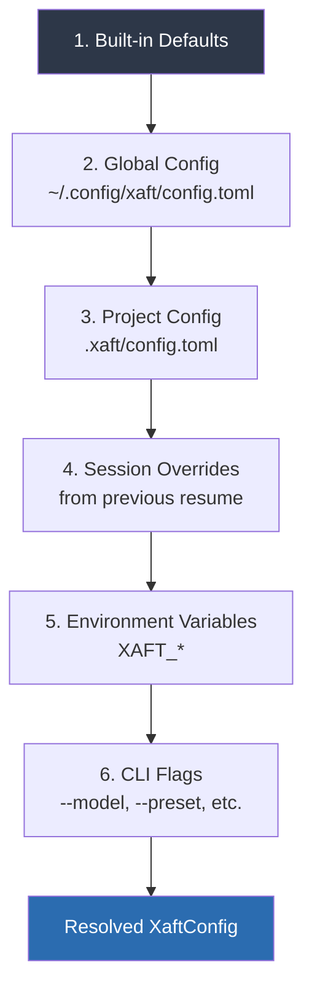
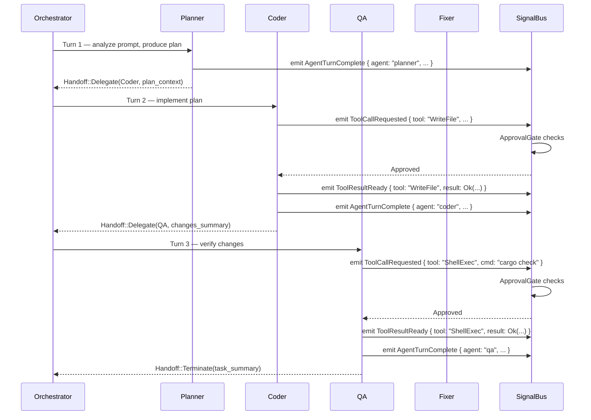

# First Task Walkthrough

This page traces a complete xaft task from start to finish, examining every subsystem that participates. We use a concrete example—adding a CLI argument parser to a Rust project—and follow the execution path through configuration resolution, agent orchestration, tool execution, approval gates, and session persistence. By the end, you will understand what happens when you type `xaft run "..."` and press Enter.

## The Task

We will work in a minimal Rust project with a single `main.rs`:

```rust
fn main() {
    println!("Hello, world!");
}
```

Our prompt:

```bash
xaft run "Add clap-based argument parsing to main.rs with --name (required string) and --count (optional u32, default 1)"
```

## Phase 1: CLI Parsing and Bootstrap

When you invoke `xaft run`, the `xaft-cli` crate's `clap`-based parser validates the arguments. The parser produces a `CliCommand::Run` variant containing the prompt string, any `--model` overrides, the `--no-tui` flag, and the `--dry-run` flag. The dispatch function in `xaft-cli` then calls `xaft_runtime::XaftRuntime::bootstrap()`.

`bootstrap()` performs three critical initialization steps in sequence:

1. **SignalBus creation.** A new `SignalBus` is instantiated. This is a broadcast-based, type-safe event system built on `tokio::sync::broadcast`. It will carry every event in the system—agent turns, tool calls, approval requests, config changes—from producers to consumers without coupling them.

2. **Session store initialization.** `FsSessionStore::open(".xaft/sessions.db")` creates or opens the SQLite database. WAL mode is enabled immediately via `PRAGMA journal_mode=WAL`. The session store registers a listener on the `SignalBus` so it can persist conversation turns and tool results as they happen.

3. **Signal listener attachment.** Several listeners are attached to the `SignalBus`:
   - A **logging listener** that writes structured events to the tracing subscriber.
   - A **metrics listener** that increments counters for turns, tokens, and tool calls.
   - An **EventBridge listener** (if TUI is enabled) that converts `SignalBus` events into `TuiEvent` messages for the dashboard.

At this point, the runtime is initialized but no agent has been created yet.

## Phase 2: Configuration Resolution

`run_task()` invokes `ConfigLoader::load()`, which merges six configuration layers in strict precedence order:



Each layer performs a deep merge: scalar values from a higher-precedence layer replace those from lower layers, but nested tables are merged recursively. For example, if the global config sets `provider.default = "anthropic"` and the project config sets `provider.model = "claude-opus-4-20250514"`, the resolved config will have both fields set correctly—neither clobbers the other.

After loading, `XaftConfig::validate()` checks for internal consistency: the specified provider must have a corresponding API key, the model name must be recognized, and numeric bounds (like `max_handoffs`) must be within acceptable ranges. Validation errors are reported immediately with actionable messages.

## Phase 3: Agent Construction

With the resolved config in hand, `run_task()` builds the agent and its supporting infrastructure:

1. **Provider chain.** The factory constructs `AnthropicProvider` or `OpenAIProvider` from the config, wraps it in `FallbackProvider` (if a secondary provider is available), then wraps that in `CostedProvider` (which tracks token usage and can enforce budget limits). The final provider implements `agtrs_runtime::LLMProvider`.

2. **Workspace and worktree.** `agtrs_git::WorktreeManager::create()` checks out a new worktree at `.xaft/worktrees/<session-id>/`. This worktree is an isolated copy of the repository at the current HEAD commit. All file modifications happen here, leaving your working tree untouched until you explicitly merge the result. A `WorkspaceStore` from `agtrs_workspace` is opened alongside it, maintaining a transaction journal of every file edit.

3. **Tool registry.** `xaft_tools::build_registry()` constructs the tool set: `ReadFile`, `WriteFile`, `EditFile`, `ShellExec`, `GitStatus`, `GitDiff`, `GitLog`, `Grep`, `ListDir`. Each tool implements the `agtrs_runtime::Tool` trait with `name()`, `description()`, `parameters()` (JSON Schema), and `execute()` methods. The registry is a `HashMap<String, Box<dyn Tool>>`.

4. **Agent instantiation.** For the default `coder` preset, a `XaftAgent` is created with the provider, tool registry, and lifecycle hooks. For the `plan-mode` preset, a `PlanModeAgent` wraps the `XaftAgent` with a planning cascade: `OneShotPlanner` attempts to produce a complete plan in one LLM call, and if the plan is incomplete, `IterativeRefinementPlanner` takes over to fill gaps over multiple turns.

5. **Orchestrator assembly.** A `HandoffOrchestrator` is constructed with the agent list—Planner, Coder, QA, Fixer—each backed by the same provider chain but with different system prompts and tool access levels. The orchestrator holds a `HandoffCounter` capped at 14.

## Phase 4: The Orchestrator Loop

The `HandoffOrchestrator::run()` method drives the core loop:



Each agent turn follows this lifecycle, governed by the `XaftAgent` lifecycle hooks:

- **`on_start`** — Called at the beginning of the turn. Initializes turn-scoped state and emits a `TurnStarted` signal.
- **`before_llm_call`** — Called just before the LLM API request is sent. Attaches the conversation history, system prompt, and available tool schemas to the request. Also emits an `LlmCallStarted` signal for the TUI to show a spinner.
- **`on_tool_result`** — Called after each tool execution completes. Validates the result and appends it to the conversation history. If the tool failed, the hook can decide whether to retry or surface the error to the LLM.
- **`on_turn_complete`** — Called after the LLM signals it has no more tool calls (a "stop" reason). Computes the `Handoff` decision and emits a `TurnComplete` signal.
- **`on_finish`** — Called when the agent is being dropped or the task is complete. Performs any cleanup, such as closing file handles or flushing buffered metrics.

## Phase 5: Tool Execution and Approval

When the Coder agent decides to write a file, it produces a tool call with the tool name `WriteFile` and arguments `{ "path": "src/main.rs", "content": "..." }`. The agent executor invokes `WriteFile::execute()`, but before the write reaches disk, the `ApprovalGate` intercepts it.

In interactive mode, the `TuiApprovalGate` sends a `TuiEvent::ApprovalRequired` message to the dashboard and waits on a `tokio::sync::oneshot` channel. The TUI renders the approval prompt showing the file path and a diff preview. You press Enter to approve, which writes `ApprovalDecision::Approve` into the oneshot channel. The gate unblocks and the write proceeds.

If you press Escape (deny), the gate returns `ApprovalDecision::Deny`, and the tool execution returns an error. The LLM sees this error in its conversation history and will attempt an alternative approach—perhaps modifying a different file, or asking for clarification.

If you do nothing for 120 seconds, the gate returns `ApprovalDecision::Timeout`, which is treated as a denial. This prevents the agent from hanging indefinitely if you step away from the terminal.

The actual file write goes through `agtrs_workspace::TransactionalEditor::write()`, which:

1. Reads the current file content.
2. Writes the old content to the undo journal.
3. Writes the new content to disk.
4. Records the operation in the workspace store.

If the write fails (disk full, permission denied), the transactional editor rolls back from the journal, ensuring the file is never left in a partially-written state.

## Phase 6: Session Persistence

Throughout the entire task, the `FsSessionStore` is listening to `SignalBus` events and persisting them to SQLite. Every `AgentTurnComplete`, `ToolCallRequested`, `ToolResultReady`, and `Handoff` event is written to the database in real time. This means:

- If xaft crashes, you can resume the session and the agent will see the full conversation history up to the last persisted event.
- You can replay any session with `xaft sessions show <id>` to see exactly what happened.
- The `FsSessionStore` uses WAL mode, which allows concurrent reads while writes are happening—so the TUI can query session state without blocking the writer.

The session database contains three primary tables:

| Table | Purpose |
|-------|---------|
| `sessions` | Session metadata: ID, prompt, creation time, status |
| `messages` | Conversation turns: role, content, timestamp, token count |
| `tool_calls` | Tool invocations: tool name, arguments, result, approval decision |

## Phase 7: Completion and Cleanup

When the orchestrator produces a `Handoff::Terminate`, `run_task()` performs final cleanup:

1. **Session finalization.** The session status is updated to `Completed` in SQLite, and a final `TaskComplete` signal is emitted with a summary of files changed, tool calls made, and total token usage.

2. **Worktree cleanup.** The Git worktree is left in place (not deleted) so you can inspect the changes, run tests, or merge the result. The worktree path is printed in the task summary.

3. **SignalBus shutdown.** The `SignalBus` is dropped, which closes all broadcast channels. Any lingering listeners receive a `RecvError::Closed` and exit gracefully.

4. **TUI teardown.** The Ratatui terminal is restored to its original state (alternate screen buffer is popped, cursor is shown, raw mode is disabled).

You can inspect the changes in the worktree:

```bash
cd .xaft/worktrees/<session-id>
git diff HEAD
```

And merge them back to your working branch:

```bash
git merge .xaft/worktrees/<session-id> --no-edit
```

## Summary

Here is what happened in this task, expressed as a timeline of signals:

| Time | Signal | Source |
|------|--------|--------|
| 0.0s | `RuntimeBootstrapped` | XaftRuntime |
| 0.1s | `ConfigResolved` | ConfigLoader |
| 0.2s | `WorktreeCreated` | WorktreeManager |
| 0.3s | `SessionCreated` | FsSessionStore |
| 0.4s | `TurnStarted { agent: "planner" }` | Planner |
| 2.1s | `LlmCallStarted` | Planner |
| 5.8s | `LlmCallCompleted { tokens: 847 }` | Planner |
| 5.9s | `TurnComplete { agent: "planner" }` | Planner |
| 6.0s | `TurnStarted { agent: "coder" }` | Coder |
| 6.1s | `LlmCallStarted` | Coder |
| 9.3s | `ToolCallRequested { tool: "WriteFile" }` | Coder |
| 9.4s | `ApprovalRequired` | TuiApprovalGate |
| 11.2s | `ApprovalDecided { decision: Approve }` | TUI (user) |
| 11.3s | `ToolResultReady { tool: "WriteFile" }` | Coder |
| 11.4s | `LlmCallStarted` | Coder |
| 14.7s | `TurnComplete { agent: "coder" }` | Coder |
| 14.8s | `TurnStarted { agent: "qa" }` | QA |
| 14.9s | `LlmCallStarted` | QA |
| 17.2s | `ToolCallRequested { tool: "ShellExec", cmd: "cargo check" }` | QA |
| 17.3s | `ApprovalRequired` | TuiApprovalGate |
| 18.5s | `ApprovalDecided { decision: Approve }` | TUI (user) |
| 20.1s | `ToolResultReady { tool: "ShellExec", result: Ok }` | QA |
| 20.3s | `TurnComplete { agent: "qa" }` | QA |
| 20.4s | `TaskComplete` | Orchestrator |

This table reveals the rhythm of a xaft task: short bursts of LLM inference punctuated by tool calls that require human approval. The signal bus ensures every component stays informed without direct coupling.

Proceed to the [Architecture Overview](../architecture/01-overview.md) to understand how these subsystems are organized at the crate level.
