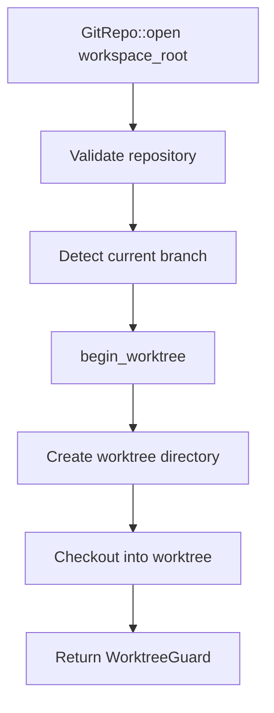
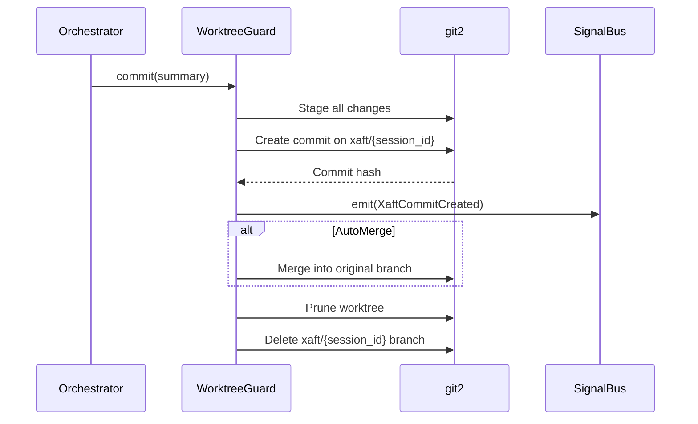

# Git Worktree Isolation

The git worktree isolation system is xaft's primary mechanism for ensuring that agent modifications never directly affect the user's working directory. Every agent session operates within its own git worktree — a lightweight checkout of the repository at a specific commit — and changes are only merged back into the main branch upon successful completion. This isolation is enforced by the `WorktreeGuard` type, which manages the worktree lifecycle and guarantees cleanup even in the face of errors or cancellation.

## Why Worktree Isolation?

Without worktree isolation, an agent modifying files directly in the user's working directory would create several problems. First, partial or incorrect changes would leave the repository in a broken state that the user would have to manually undo. Second, concurrent sessions would conflict with each other, overwriting each other's changes. Third, there would be no atomic commit boundary — some files might be changed while others are still being processed, making it impossible to evaluate the complete diff.

Worktree isolation solves all of these problems by giving each session its own isolated filesystem view. The agent can freely modify files within the worktree without affecting the main working directory or other sessions. When the agent completes successfully, the worktree's changes are committed to a dedicated branch and optionally merged back. When the agent fails or is cancelled, the worktree is simply deleted, leaving no trace.

## GitRepo and WorktreeGuard

### GitRepo::open()

The `GitRepo` type represents the user's main repository. It is opened via `GitRepo::open(path)`, which initializes a `git2::Repository` handle at the specified path. The `GitRepo` provides methods for querying the current branch, commit history, and working directory state. It is the entry point for creating worktrees.



### begin_worktree()

The `begin_worktree()` method creates a new git worktree for the session. The worktree is created at a path derived from the session ID (e.g., `.xaft/worktrees/{session_id}/`), ensuring a unique and predictable location. The worktree is checked out from the current HEAD commit of the branch that was active when the session started, providing a clean starting point for the agent's modifications.

The worktree creation process involves several steps:

1. **Path Construction**: The worktree path is constructed as `{data_dir}/worktrees/{session_id}/`, where `data_dir` comes from `CoreConfig::data_dir`. The directory is created if it doesn't exist.

2. **Branch Creation**: A new branch is created for the worktree, named `xaft/{session_id}`. This branch starts at the same commit as the current HEAD, ensuring that the worktree begins with the same state as the main working directory.

3. **Worktree Checkout**: The git worktree is created using `git2::Repository::worktree()`, which performs a lightweight checkout. Unlike a full clone, a worktree shares the same object database as the main repository, making creation nearly instantaneous regardless of repository size.

4. **Guard Construction**: A `WorktreeGuard` is constructed with the worktree path, branch name, and a reference to the parent repository. The guard takes ownership of the worktree and is responsible for cleaning it up when dropped.

### WorktreeGuard

`WorktreeGuard` is the RAII guard that manages the worktree lifecycle. It implements `Drop` to ensure that the worktree is always cleaned up, even if the session ends unexpectedly (due to a panic, cancellation, or error). The guard provides the following methods:

- **path()**: Returns the filesystem path of the worktree. This is the directory that the agent operates in — all file reads and writes are relative to this path.
- **commit(message)**: Commits the current state of the worktree. This is called automatically when the session completes successfully.
- **restore()**: Restores the worktree to its pre-session state and cleans up the branch. This is called automatically when the session fails or is cancelled.
- **diff()**: Computes the diff between the worktree's current state and the base commit.

## Commit Lifecycle

The commit lifecycle is the sequence of events that occurs when the agent's changes are committed to the repository. It is triggered by the orchestrator when the session transitions to `Completed`.

### Automatic Commit on Success

When a session completes successfully, the orchestrator calls `WorktreeGuard::commit()` with a commit message derived from the session's task description and summary. The commit process:

1. **Stage All Changes**: All modified, added, and deleted files in the worktree are staged for commit. This is equivalent to `git add -A` within the worktree.

2. **Create Commit**: A commit is created on the worktree's branch (`xaft/{session_id}`) with the provided message. The commit includes metadata about the session — the agent name, the model used, and the total token count — in the commit message footer.

3. **Emit Signal**: A `XaftCommitCreated` signal is emitted on the `SignalBus`. This signal carries the commit hash, branch name, and a summary of the changes. The TUI's `EventBridge` converts this to a `TuiEvent::CommitCreated`, which triggers the status bar and file tree to update.

4. **Merge (Optional)**: Depending on the `CommitPolicy`, the worktree branch may be merged back into the original branch. The `CommitPolicy` enum has three variants:
   - `CommitOnly`: Create the commit on the worktree branch but do not merge. The user can manually merge later.
   - `AutoMerge`: Automatically merge the worktree branch into the original branch using a fast-forward or merge commit.
   - `DraftCommit`: Create the commit but mark it as a draft (using a git note), leaving it for human review before merging.



### Cleanup on Error or Cancellation

When a session fails or is cancelled, the worktree must be restored to prevent orphaned worktrees and branches from accumulating. The `WorktreeGuard::restore()` method handles this:

1. **Discard Changes**: All uncommitted changes in the worktree are discarded. This is equivalent to `git checkout .` and `git clean -fd` within the worktree.

2. **Remove Worktree**: The worktree is removed from the repository's worktree list and its filesystem directory is deleted.

3. **Delete Branch**: The `xaft/{session_id}` branch is deleted. If the branch had been committed to (e.g., the agent committed some changes before failing), the commit is orphaned and will eventually be garbage collected by git.

The `Drop` implementation on `WorktreeGuard` calls `restore()` if the guard has not been explicitly committed. This ensures that cleanup always occurs, even if the orchestrator fails to call `restore()` explicitly (e.g., due to a panic). The `Drop` implementation uses a simple state flag — `committed: bool` — to track whether the guard has already been committed. If it has, `Drop` is a no-op. If it hasn't, `Drop` calls `restore()`.

## Worktree Directory Layout

```
.xaft/
└── worktrees/
    ├── {session_id_1}/       # Worktree for session 1
    │   ├── src/
    │   ├── Cargo.toml
    │   └── ...               # Full repository checkout
    ├── {session_id_2}/       # Worktree for session 2
    │   └── ...
    └── ...
```

Each worktree is a complete checkout of the repository at the commit where the session started. The agent reads and writes files within this directory, and all tool operations are scoped to the worktree path. The `.xaft/worktrees/` directory is configured via `CoreConfig::data_dir` and should be added to `.gitignore` to prevent worktree artifacts from being tracked by the main repository.

## Concurrency and Isolation

Multiple sessions can run concurrently, each with its own worktree. Because worktrees share the same underlying git object database, they are space-efficient — only the files that differ between the worktree and the base commit consume additional disk space. However, concurrent sessions that modify the same files will produce merge conflicts when their branches are merged back. The `AutoMerge` commit policy handles this by performing a three-way merge and, if conflicts arise, leaving the merge in a conflicted state for the user to resolve manually.

The worktree isolation model also provides natural sandboxing for tool execution. Tools that modify files (e.g., file write, shell command execution) operate within the worktree directory and cannot escape to modify the main working directory. This is enforced by passing the worktree path as the working directory for all tool subprocess invocations. Shell commands are executed with the worktree as the current directory, and file write operations are restricted to paths within the worktree.
