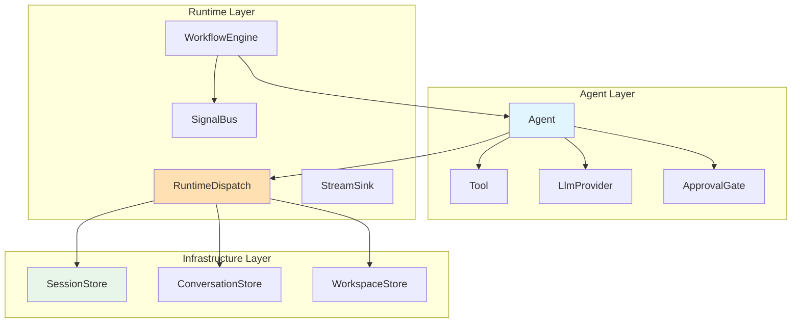

# Trait Hierarchies in xaft

This document describes the core trait hierarchies in xaft, how they compose, where the boundaries are, and why those boundaries exist. Understanding these hierarchies is essential for anyone extending xaft — every new component must implement one or more of these traits, and incorrect trait implementations are the most common source of subtle bugs.

---

## High-Level Trait Map

The xaft trait hierarchy is organized into three layers: the *agent layer* (behavioral abstractions), the *infrastructure layer* (persistence and communication), and the *runtime layer* (orchestration and dispatch). Each layer depends only on the layers below it, never upward. This strict layering prevents circular dependencies and ensures that infrastructure components can be tested in isolation.



---

## The Agent Trait

The `Agent` trait is the central abstraction in xaft. It represents an autonomous entity that can receive messages, reason about them using an LLM, invoke tools, and produce responses. Every agent — from the simplest single-purpose worker to the most complex planner — implements this same trait.

```rust
#[async_trait]
pub trait Agent: Send + Sync {
    /// The agent's unique name within the session.
    fn name(&self) -> &str;

    /// The agent's role definition (system prompt, behavioral flags).
    fn role(&self) -> &Role;

    /// The tools available to this agent.
    fn tools(&self) -> &[Arc<dyn Tool>];

    /// The commit policy for this agent.
    fn commit_policy(&self) -> &CommitPolicy;

    /// Run one turn of the agent: receive a message, think, act, respond.
    /// The runtime calls this method when the agent is the active agent
    /// in the workflow. The agent should continue processing until it
    /// either completes its task, reaches its iteration limit, or
    /// receives a cancellation signal.
    async fn turn(
        &self,
        input: TurnInput,
        cancel: CancellationToken,
    ) -> Result<TurnOutput, AgentError>;

    /// Handle a handoff from another agent. Called when another agent
    /// transfers control to this agent. The `context` parameter contains
    /// a summary of the previous agent's work.
    async fn on_handoff(
        &self,
        from: &str,
        context: HandoffContext,
    ) -> Result<(), AgentError>;
}
```

The `Agent` trait is intentionally minimal. It does not include methods for streaming, cost tracking, or approval handling — those concerns are handled by the infrastructure that wraps the agent. This design follows the single-responsibility principle: the agent is responsible for reasoning and acting; the runtime is responsible for everything else.

The `turn()` method is the main entry point. It receives a `TurnInput` (the user's message or a handoff context), performs reasoning (calling the LLM and invoking tools), and returns a `TurnOutput` (the response, any handoff requests, and accumulated metrics). The method is expected to run to completion (or cancellation) and should not be called concurrently for the same agent — the runtime ensures that only one turn is active at a time.

The `on_handoff()` method is called when another agent transfers control to this agent. It allows the receiving agent to prepare for the incoming task — for example, by loading relevant context or initializing internal state. The default implementation is a no-op, which is appropriate for simple agents that do not need special handoff handling.

---

## The Tool Trait

The `Tool` trait defines the interface for agent actions. Every operation that an agent can perform — reading files, running shell commands, making HTTP requests — is implemented as a tool. This trait is described in detail in the [custom tool tutorial](../examples/02-custom-tool.md), but here we focus on its position in the trait hierarchy.

```rust
#[async_trait]
pub trait Tool: Send + Sync {
    fn name(&self) -> &str;
    fn description(&self) -> &str;
    fn input_schema(&self) -> serde_json::Value;
    fn modifies_workspace(&self) -> bool;
    async fn execute(
        &self,
        input: serde_json::Value,
        cancel: CancellationToken,
    ) -> Result<ToolOutput, ToolError>;
}
```

The `Tool` trait is a leaf in the trait hierarchy — it does not depend on any other xaft trait. This independence is critical because tools are the most frequently extended part of the system. A tool implementer does not need to understand the agent system, the runtime, or the persistence layer; they only need to implement the five methods above.

The boundary between the `Agent` and `Tool` traits is defined by the `execute()` method's signature. The tool receives only JSON input and a cancellation token; it does not receive the agent's conversation history, the workspace state, or any other context. This boundary ensures that tools are stateless and composable — the same tool can be used by any agent without modification. If a tool needs workspace context (like the current directory), that context must be passed explicitly as part of the input JSON.

---

## The LlmProvider Trait

The `LlmProvider` trait abstracts the LLM API. It is the boundary between xaft's agent system and the external LLM services. This trait is described in detail in the [custom provider tutorial](../examples/05-adding-provider.md), but its position in the hierarchy is important for understanding the system's architecture.

```rust
#[async_trait]
pub trait LlmProvider: Send + Sync {
    fn provider_id(&self) -> &str;
    fn supported_models(&self) -> &[ModelId];
    async fn complete(&self, request: ChatRequest) -> Result<ChatResponse, LlmError>;
    async fn stream(&self, request: ChatRequest) -> Result<BoxStream<'static, Result<StreamChunk, LlmError>>, LlmError>;
    async fn count_tokens(&self, messages: &[ChatMessage]) -> Result<Option<TokenCount>, LlmError>;
    async fn health_check(&self) -> Result<(), LlmError>;
}
```

The `LlmProvider` trait is a leaf trait like `Tool`, but it has a different relationship with the `Agent` trait. While the agent calls tools explicitly (by name, with explicit parameters), the agent's use of the LLM provider is mediated by the runtime. The agent does not call `LlmProvider::stream()` directly — instead, it calls `Agent::turn()`, which internally uses the provider. This indirection allows the runtime to inject the `CostedProvider` wrapper, handle API retries, and manage the streaming pipeline without the agent being aware of these concerns.

The `LlmProvider` trait's error type (`LlmError`) is a separate hierarchy from the agent's error type (`AgentError`). The runtime maps `LlmError` to `AgentError` at the boundary: connection failures become `AgentError::LlmUnavailable`, API errors become `AgentError::LlmError`, and parse errors become `AgentError::Internal`. This mapping ensures that the agent always sees a consistent error type regardless of which LLM provider is configured.

---

## The ApprovalGate Trait

The `ApprovalGate` trait defines the interface for human-in-the-loop approval of agent actions. It is the security boundary between autonomous agent behavior and human oversight. The default implementation routes approval requests to the TUI, but custom implementations can integrate with external systems like Slack, PagerDuty, or a custom web dashboard.

```rust
#[async_trait]
pub trait ApprovalGate: Send + Sync {
    /// Request approval for a tool call. Returns the user's decision.
    /// This method blocks until the user responds or the request
    /// times out.
    async fn request_approval(
        &self,
        request: ApprovalRequest,
    ) -> Result<ApprovalDecision, ApprovalError>;

    /// Check whether a specific tool call should be auto-approved
    /// based on the current session's approval policy.
    fn should_auto_approve(&self, tool: &dyn Tool, input: &serde_json::Value) -> bool;
}
```

The `ApprovalGate` sits between the agent and the tool. When the agent invokes a tool that modifies the workspace, the runtime first calls `should_auto_approve()`. If it returns `true`, the tool is executed immediately without user interaction. If it returns `false`, the runtime calls `request_approval()`, which blocks until the user responds. This two-step process allows the approval gate to short-circuit for trusted operations while still requiring explicit approval for untrusted ones.

The `should_auto_approve()` method is pure — it does not modify any state and can be called multiple times without side effects. This is important because the runtime may call it speculatively (for example, to estimate how many approval prompts will be needed for a given task). The default implementation checks the tool's `modifies_workspace()` flag against the agent's `auto_approve_read_only` setting, but custom implementations can use more sophisticated logic (for example, checking the target file path against a whitelist or analyzing the input parameters for suspicious patterns).

---

## The Store Traits

The persistence layer is defined by three store traits: `SessionStore`, `ConversationStore`, and `WorkspaceStore`. These traits follow a common pattern — each defines a key-value interface for storing and retrieving structured data — but they serve different purposes and have different consistency requirements.

### SessionStore

```rust
#[async_trait]
pub trait SessionStore: Send + Sync {
    async fn get(&self, key: &str) -> Result<Option<serde_json::Value>, StoreError>;
    async fn set(&self, key: &str, value: serde_json::Value) -> Result<(), StoreError>;
    async fn delete(&self, key: &str) -> Result<(), StoreError>;
    async fn list_prefix(&self, prefix: &str) -> Result<Vec<(String, serde_json::Value)>, StoreError>;
}
```

The `SessionStore` persists session-level data: the current agent state, the plan progress, the approval history, and the cost accumulator totals. It is keyed by string identifiers and stores JSON values. The `list_prefix()` method supports range queries, which the runtime uses to enumerate all steps in a plan (keyed as `plan/step/0`, `plan/step/1`, etc.) or all approval decisions in a session (keyed as `approval/{tool_name}/{timestamp}`).

### ConversationStore

```rust
#[async_trait]
pub trait ConversationStore: Send + Sync {
    async fn append_message(&self, session_id: &str, message: ChatMessage) -> Result<(), StoreError>;
    async fn get_messages(&self, session_id: &str) -> Result<Vec<ChatMessage>, StoreError>;
    async fn get_recent_messages(&self, session_id: &str, n: usize) -> Result<Vec<ChatMessage>, StoreError>;
    async fn clear(&self, session_id: &str) -> Result<(), StoreError>;
}
```

The `ConversationStore` persists the conversation history between the user and the agents. Unlike `SessionStore`, it is append-only — messages cannot be modified or deleted individually, only cleared entirely. This append-only design ensures that the conversation history is a reliable audit trail. The `get_recent_messages()` method is optimized for the common case where only the last N messages are needed (for context window management), avoiding the cost of loading the entire history.

### WorkspaceStore

```rust
#[async_trait]
pub trait WorkspaceStore: Send + Sync {
    async fn read_file(&self, path: &str) -> Result<String, StoreError>;
    async fn write_file(&self, path: &str, content: &str) -> Result<(), StoreError>;
    async fn list_directory(&self, path: &str) -> Result<Vec<DirEntry>, StoreError>;
    async fn file_exists(&self, path: &str) -> Result<bool, StoreError>;
    async fn commit(&self, message: &str) -> Result<CommitHash, StoreError>;
    async fn diff(&self, from: Option<&str>) -> Result<String, StoreError>;
}
```

The `WorkspaceStore` abstracts the file system and version control operations. The default implementation (`FsWorkspaceStore`) works directly with the local file system and `git`, but the trait allows alternative implementations — for example, an in-memory store for testing or a remote store for cloud-based workspaces. The `commit()` and `diff()` methods integrate with the commit policy system, ensuring that workspace changes are always versioned.

The three store traits share the same error type (`StoreError`), which simplifies error handling across the persistence layer. However, each trait is independent — you can use a SQLite-backed `SessionStore` with an in-memory `ConversationStore` and a file-system `WorkspaceStore` in the same session. This composability is important for testing, where you typically use in-memory implementations for speed, and for production, where you typically use durable implementations for reliability.

---

## The RuntimeDispatch Trait

The `RuntimeDispatch` trait is the integration point between the runtime and external systems. It defines a narrow interface that allows external code to interact with the runtime without depending on its internal implementation. This is the trait you would implement to embed xaft in a web server, a CLI tool, or a custom application.

```rust
#[async_trait]
pub trait RuntimeDispatch: Send + Sync {
    /// Submit a user message to the active agent.
    async fn submit_message(&self, message: String) -> Result<(), RuntimeError>;

    /// Cancel the current agent operation.
    async fn cancel(&self) -> Result<(), RuntimeError>;

    /// Get the current runtime status.
    async fn status(&self) -> Result<RuntimeStatus, RuntimeError>;

    /// Subscribe to the event stream.
    async fn subscribe(&self) -> Result<broadcast::Receiver<StreamEvent>, RuntimeError>;

    /// Shut down the runtime gracefully.
    async fn shutdown(&self) -> Result<(), RuntimeError>;
}
```

The `RuntimeDispatch` trait is deliberately small. It exposes only the operations that an external system needs: submitting messages, cancelling operations, checking status, subscribing to events, and shutting down. All other runtime internals — agent management, tool registration, persistence — are hidden behind this interface. This encapsulation ensures that external systems cannot accidentally corrupt the runtime's state by calling internal methods at the wrong time.

The `subscribe()` method returns a `broadcast::Receiver<StreamEvent>`, which is the same type used by the TUI. This means that any external system that consumes the event stream sees the same events as the TUI, in the same order, with the same delivery guarantees. This consistency is important for debugging — you can compare the TUI's display with an external consumer's log to identify rendering bugs or event delivery issues.

---

## Trait Composition Rules

When composing traits, xaft follows several architectural rules that maintain the system's integrity:

**1. No upward dependencies.** Leaf traits (`Tool`, `LlmProvider`) do not depend on higher-level traits (`Agent`, `RuntimeDispatch`). This ensures that leaf implementations can be tested and reused independently.

**2. Error type isolation.** Each trait has its own error type (`ToolError`, `LlmError`, `AgentError`, `StoreError`, `RuntimeError`). Errors are mapped between types at the boundaries where traits compose. This prevents error type coupling and allows each layer to define its own error semantics.

**3. Async boundary at trait level.** All trait methods that perform I/O are async. This ensures that any implementation can perform asynchronous operations (network calls, file I/O, database queries) without blocking the tokio runtime. Synchronous traits are limited to pure computation (like `Tool::name()` and `Tool::input_schema()`).

**4. No trait state.** Traits do not define mutable state. State is managed by the concrete implementations, which can choose whatever internal representation is appropriate (in-memory, file-backed, database-backed). The trait defines only the interface for accessing and modifying that state.

**5. Arc<dyn Trait> everywhere.** Trait objects are always used behind `Arc<dyn Trait>`, not `Box<dyn Trait>`. This is because xaft uses `tokio::spawn` extensively, which requires `Send + 'static` bounds. `Arc` provides shared ownership without requiring the consumer to own the object exclusively. `Box` would require transferring ownership, which is incompatible with the multi-consumer pattern used throughout the system (e.g., multiple agents sharing the same `ToolRegistry`).

These rules are enforced by convention, not by the compiler. There is no `where` clause or trait bound that prevents you from violating them. This is a deliberate choice — enforcing these rules at the type system level would require complex higher-ranked trait bounds and associated types that would make the trait signatures much harder to read and implement. Instead, the rules are documented, and code review ensures compliance.
