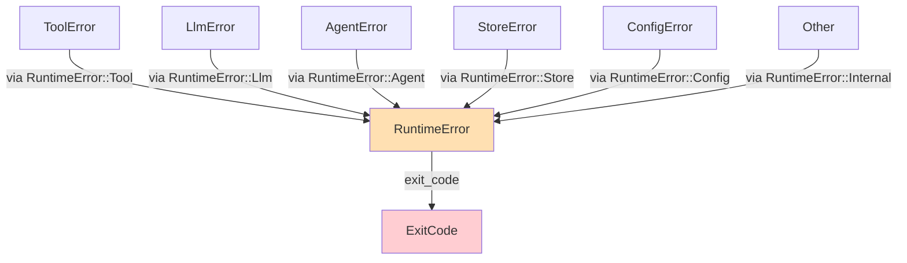
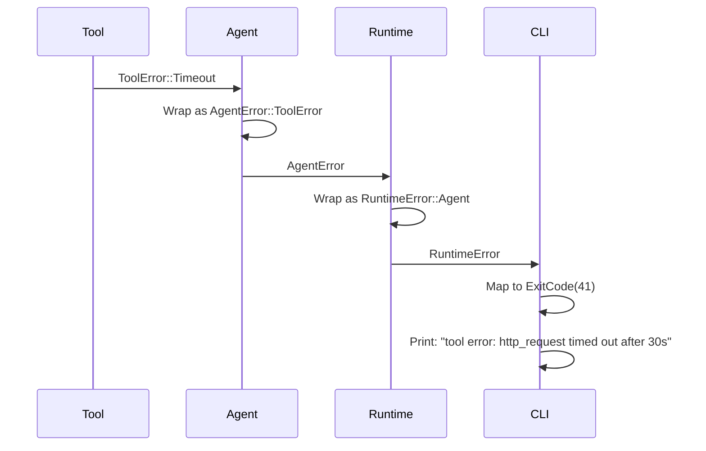

# Error Handling Patterns

This document describes xaft's error handling architecture: the error type hierarchy, propagation patterns, exit code mapping, and the cancellation convention. Error handling in xaft is designed for diagnosability — every error that reaches the user or the logs should contain enough information to identify the root cause without requiring a debugger.

---

## Error Type Hierarchy

xaft uses a layered error type hierarchy where each crate defines its own error enum using `thiserror`, and the `xaft-runtime` crate defines a unified `RuntimeError` that wraps all lower-level errors. This layered approach balances two competing concerns: each crate should have error types that reflect its domain (tools have `ToolError`, providers have `LlmError`), but the runtime needs a single error type for its public API.



### Per-Crate Error Enums

Each crate defines its error enum with `thiserror::Error` derives. This provides `Display` and `Error` implementations automatically, reducing boilerplate and ensuring consistent formatting. Here are the key error enums:

```rust
// xaft-tools
#[derive(Debug, thiserror::Error)]
pub enum ToolError {
    #[error("invalid input for tool {tool}: {message}")]
    InvalidInput { tool: String, message: String },

    #[error("tool {tool} was cancelled")]
    Cancelled { tool: String },

    #[error("permission denied for tool {tool}: {message}")]
    PermissionDenied { tool: String, message: String },

    #[error("tool {tool} timed out after {duration:?}")]
    Timeout { tool: String, duration: std::time::Duration },

    #[error("resource not found: {message}")]
    NotFound { message: String },

    #[error("internal error in tool {tool}: {message}")]
    Internal { tool: String, message: String },
}

// xaft-agent (LlmProvider errors)
#[derive(Debug, thiserror::Error)]
pub enum LlmError {
    #[error("connection to LLM provider failed: {0}")]
    ConnectionFailed(String),

    #[error("LLM API error (status {status}): {body}")]
    ApiError { status: u16, body: String },

    #[error("failed to parse LLM response: {0}")]
    ParseError(String),

    #[error("feature not supported: {0}")]
    UnsupportedFeature(String),

    #[error("LLM request timed out after {0:?}")]
    Timeout(std::time::Duration),

    #[error("rate limited: retry after {retry_after:?}")]
    RateLimited { retry_after: Option<std::time::Duration> },
}

// xaft-agent (Agent errors)
#[derive(Debug, thiserror::Error)]
pub enum AgentError {
    #[error("LLM unavailable: {0}")]
    LlmUnavailable(String),

    #[error("LLM error: {0}")]
    LlmError(#[from] LlmError),

    #[error("tool error in {tool}: {error}")]
    ToolError { tool: String, error: ToolError },

    #[error("iteration limit reached ({iterations})")]
    IterationLimitReached { iterations: usize },

    #[error("handoff failed: {0}")]
    HandoffFailed(String),

    #[error("agent cancelled")]
    Cancelled,

    #[error("internal agent error: {0}")]
    Internal(String),
}

// xaft-session (Store errors)
#[derive(Debug, thiserror::Error)]
pub enum StoreError {
    #[error("key not found: {0}")]
    NotFound(String),

    #[error("serialization error: {0}")]
    Serialization(String),

    #[error("I/O error: {0}")]
    Io(#[from] std::io::Error),

    #[error("database error: {0}")]
    Database(String),

    #[error("concurrent modification conflict: {0}")]
    Conflict(String),
}
```

### The Common Error Type: RuntimeError

The `RuntimeError` enum in `xaft-runtime` is the unified error type that the binary crate and the CLI present to the outside world. It wraps all lower-level errors and maps them to exit codes.

```rust
#[derive(Debug, thiserror::Error)]
pub enum RuntimeError {
    #[error("tool error: {0}")]
    Tool(#[from] ToolError),

    #[error("LLM provider error: {0}")]
    Llm(#[from] LlmError),

    #[error("agent error: {0}")]
    Agent(#[from] AgentError),

    #[error("store error: {0}")]
    Store(#[from] StoreError),

    #[error("configuration error: {0}")]
    Config(#[from] ConfigError),

    #[error("session error: {0}")]
    Session(String),

    #[error("cancelled by user")]
    Cancelled,

    #[error("internal error: {0}")]
    Internal(String),
}
```

The `#[from]` attribute generates `From` implementations automatically, allowing lower-level errors to be converted into `RuntimeError` using the `?` operator. This is the primary error propagation mechanism — if a function returns `Result<T, RuntimeError>`, any error that has a `From` implementation can be propagated with `?`. The generated `From` impls also preserve the original error as the source, so `error.source()` returns the underlying `ToolError`, `LlmError`, etc.

---

## Exit Code Mapping

The `RuntimeError` enum implements the `ExitCode` mapping that the binary crate uses when terminating the process. Each variant maps to a specific exit code, allowing shell scripts and CI systems to distinguish between different failure modes.

```rust
impl RuntimeError {
    pub fn exit_code(&self) -> i32 {
        match self {
            // Success-like exits (user-initiated)
            RuntimeError::Cancelled => 0,

            // Configuration errors (fix your config)
            RuntimeError::Config(_) => 2,

            // LLM errors (check your API key and network)
            RuntimeError::Llm(LlmError::ConnectionFailed(_)) => 10,
            RuntimeError::Llm(LlmError::ApiError { status, .. }) if *status == 401 => 11,
            RuntimeError::Llm(LlmError::ApiError { status, .. }) if *status == 429 => 12,
            RuntimeError::Llm(_) => 13,

            // Agent errors
            RuntimeError::Agent(AgentError::IterationLimitReached { .. }) => 20,
            RuntimeError::Agent(_) => 21,

            // Store errors
            RuntimeError::Store(_) => 30,

            // Tool errors
            RuntimeError::Tool(ToolError::PermissionDenied { .. }) => 40,
            RuntimeError::Tool(ToolError::Cancelled { .. }) => 0,
            RuntimeError::Tool(_) => 41,

            // Internal errors (bugs)
            RuntimeError::Internal(_) => 99,

            // Session errors
            RuntimeError::Session(_) => 50,
        }
    }
}
```

The exit code scheme follows a convention: 0 for success or user-initiated cancellation, 1 for generic errors (not used by xaft — every error has a specific code), 2 for configuration errors, and 10+ for domain-specific errors. The 90+ range is reserved for internal errors that indicate a bug in xaft itself. This scheme allows monitoring systems to categorize failures: a exit code of 12 means the LLM provider is rate-limiting, which suggests the agent is making too many requests; an exit code of 40 means the user denied an approval, which is expected behavior in interactive mode.

---

## Error Propagation Through the Stack

Errors propagate upward through the stack, from leaf components (tools, providers) through the agent, to the runtime, and finally to the binary. At each layer boundary, errors are mapped to the appropriate type for that layer. This mapping is not just a type conversion — it also adds context that makes the error more useful at the higher layer.



The mapping adds context at each level. When a tool returns `ToolError::Timeout`, the agent wraps it in `AgentError::ToolError { tool: "http_request", error: ToolError::Timeout { tool: "http_request", duration: 30s } }`. The redundant `tool` field in `AgentError` might seem like duplication, but it is intentional — the `AgentError` is logged and displayed independently of the inner `ToolError`, and having the tool name at both levels ensures the log message is self-contained.

When the runtime receives an `AgentError`, it maps it to `RuntimeError::Agent(AgentError)`. The `RuntimeError` does not add more context — by this point, the error has accumulated enough information. The runtime's job is to handle the error (log it, clean up resources, report it to the TUI) and propagate it to the CLI, which maps it to an exit code and prints the final error message.

---

## The is_cancelled() Convention

Cancellation in xaft is signaled through `CancellationToken`, but it also needs to be detectable in error types. This is because cancellation can occur at any point in the stack, and the error handling code at each layer needs to distinguish between "the operation failed" and "the operation was cancelled" — the two require different handling.

The convention is that every error enum that can represent cancellation has an `is_cancelled()` method that returns `true` if the error was caused by cancellation:

```rust
impl ToolError {
    pub fn is_cancelled(&self) -> bool {
        matches!(self, ToolError::Cancelled { .. })
    }
}

impl AgentError {
    pub fn is_cancelled(&self) -> bool {
        matches!(self, AgentError::Cancelled)
            || matches!(self, AgentError::ToolError { error, .. } if error.is_cancelled())
    }
}

impl RuntimeError {
    pub fn is_cancelled(&self) -> bool {
        matches!(self, RuntimeError::Cancelled)
            || matches!(self, RuntimeError::Agent(e) if e.is_cancelled())
            || matches!(self, RuntimeError::Tool(e) if e.is_cancelled())
    }
}
```

The `is_cancelled()` convention is used in several places:

1. **Logging.** Cancelled operations are logged at `INFO` level, not `ERROR` level. Cancellation is an expected event (the user pressed Ctrl+C or the runtime is shutting down), not an error condition.

2. **Exit codes.** Cancelled operations return exit code 0, not a non-zero code. This ensures that shell scripts that use `set -e` do not abort when the user cancels an operation.

3. **Retry logic.** The runtime does not retry cancelled operations. Some errors (like `LlmError::RateLimited` or `LlmError::ConnectionFailed`) are retried automatically, but cancelled operations are never retried — the user's intent was to stop, and retrying would violate that intent.

4. **Metric collection.** Cancelled operations are not counted as failures in the success rate metric. They are tracked separately as "cancelled" events, which is a different category from both "success" and "failure".

The `is_cancelled()` method walks the error chain if necessary. For example, `AgentError::ToolError { error: ToolError::Cancelled, .. }` returns `true` from `AgentError::is_cancelled()` because the method checks the inner error. This transitive checking ensures that cancellation is always detected regardless of how many layers the error has passed through.

---

## Error Context and Diagnosability

Every error message in xaft is designed to be self-contained and diagnosable. The message should answer three questions: what went wrong, where it went wrong, and what the user can do about it. This is achieved through consistent use of structured error variants (not just string messages) and through the `thiserror` derive macro's formatting.

Good error messages follow a template:

```
<domain> error in <component>: <specific problem>
```

Examples:
- `tool error in http_request: connection to http://api.example.com timed out after 30s`
- `LLM provider error: API returned status 429 (rate limited), retry after 60s`
- `configuration error: provider 'localai' requires 'base_url' but none was specified`
- `store error: key 'plan/step/3' not found (session may have been reset)`

Each message identifies the domain (tool, LLM, configuration, store), the specific component (http_request, localai, plan/step/3), and the problem (timeout, rate limit, missing config, missing key). Some messages also include a hint about how to fix the problem (retry after 60s, specify base_url, session may have been reset).

Bad error messages are vague and require the user to guess:

- `error: failed` — What failed? Why?
- `tool error` — Which tool? What went wrong?
- `internal error` — Is this a bug? What should I do?

The codebase enforces this convention through code review and through the `thiserror` derive macro, which encourages structured error variants with named fields rather than a single string message.

---

## Error Recovery Patterns

xaft implements several error recovery patterns at different layers of the stack:

### Automatic Retry

The runtime automatically retries certain errors that are likely to be transient:

- `LlmError::ConnectionFailed` — retried up to 3 times with exponential backoff (1s, 2s, 4s)
- `LlmError::RateLimited` — retried after the `retry_after` duration (if provided) or 60s
- `StoreError::Conflict` — retried up to 5 times with a 100ms delay between attempts

Retries are implemented using a `RetryPolicy` struct that encapsulates the maximum number of attempts, the backoff strategy, and the retry condition (a closure that checks whether the error is retryable). The retry logic is in the runtime layer, not in the individual components, which ensures consistent retry behavior across all tools and providers.

### Graceful Degradation

When a non-critical component fails, xaft degrades gracefully rather than crashing. For example, if the cost tracker fails to write to the session store, the cost data is lost for that session, but the agent continues operating. If the TUI's render loop encounters an error, it logs the error and continues rendering — a single rendering error should not crash the entire TUI.

### Panic Catching

The runtime catches panics at task boundaries using `tokio::spawn` and the `JoinError` type. If a task panics, the runtime logs the panic message and backtrace, cancels the associated agent, and reports the error to the user. Panics are never allowed to propagate to the binary level — the runtime always wraps them in a `RuntimeError::Internal` variant with a descriptive message. This is a last resort; the preferred approach is to return errors explicitly rather than panicking.

---

## Summary

xaft's error handling is designed around three principles: diagnosability (every error is self-contained and actionable), layering (each layer has its own error type and maps errors at boundaries), and convention (the `is_cancelled()` method and exit code mapping provide consistent handling across the stack). By following these patterns consistently, xaft ensures that errors are never silent, never ambiguous, and always actionable — whether the consumer is a human reading a terminal, a CI system checking an exit code, or a monitoring system parsing log files.
