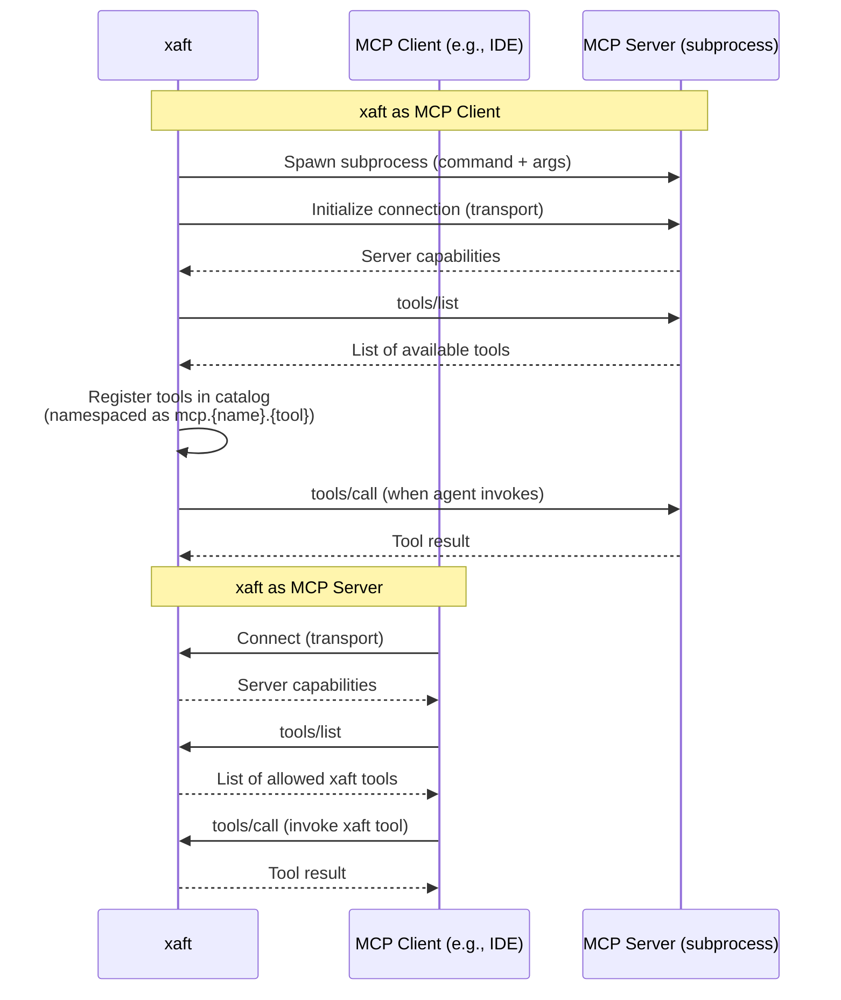

# MCP Configuration and Setup

The Model Context Protocol (MCP) integration allows xaft to extend its capabilities by connecting to external tool servers and by exposing its own tool set to MCP clients. MCP is an open protocol that standardizes how AI agents interact with external tools and data sources, enabling a rich ecosystem of integrations without requiring custom code for each one. The xaft MCP subsystem operates in two modes: as a **client** (connecting to external MCP servers to use their tools) and as a **server** (exposing xaft's tools to external MCP clients).

## MCP Configuration

MCP is configured through the `McpConfig` section of `XaftConfig`, which contains two top-level fields: `server` (for xaft acting as an MCP server) and `client` (for xaft connecting to external MCP servers as a client).

### McpServerConfig (xaft as MCP Server)

When xaft operates as an MCP server, it listens for incoming connections from MCP clients (other AI agents, IDEs, or automation tools) and exposes a subset of its tools for remote invocation.

| Field | Type | Default | Description |
|-------|------|---------|-------------|
| `enabled` | `bool` | `false` | Whether to start the MCP server |
| `transport` | `TransportType` | `Stdio` | Transport mechanism for client connections |
| `port` | `u16` | `3000` | TCP port (when transport is `Tcp`) |
| `socket_path` | `String` | `/tmp/xaft-mcp.sock` | Unix socket path (when transport is `UnixSocket`) |
| `allowed_tools` | `Vec<String>` | `[]` (all tools) | Tools that are exposed to MCP clients |

**Transport Options:**

- **Stdio**: The MCP server communicates over standard input/output. This is the simplest transport and is used when xaft is launched as a subprocess by an MCP client (e.g., an IDE extension). The client spawns the xaft process and communicates via stdin/stdout pipes.
- **Tcp**: The MCP server listens on a TCP port. This is useful for network-based integrations where the MCP client runs on a different machine or in a different process tree. The server binds to `0.0.0.0:{port}` by default, but can be restricted to localhost via the `bind_address` field.
- **UnixSocket**: The MCP server listens on a Unix domain socket. This is the preferred transport for local integrations, as it provides lower latency than TCP and better security (the socket file can be protected by filesystem permissions).

### McpClientConfig (xaft as MCP Client)

When xaft operates as an MCP client, it connects to one or more external MCP servers and registers their tools in the agent's tool catalog. Each MCP server is configured independently:

| Field | Type | Default | Description |
|-------|------|---------|-------------|
| `name` | `String` | Required | Human-readable name for the server |
| `command` | `String` | Required | Command to start the MCP server process |
| `args` | `Vec<String>` | `[]` | Arguments passed to the command |
| `env` | `HashMap<String, String>` | `{}` | Environment variables for the server process |
| `transport` | `TransportType` | `Stdio` | Transport mechanism for communicating with the server |

The `command` field specifies the executable to start the MCP server. For example, to connect to the `mcp-server-filesystem` server (which provides file system tools), the configuration would be:

```toml
[[mcp.client]]
name = "filesystem"
command = "npx"
args = ["-y", "@modelcontextprotocol/server-filesystem", "/path/to/project"]
transport = "Stdio"
```

When xaft starts, it spawns each configured MCP server as a subprocess and establishes a connection using the specified transport. The server's tools are discovered through the MCP protocol's `tools/list` method and registered in the agent's tool catalog with a namespaced identifier (e.g., `mcp.filesystem.read_file`). The agent can then invoke these tools just like built-in tools, and the invocations are forwarded to the MCP server over the established connection.

## MCP Server Lifecycle



## Connection Management

### Server Process Spawning

When xaft starts as an MCP client, it spawns each configured MCP server as a child process. The spawning process:

1. **Construct the command**: The `command` and `args` fields are combined into a `std::process::Command`.
2. **Set environment**: The `env` field's key-value pairs are added to the child process's environment, along with xaft's own environment variables.
3. **Set working directory**: The child process's working directory is set to the project's workspace root.
4. **Establish transport**: For `Stdio` transport, the child's stdin/stdout are piped. For `Tcp` and `UnixSocket` transport, the child is expected to listen on the configured endpoint.
5. **Initialize**: The MCP initialization handshake is performed, exchanging capabilities and protocol version information.

### Health Monitoring

Each MCP server connection is monitored by a health check task that runs every 30 seconds. The health check sends a `ping` request to the server and waits for a response. If the server does not respond within 10 seconds, the connection is considered unhealthy. After three consecutive failed health checks, the server is restarted: the old process is killed, a new process is spawned, and the tool catalog is refreshed. This automatic recovery mechanism ensures that transient server failures do not permanently disable the agent's access to MCP tools.

### Graceful Shutdown

When xaft shuts down, it sends a `shutdown` notification to each connected MCP server and waits up to 5 seconds for the server to close its connection. If the server does not close within the timeout, xaft kills the server process. The `Drop` implementation for the MCP client connection handles this cleanup, ensuring that no orphaned server processes are left running after xaft exits.

## Tool Registration and Namespacing

MCP tools are registered in the agent's tool catalog with a namespaced identifier to avoid conflicts with built-in tools and with tools from other MCP servers. The naming convention is:

```
mcp.{server_name}.{tool_name}
```

For example, a tool named `read_file` on a server named `filesystem` would be registered as `mcp.filesystem.read_file`. This name is what the agent uses when invoking the tool, and it is displayed in the TUI's agent activity panel.

The tool's schema (parameters, return type, description) is obtained from the MCP server's `tools/list` response and stored in the tool catalog. When the agent invokes an MCP tool, xaft:

1. Looks up the tool by its namespaced identifier.
2. Validates the agent's parameters against the tool's schema.
3. Forwards the invocation to the MCP server via `tools/call`.
4. Receives the result and returns it to the agent.

MCP tools are subject to the same approval gate and guardrail checks as built-in tools. The guardrail system treats `mcp.*` tools with the same rules as built-in tools of equivalent risk level. For example, an MCP tool that modifies files would be subject to the same file destruction guardrails as the built-in file write tool, and an MCP tool that executes shell commands would be subject to the same command approval rules.

## Security Considerations

Running external MCP servers introduces security risks that users should be aware of:

- **Process Execution**: Each MCP server is a subprocess running with the same user permissions as xaft. A malicious or compromised server could perform arbitrary actions on the user's system. Users should only configure MCP servers from trusted sources.
- **Network Access**: MCP servers that use TCP transport expose a listening port, which could be accessed by other processes on the same machine (or network, if bound to `0.0.0.0`). The `UnixSocket` transport is preferred for local integrations because it uses filesystem permissions for access control.
- **Data Exposure**: MCP tools have access to the data they are given as parameters. If an agent passes sensitive data (file contents, API keys) to an MCP tool, that data is sent to the server process. Users should review the tools exposed by each MCP server and configure guardrails to prevent sensitive data from being forwarded.
- **Tool Approval**: MCP tools are not automatically approved. They follow the same approval gate flow as built-in tools, and users are prompted to approve or deny each invocation. The `allowed_tools` and `denied_tools` lists in `AgentPreset` can be used to whitelist or blacklist specific MCP tools at the agent level.

The `PluginSecurityConfig` in `XaftConfig` provides additional security controls for MCP servers, including `sandbox` (whether to run servers in a sandboxed environment), `max_memory_mb` (memory limits), `network_access` (whether servers can make outbound network connections), and `filesystem_access` (restricting server file access to the worktree only). These controls are enforced by the MCP client connection manager when spawning server processes.
