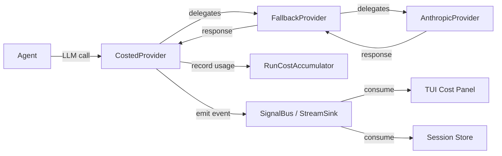

# Cost Tracking

This document describes xaft's cost tracking system: how token usage and monetary costs are accumulated during agent execution, the types and events involved, how cost data flows through the provider chain, and how costs are persisted to the session store for post-hoc analysis. Cost transparency is a critical requirement for any production agent runtime — users must be able to see how much each task costs, identify expensive operations, and set budgets to prevent runaway spending.

---

## Overview

Cost tracking in xaft is implemented as a cross-cutting concern that intercepts LLM provider calls and records token usage and monetary cost. The tracking is performed by the `CostedProvider` wrapper, which sits between the agent and the concrete LLM provider. Every LLM call — whether to `complete()` or `stream()` — passes through the `CostedProvider`, which records the usage and publishes a `ModelCallComplete` event on the stream sink.

The cost tracking system has three components:

1. **`CostedProvider`** — The provider wrapper that intercepts calls and records usage.
2. **`RunCostAccumulator`** — The accumulator that aggregates costs across all calls in a session.
3. **`ModelCallComplete` event** — The event that carries cost data from the provider to consumers (the TUI, the session store, external monitoring).



The cost tracking system is always active — there is no configuration option to disable it. This is a deliberate design choice: cost data is essential for debugging (identifying which LLM calls are expensive), for compliance (recording spending for accounting), and for safety (detecting runaway agents that are consuming tokens faster than expected). Disabling cost tracking would create a blind spot that could lead to unexpected bills.

---

## RunCostAccumulator

The `RunCostAccumulator` is the central data structure for tracking costs within a session. It maintains running totals of input tokens, output tokens, and monetary cost, broken down by model. The accumulator is shared across all agents in a session via `Arc`, allowing multiple agents to contribute to the same cost totals.

```rust
use std::collections::HashMap;
use std::sync::Arc;
use tokio::sync::Mutex;

pub struct RunCostAccumulator {
    inner: Arc<Mutex<CostAccumulatorInner>>,
}

struct CostAccumulatorInner {
    total_input_tokens: u64,
    total_output_tokens: u64,
    total_cost_usd: f64,
    by_model: HashMap<String, ModelCost>,
    call_count: usize,
}

#[derive(Debug, Clone, Serialize)]
pub struct ModelCost {
    pub input_tokens: u64,
    pub output_tokens: u64,
    pub cost_usd: f64,
    pub call_count: usize,
}

#[derive(Debug, Clone, Serialize)]
pub struct CostSnapshot {
    pub total_input_tokens: u64,
    pub total_output_tokens: u64,
    pub total_cost_usd: f64,
    pub by_model: HashMap<String, ModelCost>,
    pub call_count: usize,
}
```

The accumulator uses `tokio::sync::Mutex` for internal synchronization because the `record()` method is called from the `CostedProvider`, which runs on the orchestrator's task. The mutex is held only for the brief duration of the update operation — a few arithmetic operations and a hash map lookup — so contention is minimal even under heavy load. For read access, the `snapshot()` method returns a clone of the current state, which does not block concurrent writes.

### Recording a Call

```rust
impl RunCostAccumulator {
    pub async fn record(
        &self,
        model: &str,
        input_tokens: u64,
        output_tokens: u64,
        cost_usd: f64,
    ) {
        let mut inner = self.inner.lock().await;
        inner.total_input_tokens += input_tokens;
        inner.total_output_tokens += output_tokens;
        inner.total_cost_usd += cost_usd;
        inner.call_count += 1;

        inner.by_model
            .entry(model.to_string())
            .or_insert_with(ModelCost::default)
            .record(input_tokens, output_tokens, cost_usd);
    }

    pub async fn snapshot(&self) -> CostSnapshot {
        let inner = self.inner.lock().await;
        CostSnapshot {
            total_input_tokens: inner.total_input_tokens,
            total_output_tokens: inner.total_output_tokens,
            total_cost_usd: inner.total_cost_usd,
            by_model: inner.by_model.clone(),
            call_count: inner.call_count,
        }
    }
}
```

The `record()` method is called by the `CostedProvider` after each LLM call completes. It updates both the session-level totals and the per-model breakdown. The per-model breakdown is important because different models have different pricing — a session that uses `claude-sonnet-4-20250514` for planning and `gpt-4o` for coding needs to show the cost breakdown by model so the user can identify which model is driving the spending.

The `snapshot()` method is called by the TUI (to update the cost panel) and by the session store (to persist the cost data). It returns a clone of the accumulator's state, not a reference, because the caller needs to own the data independently of the accumulator's lock. Cloning the `HashMap` is inexpensive because it typically contains only 1-3 entries (one per model used in the session).

---

## ModelCallComplete Event

The `ModelCallComplete` event is emitted by the `CostedProvider` after each LLM call completes. It carries the call's metadata: the model name, token counts, monetary cost, and latency. This event is consumed by the TUI (to update the real-time cost display), the session store (to persist the call record), and any external monitoring systems that subscribe to the signal bus.

```rust
#[derive(Debug, Clone, Serialize)]
pub struct ModelCallComplete {
    pub model: String,
    pub input_tokens: u64,
    pub output_tokens: u64,
    pub cost_usd: f64,
    pub latency: std::time::Duration,
    pub agent_name: String,
    pub call_index: usize,
    pub session_id: String,
}
```

The `latency` field measures the wall-clock time from the start of the LLM call to the completion of the response. For streaming calls, the latency includes the time to receive the first token and all subsequent tokens until the stream completes. This is the most useful latency metric for user experience analysis — it tells you how long the user waited for the complete response.

The `call_index` field correlates the `ModelCallComplete` event with the `XaftLlmCallStarting` signal that was emitted before the call. By matching on `call_index`, consumers can compute the full call lifecycle: start time, end time, duration, token count, and cost. This correlation is used by the TUI to display a real-time "call in progress" indicator and by the cost tracker to verify that every starting event has a corresponding completion event.

---

## CostedProvider

The `CostedProvider` is the decorator that wraps any `LlmProvider` and adds cost tracking. It implements the `LlmProvider` trait by delegating all calls to the inner provider and then recording the usage after the call completes. The `CostedProvider` is always the outermost layer in the provider chain, ensuring that all LLM calls — even those that go through the `FallbackProvider` — are tracked.

### Tracking Complete Calls

For the `complete()` method, cost tracking is straightforward. The `CostedProvider` delegates to the inner provider, records the token counts from the response, computes the cost using the model's pricing, and publishes the `ModelCallComplete` event:

```rust
#[async_trait]
impl LlmProvider for CostedProvider {
    async fn complete(&self, request: ChatRequest) -> Result<ChatResponse, LlmError> {
        let start = std::time::Instant::now();

        // Delegate to the inner provider
        let response = self.inner.complete(request).await?;

        // Record the usage
        let latency = start.elapsed();
        if let Some(usage) = response.usage() {
            let cost = self.pricing.compute_cost(usage.input, usage.output);

            self.accumulator.record(
                &self.pricing.model,
                usage.input,
                usage.output,
                cost,
            ).await;

            // Publish the event
            self.stream_sink.send(StreamEvent::ModelCallComplete {
                model: self.pricing.model.clone(),
                input_tokens: usage.input,
                output_tokens: usage.output,
                cost_usd: cost,
                duration: latency,
            }).await;
        }

        Ok(response)
    }
}
```

### Tracking Streaming Calls

For the `stream()` method, cost tracking is more complex because the token counts are not known until the stream completes. The `CostedProvider` wraps the inner stream in a `CostedStream` adapter that counts tokens as they arrive and publishes the `ModelCallComplete` event when the stream terminates:

```rust
async fn stream(
    &self,
    request: ChatRequest,
) -> Result<BoxStream<'static, Result<StreamChunk, LlmError>>, LlmError> {
    let start = std::time::Instant::now();
    let inner_stream = self.inner.stream(request).await?;

    let pricing = self.pricing.clone();
    let accumulator = self.accumulator.clone();
    let sink = self.stream_sink.clone();

    // Wrap the stream with a cost-tracking adapter
    let costed_stream = inner_stream.inspect(move |chunk_result| {
        if let Ok(StreamChunk::Done) = chunk_result {
            // Stream completed — publish the cost event
            let latency = start.elapsed();
            // Note: Token counting for streaming is approximate.
            // Some providers include usage in the final chunk.
            let _ = sink.send(StreamEvent::ModelCallComplete {
                model: pricing.model.clone(),
                input_tokens: 0, // Updated from final chunk if available
                output_tokens: 0,
                cost_usd: 0.0,
                duration: latency,
            });
        }
    });

    Ok(costed_stream.boxed())
}
```

Streaming cost tracking has an inherent limitation: token counts are not available until the stream completes, and some providers (notably OpenAI's streaming API) do not include usage data in streaming responses. When usage data is not available from the stream, the `CostedProvider` estimates the token count from the accumulated text length using a rough heuristic (approximately 4 characters per token for English text). This estimate is less accurate than the provider's official count, but it provides a reasonable approximation for real-time cost display. The accurate count is available after the stream completes, when the provider's final chunk includes the usage metadata.

---

## ModelPricing

The `ModelPricing` struct maps model names to their per-token costs. It is constructed from the configuration file and is used by the `CostedProvider` to compute the monetary cost of each call.

```rust
#[derive(Debug, Clone)]
pub struct ModelPricing {
    pub model: String,
    pub cost_per_1k_input: f64,
    pub cost_per_1k_output: f64,
}

impl ModelPricing {
    pub fn new(model: impl Into<String>, cost_per_1k_input: f64, cost_per_1k_output: f64) -> Self {
        Self {
            model: model.into(),
            cost_per_1k_input,
            cost_per_1k_output,
        }
    }

    pub fn compute_cost(&self, input_tokens: u64, output_tokens: u64) -> f64 {
        (input_tokens as f64 / 1000.0) * self.cost_per_1k_input
            + (output_tokens as f64 / 1000.0) * self.cost_per_1k_output
    }
}
```

Pricing data is specified in the configuration file under the `[providers.<name>.models.<model>]` section:

```toml
[providers.anthropic.models.claude-sonnet-4-20250514]
cost_per_1k_input = 0.003
cost_per_1k_output = 0.015

[providers.openai.models.gpt-4o]
cost_per_1k_input = 0.0025
cost_per_1k_output = 0.01
```

For local models (like those provided by the `LocalAiProvider`), the cost is typically zero:

```toml
[providers.localai.models.local-llama-3-70b]
cost_per_1k_input = 0.0
cost_per_1k_output = 0.0
```

Even when the cost is zero, the `CostedProvider` still tracks token counts and publishes `ModelCallComplete` events. This is important for monitoring resource usage — even free models have compute costs that may need to be tracked for capacity planning.

---

## Session Cost Persistence

Cost data is persisted to the session store at two points: after each LLM call (via the `ModelCallComplete` event listener) and at the end of the session (via the `XaftAgentOutput` signal listener). This dual persistence ensures that cost data is available even if the session is interrupted.

### Per-Call Persistence

The session store subscribes to `ModelCallComplete` events and writes each call's metadata to the `tool_calls` table (with the `tool_name` set to `llm_call`). This creates a detailed audit trail of every LLM call, including the model, token counts, cost, latency, and the agent that made the call.

```sql
INSERT INTO tool_calls (session_id, tool_name, arguments, result, duration_ms)
VALUES (?, 'llm_call', ?, ?, ?);
```

The `arguments` column contains the request metadata (model, message count, tool count), and the `result` column contains the response metadata (token counts, cost, finish reason). This data can be queried to analyze spending patterns:

```sql
-- Total cost by model for a session
SELECT
    json_extract(result, '$.model') as model,
    SUM(json_extract(result, '$.cost_usd')) as total_cost,
    COUNT(*) as call_count
FROM tool_calls
WHERE session_id = ? AND tool_name = 'llm_call'
GROUP BY model;
```

### Session-End Persistence

When the agent completes its task, the `XaftAgentOutput` signal includes a `CostSnapshot` that summarizes the session's total costs. The session store writes this snapshot to the `session_data` table under the key `costs/summary`, providing a fast-access summary that does not require aggregating per-call records.

```rust
// In the session store's event listener
async fn on_agent_output(&self, output: &XaftAgentOutput) {
    let snapshot = output.cost_snapshot();
    self.store.set(
        &format!("{}/costs/summary", output.session_id()),
        serde_json::to_value(snapshot).unwrap(),
    ).await.unwrap();
}
```

### CLI Access to Cost Data

The `xaft sessions costs <id>` CLI command reads the cost data from the session store and displays a formatted summary:

```
$ xaft sessions costs abc-123

Session: abc-123
Duration: 4m 23s
Total cost: $0.0847

By model:
  claude-sonnet-4-20250514  12 calls  45,230 input  8,420 output  $0.0708
  gpt-4o                    3 calls   12,100 input  2,800 output  $0.0139

By agent:
  coder      10 calls  $0.0621
  reviewer    3 calls  $0.0158
  planner     2 calls  $0.0068
```

This breakdown helps users understand which models and agents are driving their costs, enabling informed decisions about model selection and agent configuration. The per-agent breakdown is computed from the `agent_name` field in the `ModelCallComplete` events, which is set by the `CostedProvider` based on the active agent at the time of the call.

---

## Budget Enforcement

The `CostedProvider` supports an optional budget that limits the total cost of a session. When the budget is exceeded, the `CostedProvider` returns a `LlmError::BudgetExceeded` error, which the agent maps to `AgentError::LlmError`. The runtime handles this error by terminating the agent and reporting the budget violation to the user.

```rust
impl CostedProvider {
    async fn check_budget(&self, additional_cost: f64) -> Result<(), LlmError> {
        if let Some(budget) = self.budget {
            let snapshot = self.accumulator.snapshot().await;
            if snapshot.total_cost_usd + additional_cost > budget {
                return Err(LlmError::BudgetExceeded {
                    current: snapshot.total_cost_usd,
                    budget,
                    attempted: additional_cost,
                });
            }
        }
        Ok(())
    }
}
```

The budget check is performed before each LLM call. The `CostedProvider` estimates the cost of the upcoming call based on the input token count (which is known before the call) and the model's input pricing. This pre-call check prevents the call from being made if it would exceed the budget. However, it is not a hard guarantee — the actual cost of the call may exceed the estimate because output tokens are not known in advance. The budget is enforced as a best-effort safeguard, not as a precise accounting mechanism.

The budget is configured in the session configuration:

```toml
[session]
max_cost_usd = 5.0  # Maximum total cost per session
```

When `max_cost_usd` is set, the runtime constructs the `CostedProvider` with the budget value. If no budget is configured, there is no cost limit. This is appropriate for trusted environments (internal tools, personal projects) where the user monitors costs manually through the TUI.
