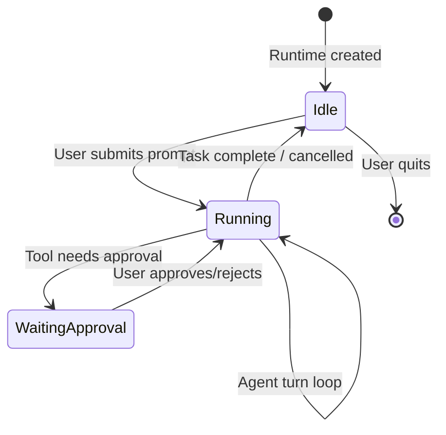
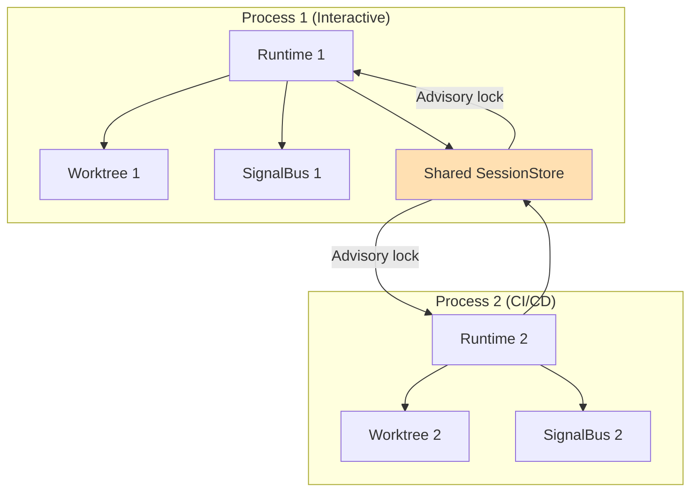

# Concurrency Model

This document describes xaft's concurrency model: how tasks are structured, when concurrency is used versus sequential execution, how sessions are isolated, and how the approval system interacts with the concurrency model. Understanding this model is essential for anyone contributing to the runtime, debugging performance issues, or building integrations that interact with the agent pipeline.

---

## Single Runtime Per TUI

The xaft TUI runs exactly one `XaftRuntime` instance per process. There is no support for running multiple runtimes simultaneously within the same TUI session — when the user starts a task, the runtime is created, the task is executed, and the runtime is destroyed. This single-runtime constraint simplifies the concurrency model enormously: there is no need for cross-runtime coordination, no shared resource pools, and no concern about one runtime's agents interfering with another's.

The single-runtime constraint is enforced at the API level. The `TuiApp::run()` method takes ownership of the `XaftRuntime`, preventing the caller from creating a second runtime while the first is running. If the user wants to run a second task, they must wait for the first to complete (or cancel it) and then start a new task, which creates a new runtime.

This design decision was made deliberately. Multi-runtime support would require a resource manager that allocates LLM API quota, git worktrees, and session storage across concurrent runtimes. The complexity of such a manager is not justified for the current use case — most users run one task at a time, and the rare case of wanting parallel tasks is better served by running multiple xaft processes (each in its own terminal), which provides natural isolation through operating system process boundaries.

The single-runtime model also simplifies the TUI's rendering logic. The TUI renders events from a single `StreamEvent` channel, which is connected to a single runtime. If there were multiple runtimes, the TUI would need to multiplex events from multiple channels, which would complicate the rendering code and potentially confuse the user with interleaved output from different agents.

---

## Sequential Tasks Within a Runtime

Within a single runtime, tasks execute sequentially. The runtime processes one task at a time: it receives the user's prompt, constructs the agent pipeline, runs it to completion (or cancellation), and then returns to the idle state, waiting for the next prompt. There is no task queue and no background task processing.

The sequential execution model is a consequence of the git worktree architecture. Each task creates a new git worktree (or reuses the main working tree, depending on configuration), and the worktree is exclusive to the task. Running multiple tasks concurrently would require multiple worktrees, which adds complexity and disk space usage without a clear benefit for interactive use.



The sequential model also ensures that the user's mental model is simple: one task is running at a time, and the TUI shows the progress of that task. If a task is taking too long, the user can cancel it and start a new one. There is no need to manage a task queue or switch between concurrent tasks.

However, the sequential model does not mean that the runtime is single-threaded. Within a single task, multiple concurrent operations may be in flight: the LLM provider is streaming tokens, the tool executor is running a shell command, and the signal bus is dispatching events. These concurrent operations are managed by tokio's multi-threaded runtime and coordinated through the `tokio::select!` event loop.

---

## Concurrent Sessions Across Processes

While a single xaft process runs one task at a time, multiple xaft processes can run concurrently against the same project. This is a supported use case: a developer might run one xaft process in their terminal for an interactive coding task while a CI pipeline runs another xaft process in headless mode for automated testing.

Concurrent sessions are isolated through three mechanisms:

1. **Git worktrees**: Each session creates its own git worktree, which provides an independent copy of the repository's files. Changes made in one worktree do not affect other worktrees, and each worktree can be committed independently.

2. **Session store locking**: The `FsSessionStore` uses advisory file locking to prevent concurrent processes from writing to the same session record. If two processes try to write to the same session simultaneously, one will block until the other completes. This prevents data corruption but does not prevent concurrent access to different sessions.

3. **Signal bus isolation**: Each process has its own `SignalBus` instance. There is no cross-process signal delivery — events emitted in one process are not visible in other processes. This is by design: cross-process signal delivery would require a networking layer (like a message broker) that adds complexity without sufficient benefit for the current use case.



The session store is the only shared resource between concurrent processes. The advisory locking ensures that session records are written atomically, but it does not provide transaction isolation — one process may read a partially-written session record if another process is in the middle of an update. This is acceptable because session records are informational, not transactional. The worst case is that a session's status is briefly inconsistent (e.g., showing "Running" when the process has already terminated), which is corrected on the next write.

---

## Approval Blocking

The approval system is the primary point where the runtime blocks and waits for user input. When a tool call requires approval, the agent's execution is paused, and the runtime waits for the user's decision. This blocking is implemented using a `tokio::sync::oneshot` channel: the runtime creates the channel, sends the sender half to the TUI via the `ApprovalRequest` event, and awaits the receiver half.

The approval blocking has a significant impact on the concurrency model. While the runtime is waiting for an approval decision, the agent's turn loop is suspended. No LLM calls are made, no tools are executed, and no tokens are streamed. The TUI continues to render (it processes its own event loop independently), but the agent's execution is completely paused.

This pause-and-wait pattern is necessary because the agent cannot proceed without the user's decision. The tool call might be destructive (writing a file, executing a shell command), and proceeding without approval would violate the safety contract. The blocking is cooperative — the `tokio::select!` loop continues to process cancellation tokens and other control signals while waiting for the approval response.

```rust
// The approval wait is integrated into the event loop
tokio::select! {
    biased;

    // Cancellation always takes priority
    _ = cancel_token.cancelled() => {
        tracing::info!("Cancelled while waiting for approval");
        return Err(AgentError::Cancelled);
    }

    // Approval response from the TUI
    decision = approval_rx.recv() => {
        match decision {
            Ok(ApprovalDecision::Approve) => {
                // Proceed with the tool call
                let result = tool.execute(input, cancel_token.clone()).await?;
                // ...
            }
            Ok(ApprovalDecision::Reject) => {
                // Report the rejection to the agent
                tracing::info!("Approval rejected by user");
                // ...
            }
            Ok(ApprovalDecision::ApproveAll) => {
                // Approve this and all future calls from this tool
                self.approval_gate.approve_all(&tool_name);
                // ...
            }
            Err(_) => {
                // Channel closed (TUI crashed), treat as rejection
                tracing::warn!("Approval channel closed, rejecting");
                // ...
            }
        }
    }

    // Timeout — prevent indefinite waits
    _ = tokio::time::sleep(Duration::from_secs(120)) => {
        tracing::warn!("Approval request timed out after 120s");
        // Treat as rejection
    }
}
```

The 120-second approval timeout is a safety mechanism that prevents the runtime from waiting indefinitely if the TUI is unresponsive or the user has walked away. When the timeout expires, the approval is treated as a rejection, and the agent receives an error observation explaining that the approval timed out. The agent can then decide whether to try a different approach, ask the user again, or give up.

---

## Task-Level Concurrency Summary

The following table summarizes the concurrency behavior at each level of the system:

| Level | Concurrency | Coordination | Blocking |
|-------|------------|-------------|----------|
| TUI process | Single runtime | No coordination needed | N/A |
| Runtime | Sequential tasks | Single event loop | Approval, cancellation |
| Agent turn | Sequential LLM calls | Turn loop iteration | LLM response, tool execution |
| Tool execution | Concurrent (within a turn) | `tokio::spawn` | I/O operations |
| Streaming | Concurrent with turn | Broadcast channel | Channel capacity |
| Signal bus | Concurrent dispatch | `tokio::spawn` per subscriber | None (fire-and-forget) |
| Session store | Sequential writes | Advisory file locking | Lock acquisition |
| Cross-process | Concurrent sessions | Git worktrees, file locking | Session record locks |

The key insight is that concurrency is used selectively where it improves performance (tool execution, streaming, signal dispatch) but is avoided where it would add complexity without clear benefit (task scheduling, agent turn loop). This pragmatic approach keeps the runtime simple and predictable while still taking advantage of tokio's async runtime for I/O-bound operations.

---

## Thread Safety Guarantees

xaft's thread safety guarantees follow from its concurrency model:

1. **Agents are accessed from a single task**: The orchestrator's event loop is the only task that calls `agent.turn()`. There is no need for the agent to be thread-safe internally — it can use non-atomic fields and non-mutex-protected state without risk of data races.

2. **Tools are accessed from the orchestrator's task**: Tool execution happens on the orchestrator's task (or a spawned blocking task for CPU-intensive tools). Tools do not need to be thread-safe because they are never called concurrently for the same tool instance.

3. **The signal bus is thread-safe**: The signal bus is accessed from multiple tasks (the orchestrator, the TUI, the cost tracker). It uses internal synchronization (`tokio::sync::broadcast`) to ensure safe concurrent access.

4. **The session store is thread-safe**: The session store is accessed from the event loop and from background tasks. It uses internal synchronization (SQL transactions and advisory locks) to ensure safe concurrent access.

5. **The cost accumulator is thread-safe**: The cost accumulator is accessed from the `CostedProvider` (on the orchestrator's task) and from the TUI (on the render task). It uses `tokio::sync::Mutex` for safe concurrent access.

These guarantees are maintained by convention, not by the compiler. The codebase follows a rule of thumb: if a type is shared across tasks via `Arc`, it must be thread-safe (using `Mutex`, `AtomicUsize`, or `broadcast` channels internally). If a type is owned by a single task, it does not need to be thread-safe. This rule is simple enough to verify in code review and covers all the concurrency patterns used in xaft.
