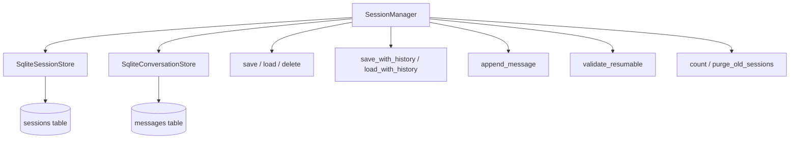

# Session Persistence

The xaft session persistence system ensures that session state survives process restarts, crashes, and intentional suspension. It is built on SQLite for reliability and performance, providing atomic transactions for session creation, update, and deletion. The `SessionManager` orchestrates both session metadata and conversation history through dedicated store implementations, offering a unified API for the runtime to persist and recover session state.

## SessionManager

The `SessionManager` is the primary interface for session persistence. It composes two stores:

- **SessionStore**: Manages session metadata (status, cost, tokens, agent configuration)
- **ConversationStore**: Manages conversation messages (user inputs, agent outputs, tool results)

The `SessionManager` provides high-level operations that coordinate between these two stores, ensuring that session metadata and conversation history are always consistent. For example, when a session is saved with `save_with_history()`, both the session metadata and the conversation messages are persisted in a single logical operation, preventing the scenario where metadata is saved but messages are lost (or vice versa).



## SessionWithHistory

The `SessionWithHistory` struct bundles a session with its conversation messages and the key used to look them up. It is the primary return type for operations that need both session metadata and conversation data:

```rust
pub struct SessionWithHistory {
    pub session: Session,
    pub messages: Vec<Message>,
    pub conversation_key: String,
}
```

- **session**: The session metadata, including status, cost, tokens, and agent configuration.
- **messages**: The ordered list of conversation messages associated with this session.
- **conversation_key**: The key used to look up the conversation in the conversation store. This key follows the convention described in [Conversations](02-conversations.md).

## SQLite Schema

### sessions Table

The `sessions` table stores session metadata. Each row represents a single session:

| Column | Type | Description |
|--------|------|-------------|
| `id` | `TEXT PRIMARY KEY` | Unique session identifier (UUID v4) |
| `created_at` | `TEXT` | ISO 8601 timestamp of session creation |
| `updated_at` | `TEXT` | ISO 8601 timestamp of last update |
| `task` | `TEXT` | The user's original task description |
| `workspace_root` | `TEXT` | Absolute path to the project directory |
| `git_branch` | `TEXT` | Git branch name for the session's worktree |
| `total_cost_usd` | `REAL` | Cumulative LLM API cost in USD |
| `total_tokens` | `INTEGER` | Cumulative token count (input + output) |
| `turn_count` | `INTEGER` | Number of agent-tool interaction turns |
| `status_json` | `TEXT` | JSON-serialized `SessionStatus` with attached data |
| `agent_preset` | `TEXT` | Name of the agent preset used for this session |
| `model` | `TEXT` | Resolved model identifier |

### messages Table

The `messages` table stores conversation messages. Each row represents a single message in a conversation:

| Column | Type | Description |
|--------|------|-------------|
| `id` | `INTEGER PRIMARY KEY AUTOINCREMENT` | Auto-incrementing message ID |
| `conversation_key` | `TEXT` | Foreign key to the conversation (not the session ID directly) |
| `role` | `TEXT` | Message role: "user", "assistant", "system", "tool" |
| `content` | `TEXT` | Message content (text or JSON for tool results) |
| `timestamp` | `TEXT` | ISO 8601 timestamp of message creation |
| `metadata_json` | `TEXT` | Optional JSON metadata (tool name, token counts, etc.) |

### Indexes

The schema includes the following indexes for common query patterns:

- `idx_sessions_status`: Index on `status_json` for filtering by session status (e.g., finding all active sessions)
- `idx_sessions_updated_at`: Index on `updated_at` for sorting by recency (e.g., listing the most recent sessions)
- `idx_messages_conversation_key`: Index on `conversation_key` for looking up all messages in a conversation
- `idx_messages_timestamp`: Index on `timestamp` for ordering messages within a conversation

These indexes ensure that the most common operations — loading a session's messages, listing recent sessions, filtering by status — are efficient even with thousands of sessions and hundreds of thousands of messages.

## SqliteSessionStore Methods

### save()

`save(&self, session: &Session) -> Result<()>` inserts or updates a session record. It uses `INSERT OR REPLACE` (SQLite's upsert) to handle both new sessions and updates to existing sessions. The `updated_at` field is automatically set to the current timestamp. The `status_json` field is serialized from the `SessionStatus` enum using `serde_json::to_string()`.

### load()

`load(&self, id: &str) -> Result<Session>` retrieves a session by its ID. It deserializes the `status_json` field back into a `SessionStatus` enum and constructs the `Session` struct. If the session ID doesn't exist, it returns a `NotFound` error.

### load_with_history()

`load_with_history(&self, id: &str) -> Result<SessionWithHistory>` retrieves a session along with its conversation messages. It calls `load()` to get the session metadata, then queries the `messages` table for all messages with the session's conversation key, ordered by timestamp. The messages are assembled into a `Vec<Message>` and bundled with the session into a `SessionWithHistory`.

### save_with_history()

`save_with_history(&self, swm: &SessionWithHistory) -> Result<()>` saves both session metadata and conversation messages. It wraps the operation in a SQLite transaction to ensure atomicity — either both the session and messages are saved, or neither is. This prevents partial saves that could leave the store in an inconsistent state.

### append_message()

`append_message(&self, conversation_key: &str, message: &Message) -> Result<()>` appends a single message to a conversation. This is the most common write operation, used during active sessions to record each agent turn and tool result. It is optimized for single-message inserts and does not require a transaction (SQLite's autocommit handles single-statement transactions automatically).

### list()

`list(&self, filter: SessionFilter) -> Result<Vec<Session>>` retrieves a list of sessions matching the given filter. The `SessionFilter` struct supports filtering by status, date range, and workspace root, as well as pagination (limit/offset). Results are ordered by `updated_at` descending, so the most recently active sessions appear first.

### delete()

`delete(&self, id: &str) -> Result<()>` deletes a session and all associated data. It performs a cascade delete: first, all messages with the session's conversation key are deleted from the `messages` table; then, the session record is deleted from the `sessions` table. Both operations are wrapped in a transaction to ensure atomicity. If the session has associated git worktrees or branches, those are also cleaned up (though this cleanup is performed by the git subsystem, not the session store).

### validate_resumable()

`validate_resumable(&self, id: &str) -> Result<bool>` checks whether a session can be resumed. It loads the session's status and checks it against the resumability matrix defined in the [SessionStatus](../state-machines/01-session-status.md) state machine. Only sessions with status `Active` or `Suspended` are considered resumable. This method is called before any resumption attempt to prevent the user from accidentally trying to resume a completed, failed, or cancelled session.

### count()

`count(&self) -> Result<usize>` returns the total number of sessions in the store. This is used for administrative purposes and for displaying session statistics in the TUI.

### message_count()

`message_count(&self, conversation_key: &str) -> Result<usize>` returns the number of messages in a specific conversation. This is used for pagination and for estimating the conversation size before loading.

### purge_old_sessions()

`purge_old_sessions(&self, max_age: Duration) -> Result<usize>` deletes sessions that are older than the specified duration and are in a terminal state (Completed, Failed, or Cancelled). Active and suspended sessions are never purged, regardless of age. The method returns the number of sessions that were deleted. This is a maintenance operation that should be run periodically to prevent the database from growing indefinitely. The recommended schedule is once per day, with a max age of 30 days for terminal sessions.

## Connection Pooling

The `SqliteSessionStore` uses `r2d2` connection pooling to manage SQLite connections. The pool size is configurable, with a default of 4 connections. SQLite's WAL (Write-Ahead Logging) mode is enabled to allow concurrent reads while writes are in progress, improving throughput for the common pattern of appending messages during an active session while the TUI reads session metadata for display.

The SQLite database file is located at `{data_dir}/xaft.db`, where `data_dir` comes from `CoreConfig::data_dir`. The database is created automatically on first use, with the schema applied via migration scripts that run on startup. Migrations are idempotent — they check whether each table and index already exists before creating it, so running them multiple times is safe.

## Error Handling

All session store methods return `Result<T, SessionError>`, where `SessionError` is an enum with the following variants:

- **NotFound**: The requested session or message does not exist
- **DatabaseError**: A SQLite operation failed (includes the underlying `rusqlite::Error`)
- **SerializationError**: Failed to serialize or deserialize JSON data
- **InvalidState**: The session is in a state that doesn't support the requested operation (e.g., resuming a completed session)

Errors are propagated to the caller (typically the runtime or the TUI) for handling. The session store itself does not retry operations — retry logic is the caller's responsibility. This design keeps the store simple and predictable, while allowing the caller to implement appropriate retry strategies for different scenarios (e.g., retrying a transient database lock vs. failing immediately on a not-found error).
