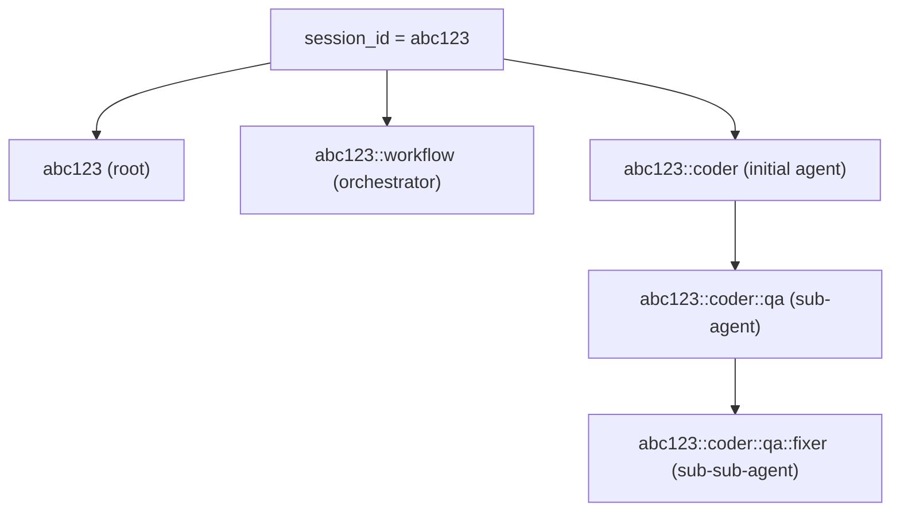
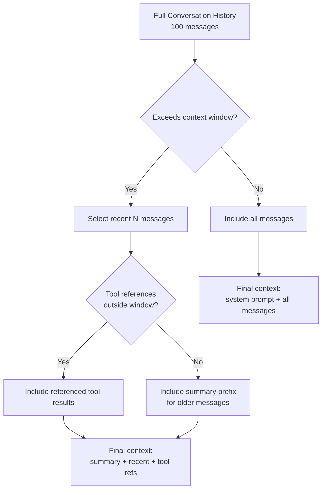

# Conversation Store

The conversation store manages the persistent storage and retrieval of conversation messages — the sequence of user inputs, agent outputs, tool calls, and tool results that constitute an agent session's history. While the session store (described in [Sessions](01-sessions.md)) tracks metadata about the session as a whole, the conversation store tracks the actual content of the dialogue. This separation allows conversation history to be managed independently of session lifecycle, enabling features like conversation branching, history re-seeding, and cross-session context sharing.

## Conversation Key Convention

Conversation messages are keyed by a `conversation_key` string, not directly by the session ID. This indirection allows a single session to have multiple conversation streams — one for each agent that participates in the workflow. The key convention follows a hierarchical naming scheme:

| Pattern | Example | Used By |
|---------|---------|---------|
| `{session_id}` | `abc123` | Single-agent sessions |
| `{session_id}::workflow` | `abc123::workflow` | Orchestrator's top-level conversation |
| `{session_id}::{initial_agent}` | `abc123::coder` | First agent in a multi-agent workflow |
| `{session_id}::{initial_agent}::{agent_name}` | `abc123::coder::qa` | Subsequent agents in a multi-agent workflow |

### Key Construction

The orchestrator constructs conversation keys as it activates agents during the workflow. When the session starts, the orchestrator creates a root key `{session_id}`. When the first agent is activated, it creates a key `{session_id}::{agent_name}`. When the orchestrator hands off to a second agent (e.g., from coder to QA), it creates a new key `{session_id}::{initial_agent}::{agent_name}`. This hierarchical key structure preserves the full activation chain, making it easy to reconstruct the conversation topology from the keys alone.

The `::` separator was chosen because it is not a valid character in UUID v4 identifiers (which use only hex digits and hyphens), ensuring that key parsing is unambiguous. The separator is also visually distinct from the `-` used in UUIDs, making keys readable in logs and debugging output.

## SqliteConversationStore

The `SqliteConversationStore` implements the conversation persistence layer using the `messages` table in the SQLite database. It provides methods for appending, reading, and deleting conversation messages.

### Methods

#### append()

`append(&self, conversation_key: &str, message: &Message) -> Result<()>` appends a single message to a conversation. This is the hot path — it is called for every message during an active session, including streaming token fragments (when the streaming mode accumulates tokens into complete messages). The append operation is a simple `INSERT` into the `messages` table with the conversation key, role, content, timestamp, and optional metadata.

For performance, appends are batched using a write-behind buffer. Messages are first written to an in-memory buffer and flushed to SQLite in batches of up to 50 messages or every 500 milliseconds, whichever comes first. This batching reduces the number of filesystem syncs (SQLite's `fsync` is expensive) and improves throughput for high-frequency streaming scenarios. The buffer is always flushed before any read operation (like `load()`) to ensure consistency.

#### load()

`load(&self, conversation_key: &str) -> Result<Vec<Message>>` retrieves all messages for a conversation, ordered by timestamp. It flushes the write-behind buffer first, then queries the `messages` table with a `SELECT * FROM messages WHERE conversation_key = ? ORDER BY timestamp ASC`. The result set is converted into a `Vec<Message>` and returned.

For large conversations (thousands of messages), loading can be slow. The `load_range()` method provides pagination support:

`load_range(&self, conversation_key: &str, offset: usize, limit: usize) -> Result<Vec<Message>>` retrieves a subset of messages, allowing the caller to load conversation history incrementally. The TUI uses this method to implement lazy loading of conversation history — it loads only the most recent N messages initially and fetches older messages on demand when the user scrolls up.

#### delete()

`delete(&self, conversation_key: &str) -> Result<()>` deletes all messages for a conversation. This is called during session deletion (cascade) and during conversation reset operations. It uses a `DELETE FROM messages WHERE conversation_key = ?` query, which is efficient due to the index on `conversation_key`.

#### count()

`count(&self, conversation_key: &str) -> Result<usize>` returns the number of messages in a conversation. This is used for pagination and for estimating the conversation size before loading the full history.

## History Re-Seeding

History re-seeding is the process of constructing the initial message context for an LLM call from the persisted conversation history. When an agent makes an LLM call, it needs the conversation history as context — but it doesn't need the entire history. Long conversations can exceed the model's context window, and including irrelevant messages wastes tokens and reduces response quality. The re-seeding process selects the most relevant subset of messages to include.

### Re-Seeding Algorithm

1. **System Prompt**: Always included as the first message. This is not stored in the conversation history — it comes from the `AgentPreset::system_prompt` configuration.

2. **Recent Messages**: The most recent N messages (where N is determined by the model's context window minus the system prompt and reserved output tokens) are included verbatim. These are the most relevant messages because they contain the current task context and the agent's recent actions.

3. **Summary Prefix**: If the conversation history is longer than N messages, older messages are summarized into a single system message prefixed with "Previous conversation summary:". This summary is generated by the LLM itself at periodic checkpoints (e.g., every 10 turns) and stored as a special message in the conversation history with the role "system" and metadata indicating it's a summary.

4. **Tool Results**: Tool call results that are referenced by recent messages are always included, even if the tool call itself falls outside the recent window. This ensures that the agent has the context needed to understand why it made certain decisions.

### Summary Generation

Conversation summaries are generated periodically during the agent loop. The orchestrator checks the message count after each turn, and if it exceeds a threshold (default: 20 messages since the last summary), it makes a special LLM call requesting a summary of the conversation so far. The summary is stored as a message with role "system" and metadata `{"type": "summary", "summarized_message_count": N}`. Subsequent re-seeding operations use this summary as the starting point, including only messages after the summary.

Summary generation is an expensive operation (it requires an additional LLM call), but it saves tokens in the long run by reducing the context size for subsequent calls. The trade-off is configurable through `AgentPreset::summarization_threshold`, which can be set to 0 to disable summarization entirely (for short conversations where the full history fits in the context window) or to higher values for models with larger context windows.

## Message Types and Serialization

The `Message` struct is serialized differently depending on the role:

- **user**: Content is a plain string (the user's input text).
- **assistant**: Content may be a plain string (for text responses) or a JSON array (for responses containing tool calls). The JSON format follows the LLM provider's native tool call format, allowing the conversation history to be replayed directly into the API without transformation.
- **system**: Content is a plain string. System messages include the agent's system prompt, conversation summaries, and status notifications.
- **tool**: Content is a JSON object with `tool_name`, `result`, and `success` fields. Tool results are stored as JSON to preserve structured data (e.g., file contents, command output) that might be needed for re-seeding.

The `metadata_json` field stores optional structured data about the message. For assistant messages with tool calls, it includes the list of tool call IDs. For tool result messages, it includes the tool call ID that the result corresponds to. This metadata is used during re-seeding to correctly pair tool calls with their results, ensuring that the LLM receives a consistent conversation structure.

## Cross-Session Context

While each session has its own conversation history, the conversation store supports sharing context across sessions through a "context prefix" mechanism. When a new session is created, it can optionally inherit the conversation history (or a summary thereof) from a previous session. This enables iterative workflows where the user refines the agent's output across multiple sessions — the new session starts with the context of what was accomplished previously, rather than starting from scratch.

Cross-session context is configured through the `SessionConfig::inherit_context_from` field, which specifies the session ID to inherit from. The inheritance is implemented by copying the previous session's summary message (if one exists) into the new session's conversation history as the first system message. The full history is not copied — only the summary — to avoid bloating the new session's context window with potentially irrelevant details from the previous session.

This feature is particularly useful for long-running projects where the user submits multiple tasks across different sessions. Without context inheritance, each session would start with no knowledge of what was done previously, leading to redundant analysis and wasted tokens. With context inheritance, the agent has a high-level understanding of the project's history and can build on previous work efficiently.
