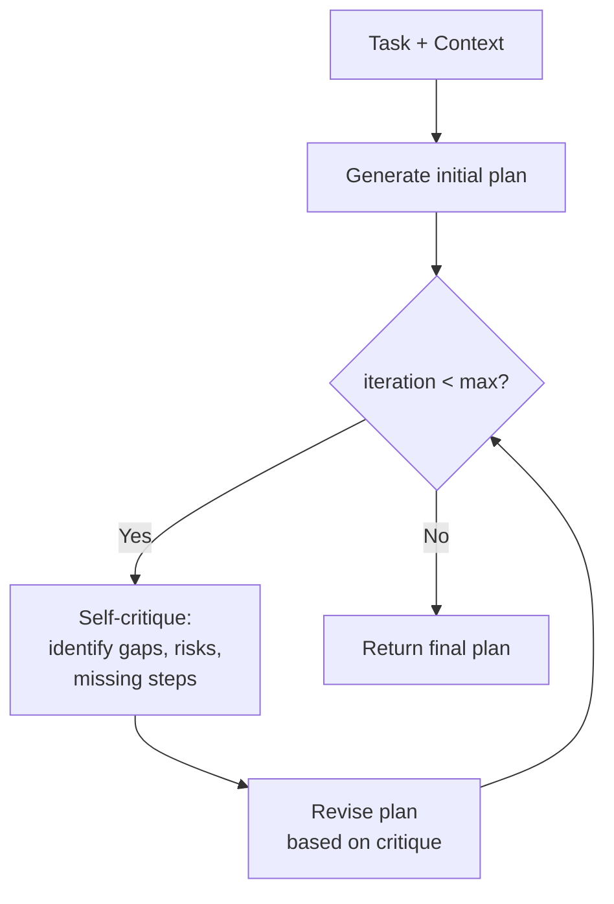

# Planner System Overview

The planner subsystem is the cognitive core of xaft's workflow pipeline. Planners are responsible for analyzing tasks, decomposing them into structured plans, and classifying them as informational or coding tasks. The planner's output determines the trajectory of the entire workflow — whether the agent loop terminates immediately with a text answer or triggers a multi-agent coding pipeline. This page covers the two planner implementations, their interfaces, and how they integrate with the broader orchestration layer.

---

## The Role of Planning in xaft

Planning in xaft is not merely "thinking before acting." It is the decision point that determines which agents are activated, what tools they use, and what success looks like. A good planner produces clear, actionable plans that downstream agents can execute without ambiguity. A poor planner generates vague or contradictory instructions that cause the Coder to make incorrect changes and the QA agent to request endless fix cycles.

The planner subsystem addresses this challenge with two complementary implementations:

- **`OneShotPlanner`**: Generates a plan in a single LLM invocation. Fast, simple, and sufficient for most tasks.
- **`IterativeRefinementPlanner`**: Generates an initial plan and then refines it through multiple rounds of self-critique and revision. Slower but more robust for complex tasks.

Both planners implement the same interface, making them interchangeable in the workflow.

---

## Planner Trait

```rust
#[async_trait]
pub trait Planner: Send + Sync {
    async fn plan(&self, task: &str, context: &PlanContext) -> Result<PlanResult, AgtrsError>;
}
```

### `PlanContext`

```rust
pub struct PlanContext {
    pub workspace_root: PathBuf,
    pub available_tools: Vec<ToolInfo>,
    pub agent_topology: AgentTopology,
}
```

The `PlanContext` provides the planner with environmental information it needs to make informed decisions:

- **`workspace_root`**: The root directory of the workspace. The planner may use this to understand project structure, though it typically relies on file tools rather than direct filesystem access.

- **`available_tools`**: A list of tool names and descriptions available to the Coder and Fixer agents. This allows the planner to tailor its plan to the capabilities that will actually be available during execution. For example, if `bash_exec` is not available, the planner should not include "run cargo test" as a verification step.

- **`agent_topology`**: A description of the agent graph — which agents exist, what tools they have, and who they can hand off to. This lets the planner understand the full execution path and produce plans that align with the workflow's structure.

### `PlanResult`

```rust
pub enum PlanResult {
    Informational { answer: String },
    Coding { plan: CodingPlan },
}

pub struct CodingPlan {
    pub summary: String,
    pub steps: Vec<PlanStep>,
    pub files_to_modify: Vec<String>,
    pub constraints: Vec<String>,
}

pub struct PlanStep {
    pub description: String,
    pub target_file: Option<String>,
    pub tool_hint: Option<String>,
}
```

The `PlanResult` is the planner's primary output. It is a classified result:

- **`Informational`**: The task can be answered without code changes. The `answer` field contains the planner's direct response, which the orchestrator returns to the user immediately.

- **`Coding`**: The task requires code modifications. The `CodingPlan` provides structured guidance for the Coder agent, including a summary of the work, step-by-step instructions, the files that will need to be modified, and any constraints the Coder must respect.

The `tool_hint` field in `PlanStep` is an optional suggestion for which tool the Coder should use (e.g., "edit_file" for targeted changes, "write_file" for new files). This is not enforced — the Coder may choose a different tool — but it nudges the Coder toward the most appropriate approach, reducing the likelihood of suboptimal tool selection.

---

## `OneShotPlanner`

The `OneShotPlanner` generates a complete plan in a single LLM call. It is the default planner for the standard workflow and is suitable for the vast majority of tasks.

### Architecture


The `OneShotPlanner` operates in three phases:

1. **Prompt construction**: The planner assembles a system prompt that includes the task description, workspace context, and instructions for producing a structured plan. The prompt explicitly asks the LLM to classify the task as informational or coding and to format its output accordingly.

2. **LLM invocation**: A single completion request is sent to the LLM. The planner does not stream — it waits for the full response before proceeding. This is because the entire response must be available for parsing.

3. **Output parsing**: The raw LLM output is passed through `parse_plan_result()`, which extracts a structured `PlanResult`. See [Escalation & Plan Parsing](./02-escalation.md) for detailed parsing logic.

### Prompt Template

The `OneShotPlanner`'s prompt follows this structure:

```
You are a planning agent for a coding assistant. Analyze the task below and produce a plan.

CLASSIFICATION:
- If the task is purely informational (asking for explanation, analysis, or advice),
  respond with a direct answer prefixed with "INFORMATIONAL:".
- If the task requires code changes, produce a structured coding plan.

CODING PLAN FORMAT:
Summary: <one-line summary of the task>
Files to modify:
- <file path>
Steps:
1. <step description> [file: <path>] [tool: <hint>]
2. ...
Constraints:
- <constraint>

Task: {task}
Workspace: {workspace_root}
Available tools: {tool_list}
```

This template is deliberately structured. The classification instructions reduce ambiguity — the LLM knows exactly what "informational" and "coding" mean in this context. The coding plan format is parseable by `parse_plan_result()` but also readable by the Coder agent, which receives the plan as a handoff summary.

### Strengths and Limitations

**Strengths**: Fast (one LLM call), deterministic (same input produces similar output), and simple (no state management or iteration logic). For well-defined tasks like "add a new tool" or "fix the bug in edit_file.rs", the OneShotPlanner produces high-quality plans with minimal latency.

**Limitations**: Complex tasks may benefit from multiple rounds of planning — the first plan might miss edge cases, conflate steps, or overlook dependencies. The OneShotPlanner cannot self-correct because it has no feedback loop. For these cases, the `IterativeRefinementPlanner` is more appropriate.

---

## `IterativeRefinementPlanner`

The `IterativeRefinementPlanner` generates an initial plan and then iteratively improves it through self-critique. Each iteration produces a critique of the current plan and a revised version that addresses the critique's findings.

### Architecture



### Configuration

```rust
pub struct IterativeRefinementPlanner {
    max_iterations: usize,
    critique_prompt_fn: Box<dyn Fn(&CodingPlan) -> String + Send + Sync>,
}
```

- **`max_iterations`**: The maximum number of critique-revise cycles. Default is 3. Higher values produce more refined plans but increase latency (each iteration requires an LLM call). In practice, 2–3 iterations capture most improvements — additional iterations yield diminishing returns as the plan converges.

- **`critique_prompt_fn`**: A closure that generates the critique prompt given the current plan. The default implementation asks the LLM to evaluate the plan against several criteria: completeness (are all necessary steps included?), correctness (are the steps technically sound?), ordering (are dependencies respected?), and risk (what could go wrong?).

### Refinement Process

Each iteration follows this protocol:

1. **Present the current plan** to the LLM as a critique target.
2. **Generate a critique** that identifies weaknesses: missing files, incomplete steps, unclear instructions, or potential pitfalls the Coder might encounter.
3. **Generate a revised plan** that addresses every point in the critique. The revised plan must be complete — it replaces the previous version entirely, not patches it incrementally.
4. **Compare the revised plan to the previous version**. If no substantive changes were made (the LLM merely rephrased the same plan), the iteration terminates early. This convergence detection prevents wasted LLM calls when the plan has stabilized.

### When to Use

Use the `IterativeRefinementPlanner` when:

- The task involves multiple interdependent changes across several files (e.g., a refactoring that requires updating type signatures, imports, and tests).
- The workspace is unfamiliar — the planner hasn't seen the codebase before and may make incorrect assumptions about file structure or module organization.
- The cost of a bad plan is high — if the Coder will spend many turns implementing the plan, a wrong plan wastes significantly more time than an extra planning iteration.

Use the `OneShotPlanner` when:

- The task is straightforward (single-file changes, well-defined feature additions).
- Latency is a priority (the user is waiting for a quick response).
- The planner has already seen the workspace in a previous task (cached knowledge reduces the need for iteration).

---

## Post-Orchestration Planning

Planners also play a role after the main workflow completes. When the orchestrator terminates with a coding result (QA approved), it invokes `OneShotPlanner` to generate a **concluding summary**:

```rust
let concluding_summary = OneShotPlanner::new()
    .plan(&format!(
        "Summarize the following completed task:\n\n\
         Original task: {}\n\
         Files changed: {:?}\n\
         QA verdict: APPROVED",
        original_task, files_changed
    ), &context)
    .await?;
```

This concluding summary is not a plan — it is a natural-language recap of what was accomplished. It synthesizes the original task, the changes made, and the QA approval into a concise result that the user can quickly understand. The `OneShotPlanner` is used here (rather than the iterative variant) because summarization is a simpler task that doesn't benefit from multiple rounds of refinement.

---

## Planner Selection Guide

| Criterion | OneShotPlanner | IterativeRefinementPlanner |
|-----------|---------------|--------------------------|
| Task complexity | Low to medium | Medium to high |
| Expected plan steps | 1–3 | 4+ |
| Inter-file dependencies | Minimal | Significant |
| Workspace familiarity | Known | Unknown |
| Latency budget | Tight (<5s) | Loose (>15s) |
| LLM cost budget | Low (1 call) | Medium (3–4 calls) |
| Failure cost | Low (quick retry) | High (many agent turns) |

The standard workflow uses `OneShotPlanner` by default. You can switch to `IterativeRefinementPlanner` by modifying the `prompt_fn` closure in `run_workflow()` or by providing a custom `AgentDefinition` for the Planner agent that uses the iterative planner in its system prompt.
