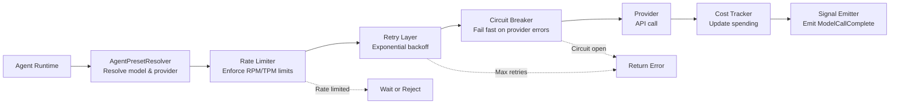

# Provider Abstraction

The xaft provider abstraction provides a unified interface for interacting with multiple LLM API backends. It decouples the agent runtime from any specific API provider, allowing agents to seamlessly use models from Anthropic, OpenAI, and OpenAI-compatible services through a single, consistent API. The abstraction handles provider-specific differences in request formatting, response parsing, authentication, rate limiting, and error handling, presenting a clean `LlmProvider` trait that the agent runtime can call without knowledge of the underlying provider implementation.

## LlmProvider Trait

The `LlmProvider` trait defines the interface that all provider implementations must satisfy. It is async-first (since LLM API calls are inherently I/O-bound), type-safe (using strongly-typed request and response structs rather than raw JSON), and stream-aware (supporting both complete and streaming responses).

```rust
#[async_trait]
pub trait LlmProvider: Send + Sync {
    /// The provider's name (e.g., "anthropic", "openai").
    fn name(&self) -> &str;

    /// List available models for this provider.
    async fn list_models(&self) -> Result<Vec<ModelInfo>>;

    /// Make a single completion request (non-streaming).
    async fn complete(&self, request: LlmRequest) -> Result<LlmResponse>;

    /// Make a streaming completion request.
    async fn complete_stream(
        &self,
        request: LlmRequest,
    ) -> Result<Box<dyn LlmStream>>;

    /// Check the health of the provider connection.
    async fn health_check(&self) -> Result<()>;

    /// Get current rate limit status.
    async fn rate_limit_status(&self) -> RateLimitStatus;
}
```

### LlmRequest

The `LlmRequest` struct is provider-agnostic, containing all the information needed to make an LLM API call:

| Field | Type | Description |
|-------|------|-------------|
| `model` | `String` | Model identifier (may be an alias, resolved by the provider) |
| `messages` | `Vec<ChatMessage>` | Conversation history |
| `system_prompt` | `Option<String>` | System prompt (separated from messages for providers that handle it differently) |
| `temperature` | `Option<f64>` | Sampling temperature |
| `top_p` | `Option<f64>` | Nucleus sampling threshold |
| `max_tokens` | `Option<u32>` | Maximum output tokens |
| `stop_sequences` | `Vec<String>` | Sequences that stop generation |
| `tools` | `Vec<ToolDefinition>` | Available tools for function calling |
| `stream` | `bool` | Whether to use streaming mode |

### LlmResponse

The `LlmResponse` struct is also provider-agnostic:

| Field | Type | Description |
|-------|------|-------------|
| `content` | `String` | Text content of the response |
| `tool_calls` | `Vec<ToolCall>` | Tool calls requested by the model |
| `usage` | `TokenUsage` | Token counts (input, output, cached) |
| `model` | `String` | Actual model used (may differ from requested due to aliases) |
| `stop_reason` | `StopReason` | Why generation stopped (end_turn, tool_use, max_tokens, stop_sequence) |
| `latency_ms` | `u64` | Round-trip latency in milliseconds |

### LlmStream

The `LlmStream` trait provides an async iterator interface for streaming responses:

```rust
#[async_trait]
pub trait LlmStream: Send + Sync {
    async fn next_chunk(&mut self) -> Option<Result<StreamChunk>>;
}

pub struct StreamChunk {
    pub content_delta: Option<String>,
    pub tool_call_delta: Option<ToolCallDelta>,
    pub usage: Option<TokenUsage>,
    pub stop_reason: Option<StopReason>,
}
```

Each chunk may contain a text delta (a fragment of the generated text), a tool call delta (a fragment of a tool call's arguments), updated token usage, or a stop reason. The stream ends when `next_chunk()` returns `None` or when a chunk contains a `stop_reason`.

## Provider Implementations

### AnthropicProvider

The `AnthropicProvider` implements the `LlmProvider` trait for the Anthropic Claude API. It handles Anthropic-specific request formatting, including:

- **System Prompt Handling**: Anthropic's API separates the system prompt from the message list. The provider extracts `LlmRequest::system_prompt` and sends it as the top-level `system` parameter.
- **Tool Call Format**: Anthropic uses `tool_use` content blocks for tool calls, which differ from OpenAI's `function_call` format. The provider translates between the provider-agnostic `ToolCall` format and Anthropic's native format.
- **Caching**: Anthropic supports prompt caching, which can significantly reduce costs for repeated system prompts and long conversation histories. The provider automatically enables caching for system prompts and cached message blocks when available.
- **Streaming**: Anthropic uses Server-Sent Events (SSE) for streaming. The provider parses the SSE stream and converts events into `StreamChunk` instances.

### OpenaiProvider

The `OpenaiProvider` implements the `LlmProvider` trait for the OpenAI API (including GPT-4, GPT-4o, and o1 models). It handles OpenAI-specific formatting:

- **System Prompt Handling**: OpenAI includes the system prompt as the first message in the messages array with role "system". The provider prepends it to the message list.
- **Tool Call Format**: OpenAI uses `function` type tool calls with a `function.name` and `function.arguments` structure. The provider translates between the provider-agnostic format and OpenAI's native format.
- **Streaming**: OpenAI also uses SSE for streaming, with a `delta` object in each chunk. The provider accumulates tool call deltas across chunks, since OpenAI streams tool call arguments incrementally.
- **Response Format**: OpenAI supports `response_format` parameters (e.g., `json_object`, `json_schema`) that constrain the output format. The provider passes these through when configured.

### OpenaiCompatibleProvider

The `OpenaiCompatibleProvider` is a generic implementation that works with any API that follows the OpenAI chat completions format. It is used for providers like Together AI, Groq, Fireworks AI, and locally-hosted models (vLLM, Ollama, llama.cpp server). The provider requires a `base_url` configuration and supports all the same features as the `OpenaiProvider`, plus:

- **Custom Headers**: Additional HTTP headers can be configured through `ProviderConfig::headers`, allowing authentication with providers that use non-standard header formats.
- **Model Mapping**: The `models.aliases` configuration allows mapping short names to provider-specific model identifiers, abstracting away differences in model naming conventions across providers.
- **Health Check Customization**: The health check endpoint may differ across OpenAI-compatible providers. The provider supports a configurable health check path through the `ProviderConfig`.

## Provider Chain

When an agent makes an LLM call, the request flows through a chain of components before reaching the provider:



### Rate Limiter

The rate limiter enforces the `rpm_limit` and `tpm_limit` configured in `ProviderConfig`. It uses a token bucket algorithm that allows burst traffic up to the limit while maintaining the average rate over time. When a request would exceed the rate limit, the limiter either delays the request (if the deadline has not been reached) or rejects it with a `RateLimitExceeded` error. The rate limiter is per-provider, not per-agent, ensuring that all agents sharing a provider contribute to the same rate budget.

### Retry Layer

The retry layer handles transient errors — network timeouts, HTTP 429 (rate limited by the provider), HTTP 503 (service unavailable), and HTTP 500 (internal server error). It uses exponential backoff with jitter: the first retry waits 1 second, the second waits 2 seconds, the third waits 4 seconds, and so on, up to `max_retries` attempts. Jitter (random variation of ±25%) prevents thundering herd effects when multiple sessions retry simultaneously after a provider outage.

Non-retryable errors (HTTP 400, HTTP 401, HTTP 403) are returned immediately without retry. These errors indicate a problem with the request itself (invalid parameters, expired API key, insufficient permissions) that retrying will not fix.

### Circuit Breaker

The circuit breaker prevents cascading failures when a provider is experiencing an extended outage. It tracks the failure rate over a sliding window (default: 10 requests). If the failure rate exceeds 50%, the circuit opens and all subsequent requests fail immediately with a `CircuitOpen` error, without making an API call. After a cooldown period (default: 30 seconds), the circuit enters a half-open state, allowing a single request through to test whether the provider has recovered. If the test request succeeds, the circuit closes and normal operation resumes. If it fails, the circuit remains open for another cooldown period.

### Cost Tracker

After each successful API call, the cost tracker updates the session's cumulative spending. The cost is calculated from the token usage in the response and the model's pricing (cost per 1M input tokens and cost per 1M output tokens). The cost tracker checks the session's remaining budget before each call and rejects requests that would exceed the `CostLimitConfig::per_session_usd` or `per_task_usd` limits. A warning is emitted when spending reaches 80% of the limit, and the call is blocked when spending reaches 100%.

## Provider Selection

The provider for an LLM call is determined by the agent's preset configuration. The `AgentPresetResolver` looks up the preset's `provider` field in the `XaftConfig::provider` map and creates or retrieves the corresponding `LlmProvider` instance. Provider instances are cached for the session's lifetime, so the same provider is reused across multiple calls. This caching is important for the rate limiter and circuit breaker, which maintain state across calls and would be ineffective if a new provider instance were created for each request.
