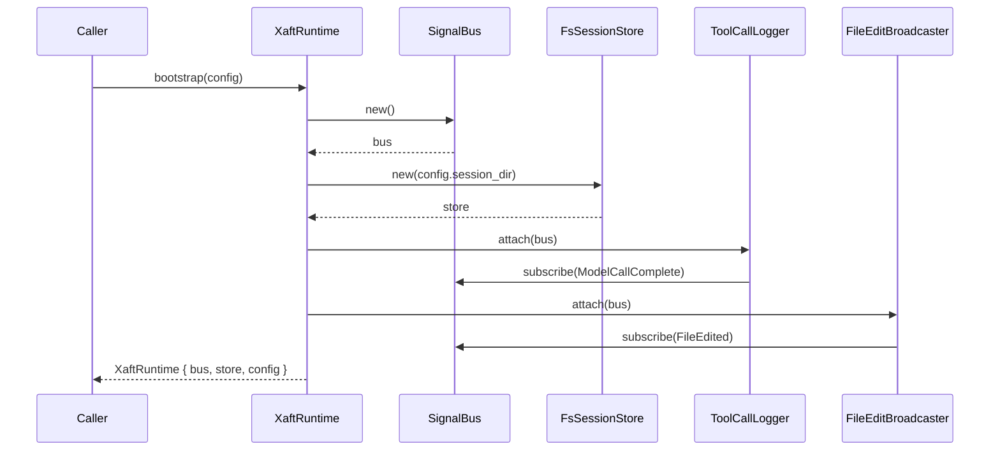

# Bootstrap Sequence

The `XaftRuntime::bootstrap(config)` method is the single entry point that transforms a raw configuration into a fully operational agent runtime. Every subsequent operation — task execution, streaming, cost tracking, and git integration — depends on the infrastructure established during bootstrap. Understanding this sequence is essential for debugging initialization failures, customizing signal routing, and reasoning about the runtime's lifecycle guarantees.

## Overview

Bootstrap performs three structurally significant operations in strict order: it constructs the `SignalBus`, initializes the `FsSessionStore`, and attaches the built-in signal listeners that wire together tool-call logging and file-edit broadcasting. The ordering matters because the signal listeners attached in the final step require both the bus and the session store to already exist — attempting to attach a listener to a non-existent bus would panic, and the tool-call logger needs the session store to persist its records.

## SignalBus Construction

The `SignalBus` is the runtime's central publish-subscribe backbone. It is created first because every other subsystem — the session store, the agent, the provider chain — will eventually publish or subscribe to signals on this bus. Internally, the bus is implemented as a lock-free, multi-producer multi-consumer dispatch table keyed by signal type. Each signal type maps to a `tokio::sync::broadcast` channel, allowing multiple subscribers to receive the same event without requiring fan-out logic at the call site.

The bus is parameterized by a configurable channel capacity. When the capacity is exhausted — which can happen under extreme load when a consumer is slow — the bus applies backpressure by dropping the oldest events and emitting a `SignalDropped` diagnostic. This design choice prioritizes forward progress over perfect event delivery, which is the correct trade-off for a runtime that must remain responsive even when a logging subscriber blocks.

During bootstrap, the bus is created with no subscribers. Subscribers are attached in subsequent steps, and the bus's `subscribe` method returns a `SignalSubscription` handle that automatically unsubscribes when dropped. This RAII pattern prevents stale subscribers from accumulating memory over long-running sessions.

## FsSessionStore Initialization

The `FsSessionStore` provides durable persistence of agent sessions to the filesystem. It is initialized with a session directory derived from the configuration — typically `~/.xaft/sessions/` or a project-local `.xaft/sessions/` path. The store creates the directory tree on disk if it does not already exist, and validates that the directory is writable before returning.

Each session is serialized as a JSON file named by its session ID (a UUID v4). The store uses advisory file locking (`flock` on Unix, `LockFile` on Windows) to prevent concurrent runtimes from corrupting the same session file. This is critical in multi-agent scenarios where several runtime processes might operate on the same project simultaneously — for example, a terminal-based agent and a headless CI agent both running against the same repository.

The session store's position in the bootstrap sequence — after the bus but before the listeners — is intentional. The tool-call logger will later need to write session metadata through the store, so the store must be fully initialized and validated before the logger attaches. If the session directory is not writable, bootstrap fails early with a `RuntimeError::Io` variant, preventing a half-initialized runtime from entering an inconsistent state.

## Signal Listener Attachment

The final phase of bootstrap attaches two built-in signal listeners to the bus. These listeners are long-lived tasks spawned on the runtime's Tokio executor, and they run for the entire lifetime of the runtime.

### Tool-Call Logger

The tool-call logger subscribes to the `ModelCallComplete` signal. Every time an LLM provider completes a call — whether successful or failed — the provider emits this signal with metadata including the model name, token counts, latency, and cost. The logger persists this information into the session store, creating a durable audit trail that can be inspected after the run completes. This is the foundation of xaft's cost transparency: the `xaft session costs <id>` CLI command reads from the records produced by this listener.

The logger is intentionally decoupled from the provider chain. Providers do not call the logger directly; they merely emit a signal. This means the logger can be replaced, extended, or disabled without modifying provider code. It also means that a slow logger cannot block the provider — the broadcast channel absorbs the signal and the logger processes it asynchronously.

### File-Edit Broadcaster

The file-edit broadcaster subscribes to the `FileEdited` signal. When an agent modifies a file through a write tool, the tool emits this signal with the file path, the diff, and the editing agent's identity. The broadcaster's job is to route this information to any connected frontends — for example, a VS Code extension that highlights modified files in real time, or a web dashboard that shows a live diff feed.

Like the logger, the broadcaster operates asynchronously and cannot block the editing tool. The signal is fire-and-forget from the tool's perspective. If no frontend is connected, the signal is simply consumed by an empty subscriber set and discarded — there is no overhead beyond the signal dispatch itself.

## Bootstrap Failure Semantics

Bootstrap is designed to fail fast and fail clearly. If any step cannot complete — the session directory is not writable, the bus capacity is invalid, a listener fails to spawn — the entire bootstrap returns an `Err(RuntimeError)` and no partially-initialized runtime is returned. This is a deliberate design choice: a half-bootstrapped runtime would have missing signal listeners, an uninitialized session store, or a bus that drops events silently, all of which would produce subtle, hard-to-diagnose bugs downstream.

The error variant returned depends on the failure point. Filesystem errors produce `RuntimeError::Io`, invalid configuration produces `RuntimeError::Config`, and listener spawn failures (which are exceedingly rare and usually indicate system resource exhaustion) produce `RuntimeError::Io` as well. The caller is expected to match on these variants and present an actionable error message to the user.

## Configuration Influence on Bootstrap

The `config` parameter passed to bootstrap controls several behavioral knobs that take effect during initialization. The `session_dir` field determines where the `FsSessionStore` persists its data. The `signal_bus_capacity` field controls the broadcast channel depth — a higher value reduces the risk of signal drops under load but increases memory consumption. The `log_level` field does not directly affect bootstrap, but it is stored on the runtime so that subsequently created agents and providers inherit the logging configuration.

Importantly, bootstrap does not validate the full configuration — it only validates the subset required for initialization. Provider credentials, agent presets, and workspace paths are validated later during `run_task()`, because those validations may require network access or filesystem checks that are too expensive to perform at bootstrap time. This separation keeps bootstrap lightweight and fast, allowing the runtime to be created even in offline or partially-configured environments.
