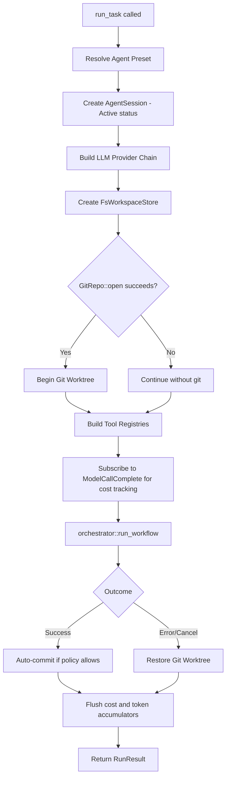

# Task Execution

The `run_task(request: RunRequest)` method is the runtime's primary workhorse. It transforms a high-level task description and execution configuration into a fully managed agent session, orchestrating provider resolution, workspace setup, tool registry assembly, git integration, cost tracking, and workflow execution. This page documents every phase of the task execution pipeline in detail.

## RunRequest Structure

The `RunRequest` is the input contract for `run_task()`. It carries all the information the runtime needs to configure and execute a single agent task:

| Field | Type | Description |
|---|---|---|
| `task` | `String` | The natural-language task description provided by the user |
| `config` | `RunConfig` | Execution configuration including agent preset name, model overrides, and budget limits |
| `working_dir` | `PathBuf` | The filesystem root for workspace operations |
| `headless` | `bool` | When `true`, suppresses interactive prompts and approvals |
| `dry_run` | `bool` | When `true`, executes the planning phase only without applying changes |
| `auto_approve` | `bool` | When `true`, automatically approves all tool calls that would otherwise require user confirmation |
| `dangerously_skip_permissions` | `bool` | When `true`, bypasses all permission checks — use only in trusted CI environments |
| `resume_session_id` | `Option<SessionId>` | When set, resumes a previously interrupted session by loading its state from the session store |

The `resume_session_id` field enables session continuity across process restarts. When provided, `run_task()` loads the prior session's conversation history, tool results, and git state from the `FsSessionStore`, allowing the agent to continue from where it left off rather than starting from scratch. This is critical for long-running tasks that may be interrupted by network failures, user cancellations, or CI timeouts.

## Execution Pipeline



## Phase 1: Agent Preset Resolution

The first step resolves the `agent_preset` name from `RunConfig` into a concrete `XaftAgent` configuration. The preset system allows teams to define reusable agent profiles — for example, `code-editor`, `code-reviewer`, or `planner` — each with their own tool sets, commit policies, and system prompts. The resolution process looks up the preset name in the runtime's preset registry, which is populated from the configuration file during bootstrap.

If the preset name does not exist in the registry, `run_task()` returns `RuntimeError::Agent` with a descriptive message listing the available presets. If the preset exists but references tools that are not registered in the runtime's global tool registry, the error is deferred until tool registry assembly in Phase 5, because some tools may be conditionally available depending on the workspace state.

## Phase 2: AgentSession Creation

With the preset resolved, the runtime creates an `AgentSession` record with `Active` status. The session is assigned a new UUID v4 identifier and is immediately persisted to the `FsSessionStore`. The session record captures the task description, the resolved agent configuration, the start timestamp, and the initial status.

The session status transitions through a well-defined state machine: `Active` → `Completed` | `Failed` | `Cancelled`. The status is updated at the end of `run_task()` based on the workflow outcome. If the runtime crashes before updating the status, the session remains in `Active` state, which is detectable by the `xaft session list` CLI command as a "zombie" session that may need manual cleanup or resumption via `resume_session_id`.

## Phase 3: LLM Provider Chain Construction

The runtime calls `ProviderFactory::build()` to construct the provider chain for the resolved model configuration. This produces a layered provider stack — typically `AnthropicProvider` or `OpenAIProvider` wrapped in `FallbackProvider` (which adds retry logic) wrapped in `CostedProvider` (which emits cost signals). The full details of provider construction are documented in [Provider Factory](../runtime/04-provider-factory.md).

If the provider cannot be constructed — for example, because no API key is available for the requested model — `run_task()` returns `RuntimeError::Provider` immediately. This is a hard failure; there is no fallback to a different provider unless the configuration explicitly specifies one through the `FallbackProvider` mechanism.

## Phase 4: FsWorkspaceStore and Git Integration

The `FsWorkspaceStore` is created for the `working_dir` specified in the `RunRequest`. This store manages the agent's view of the filesystem, tracking which files have been read, written, or modified during the session. It provides a sandboxed filesystem abstraction that can enforce permission boundaries — for example, preventing writes outside the working directory when `dangerously_skip_permissions` is `false`.

After the workspace store is created, the runtime attempts `GitRepo::open()` on the working directory. If the directory is a git repository, the runtime calls `begin_worktree()` to create an isolated git worktree for the agent's changes. The worktree ensures that the agent's modifications do not affect the main working tree until they are explicitly committed, providing a clean rollback path if the task fails or is cancelled.

If `GitRepo::open()` fails — because the directory is not a git repository, or because git is not installed — the runtime continues without git integration. In this mode, there is no worktree isolation and no auto-commit functionality. File changes are written directly to the working directory and cannot be rolled back automatically. The runtime logs a warning in this case, because the absence of git integration means the agent operates without a safety net.

## Phase 5: Tool Registry Assembly

The runtime constructs two distinct tool registries: a **read-only registry** and a **write registry**. The read-only registry contains tools that inspect the workspace without modifying it — `ReadFile`, `ListDirectory`, `SearchFiles`, `GitLog`, `GitDiff`, and similar. The write registry contains tools that mutate the workspace — `WriteFile`, `EditFile`, `DeleteFile`, `ShellExec`, and others.

This separation serves the permission system. When `auto_approve` is `false` and `dangerously_skip_permissions` is `false`, every call to a write tool triggers a `PendingApproval` event that must be approved by the user (or by a headless approval policy) before the tool executes. Read-only tools never require approval, because they cannot cause side effects. This two-tier model significantly reduces approval fatigue compared to requiring approval for every tool call.

The tool registries are also filtered by the agent preset. Not every agent needs every tool — a `code-reviewer` agent might only need read tools plus `WriteFile` (for posting review comments), while a `code-editor` agent needs the full suite including `ShellExec`. The preset's `tools` field lists the tool names the agent is allowed to use, and the registry assembly step enforces this allowlist.

## Phase 6: Cost Accumulation Subscription

Before the workflow begins, the runtime subscribes to the `ModelCallComplete` signal on the `SignalBus`. This subscription feeds a `CostAccumulator` that tracks cumulative token usage and monetary cost across all LLM calls during the task. The accumulator is checked against the budget limits specified in `RunConfig` after every call — if the budget is exceeded, the workflow is terminated with `RuntimeError::BudgetExceeded`.

The cost accumulator uses atomic counters for token counts and a floating-point accumulator for monetary cost. The floating-point accumulation is not perfectly precise, but the error is negligible for typical budgets (sub-cent on a $10 task). For production deployments requiring exact accounting, the per-call records persisted by the tool-call logger provide a precise ground truth that can be summed after the run completes.

## Phase 7: Workflow Execution

The runtime calls `orchestrator::run_workflow()` with the fully constructed agent, provider chain, tool registries, and workspace. The orchestrator drives the agent through its turn loop — calling the LLM, executing tools, and processing results — until the agent signals completion, the budget is exceeded, or the user cancels the task.

The orchestrator is agnostic to the agent's internal logic. It provides the execution framework and delegates all decision-making to the agent's trait methods (`before_llm_call`, `on_tool_result`, `on_turn_complete`, `on_finish`). This separation of concerns means that swapping the agent implementation — for example, from `XaftAgent` to `PlanModeAgent` — requires no changes to the orchestrator.

## Phase 8: Post-Workflow Processing

After the workflow completes, the runtime performs cleanup based on the outcome:

- **Success**: If the agent's `CommitPolicy` is `OnSuccess` or `Always`, the runtime auto-commits the worktree changes with a commit message generated from the task description and a summary of the changes. The commit includes the session ID in its metadata for traceability.
- **Error or Cancellation**: The runtime restores the git worktree to its original state, discarding all changes made by the agent. This rollback is performed by `worktree.restore()`, which resets the worktree to the HEAD commit. If the worktree cannot be restored (for example, because of uncommitted changes in files that were not tracked by the agent), a warning is logged but the runtime does not fail — the original working tree is always preserved.
- **Regardless of outcome**: The runtime flushes the cost and token accumulators, updates the session status, and persists the final session record to the `FsSessionStore`.

## RunResult and Exit Codes

The `RunResult` returned by `run_task()` contains the exit code, the session record, and a human-readable summary:

```rust
pub struct RunResult {
    pub exit_code: ExitCode,
    pub session: AgentSession,
    pub summary: String,
}
```

The `ExitCode` enum maps directly to process exit codes, enabling CLI wrappers to propagate the result:

| Variant | Code | Meaning |
|---|---|---|
| `SUCCESS` | 0 | The task completed successfully |
| `TASK_FAILED` | 1 | The agent failed to complete the task |
| `USAGE_ERROR` | 2 | Invalid arguments or conflicting options |
| `CONFIG_ERROR` | 3 | The configuration is invalid or incomplete |
| `CANCELLED` | 130 | The user cancelled the task (matches Unix SIGINT convention) |
| `BUDGET_EXCEEDED` | 4 | The task exceeded its cost or token budget |

## RuntimeError Variants

Every error that can occur during `run_task()` is captured by the `RuntimeError` enum, which provides structured error information for programmatic handling:

| Variant | Trigger |
|---|---|
| `Config` | Invalid or missing configuration values |
| `Provider` | Failed to construct the LLM provider (missing API key, unsupported model) |
| `Workspace` | The working directory is inaccessible or does not exist |
| `Git` | Git operations failed (worktree creation, commit, rollback) |
| `Agent` | Agent preset not found or agent initialization failed |
| `AgentFailed` | The agent completed but reported a task-level failure |
| `SessionNotFound` | `resume_session_id` references a session that does not exist |
| `BudgetExceeded` | Cumulative cost or token count exceeded the configured budget |
| `Cancelled` | The user or a cancellation signal terminated the workflow |
| `NotImplemented` | A requested feature is not yet implemented |
| `Io` | A filesystem or network I/O error occurred |

Each variant carries contextual information — for example, `Provider` includes the model name and the key resolution chain that was attempted, and `BudgetExceeded` includes the budget limit and the actual accumulated cost at the point of termination. This context is essential for producing actionable error messages in the CLI and API layers.
