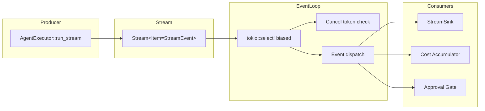

# Event Loop

The `EventLoop` is the runtime's core dispatch mechanism for streaming events produced by the agent execution pipeline. It bridges the asynchronous, event-driven world of LLM streaming responses and tool executions with the synchronous expectations of consumers like CLI progress renderers, web dashboards, and test harnesses. Understanding the event loop is essential for anyone building a frontend for xaft, debugging streaming behavior, or implementing custom event handlers.

## Architecture Overview

The event loop is built on a simple principle: the `AgentExecutor::run_stream()` method produces a `Stream<Item = StreamEvent>`, and the `EventLoop::consume()` method drains this stream, dispatching each event to the appropriate handler. The stream is processed using Tokio's `select!` macro with biased prioritization, which ensures that cancellation signals are always checked before processing the next event.



## The consume() Method

The `consume()` method is the heart of the event loop. It enters a loop that repeatedly awaits the next event from the stream, while simultaneously listening for a cancellation signal. The implementation uses `tokio::select!` with the `biased` modifier, which means the branches are evaluated in declaration order and the first ready branch wins.

```rust
async fn consume(&mut self) -> Result<(), RuntimeError> {
    loop {
        tokio::select! {
            biased;

            // Priority 1: Cancellation
            _ = self.cancel.cancelled() => {
                return Err(RuntimeError::Cancelled);
            }

            // Priority 2: Next stream event
            event = self.stream.next() => {
                match event {
                    Some(Ok(event)) => self.dispatch(event)?,
                    Some(Err(e)) => return Err(RuntimeError::Agent(e.into())),
                    None => return Ok(()), // Stream exhausted = normal termination
                }
            }
        }
    }
}
```

### Why Biased Select Matters

The `biased` keyword is not a cosmetic choice — it is a correctness requirement. Without biased prioritization, Tokio's `select!` macro chooses randomly among ready branches, which means that under heavy event load (which is the common case during agent execution — every streaming token produces a `TextDelta`), the cancellation branch might never be selected. This would make it impossible to cancel a running task, which is unacceptable for an interactive tool where the user expects Ctrl+C to produce an immediate response.

With biased selection, the cancellation token is checked first on every iteration. If it is signaled, the event loop returns `RuntimeError::Cancelled` immediately, regardless of how many events are buffered in the stream. The stream is then dropped, which cancels the underlying agent execution through the same cancellation token.

### Cancellation Token Propagation

The cancellation token is a `tokio_util::sync::CancellationToken` that is created at the task level and shared between the event loop, the orchestrator, and the agent. When the user presses Ctrl+C (or the API sends a cancellation request), the token is cancelled, and every component that holds a clone of the token receives the signal simultaneously. This means the agent stops generating, the orchestrator stops driving turns, and the event loop stops consuming — all in the same `select!` iteration.

The cancellation is cooperative, not preemptive. If the agent is in the middle of executing a long-running tool (for example, a `ShellExec` that runs a build command), the tool is not killed instantly. Instead, the cancellation signal is checked between events, and the tool will complete its current execution before the loop exits. This design avoids the data corruption risks associated with forcefully terminating processes mid-write. For tools that support it (like `ShellExec` with a `timeout` parameter), the tool itself checks the cancellation token and terminates early.

## Event Dispatch

When a `StreamEvent` is received, the `dispatch()` method matches on the event variant and routes it to the appropriate handler. Each variant has distinct semantics and lifecycle implications:

### TextDelta

A `TextDelta` event carries a fragment of the LLM's text response. These events arrive at high frequency — typically one per 10-50 milliseconds during active generation — and are the primary input for real-time progress display. The event loop forwards `TextDelta` events to the `StreamSink` immediately, without batching or buffering. This design minimizes latency between the LLM's generation and the user seeing the output.

In headless mode, `TextDelta` events are typically consumed by a `CollectSink` that concatenates all deltas into the final response text. In interactive mode, they are consumed by a `ChannelSink` that sends each delta to the terminal renderer, which may apply its own batching logic for rendering efficiency.

### ThinkingDelta

`ThinkingDelta` events carry the LLM's "thinking" or "reasoning" output — the internal chain-of-thought that models like Claude produce before their final response. These events are structurally identical to `TextDelta` but are semantically distinct: they represent the agent's reasoning process, not its output. The event loop forwards them to the `StreamSink` just like `TextDelta`, but consumers typically display them differently (for example, in a collapsed "thinking" section in the UI, or with a dimmed text style in the terminal).

### ToolExecution

A `ToolExecution` event signals that a tool has begun executing. It carries the tool name, the input parameters, and a unique call ID that links it to the corresponding `ToolResult` event. The event loop uses this event to update progress indicators ("Running WriteFile...") and to log the tool invocation for auditing purposes. This event does not require user interaction — it is purely informational.

### ToolResult

A `ToolResult` event carries the output of a completed tool execution. It references the call ID from the corresponding `ToolExecution` event, and includes the output data (which may be text, structured JSON, or an error message). The event loop forwards `ToolResult` events to the `StreamSink` and also triggers the agent's `on_tool_result` hook, which may emit additional signals or update the agent's internal state.

### PendingApproval

A `PendingApproval` event signals that a tool call requires user approval before it can execute. This event is only emitted when the tool is in the write registry and neither `auto_approve` nor `dangerously_skip_permissions` is set. The event loop pauses event processing and waits for an approval decision — either through an interactive prompt (in terminal mode) or through an API callback (in headless mode).

The approval gate is the event loop's only blocking point. All other events are processed as they arrive, but `PendingApproval` requires an external decision. If the user denies the approval, the tool is not executed and a `ToolResult` with an error message is synthesized and dispatched. If the user approves, the tool executes and the normal `ToolExecution` → `ToolResult` sequence follows.

### GuardrailOverride

A `GuardrailOverride` event signals that a content guardrail — for example, a check that prevents the agent from writing to files outside the workspace — has been triggered, and the agent is requesting an override. This event is handled similarly to `PendingApproval`: the event loop pauses and waits for a decision. Override requests are rare and typically only appear in edge cases where the agent legitimately needs to access a file outside the workspace (for example, writing to a shared configuration directory).

### ToolCallDelta

A `ToolCallDelta` event carries a fragment of a tool call's input parameters as they are being streamed by the LLM. Not all models support streaming tool call inputs; for models that do, these deltas allow the frontend to show a live preview of the tool call as it is being constructed. The event loop forwards these deltas to the `StreamSink` without modification. For models that do not support streaming tool calls, the tool call input arrives atomically in the `ToolExecution` event.

### Done

A `Done` event signals that the agent has completed its work. The event carries a final summary of the task's outcome, including the exit code and any summary text the agent produced. When the event loop receives `Done`, it performs final cleanup — flushing the `StreamSink`, unsubscribing from the `SignalBus`, and breaking out of the consume loop. The `Done` event is always the last event in the stream; any events produced after `Done` are discarded.

### Error

An `Error` event signals an unrecoverable error in the agent execution pipeline. The event carries the error details. When the event loop receives `Error`, it does not attempt to continue — it returns `RuntimeError::AgentFailed` immediately, triggering the error-handling path in `run_task()` which restores the git worktree and cleans up the session. Error events are distinct from `ToolResult` errors (which are recoverable) — they represent failures in the orchestration layer itself, such as a provider returning a persistent 500 error or the agent exceeding its maximum turn count.

## Lifecycle Guarantees

The event loop provides several important lifecycle guarantees:

1. **Exactly-once dispatch**: Every event produced by the stream is dispatched exactly once. There is no risk of duplicate dispatch or skipped events, because the stream is consumed sequentially and the event loop never re-enters the dispatch method for the same event.

2. **Ordered delivery**: Events are dispatched in the order they are produced by the stream. The `biased` select does not reorder events — it only prioritizes the cancellation check, which does not produce events.

3. **Graceful termination on cancellation**: When cancelled, the event loop returns immediately but does not abort in-flight tool executions. The next call to `consume()` after a cancellation will find the stream in a terminal state.

4. **No event loss on normal termination**: The `Done` event is always dispatched before the loop exits. This means consumers can rely on receiving `Done` as a termination signal, even if the agent produces a very large number of events.
