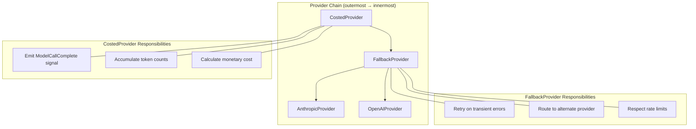
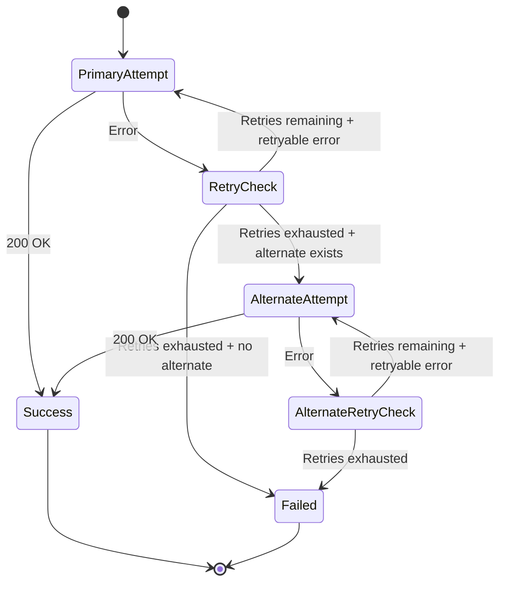
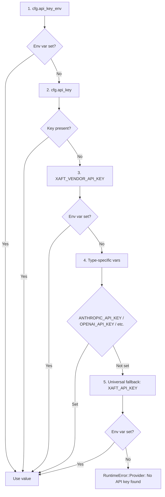

# Provider Factory

The `ProviderFactory` is responsible for constructing the LLM provider stack that drives all model interactions during a task. It transforms a model configuration into a layered provider chain that handles API communication, retry logic, fallback routing, and cost tracking. This page documents the factory's construction algorithm, the layered provider architecture, and the API key resolution strategy that makes credential management transparent and flexible.

## Provider Chain Architecture

The provider chain is built as a series of decorator layers, each adding a specific capability to the underlying provider. The outermost layer is the one that the runtime interacts with; each layer delegates to the next inner layer after applying its own logic.



## ProviderFactory::build() Algorithm

The `build()` method takes a `ProviderConfig` and produces a fully constructed `Box<dyn LlmProvider>`. The construction proceeds in three stages:

### Stage 1: Base Provider Construction

The factory first determines the base provider type from the `model` field in the configuration. Model names follow a convention that encodes the provider: `claude-*` models route to `AnthropicProvider`, `gpt-*` and `o1-*` models route to `OpenAIProvider`, and so on. The factory maintains a registry of provider constructors, each keyed by a prefix-matching rule.

Each base provider constructor receives the resolved API key (see [API Key Resolution](#api-key-resolution) below) and the model-specific configuration (temperature, max tokens, etc.). The base provider is responsible for translating xaft's generic `LlmRequest` into the provider's native API format, sending the HTTP request, and parsing the streaming response into xaft's `StreamEvent` types.

If the model name does not match any known provider prefix, the factory returns `RuntimeError::Provider` with a message listing the supported models and their expected naming patterns. This fail-fast behavior prevents silent misrouting — for example, sending a Claude prompt to the OpenAI API, which would produce garbled responses rather than a clear error.

### Stage 2: FallbackProvider Wrapping

The base provider is wrapped in a `FallbackProvider` that adds retry logic and optional alternate-provider routing. The `FallbackProvider` configuration specifies:

- **Max retries**: The number of times to retry a failed request before giving up. Defaults to 3.
- **Retry backoff**: The backoff strategy for retries — fixed, exponential, or exponential with jitter. The default is exponential with jitter, which avoids the "thundering herd" problem when multiple agents retry simultaneously after a provider outage.
- **Retryable errors**: The set of error conditions that trigger a retry. Typically includes HTTP 429 (rate limit), HTTP 500/502/503 (server errors), and network timeouts. Non-retryable errors like HTTP 401 (authentication failure) are immediately propagated without retry.
- **Alternate providers**: An optional list of fallback providers to try if the primary provider exhausts its retries. This enables configurations like "try Claude first, fall back to GPT-4 if Claude is unavailable."

The `FallbackProvider` implements a state machine for each request:



### Stage 3: CostedProvider Wrapping

The outermost layer is the `CostedProvider`, which wraps the `FallbackProvider` and adds cost tracking. Every LLM call that passes through the `CostedProvider` triggers two actions:

1. **Signal emission**: After the call completes (whether successfully or with an error), the `CostedProvider` emits a `ModelCallComplete` signal on the `SignalBus`. This signal carries the model name, input token count, output token count, latency, and calculated cost. The tool-call logger (attached during bootstrap) subscribes to this signal and persists it to the session store.

2. **Accumulator update**: The `CostedProvider` maintains an atomic cost accumulator that tracks the cumulative cost of all calls made through this provider instance. The accumulator is checked against the budget limits specified in `RunConfig` after every call. If the budget is exceeded, the `CostedProvider` returns an error immediately, which propagates through the `FallbackProvider` (which does not retry budget errors) and terminates the workflow.

The cost calculation uses a model-specific pricing table that maps model names to per-token costs for input and output tokens. The pricing table is embedded in the xaft binary and is updated with each release. For models that are not in the pricing table (for example, a newly released model), the `CostedProvider` uses a conservative default rate and logs a warning. This ensures that cost tracking never silently underestimates the actual cost.

## API Key Resolution

The API key resolution algorithm is one of the most frequently misunderstood parts of the provider factory. It implements a multi-layered fallback chain that balances security, convenience, and flexibility. The algorithm is applied per-provider — an AnthropicProvider and an OpenAIProvider in the same chain will resolve their keys independently.

### Resolution Chain

The resolution chain proceeds in the following order, with the first successful resolution winning:



### Layer 1: cfg.api_key_env

The `api_key_env` field in the provider configuration specifies the name of an environment variable that contains the API key. This is the most secure option for production deployments, because it allows the key to be injected by a secret manager (like HashiCorp Vault, AWS Secrets Manager, or Kubernetes secrets) without writing the key to disk. The environment variable is read at provider construction time, not at configuration parse time, which means the key can be rotated without restarting the runtime.

### Layer 2: cfg.api_key

The `api_key` field in the provider configuration contains the API key directly. This is the least secure option — the key is stored in plain text in the configuration file — but it is the most convenient for local development and quick prototyping. The configuration file should be protected with appropriate filesystem permissions (0600 on Unix) and should never be committed to version control.

When both `api_key_env` and `api_key` are specified, `api_key_env` takes precedence. This allows a configuration file to include a default key for convenience while still supporting environment variable overrides in CI or production environments.

### Layer 3: XAFT_<VENDOR>_API_KEY

If neither `api_key_env` nor `api_key` is specified, the factory looks for a convention-based environment variable named `XAFT_<VENDOR>_API_KEY`, where `<VENDOR>` is the provider's name in uppercase. For example, the Anthropic provider looks for `XAFT_ANTHROPIC_API_KEY`, and the OpenAI provider looks for `XAFT_OPENAI_API_KEY`.

This convention provides a middle ground between security and convenience. It allows users to set a single environment variable per provider in their shell profile, and it avoids the need to create provider-specific configuration entries for the sole purpose of specifying a key. The `XAFT_` prefix prevents namespace collisions with other tools that might use `ANTHROPIC_API_KEY` for different purposes.

### Layer 4: Type-Specific Variables

If the xaft-namespaced variable is not set, the factory falls back to the provider's native environment variable convention. For Anthropic, this is `ANTHROPIC_API_KEY`; for OpenAI, it is `OPENAI_API_KEY`; and so on. This layer maximizes interoperability with existing tooling — if the user already has `ANTHROPIC_API_KEY` set for the Claude CLI or the Anthropic SDK, xaft will find and use it without any additional configuration.

The fallback to native variables is intentional and important. Many users have already configured these variables for their existing workflows, and requiring them to duplicate the key under a different name would be friction that serves no purpose. The xaft-specific variables (Layer 3) exist for cases where the user needs different keys for xaft and for other tools, or where the native variable is set to a different value.

### Layer 5: Universal Fallback

The final fallback is the universal `XAFT_API_KEY` environment variable. This variable is shared across all providers and is intended for single-provider setups where the user only uses one LLM backend. If `XAFT_API_KEY` is set and no provider-specific key is found, the factory uses this value for all providers.

The universal fallback is useful for getting started quickly — set one environment variable and you're ready to run agents against any supported provider. However, it is not suitable for multi-provider setups, because sharing a single key across providers would cause authentication failures (an OpenAI key cannot authenticate against the Anthropic API).

### Resolution Failure

If none of the five layers produces a key, the factory returns `RuntimeError::Provider` with a detailed error message that lists every variable that was checked, in order. This message is designed to be immediately actionable — the user can see exactly which variable to set to resolve the error, without needing to consult documentation.

## Provider Trait Interface

All providers — regardless of their position in the chain — implement the `LlmProvider` trait:

```rust
#[async_trait]
pub trait LlmProvider: Send + Sync {
    async fn complete(&self, request: LlmRequest) -> Result<LlmResponse, ProviderError>;
    fn stream(&self, request: LlmRequest) -> BoxStream<'static, Result<StreamEvent, ProviderError>>;
    fn model_name(&self) -> &str;
    fn supports_tools(&self) -> bool;
    fn supports_thinking(&self) -> bool;
}
```

The `stream()` method returns a boxed stream that yields `StreamEvent` items, which are consumed by the event loop. The `supports_tools()` and `supports_thinking()` methods allow the runtime to query the provider's capabilities before constructing tool-calling or thinking prompts, avoiding unnecessary prompt construction for models that do not support these features.

The decorator layers (`FallbackProvider`, `CostedProvider`) implement this same trait, delegating to the inner provider and adding their own logic. This uniform interface is what makes the layered architecture possible — the runtime never needs to know whether it is talking to a raw provider, a retried provider, or a costed provider. It simply calls `stream()` and processes the resulting events.
