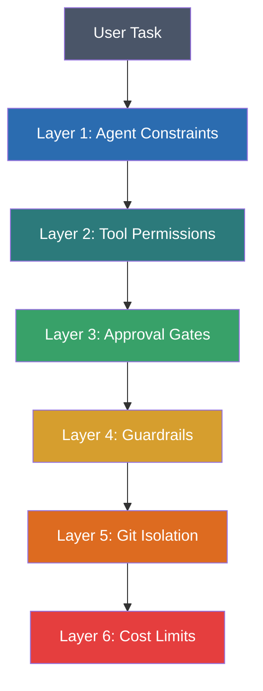

# Safety Overview: Defense in Depth

The xaft safety system is designed around the principle of defense in depth — multiple, independent layers of protection that each mitigate different classes of risk. No single layer is sufficient to prevent all harmful actions, but the combination of layers provides comprehensive coverage that makes catastrophic failures extremely unlikely. Each layer operates independently, so the failure or bypass of one layer does not compromise the others. This document provides an overview of all safety layers and how they work together to protect the user's code, data, and system.

## The Safety Layers

### Layer 1: Agent Constraints

Agent constraints are the first line of defense, configured through `AgentPreset`. They limit what an agent can do by restricting which tools are available (`allowed_tools` and `denied_tools`), how many turns it can take (`max_turns`), and how creative or conservative its outputs are (`temperature`, `top_p`). By default, agents are configured conservatively — they have access to a curated set of safe tools and are limited to 25 turns per task. This prevents runaway agents from consuming unlimited resources or executing unexpected tool chains.

The `system_prompt` field also plays a safety role by instructing the agent about acceptable behavior. While system prompts are not enforceable guarantees (the LLM may ignore them), they significantly reduce the probability of harmful outputs by establishing behavioral norms. Well-crafted system prompts include instructions about not deleting important files, not executing destructive shell commands, and not modifying files outside the project directory.

### Layer 2: Tool Permissions

Tool permissions control which tools are available and how they can be configured. The `ToolConfig` map in `XaftConfig` allows administrators to disable specific tools entirely, set size limits for file operations, and configure timeouts for long-running tools. Even if an agent attempts to invoke a disabled tool, the runtime rejects the invocation before any execution occurs. This provides a hard boundary that the agent cannot bypass, regardless of its system prompt or behavior.

Tool permissions also include resource limits: file size caps prevent the agent from creating or reading extremely large files, and execution timeouts prevent tools from running indefinitely. These limits protect against both accidental resource exhaustion (e.g., the agent tries to read a 10GB log file) and adversarial prompt injection attacks that attempt to cause denial-of-service through resource consumption.

### Layer 3: Approval Gates

Approval gates are the interactive safety layer that requires explicit user consent for potentially dangerous operations. The `ApprovalGate` trait defines the interface for requesting and responding to approval, and concrete implementations (like `TuiApprovalGate` and `AutoApproveGate`) provide different approval strategies. The TUI approval gate presents a visual overlay that the user can approve or deny, while the auto-approve gate automatically approves all requests (useful for non-interactive CI/CD environments).

Approval gates are invoked before tool execution, giving the user a chance to review and veto any operation. The approval request includes the tool name, its parameters, and a computed risk level based on guardrail rules. High-risk operations (file deletion, shell command execution) always require approval, while low-risk operations (file reads, directory listings) may be auto-approved depending on the guardrail configuration. See [Approval Gates](02-approval-gates.md) for detailed documentation.

### Layer 4: Guardrails

Guardrails are the rule-based safety layer that automatically evaluates tool invocations against a set of configurable policies. The `GuardrailConfig` defines rules for file destruction (preventing deletion of protected paths), secret leakage (detecting and blocking output that contains API keys, passwords, or other secrets), cost limits (capping API spending), and command approval (classifying shell commands by risk level). Guardrails operate at the pre-execution phase — they evaluate the tool's parameters before the tool is executed and can block the invocation entirely.

The guardrail system is designed to be extensible. Custom guardrail rules can be added through the plugin system, allowing organizations to implement domain-specific safety policies (e.g., "never modify files in the `vendor/` directory" or "always require approval for database schema changes"). Guardrails are checked in order, and the first failing guardrail blocks execution. This short-circuit evaluation ensures that the most restrictive rules take precedence.

### Layer 5: Git Isolation

Git isolation ensures that the agent's modifications never directly affect the user's working directory. Every session operates within its own git worktree, and changes are only committed and merged back upon successful completion. If the session fails or is cancelled, the worktree is restored and the branch is cleaned up, leaving no trace of the agent's activity. This provides a natural rollback mechanism — the worst-case scenario is that the user's repository is unchanged, not that it's in a broken state.

The git isolation layer also provides auditing capabilities. Every commit created by the agent is tagged with metadata (session ID, agent name, model, token count), making it easy to identify and review agent-produced changes. The commit history in the worktree branch provides a detailed record of every modification the agent made, in order, which is invaluable for debugging and trust verification.

### Layer 6: Cost Limits

Cost limits prevent runaway API spending by capping the total cost of LLM calls per session and per task. The `CostLimitConfig` specifies maximum dollar amounts, and the runtime tracks cumulative spending across all LLM calls. When the cost limit is reached, the runtime stops making new LLM calls and transitions the session to a terminal state. A warning is emitted when spending reaches 80% of the limit, giving the user advance notice.

Cost limits are enforced at the API call level — before each LLM call, the runtime estimates the cost (based on the prompt length and the model's pricing) and checks whether the estimated cost would exceed the remaining budget. If it would, the call is blocked. This proactive approach prevents the situation where a single expensive call pushes the total cost well beyond the limit. The cost tracking is updated after each API response with the actual token counts and cost, ensuring accurate accounting.

## How the Layers Work Together

The defense-in-depth model means that each layer catches failures that slip through the others. For example:

- If an agent ignores its system prompt and tries to delete a file (Layer 1 failure), the tool permission system may block the deletion tool entirely (Layer 2 catches it).
- If the deletion tool is enabled (Layer 2 allows it), the guardrail system may classify the deletion as high-risk (Layer 4 catches it).
- If the guardrail doesn't have a specific rule for the file (Layer 4 misses it), the approval gate requires user consent (Layer 3 catches it).
- If the user accidentally approves the deletion (Layer 3 failure), the git isolation ensures the change is in a worktree, not the main directory (Layer 5 catches it).
- If all else fails and the file is deleted in the worktree, the session can be cancelled and the worktree restored (Layer 5 recovery).

This cascading protection means that no single point of failure can lead to catastrophic data loss. The user's working directory is always protected by the git isolation layer, regardless of what happens in the upper layers. This is the core guarantee of the xaft safety model: **the main working directory is never modified directly**, and any changes can always be rolled back.

## Threat Model

The xaft safety system is designed to protect against the following threat categories:

| Threat | Primary Layer | Secondary Layer |
|--------|--------------|-----------------|
| Accidental file deletion | Agent constraints | Git isolation |
| Adversarial prompt injection | Tool permissions | Approval gates |
| Runaway API costs | Cost limits | Agent max_turns |
| Secret leakage in output | Secret guardrails | Agent system prompt |
| Unauthorized shell commands | Command approval | Tool permissions |
| Resource exhaustion | Tool size limits | Execution timeouts |
| Concurrent session conflicts | Git worktree isolation | Branch naming |
| Malicious plugin code | Plugin sandbox | Filesystem access control |

The system is **not** designed to protect against a compromised runtime binary or a compromised host operating system. These are out-of-scope threats that require operating-system-level security mechanisms (sandboxing, containerization, virtualization) that are beyond xaft's responsibility.
