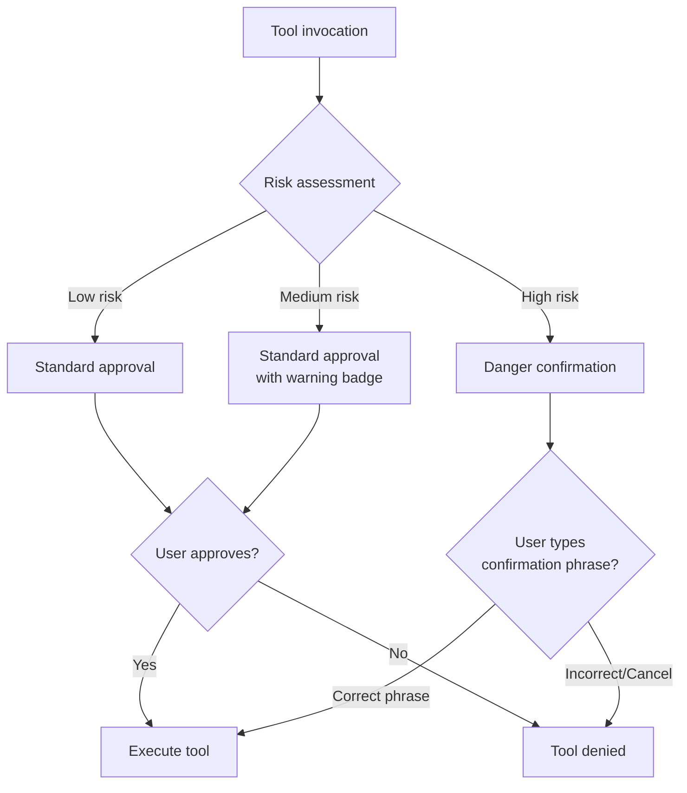

# Approval Gates

Approval gates are the interactive safety mechanism that gives users direct control over potentially dangerous operations. The system is built around the `ApprovalGate` trait, which defines the interface for requesting and responding to approvals, and two concrete implementations — `TuiApprovalGate` for interactive terminal sessions and `AutoApproveGate` for headless or CI/CD environments. This document covers the trait design, the implementations, and the special danger confirmation flow that adds an extra layer of protection for the most risky operations.

## The ApprovalGate Trait

The `ApprovalGate` trait defines the contract that all approval mechanisms must implement. It is designed to be async-first (since approval may involve waiting for user input) and type-safe (since the response is a boolean, not a generic value).

```rust
#[async_trait]
pub trait ApprovalGate: Send + Sync {
    /// Request approval for a tool invocation.
    /// Returns true if approved, false if denied.
    async fn request(&self, tool_name: &str, params: &Value) -> Result<bool>;

    /// Respond to a specific approval request.
    /// Used by the UI to send the user's decision.
    async fn respond(&self, request_id: &str, approved: bool);

    /// Cancel all pending approval requests.
    /// Called during session shutdown to unblock waiting tools.
    async fn cancel_all(&self);
}
```

The trait has three methods:

- **request()**: Called by the tool execution context before the tool runs. It takes the tool name and its parameters, and returns a boolean indicating whether the operation is approved. This method is async because it may block while waiting for user input (in the TUI implementation) or for an external system's response (in a hypothetical remote approval implementation).

- **respond()**: Called by the UI (or any external system) to deliver the user's decision for a specific request. The `request_id` parameter identifies which request is being answered, and `approved` is the user's decision. This method is separate from `request()` because the decision is made asynchronously — the tool execution context is awaiting `request()`, while the UI calls `respond()` on a different task.

- **cancel_all()**: Called during session cancellation to deny all pending requests and unblock any tools that are waiting for approval. This ensures that the shutdown sequence is not blocked by a tool waiting indefinitely for user input.

## TuiApprovalGate

The `TuiApprovalGate` is the primary implementation used in interactive terminal sessions. It integrates with the TUI's `ApprovalWidget` overlay to present approval requests visually and collect the user's decision via keyboard or mouse input.

### Internal State

The `TuiApprovalGate` maintains the following internal state:

- **pending**: A `HashMap<String, oneshot::Sender<bool>>` that maps request IDs to oneshot senders. When a request is created, a oneshot channel is created, and the sender is stored in this map. The receiver is returned to the tool execution context, which awaits it. When the user responds (via `respond()`) or the request times out, the sender is used to deliver the decision.
- **signal_bus**: A reference to the `SignalBus`, used to emit `ToolPendingApproval` signals that the `EventBridge` converts to TUI events.
- **timeout_duration**: The duration after which an unresponded request is automatically denied. Defaults to 120 seconds.

### Request Flow

1. The tool execution context calls `request(tool_name, params)`.
2. A unique request ID is generated (UUID v4).
3. A `oneshot::channel<bool>()` is created. The sender is stored in `pending[id]`.
4. A timeout task is spawned: `tokio::spawn(async { sleep(timeout); send(false); })`.
5. A `ToolPendingApproval` signal is emitted on the `SignalBus`.
6. The `EventBridge` converts the signal to `TuiEvent::ToolPendingApproval` and sends it to the TUI.
7. The TUI's main loop adds the request to `AppState::approval_queue` and displays the `ApprovalWidget`.
8. The user presses a key to approve or deny.
9. The TUI's main loop calls `respond(id, approved)`.
10. The oneshot sender sends the boolean to the receiver.
11. The tool execution context receives the decision and proceeds or aborts.

### Cancellation Flow

When the session is cancelled, `cancel_all()` is called:

1. The `pending` HashMap is locked (or the mutex is acquired, depending on the implementation).
2. For each entry, `false` is sent through the oneshot sender.
3. The HashMap is cleared.
4. All timeout tasks are cancelled (their send attempts will fail because the senders have been consumed).

This flow ensures that every tool waiting for approval receives a denial, allowing it to exit cleanly. The denial is treated as a normal approval rejection, not a special cancellation event, which simplifies the tool's error handling.

## AutoApproveGate

The `AutoApproveGate` is a simple implementation that automatically approves all requests. It is used in headless environments (CI/CD pipelines, batch processing, scripted workflows) where interactive approval is not feasible. The implementation is trivial:

```rust
pub struct AutoApproveGate;

#[async_trait]
impl ApprovalGate for AutoApproveGate {
    async fn request(&self, _tool_name: &str, _params: &Value) -> Result<bool> {
        Ok(true) // Always approve
    }

    async fn respond(&self, _request_id: &str, _approved: bool) {
        // No-op: there are no pending requests to respond to
    }

    async fn cancel_all(&self) {
        // No-op: there are no pending requests to cancel
    }
}
```

The `AutoApproveGate` should be used with caution. It provides no interactive safety, so the remaining safety layers (tool permissions, guardrails, git isolation, cost limits) must be sufficient to prevent harmful operations. In CI/CD environments, this typically means that tool permissions are tightly restricted and guardrails are configured with strict rules.

When the `AutoApproveGate` is active, the `ApprovalWidget` is never displayed in the TUI, and the `ToolPendingApproval` signal is not emitted. This reduces visual noise and ensures that the TUI's approval queue remains empty.

## Danger Confirmation Flow

Some operations are considered so risky that a simple approve/deny button is insufficient. The danger confirmation flow adds an extra verification step that requires the user to explicitly acknowledge the risk before the operation proceeds. This flow is triggered for operations that match specific danger patterns:

- **File deletion of protected paths**: Deleting files in directories marked as protected in `GuardrailConfig`
- **Destructive shell commands**: Commands matching the `deny` patterns in `CommandApprovalConfig` that have been escalated rather than outright denied
- **Large-scale file modifications**: Operations that modify more than a configurable number of files in a single tool call
- **Schema migrations**: Modifications to database schema files (detected by filename pattern)

When a danger confirmation is required, the approval flow is modified:

1. **Risk Assessment**: The guardrail engine evaluates the tool's parameters against danger patterns and computes a risk score.
2. **Enhanced Display**: The `ApprovalWidget` displays the operation with a red "DANGER" badge, the full parameters, and a clear description of the potential consequences.
3. **Explicit Confirmation**: The user must type a specific confirmation phrase (e.g., "yes, delete these files" or the exact file path being deleted) to approve the operation. Simply pressing "Approve" is not sufficient.
4. **Audit Logging**: The confirmation is logged with the user's typed phrase, the tool parameters, and a timestamp. This creates an audit trail for post-incident analysis.



### Confirmation Phrase Matching

The confirmation phrase is generated based on the operation type. For file deletions, the phrase is the exact path of the file being deleted. For shell commands, the phrase is the exact command string. This design ensures that the user must read and acknowledge the specific operation, preventing rubber-stamp approvals where the user clicks "approve" without reading the details.

Phrase matching is case-sensitive and requires an exact match. Partial matches, abbreviations, and variations are rejected. This strictness is intentional — it forces the user to pay close attention to the operation they are approving. The confirmation input is rendered in the `ApprovalWidget` with a red border and a blinking cursor, drawing the user's attention to the severity of the action.

## Integration with the Guardrail System

The approval gate and guardrail systems work together to provide layered protection. The guardrail system evaluates tool parameters first and classifies the operation by risk level. This classification is then used by the approval gate to determine the appropriate approval flow:

- **Low risk**: Auto-approved (if `AutoApproveGate`) or standard approval (if `TuiApprovalGate`)
- **Medium risk**: Standard approval with a warning indicator
- **High risk**: Danger confirmation with explicit phrase matching

The guardrail system can also outright deny an operation without involving the approval gate. This happens when the operation matches a `deny` pattern in `CommandApprovalConfig` — the denial is immediate and non-negotiable. The approval gate is only consulted for operations that are not outright denied, ensuring that the most dangerous operations are blocked at the earliest possible stage.

This two-phase approach — guardrails first, then approval gates — ensures that the approval gate is never asked to approve an operation that should be automatically denied. It also means that the guardrail system can be updated independently of the approval system, allowing new denial rules to be added without modifying the approval gate implementation.
