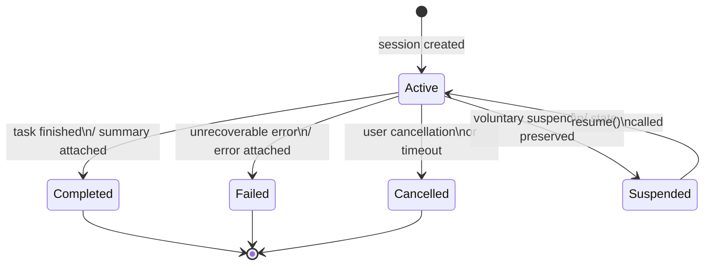

# SessionStatus State Machine

The `SessionStatus` state machine governs the lifecycle of every xaft session from creation through terminal disposition. It is the canonical source of truth for whether a session is actively processing, temporarily suspended, or permanently concluded. Every session begins in the `Active` state and may transition through several intermediate states before reaching a terminal disposition. Understanding these transitions is critical for building reliable orchestration logic, implementing correct resumption behavior, and ensuring that resources are properly cleaned up when sessions end.

## State Diagram

## States and Their Semantics

### Active

`Active` is the steady-state of a running session. While in this state, the event loop is processing messages, the LLM is making tool calls, and the agent is making forward progress on the user's task. The session remains `Active` from the moment it is created until one of the four exit transitions fires. The orchestrator continuously monitors the session status to decide whether to continue the agent loop, yield control to another agent, or terminate. A session that is `Active` is considered resumable — if the process crashes or the user disconnects, the session can be recovered from persistence and resumed from its last checkpoint.

### Completed

A session transitions to `Completed` when the agent determines that the user's task has been fully addressed. This is not an automatic transition — it requires the agent to explicitly signal completion, typically by producing a final summary message. The `Completed` state carries a `summary: String` field that captures a human-readable description of what was accomplished. This summary is persisted alongside the session record and is displayed when listing past sessions. Once `Completed`, a session is terminal and cannot be resumed. Any attempt to call `resume()` on a completed session will be rejected by `validate_resumable()`.

### Failed

A session enters the `Failed` state when an unrecoverable error occurs during execution. This could be an LLM API failure that exhausts all retries, a tool execution error that the agent cannot self-correct, or an internal invariant violation. The `Failed` state carries an `error: String` field describing the failure. Like `Completed`, `Failed` is a terminal state — the session cannot be resumed. However, the user can inspect the error message and create a new session with modified parameters to attempt the task again. The error string is persisted and made available through the session listing API.

### Cancelled

The `Cancelled` state represents a session that was terminated by explicit user action, typically via `Ctrl+C` or a cancellation command. Cancellation is cooperative: the runtime sets a cancellation token, the approval gate cancels all pending approvals, and the event loop detects the signal and gracefully winds down. The session is marked `Cancelled` rather than `Failed` to distinguish user-initiated termination from error-induced failure. Like the other terminal states, `Cancelled` is non-resumable. The git worktree associated with a cancelled session is restored to its pre-session state, and any branches created during the session are cleaned up.

### Suspended

The `Suspended` state is a voluntary pause mechanism that allows a session to be temporarily halted and later resumed. When a session is suspended, the full execution state — including conversation history, agent context, and tool state — is persisted to the SQLite store. The key distinction between `Suspended` and the terminal states is that `Suspended` is the only non-`Active` state that supports resumption. Calling `resume()` on a suspended session reloads its state from persistence and transitions it back to `Active`, where the event loop picks up exactly where it left off. This is the recommended way to "pause" long-running tasks without losing progress.

## Resumability Matrix

| State | Resumable | Reasoning |
|-------|-----------|-----------|
| `Active` | Yes | Session is in progress; can be reattached after crash or reconnect |
| `Suspended` | Yes | Explicitly preserved for later resumption; full state persisted |
| `Completed` | No | Task is done; no further work to perform |
| `Failed` | No | Unrecoverable error; resuming would hit the same error |
| `Cancelled` | No | User explicitly terminated; resuming would violate intent |

The `validate_resumable()` method on `SessionManager` enforces this matrix. It checks the current status of a loaded session and returns an error if the session is in a non-resumable state. This prevents accidental resumption of completed or failed sessions, which could lead to duplicate work or repeated failures. The resumability check is performed before any state restoration occurs, ensuring that resources are not allocated for sessions that cannot make forward progress.

## Transition Guards and Side Effects

Each transition carries specific side effects that ensure system consistency:

- **Active → Completed**: The git worktree is committed with a final commit message derived from the summary. A `XaftCommitCreated` signal is emitted. The session's `total_cost_usd` and `total_tokens` are finalized and persisted.
- **Active → Failed**: The git worktree is restored to its pre-session state. Any branches created during the session are deleted. The error message is captured and persisted. No commit is created.
- **Active → Cancelled**: Identical cleanup to the `Failed` transition — worktree restoration and branch cleanup. The cancellation is logged with a timestamp for audit purposes.
- **Active → Suspended**: The full session state is persisted, including conversation history and agent context. No git cleanup occurs — the worktree is left in its current state so that resumption can continue seamlessly.
- **Suspended → Active**: The session state is reloaded from persistence. The event loop is restarted. Any streaming renderers or token counters are reinitialized from the persisted state. The git worktree is verified to still exist and be in a consistent state.

## Implementation Notes

The `SessionStatus` enum is serialized as a tagged JSON object when persisted to SQLite. The `status_json` column in the `sessions` table stores the full status including any attached data (summary, error). This design allows the status to be queried efficiently without joining additional tables. When loading a session, the status is deserialized from JSON and validated against the resumability matrix before any state restoration begins. The status is also exposed through the TUI's status bar widget, which displays the current state with color-coded indicators: green for `Active`, blue for `Suspended`, yellow for `Completed`, red for `Failed`, and gray for `Cancelled`.
