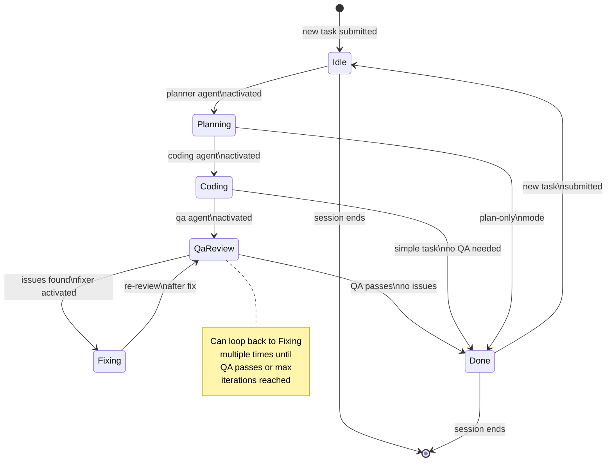

# WorkflowPhase State Machine

The `WorkflowPhase` state machine models the high-level progression of a task through the xaft agent orchestration pipeline. Unlike `SessionStatus`, which tracks whether a session is running or stopped, `WorkflowPhase` tracks *what the agent is doing* at any given moment. This phase information drives the TUI's visual presentation — different phases display different panels, status messages, and activity indicators — and also determines which agents are invoked and how tool outputs are interpreted. The workflow phase is inferred from the active agent's name, making the phase transition mechanism declarative rather than imperative.

## State Diagram

## Phase Definitions

### Idle

The `Idle` phase represents a session that is waiting for user input. No agent is currently running, and the system is in a quiescent state. The TUI displays the conversation widget with a blinking cursor in the input bar, ready to accept a new task. When the user submits a task, the orchestrator transitions to `Planning` by invoking the planner agent. The `Idle` phase is also entered after a task completes (`Done → Idle`), allowing the user to submit follow-up tasks within the same session. This design enables conversational workflows where the context of previous tasks carries forward into subsequent interactions.

### Planning

During the `Planning` phase, the planner agent analyzes the user's task, examines the codebase, and produces a structured plan. The plan typically includes a sequence of steps, each describing a file to modify or a tool to invoke. The planning phase is critical for complex tasks that require multi-step execution, as it provides a roadmap that the coding agent can follow. A `XaftPlanCreated` signal is emitted when the plan is finalized, and a `XaftPlanEmpty` signal is emitted if the planner determines that no action is needed. The TUI displays the plan in the agent activity panel, allowing the user to review the proposed approach before coding begins. If the plan-only mode is enabled, the workflow transitions directly to `Done` after planning completes, skipping the coding and QA phases entirely.

### Coding

The `Coding` phase is where the primary work happens. The coding agent reads the plan (if one was produced), executes tool calls to modify files, and makes iterative progress toward the task goal. This is typically the longest phase, and it may involve multiple rounds of tool calls, file reads, and edits. The TUI displays real-time tool activity in the agent activity panel, a diff viewer showing file changes, and a file tree highlighting modified files. Token consumption and cost accumulate during this phase, and the token dashboard widget provides live updates. The coding phase ends when the coding agent signals completion, at which point the orchestrator either transitions to `QaReview` (if a QA agent is configured) or directly to `Done` for simple tasks that don't require review.

### QaReview

The `QaReview` phase activates the quality assurance agent, which reviews the changes made during the coding phase. The QA agent examines diffs, runs linters and tests, and evaluates whether the implementation meets the original task requirements. This phase implements the critical review loop that catches regressions, style violations, and logical errors before changes are committed. The QA agent's output is displayed in the agent activity panel, with issues categorized by severity. If the QA agent finds issues, the workflow transitions to the `Fixing` phase. If no issues are found, the workflow transitions to `Done`, and the changes are eligible for commit. The QA review loop can execute multiple times (alternating between `Fixing` and `QaReview`) until all issues are resolved or a maximum iteration count is reached to prevent infinite loops.

### Fixing

The `Fixing` phase is entered when the QA agent reports issues. The fixer agent receives the list of issues along with the current code state and attempts to resolve each one. The fixer has access to the same tools as the coding agent and may modify files, run commands, or request additional context. After the fixer completes, the workflow transitions back to `QaReview` for re-evaluation. This loop continues until the QA agent confirms that all issues have been resolved or the maximum iteration count is reached. The iteration limit is a safety measure that prevents the agent from entering an infinite cycle of creating and fixing bugs. When the limit is reached, the workflow transitions to `Done` with a warning that some issues may remain unresolved.

### Done

The `Done` phase indicates that the task has been completed (or that the workflow has reached a terminal state within the current task). In this phase, the agent's final output is displayed, and the git worktree may be committed depending on the commit policy. The TUI shows a completion summary with total token usage, cost, and a diff of all changes made. The session does not end when the task is done — instead, the workflow transitions back to `Idle`, allowing the user to submit additional tasks. This design supports iterative development workflows where the user can refine the agent's output through follow-up instructions.

## Phase Inference from Agent Name

The workflow phase is not set explicitly through a state machine API. Instead, it is inferred from the name of the currently active agent. This design keeps the phase in sync with the actual execution state without requiring manual state management. The inference rules are:

| Agent Name Pattern | Inferred Phase |
|---|---|
| `planner`, `plan`, `architect` | `Planning` |
| `coder`, `implementer`, `developer` | `Coding` |
| `qa`, `reviewer`, `quality`, `tester` | `QaReview` |
| `fixer`, `repair`, `corrector` | `Fixing` |
| *(no agent active)* | `Idle` or `Done` |

When the orchestrator activates an agent, it passes the agent name to the `WorkflowPhase::from_agent_name()` function, which returns the inferred phase. The phase is then stored in `AppState` and used to drive TUI rendering decisions. If the agent name doesn't match any known pattern, the phase defaults to `Coding`, since the coding phase is the most general catch-all for agent activity. This fallback ensures that custom agents with unconventional names still produce meaningful TUI output.

The inference approach has a key advantage: it requires no changes to the phase system when new agents are added. As long as the agent name follows a recognizable convention, the phase will be inferred correctly. For agents with non-standard names, the `WorkflowPhase` can be overridden explicitly via the agent preset configuration, which includes an optional `phase_hint` field that takes precedence over name-based inference.

## Transition Side Effects

Each phase transition triggers specific side effects in the TUI and the runtime:

- **Idle → Planning**: The TUI clears the diff viewer and file tree. The status bar updates to show "Planning...". The agent activity panel is reset. Token counters are zeroed for the new task.
- **Planning → Coding**: The plan is displayed in the agent activity panel. The status bar updates to show "Coding...". The diff viewer begins tracking file changes.
- **Coding → QaReview**: The status bar updates to show "QA Review...". The agent activity panel switches to display QA findings. The diff viewer freezes its current state for review.
- **QaReview → Fixing**: The status bar updates to show "Fixing...". The agent activity panel shows the list of issues to fix. The diff viewer resumes tracking as the fixer makes changes.
- **Fixing → QaReview**: The iteration counter increments. The status bar shows the current iteration (e.g., "QA Review (iteration 2)"). If the iteration limit is reached, a warning is logged.
- **QaReview → Done**: A completion signal is emitted. The final diff is displayed. The status bar shows "Done" with a summary of changes.
- **Done → Idle**: The TUI resets task-specific state while preserving the conversation history. The input bar is re-enabled for new tasks.

## Error Handling

If an error occurs during any phase, the workflow does not transition to a special error state. Instead, the error is reported through the `RuntimeError` TuiEvent, and the session status transitions to `Failed` via the SessionStatus state machine. The workflow phase remains at whatever it was when the error occurred, providing diagnostic context about what the agent was doing when the failure happened. The TUI displays the error in the conversation widget with the phase name as a prefix, helping the user understand the failure context.
