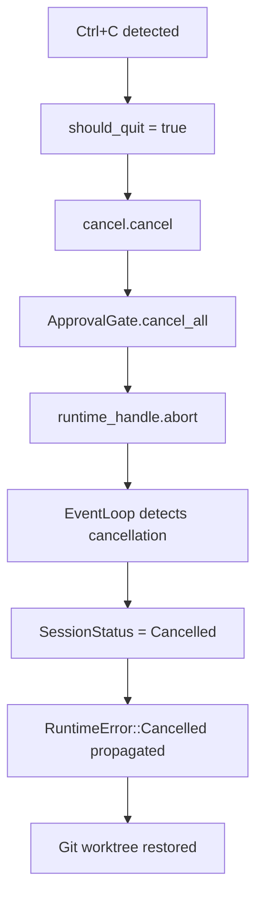
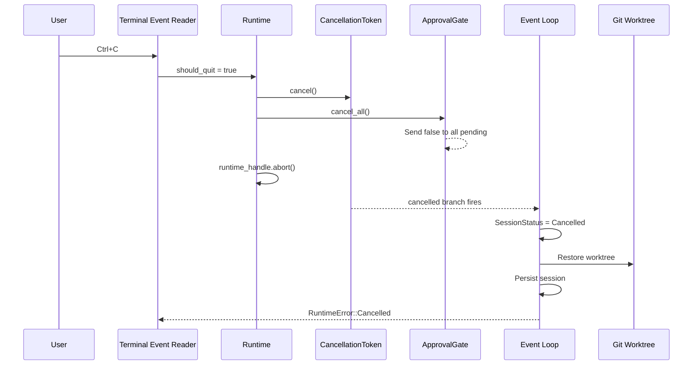

# Cancellation Propagation

Cancellation in xaft is a cooperative, multi-level mechanism that ensures clean shutdown across all subsystems when a user requests termination. Unlike a simple process kill, cooperative cancellation allows each component to perform cleanup — restoring git state, persisting session data, and releasing resources — before shutting down. The cancellation system operates at three distinct levels, each with its own scope and guarantees, and propagation flows from the user's input through the runtime to individual agents and tools.

## Three Levels of Cancellation

### Level 1: CancellationToken (Event Loop)

The `CancellationToken` is the primary cancellation mechanism, based on the `tokio_util::sync::CancellationToken` pattern. It is checked in the event loop's `select!` macro, where it competes with other event sources (LLM responses, tool outputs, timer ticks). When the token is cancelled, the `select!` branch fires, and the event loop begins its graceful shutdown sequence.

The cancellation token is created at session startup and stored in the runtime handle. It is the single source of truth for whether the session has been asked to stop. All long-running operations within the event loop check this token periodically — typically at the start of each iteration — and exit early if it is set. The token is not checked during synchronous tool execution (since those operations cannot be interrupted), but it is checked between tool calls, ensuring that the agent does not start new work after cancellation has been requested.

### Level 2: ApprovalGate cancel_all()

The `ApprovalGate` maintains a collection of pending approval requests. When cancellation is requested, `cancel_all()` is called, which sends `false` (denial) through every pending oneshot channel. This ensures that any tool waiting for user approval immediately receives a denial and can exit cleanly. Without this step, a tool waiting for approval would block indefinitely even after the cancellation token is set, creating a deadlock in the shutdown sequence.

The `cancel_all()` method iterates over all entries in the pending approvals hashmap, sends `false` through each oneshot sender, and clears the hashmap. The corresponding oneshot receivers — which are awaiting approval in the tool execution context — receive the `false` value and interpret it as a denial. The tool then returns an error indicating that the operation was not approved, which propagates up to the agent as a tool failure. This denial-based cancellation is intentional: it allows the agent's error handling to treat cancellation as a normal tool failure rather than a special case.

### Level 3: AgentError::is_cancelled()

At the agent level, errors are checked for cancellation status via the `AgentError::is_cancelled()` method. This method returns `true` if the error was caused by a cancellation request, as opposed to a genuine tool failure or LLM error. The orchestrator uses this check to decide whether to retry the operation (for transient errors) or to propagate the cancellation upward (for cancellation-induced errors). If `is_cancelled()` returns `true`, the orchestrator does not retry and immediately transitions the session to `Cancelled`.

This three-level design ensures that cancellation propagates cleanly through every layer of the system. The `CancellationToken` handles the event loop, `cancel_all()` handles pending approvals, and `AgentError::is_cancelled()` handles agent-level error classification. Together, they guarantee that no component is left in a blocked or inconsistent state after cancellation.

## Propagation Sequence

The full cancellation propagation sequence, from user input to final cleanup, proceeds as follows:

1. **Signal Detection**: The user presses `Ctrl+C`. The terminal event reader detects the key event and sets `should_quit = true` in the shared application state.

2. **Token Cancellation**: The runtime checks `should_quit` on the next tick and calls `cancel.cancel()` on the `CancellationToken`. This unblocks any `select!` branches that are waiting on the token.

3. **Approval Drain**: Simultaneously, `cancel_all()` is called on the approval gate. All pending approval requests receive a denial response, allowing the tools that requested approval to exit their wait loops.

4. **Runtime Abort**: The runtime handle is aborted via `runtime_handle.abort()`. This forcibly terminates any remaining agent tasks that have not yet responded to the cancellation token.

5. **Event Loop Detection**: The event loop's `select!` detects the cancelled token and exits its main loop. It sets the session status to `Cancelled` and propagates a `RuntimeError::Cancelled` to the orchestrator.

6. **Git Worktree Restoration**: The orchestrator catches the `RuntimeError::Cancelled` and initiates git cleanup. The worktree is restored to its pre-session state, and any branches created during the session are deleted. This ensures that the user's repository is left in a clean state after cancellation.

7. **Session Persistence**: The session is persisted with `SessionStatus::Cancelled`. This allows the user to inspect the cancelled session later and understand what was accomplished before termination.

8. **TUI Shutdown**: The TUI receives a `RunComplete` or `Cancelled` event and displays a cancellation message. The terminal is restored from raw mode and alternate screen.

## Cleanup Guarantees

The cancellation system provides several important guarantees:

**Git State Consistency**: Regardless of how cancellation occurs, the git worktree is always restored to its pre-session state. The `WorktreeGuard` implements `Drop`, which triggers automatic cleanup if the guard is dropped without being explicitly committed. This ensures that even a panic or forced termination does not leave the repository in a dirty state.

**No Orphaned Approvals**: The `cancel_all()` method ensures that every pending approval request receives a response. There are no scenarios where a oneshot receiver is left waiting indefinitely after cancellation.

**Session Persistability**: The session is always persisted before the process exits, even during cancellation. This means the user can inspect the session later to understand what was accomplished and what was interrupted. The session status is set to `Cancelled`, and the conversation history up to the point of cancellation is preserved.

**No Partial Tool Execution**: Tools that require approval never execute partially. If a tool is waiting for approval when cancellation occurs, it receives a denial and does not execute. If a tool has already started executing, it runs to completion (since tool execution is not interruptible), but no subsequent tools are invoked.

## Handling Double Cancellation

If the user presses `Ctrl+C` a second time while cancellation is already in progress, the runtime performs a forced exit. The second `Ctrl+C` bypasses the cooperative cancellation mechanism and calls `std::process::exit(1)` directly. This is a safety valve for situations where the graceful shutdown is taking too long (e.g., a tool is stuck in a synchronous operation). The forced exit does not guarantee git worktree restoration or session persistence, so it should be used only as a last resort. The TUI displays a warning after the first `Ctrl+C` indicating that a second press will force-quit.
