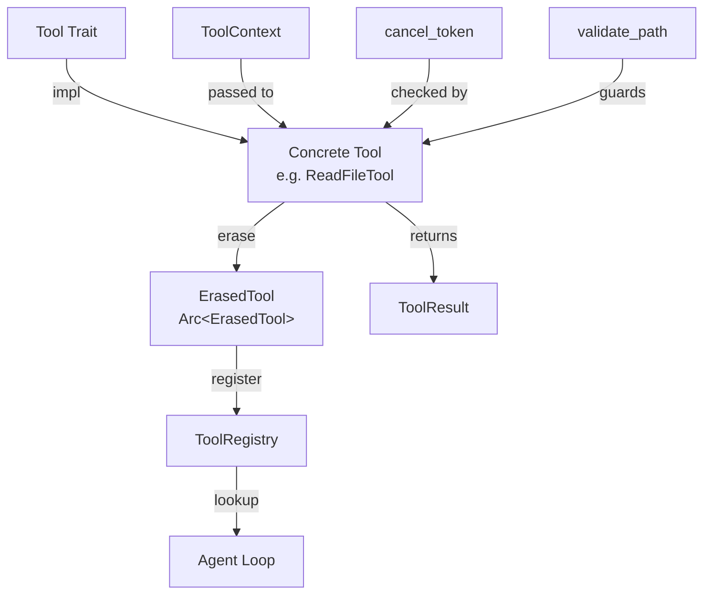

# Tool System Overview

The xaft runtime exposes a fully typed, async-first tool system that lets agents interact with the filesystem, shell, version control, and custom backends. Every capability an agent can exercise flows through the same `Tool` trait, ensuring uniform validation, cancellation, and error handling regardless of whether the operation is a simple file read or a multi-step shell pipeline.

## Architecture

The tool subsystem lives in `agtrs_runtime::tool` and is organized around a small set of primitives that compose cleanly:



Agents never invoke tools directly. Instead, the agent loop resolves a tool name through the `ToolRegistry`, obtains an `Arc<ErasedTool>`, and calls it with a JSON input and a `ToolContext`. This indirection makes it possible to swap tool implementations at runtime, inject mocks for testing, and enforce policy gates without touching agent logic.

---

## The `Tool` Trait

The foundational contract is `agtrs_runtime::tool::Tool`:

```rust
#[async_trait]
pub trait Tool: Send + Sync {
    fn name(&self) -> &str;
    fn description(&self) -> &str;
    fn schema(&self) -> serde_json::Value;
    fn requires_confirmation(&self) -> bool { false }
    async fn call(
        &self,
        input: serde_json::Value,
        ctx: ToolContext,
    ) -> Result<ToolResult, AgtrsError>;
}
```

### Method Breakdown

| Method | Purpose |
|--------|---------|
| `name()` | Unique identifier used for registry lookup and agent prompt construction. Must be a non-empty, snake_case string that is stable across sessions. |
| `description()` | Human-readable summary injected into the agent's system prompt so the LLM knows when to invoke the tool. |
| `schema()` | JSON Schema object describing the expected shape of `input`. The agent loop validates every invocation against this schema before `call()` is entered, providing a first line of defense against malformed arguments. |
| `requires_confirmation()` | When `true`, the agent loop must obtain user or approval-gate consent before dispatching `call()`. Destructive tools like `WriteFileTool` (with `destructive=true`) and `BashExecTool` always set this flag. |
| `call(input, ctx)` | The actual operation. Receives a validated `serde_json::Value` and a `ToolContext`, returns either a successful `ToolResult` or an `AgtrsError`. |

The trait is `Send + Sync` because tools are stored in `Arc` wrappers and may be called concurrently from multiple agent tasks. The `async_trait` projection ensures that implementors can use `.await` freely inside `call()` without boxing overhead at the call site.

### Defensive Checks Inside `call()`

Every built-in tool begins its `call()` body with two invariants:

1. **Cancellation check** — `ctx.cancel_token.is_cancelled()`. If the workflow has been cancelled (e.g., the user hit a stop button or a handoff timeout fired), the tool returns early with `AgtrsError::Cancelled`. This makes shutdown cooperative and prevents orphaned subprocesses.

2. **Path validation** — file tools invoke `validate_path()` to canonicalize the target path and verify it resides within the workspace root. This prevents path-traversal attacks where an LLM-generated path like `../../etc/shadow` could escape the sandbox.

---

## `ErasedTool` — Type-Erased Dispatch

`ErasedTool` wraps any `Tool` implementor behind a uniform vtable, enabling heterogeneous storage in the `ToolRegistry`:

```rust
pub struct ErasedTool {
    name: String,
    description: String,
    schema: serde_json::Value,
    requires_confirmation: bool,
    call_fn: Box<dyn Fn(serde_json::Value, ToolContext) -> Pin<Box<dyn Future<Output = Result<ToolResult, AgtrsError>> + Send>> + Send + Sync>,
}
```

The key design choice is storing the `call` function pointer rather than the original `dyn Tool`. This avoids trait-object indirection on every method call and allows `ErasedTool` to be `Clone`-friendly when wrapped in `Arc`. The registry always hands out `Arc<ErasedTool>`, so cloning is cheap and the same tool instance is shared across all agents in a workflow.

Type erasure happens at registration time via `ErasedTool::from_tool(tool)`, which monomorphizes the `call` closure once and never needs to revisit the concrete type. This means zero-cost dynamic dispatch for the common path — the only overhead is the `Box<dyn Future>` allocation, which is negligible compared to I/O latency in file and shell operations.

---

## `ToolContext`

`ToolContext` carries per-invocation metadata that tools need but cannot derive from their input alone:

```rust
pub struct ToolContext {
    pub tool_use_id: String,
    pub cancel_token: CancellationToken,
}
```

- **`tool_use_id`** — A unique identifier generated by the agent loop for each tool invocation. It is echoed back in the `ToolResult` so that conversation-store reconstruction can correlate model outputs with tool responses, even when multiple tools are invoked in a single turn.

- **`cancel_token`** — A `tokio_util::sync::CancellationToken` shared with the orchestrator. When the orchestrator decides to abort the workflow — whether due to a user interrupt, a handoff-count breach, or an approval-gate rejection — it cancels this token. Tools poll `is_cancelled()` at natural yield points (before file opens, before subprocess spawns, before network calls) and exit cleanly.

The context is constructed fresh for every `call()` invocation. This ensures that cancellation scopes are correct even when the same `Arc<ErasedTool>` is shared across concurrent agent tasks with independent lifetimes.

---

## `ToolResult`

`ToolResult` is the unified output type that every tool produces:

```rust
pub struct ToolResult {
    pub content: String,
    pub is_error: bool,
}

impl ToolResult {
    pub fn ok(content: impl Into<String>) -> Self {
        Self { content: content.into(), is_error: false }
    }

    pub fn error(content: impl Into<String>) -> Self {
        Self { content: content.into(), is_error: true }
    }
}
```

The `is_error` flag is critical for agent-loop semantics. When `true`, the agent loop formats the result as an error message in the conversation, prompting the LLM to retry or adjust. When `false`, the content is treated as ordinary output. This bifurcation means tools never need to throw Rust errors for expected failure modes (e.g., file not found, grep with no matches) — they can return `ToolResult::error("no matches found")` and let the LLM decide whether to re-query or pivot.

Unrecoverable system errors — malformed JSON input, cancellation, internal panics — are instead propagated as `AgtrsError` variants, which bypass the LLM loop entirely and surface to the orchestrator for workflow-level handling.

---

## Error Taxonomy

Tools interact with two error channels, and understanding the distinction is essential for anyone building custom tools:

| Channel | Type | LLM sees it? | Example |
|---------|------|-------------|---------|
| **Soft error** | `ToolResult::error(msg)` | Yes — returned as tool output | `grep` found no matches, file not found |
| **Hard error** | `AgtrsError` | No — propagated to orchestrator | Input failed schema validation, cancellation, internal panic |

Soft errors are recoverable by the LLM. Hard errors are not. When implementing a custom tool, reserve `AgtrsError` for truly exceptional conditions (corrupt state, missing dependencies) and use `ToolResult::error()` for anything the model might plausibly fix by adjusting its arguments.

---

## Lifecycle of a Tool Invocation

The following sequence diagram shows the full path from agent-loop dispatch to result delivery:

```mermaid
sequenceDiagram
    participant AL as Agent Loop
    participant TR as ToolRegistry
    participant SC as Schema Validator
    participant AG as Approval Gate
    participant T as Tool (via ErasedTool)
    participant Ctx as ToolContext

    AL->>TR: get("read_file")
    TR-->>AL: Arc&lt;ErasedTool&gt;
    AL->>SC: validate(input, tool.schema())
    SC-->>AL: Ok / Err
    alt requires_confirmation
        AL->>AG: request_approval(tool, input)
        AG-->>AL: Approved / Rejected
    end
    AL->>Ctx: new(tool_use_id, cancel_token)
    AL->>T: call(input, ctx)
    T->>Ctx: cancel_token.is_cancelled()
    alt cancelled
        T-->>AL: Err(AgtrsError::Cancelled)
    else normal
        T-->>AL: Ok(ToolResult)
    end
```

This pipeline ensures that every tool invocation is schema-validated, optionally gated, and cancellation-aware before any side effects occur. The agent loop never trusts the LLM's output blindly — it validates, authorizes, and then executes.
