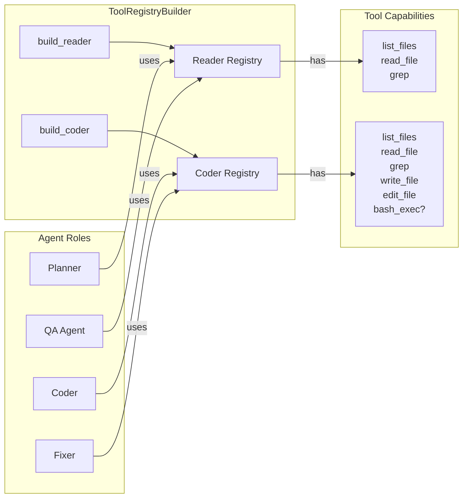

# Tool Registry & Builder

The `ToolRegistry` and `ToolRegistryBuilder` form the backbone of xaft's tool-dispatch layer. The registry provides fast name-based lookup and ordered iteration, while the builder assembles role-appropriate tool sets — read-only for planners, read-write for coders — with a single method call. Together they ensure that every agent receives exactly the capabilities its role demands, and nothing more.

---

## `ToolRegistry`

```rust
pub struct ToolRegistry {
    tools: HashMap<String, Arc<ErasedTool>>,
    order: Vec<String>,
}
```

The registry is a dual-index structure. The `HashMap` provides O(1) lookup by tool name, which is the hot path during agent execution. The `order` vector preserves registration sequence so that tool descriptions can be rendered deterministically in system prompts — the LLM sees tools in a stable, predictable order rather than the hash-randomized order of the map.

### Methods

| Method | Signature | Description |
|--------|-----------|-------------|
| `new()` | `-> Self` | Creates an empty registry with no tools. |
| `register(&mut self, tool: impl Tool)` | `-> &mut Self` | Accepts any `Tool` implementor, erases it into an `ErasedTool`, inserts it into both the map and the order vector, and returns `&mut Self` for chaining. If a tool with the same name already exists, it is replaced in the map and the order vector is left unchanged — the new tool simply shadows the old one at the same position. |
| `add(&mut self, tool: Arc<ErasedTool>)` | `-> &mut Self` | Low-level insertion that accepts a pre-erased tool. Useful when the same tool instance must be shared across multiple registries (e.g., a singleton `BashExecTool` with shared process state). |
| `all(&self)` | `-> Vec<&Arc<ErasedTool>>` | Returns tools in registration order. Used by the agent-loop to build the tool section of the system prompt. |
| `get(&self, name: &str)` | `-> Option<&Arc<ErasedTool>>` | Name-based lookup. Returns `None` for unknown tools, which the agent loop translates into an error message for the LLM. |
| `len(&self)` | `-> usize` | Returns the number of registered tools. |
| `is_empty(&self)` | `-> bool` | Convenience check for zero tools. |

### Concurrency & Ownership

The registry itself is not `Sync` — it is constructed once during workflow initialization and then frozen. Agents receive an `Arc<ToolRegistry>` (or a reference) and never mutate it. This pattern avoids locks entirely: the registry is built, shared immutably, and dropped when the workflow completes. The `Arc<ErasedTool>` values inside are individually cloneable, so an agent loop can cheaply hand out references without borrowing the entire registry.

---

## `ToolRegistryBuilder`

```rust
pub struct ToolRegistryBuilder {
    workspace_root: PathBuf,
    executor_timeout: Duration,
    execution_policy: ExecutionPolicy,
    include_git: bool,
    include_shell: bool,
    include_write: bool,
    include_in_memory: bool,
}
```

The builder encapsulates the policy decisions that determine which tools are available to an agent. Rather than manually constructing a `ToolRegistry` tool by tool, consumers configure a builder with workspace and permission parameters and then call one of the assembly methods.

### Builder Fields

| Field | Type | Purpose |
|-------|------|---------|
| `workspace_root` | `PathBuf` | The root directory that all file tools are confined to. `validate_path()` will reject any path that resolves outside this root. This is a security-critical parameter — setting it incorrectly can allow path-traversal escapes. |
| `executor_timeout` | `Duration` | Maximum wall-clock time for shell command execution. Commands that exceed this limit are killed via the `CancellationToken` associated with the `CommandExecutor`. Defaults to 120 seconds. |
| `execution_policy` | `ExecutionPolicy` | Controls sandbox strictness for `BashExecTool`. Policies range from permissive (full shell access) to restricted (whitelisted commands only). See [Shell Tools](./04-shell-tools.md) for details. |
| `include_git` | `bool` | Whether to register `GitStatusTool`, `GitDiffTool`, and `GitLogTool`. Disabled by default because some environments (e.g., container sandboxes) may not have a `.git` directory. |
| `include_shell` | `bool` | Whether to register `BashExecTool`. Shell access is the most dangerous capability and is only enabled for agents that need it (typically the Coder and Fixer roles). |
| `include_write` | `bool` | Whether to register `WriteFileTool` and `EditFileTool`. Without write tools, an agent can only observe — never modify — the workspace. |
| `include_in_memory` | `bool` | Whether to include in-memory store tools for ephemeral, non-filesystem workspaces. Used primarily in testing. |

### Assembly Methods

The builder exposes two high-level assembly methods that produce pre-configured registries:

#### `build_reader()`

Assembles a read-only tool set:

```
list_files, read_file, grep
+ optional: git_status, git_diff, git_log (if include_git)
```

This is the registry assigned to the **Planner** and **QA** agents. They can inspect the codebase and version-control state but cannot modify anything. The read-only constraint is not merely a convenience — it is a safety guarantee that prevents an overeager LLM from editing files when its role is purely analytical.

#### `build_coder()`

Assembles a read-write tool set:

```
list_files, read_file, grep
+ write_file, edit_file
+ optional: bash_exec (if include_shell)
+ optional: git_status, git_diff, git_log (if include_git)
```

This is the registry assigned to the **Coder** and **Fixer** agents. It includes everything from the reader set plus the tools necessary to modify the workspace: file writers, file editors, and optionally a shell. The shell is gated behind `include_shell` because some deployments run agents in hardened environments where arbitrary command execution is forbidden.

---

## Role-Based Assembly Pattern

The relationship between builder configuration and agent roles follows a consistent pattern that maps capabilities to trust levels:



This separation ensures that even if an LLM generates a tool call for `write_file` while operating as the Planner, the agent loop will fail to resolve the tool name in the registry and return an error — the tool simply does not exist in that agent's namespace. This is a key defense-in-depth measure: access control is enforced not by runtime permission checks but by tool absence, making it impossible for the model to discover and invoke capabilities it should not have.

---

## `FsWorkspaceStore`

File tools require a `WorkspaceStore` implementation to interact with the filesystem. The default and primary implementation is `FsWorkspaceStore`:

```rust
pub struct FsWorkspaceStore {
    root: PathBuf,
}
```

`FsWorkspaceStore` wraps standard `tokio::fs` calls behind the `WorkspaceStore` trait, adding path canonicalization and traversal checks. Every file operation — read, write, edit, list, grep — goes through this store, which ensures that:

1. All paths are resolved relative to `root` before any I/O occurs.
2. Symlinks that resolve outside `root` are rejected.
3. Relative path components like `..` are resolved and then checked against the root boundary.

The store is created by the `ToolRegistryBuilder` using the configured `workspace_root` and passed into each file tool's constructor. Tools never access the filesystem directly — they always go through the store, which acts as a controlled gateway between the agent and the host system.

---

## Usage Example

```rust
let builder = ToolRegistryBuilder::new("/workspace/project")
    .executor_timeout(Duration::from_secs(60))
    .execution_policy(ExecutionPolicy::Restricted)
    .include_git(true)
    .include_shell(true)
    .include_write(true);

let coder_registry = builder.build_coder();
let reader_registry = builder.build_reader();

// coder_registry contains: list_files, read_file, grep, write_file, edit_file, bash_exec, git_status, git_diff, git_log
// reader_registry contains: list_files, read_file, grep, git_status, git_diff, git_log

assert_eq!(coder_registry.len(), 9);
assert_eq!(reader_registry.len(), 5);
```

The builder pattern makes it straightforward to create multiple registries from the same configuration, ensuring that all agents share consistent workspace-root and timeout settings even when their tool sets differ.
