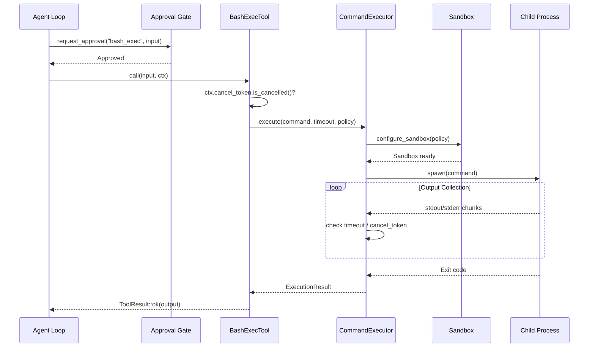

# Shell Tools

The `BashExecTool` is xaft's interface to arbitrary shell command execution. It is the most powerful — and most dangerous — built-in tool, capable of running any command available on the host system. To mitigate this power, xaft layers multiple safety mechanisms: sandbox confinement, execution policies, mandatory confirmation gates, timeout enforcement, and cooperative cancellation.

---

## `BashExecTool`

### Input Schema

```json
{
  "type": "object",
  "properties": {
    "command": {
      "type": "string",
      "description": "The shell command to execute"
    },
    "timeout_secs": {
      "type": "integer",
      "description": "Per-command timeout in seconds. Overrides the executor_timeout default."
    }
  },
  "required": ["command"]
}
```

### Core Properties

- **`requires_confirmation()` always returns `true`**. The agent loop cannot dispatch `BashExecTool` without explicit approval from the configured approval gate. This is a non-negotiable safety invariant — there is no flag or configuration that disables it.

- The tool delegates all execution to `CommandExecutor`, which manages process spawning, sandbox setup, timeout enforcement, and output collection.

### Execution Flow



---

## `CommandExecutor`

The `CommandExecutor` is the internal engine that `BashExecTool` uses to spawn and manage child processes. It encapsulates all the complexity of process lifecycle management, providing a clean `execute()` interface that returns an `ExecutionResult`.

### `ExecutionResult`

```rust
pub struct ExecutionResult {
    pub stdout: String,
    pub stderr: String,
    pub exit_code: Option<i32>,
    pub timed_out: bool,
}
```

The `exit_code` is `None` when the process was killed by a signal or timed out. The `timed_out` flag is set when the process exceeded the configured timeout and was forcibly terminated. Both pieces of information are included in the `ToolResult` so the LLM can distinguish between a clean failure (non-zero exit code) and a timeout (process killed).

### Timeout Enforcement

Timeouts are enforced at two levels:

1. **Per-command timeout** (`timeout_secs` in the input): The maximum wall-clock time for a single command invocation. When exceeded, the `CommandExecutor` sends `SIGKILL` to the process group and sets `timed_out = true`.

2. **Global executor timeout** (`executor_timeout` in the builder): A ceiling on total execution time across all commands within a single agent turn. This prevents an agent from burning its entire turn budget on a single long-running command.

Both timeouts are checked against `ctx.cancel_token`, so a workflow cancellation will also kill any running subprocesses.

---

## Sandbox

The `Sandbox` struct configures the execution environment for child processes. It is constructed from the `ExecutionPolicy` and applied before each command is spawned.

### Sandbox Configuration

| Parameter | Description |
|-----------|-------------|
| **Working directory** | Set to `workspace_root`. Commands always execute in the workspace, preventing accidental operations on host files. |
| **Environment variables** | A sanitized subset of the host environment. `PATH` is preserved; `HOME`, `USER`, and other identity variables are either set to neutral values or removed, depending on policy strictness. |
| **Filesystem access** | On platforms that support it (Linux with namespaces), the sandbox can mount the workspace as the only visible filesystem. On other platforms, this is enforced through `validate_path()` in file tools and the working-directory constraint in shell execution. |
| **Network access** | Configurable per policy. Restricted policies disable network access to prevent data exfiltration or unauthorized API calls from within a command. |

---

## `ExecutionPolicy`

`ExecutionPolicy` determines the strictness of command execution. It is set on the `ToolRegistryBuilder` and propagated to every `BashExecTool` instance.

### Variants

#### `ExecutionPolicy::Permissive`

All commands are allowed. The sandbox applies minimal restrictions: the working directory is set to the workspace root, and the global timeout is enforced. This policy is appropriate for trusted environments where the agent has been explicitly authorized to run arbitrary commands, such as local development workstations where the user is actively supervising.

Under permissive policy, the agent can install packages, run build systems, execute test suites, and perform any shell operation. The only guardrail is the approval gate — every command still requires confirmation.

#### `ExecutionPolicy::Restricted`

Only a whitelist of commands is allowed. The default whitelist includes:

```
ls, cat, head, tail, wc, find, grep, rg, sort, uniq, diff, echo,
cargo, rustc, rustfmt, clippy, npm, node, python3, pytest, make, cmake
```

Commands not on the whitelist are rejected with `ToolResult::error("command not allowed by execution policy: <command>")`. This policy is appropriate for CI environments, shared servers, and any deployment where the cost of a rogue command is high.

The whitelist is extensible at build time through the `ToolRegistryBuilder`, allowing operators to add project-specific tools (e.g., `terraform`, `kubectl`) without switching to permissive mode.

#### `ExecutionPolicy::DryRun`

Commands are not executed at all. Instead, the tool returns `ToolResult::ok("dry run: would execute: <command>")`. This policy is used for auditing and testing — it lets you see what commands the agent would run without actually running them. It is also useful for prompt-engineering workflows where you want to validate an agent's behavior before giving it real execution capability.

---

## Approval Gates

The approval gate is a pluggable callback that the agent loop consults before dispatching any tool with `requires_confirmation() == true`. For `BashExecTool`, this is always the case.

### Gate Interface

```rust
pub trait ApprovalGate: Send + Sync {
    fn approve(&self, tool_name: &str, input: &serde_json::Value) -> bool;
}
```

The gate receives the tool name and its input, and returns `true` to allow execution or `false` to reject it. When rejected, the agent loop returns `ToolResult::error("execution denied by approval gate")` to the LLM, which can then adjust its approach.

### Built-in Gate Implementations

| Gate | Behavior |
|------|----------|
| `AutoApproveGate` | Always returns `true`. Used in fully autonomous mode where the agent is trusted to execute any command. |
| `InteractiveGate` | Prompts the user on the terminal for approval. Displays the command and asks y/n. Used in interactive sessions. |
| `LoggingGate` | Always approves but logs every request for audit purposes. Combines autonomy with observability. |
| `PolicyGate` | Applies `ExecutionPolicy` checks in addition to the tool's own checks. Provides a second layer of command filtering. |

### Composition

Gates can be composed using `ChainedApprovalGate`, which runs multiple gates in sequence and requires all to approve. A common configuration is:

```
ChainedApprovalGate::new(vec![
    PolicyGate::new(policy.clone()),
    InteractiveGate::new(),
])
```

This ensures that even if the user approves a command, it must still pass the policy check, and vice versa. The composition order matters — placing the `PolicyGate` first avoids unnecessary user prompts for commands that will be rejected anyway.

---

## Output Handling

The `BashExecTool` formats command output for LLM consumption. The output includes:

```
Command: cargo test --lib
Exit code: 0
--- stdout ---
running 42 tests
test tool::tests::test_read_file ... ok
test tool::tests::test_write_file ... ok
...
test result: ok. 42 passed; 0 failed; 0 ignored

--- stderr ---
(empty)
```

Both `stdout` and `stderr` are captured and included in the result. If the output exceeds a configurable size limit (default: 10,000 characters), it is truncated with a notice: `... (output truncated at 10000 characters)`. This prevents a noisy command from consuming the entire conversation context.

When a command times out, the output reflects the partial results collected before the kill:

```
Command: cargo build
Timed out after 60 seconds (killed)
--- partial stdout ---
   Compiling agtrs-runtime v0.1.0
   Compiling agtrs-git v0.1.0
...
```

---

## Security Considerations

Shell execution is the highest-risk capability in xaft. The defense-in-depth model includes:

1. **Confirmation gate**: Every command requires approval.
2. **Execution policy**: Commands are filtered by policy before execution.
3. **Sandbox confinement**: Working directory, environment, and (where available) filesystem namespace are restricted.
4. **Timeout enforcement**: No command can run indefinitely.
5. **Cancellation**: Workflows can be aborted, killing all child processes.
6. **Output size limits**: Prevent context-window exhaustion from noisy commands.
7. **Path validation**: Even within shell commands, the working directory is constrained to the workspace root.

No single mechanism is sufficient on its own. The combination ensures that even if one layer is bypassed (e.g., the LLM generates an unexpected command variant), the remaining layers contain the blast radius.
