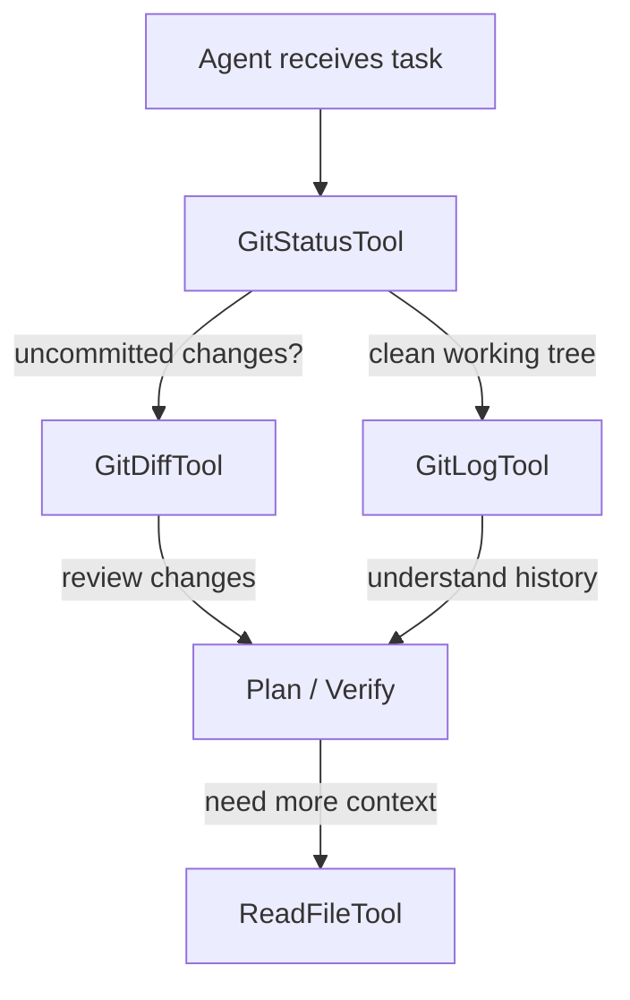

# Git Tools

The git tools provide read-only access to version-control state, enabling agents to understand what has changed, what the current branch situation is, and what the recent history looks like. All three tools wrap `agtrs_git::GitRepo`, which encapsulates `git2` bindings and provides a safe, typed interface over raw git operations.

---

## `GitRepo` — The Underlying Engine

`agtrs_git::GitRepo` is the shared foundation for all git tools. It opens a repository at a given path and exposes methods that map to common git queries:

```rust
pub struct GitRepo {
    repo: git2::Repository,
    root: PathBuf,
}

impl GitRepo {
    pub fn open(path: &Path) -> Result<Self, AgtrsError>;
    pub fn status(&self) -> Result<GitStatus, AgtrsError>;
    pub fn diff(&self, options: DiffOptions) -> Result<GitDiff, AgtrsError>;
    pub fn log(&self, max_count: usize) -> Result<Vec<GitCommit>>, AgtrsError>;
}
```

The `GitRepo` is constructed once when the tool registry is built (if `include_git` is `true`) and shared across all three git tools via `Arc`. This avoids re-opening the repository for each invocation and ensures that all tools see a consistent view of the repository state within a single agent turn.

### Error Handling

If the workspace root does not contain a `.git` directory, `GitRepo::open()` returns `AgtrsError::NotAGitRepo`. This error is caught during tool registration — when `include_git` is set but no repository is found, the builder logs a warning and omits the git tools from the registry rather than failing the entire build. This graceful degradation means workflows that enable git tools by default still work in non-git workspaces.

---

## `GitStatusTool`

Reports the current working-tree status — staged changes, unstaged changes, and untracked files.

### Input Schema

```json
{
  "type": "object",
  "properties": {},
  "required": []
}
```

`GitStatusTool` takes no input parameters. It always reports the status of the entire working tree relative to the repository root.

### Output Format

The tool returns a structured text representation of `GitStatus`:

```
On branch: feature/add-git-tools

Staged changes:
  M  src/tools/mod.rs
  A  src/tools/git_status.rs
  A  src/tools/git_diff.rs
  A  src/tools/git_log.rs

Unstaged changes:
  M  src/tools/git_status.rs

Untracked files:
  ??  src/tools/git_tools_test.rs
```

Each file is prefixed with a git-style status indicator: `M` for modified, `A` for added, `D` for deleted, `R` for renamed, `??` for untracked. This format is familiar to anyone who has used `git status --short` and is compact enough to fit within the LLM's context window even for large changesets.

### Agent Usage

The Planner agent uses `GitStatusTool` to understand the current state of the codebase before formulating a plan. For example, if the status shows uncommitted changes, the planner might recommend committing before starting new work. The QA agent uses it to verify that the Coder made the expected changes and didn't introduce unexpected modifications.

---

## `GitDiffTool`

Shows the differences between the working tree and the index, between the index and a commit, or between any two commits.

### Input Schema

```json
{
  "type": "object",
  "properties": {
    "cached": {
      "type": "boolean",
      "description": "Show staged changes (index vs HEAD) instead of working-tree changes. Defaults to false."
    },
    "path": {
      "type": "string",
      "description": "Restrict diff to a specific file or directory. Defaults to entire repository."
    },
    "max_lines": {
      "type": "integer",
      "description": "Maximum number of diff lines to return. Defaults to 500."
    }
  }
}
```

### Output Format

The tool returns a unified diff format:

```diff
diff --git a/src/tools/git_diff.rs b/src/tools/git_diff.rs
index a1b2c3d..e4f5g6h 100644
--- a/src/tools/git_diff.rs
+++ b/src/tools/git_diff.rs
@@ -18,7 +18,10 @@ impl GitDiffTool {
     fn schema(&self) -> serde_json::Value {
-        json!({})
+        json!({
+            "type": "object",
+            "properties": { ... }
+        })
     }
 }
```

The `max_lines` parameter prevents the diff from overwhelming the conversation context. In repositories with large binary files or massive refactors, an unbounded diff could easily exceed 10,000 lines. The default of 500 lines captures the most relevant changes while leaving room for the agent's reasoning and other tool outputs.

### `cached` Parameter

- **`cached: false`** (default): Shows the diff between the working tree and the index — what `git diff` shows on the command line. This is the most common use case for agents checking what they've changed.

- **`cached: true`**: Shows the diff between the index and `HEAD` — what `git diff --cached` shows. This is useful for verifying what will be committed before actually committing.

### Agent Usage

The Coder agent uses `GitDiffTool` to verify its edits before handing off to QA. By reviewing the diff, the coder can catch mistakes (e.g., deleting too much, introducing unintended changes) without needing to read the entire file. The QA agent uses it to understand exactly what changed between the pre-edit and post-edit states, which is more efficient than reading entire files and comparing them mentally.

---

## `GitLogTool`

Shows recent commit history, providing agents with context about the project's evolution and recent activity.

### Input Schema

```json
{
  "type": "object",
  "properties": {
    "max_count": {
      "type": "integer",
      "description": "Maximum number of commits to return. Defaults to 10."
    },
    "path": {
      "type": "string",
      "description": "Restrict log to a specific file or directory. Defaults to entire repository."
    }
  }
}
```

### Output Format

The tool returns a structured log with commit hash, author, date, and message:

```
commit a1b2c3d4e5f6789012345678901234567890abcd
Author: Jane Developer <jane@example.com>
Date:   2024-12-15 14:32:01 -0500

    feat(tools): add git tools for status, diff, and log

commit f0e1d2c3b4a59687012345678901234567890123
Author: John Coder <john@example.com>
Date:   2024-12-14 09:15:44 -0500

    fix(edit_file): improve fuzzy matching for indentation differences
```

The `max_count` parameter defaults to 10, which provides enough historical context for most agent tasks without flooding the context window. For targeted queries (e.g., "what changed in this file recently?"), the `path` filter narrows the log to a single file or directory.

### Agent Usage

The Planner agent uses `GitLogTool` to understand the project's recent trajectory — what features were added, what bugs were fixed, who the active contributors are. This context helps the planner make informed decisions about code style, naming conventions, and architectural patterns. For example, if the log shows recent commits adding tests for a module, the planner might suggest following the same testing pattern for new code.

---

## Tool Coordination Patterns

The three git tools are rarely used in isolation. Effective agents combine them to build a comprehensive picture of repository state:



A typical pattern is:

1. **Status first**: `GitStatusTool` gives the high-level picture — are there uncommitted changes? What files are affected?
2. **Diff for detail**: If the status shows changes, `GitDiffTool` zooms in on the specific modifications.
3. **Log for context**: If the agent needs to understand why something was done or find related previous changes, `GitLogTool` provides the historical narrative.
4. **Read for verification**: `ReadFileTool` fills in any gaps that the diff doesn't cover (e.g., the full context around a changed function).

This layered approach minimizes context consumption: the agent starts with the most compact representation (status) and only requests more detail when necessary.

---

## Limitations and Constraints

The git tools are intentionally **read-only**. There is no `GitCommitTool`, `GitPushTool`, or `GitCheckoutTool`. This design decision reflects a philosophical stance: version-control mutations are irreversible operations that should require explicit human intent. If an agent needs to commit changes, it should describe the commit message in its output and let the human execute the actual `git commit` command.

Additionally, the git tools do not support:

- **Merge conflict resolution**: The tools report conflicts via `GitStatusTool` but do not attempt to resolve them.
- **Remote operations**: No `fetch`, `pull`, or `push`. Network-bound git operations are outside the agent's scope.
- **Branch creation or switching**: These are mutations that could disrupt the developer's workflow.
- **Stash operations**: While useful, stash interactions are complex enough that they're better handled directly by the developer.

These limitations keep the git tools focused on their core purpose: providing agents with the version-control context they need to make informed decisions about code changes, without giving them the power to alter the repository's history.
