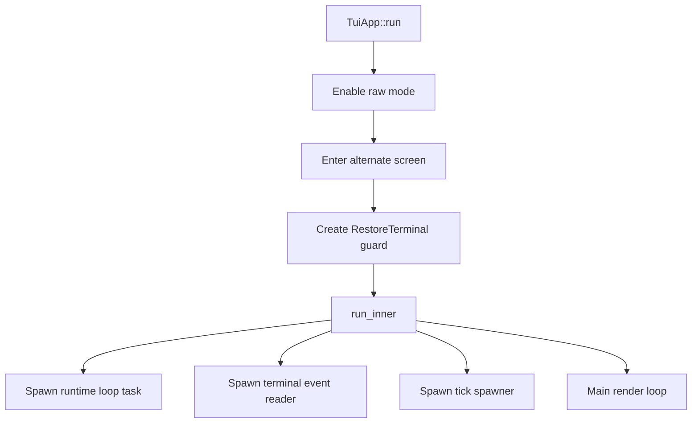
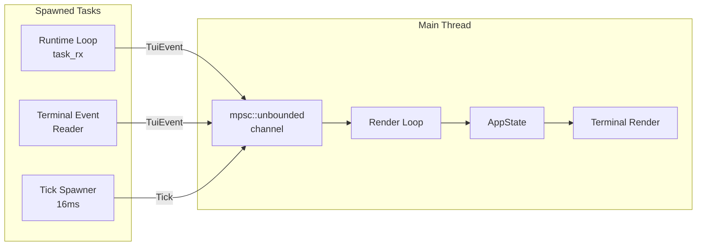

# TUI Architecture

The xaft terminal user interface is built on a task-based, event-driven architecture that separates concerns across multiple concurrent tasks communicating through channels. The design prioritizes responsiveness — the TUI must never block on LLM calls, tool execution, or file I/O — and correctness — the displayed state must accurately reflect the runtime's actual state without race conditions. This is achieved through a single-threaded render loop that processes events from multiple sources via an `mpsc` channel, ensuring that all state mutations occur on the main thread.

## Core Components

### TuiApp

`TuiApp` is the top-level entry point for the TUI subsystem. It holds the application configuration (`TuiConfig`) and the active theme (`Theme`). Its `run()` method is the bootstrap sequence:

1. **Terminal Setup**: The terminal is switched to raw mode via `crossterm::terminal::enable_raw_mode()`, and the alternate screen buffer is activated. Raw mode ensures that keystrokes are delivered immediately without line buffering, while the alternate screen prevents the TUI from overwriting the user's terminal scrollback.

2. **Terminal Restoration**: A `RestoreTerminal` guard is created to ensure the terminal is restored on drop — even if a panic occurs. The guard switches back from raw mode and the alternate screen.

3. **Task Spawning**: `run_inner()` is called, which spawns the three concurrent tasks and enters the main event loop.

### The Three Spawned Tasks

The TUI's concurrency model is built on three tasks that feed events into the main loop through a single `mpsc::unbounded` channel. This design ensures that the render loop — which runs on the main thread — never blocks, because it only needs to drain the channel and repaint.

**1. Runtime Loop Task (task_rx)**

This task receives messages from the agent runtime via a dedicated `task_rx` receiver. When the runtime produces output — LLM tokens, tool results, agent messages — it sends them through `task_tx`, and the runtime loop task forwards them as `TuiEvent` variants to the main channel. This task acts as an adapter between the runtime's message protocol and the TUI's event system, translating runtime-specific message types into the `TuiEvent` enum that the render loop understands.

**2. Terminal Event Reader (EventStream)**

The terminal event reader uses `crossterm::event::EventStream` to asynchronously read terminal events (key presses, mouse events, resize notifications). Each event is wrapped in a `TuiEvent::Key`, `TuiEvent::Mouse`, or `TuiEvent::Resize` variant and sent to the main channel. The use of `EventStream` — which is built on `tokio`'s async I/O — ensures that the terminal event reader does not block the main thread or consume CPU while waiting for input.

**3. Tick Spawner (16ms interval)**

The tick spawner emits `TuiEvent::Tick` events at a 16ms interval (approximately 60 FPS). Ticks serve two purposes: they drive the render loop's frame rate, and they trigger periodic state updates such as cursor blinking, spinner animation, and token counter refreshes. The 16ms interval was chosen to match common monitor refresh rates, providing smooth visual updates without excessive CPU usage. The tick handler is lightweight — it merely sends an event — and all actual rendering work is deferred to the main loop's tick processing.

### EventBridge

The `EventBridge` is the subsystem that connects the `SignalBus` to the TUI's event stream. It subscribes to all signal types on the `SignalBus` and forwards each signal as a corresponding `TuiEvent` through the `mpsc::unbounded` channel. This bridge is what allows the TUI to react to runtime events — LLM call starts and completions, tool executions, agent outputs — without the runtime needing to know about the TUI at all.

The `EventBridge` is spawned as a background task during `run_inner()`. It holds an unbounded sender (`tx`) that writes to the main event channel. For each signal type, it registers a handler on the `SignalBus` that converts the signal into the appropriate `TuiEvent` variant and sends it through `tx`. Because the `SignalBus` uses broadcast channels, the `EventBridge` receives signals asynchronously and does not block the signal emitter. The fire-and-forget pattern (`tokio::spawn` in `try_emit_signal()`) ensures that signal emission never blocks the runtime, even if the TUI's channel is temporarily full.

### TuiEvent Variants

The `TuiEvent` enum is the unified event type that the main render loop processes. Each variant corresponds to a specific runtime or user interaction:

| Variant | Source | Purpose |
|---------|--------|---------|
| `LlmCallStarting` | SignalBus → EventBridge | LLM API call initiated; show spinner |
| `LlmCallComplete` | SignalBus → EventBridge | LLM API call finished; update token counts |
| `AgentOutput` | SignalBus → EventBridge | Agent produced text output; append to conversation |
| `RunComplete` | SignalBus → EventBridge | Agent run finished; transition phase |
| `Cancelled` | SignalBus → EventBridge | Agent was cancelled; show cancellation message |
| `ToolStarted` | SignalBus → EventBridge | Tool execution started; show in activity panel |
| `ToolCompleted` | SignalBus → EventBridge | Tool execution finished; update status |
| `ToolPendingApproval` | SignalBus → EventBridge | Tool awaiting user approval; show approval widget |
| `CommitCreated` | SignalBus → EventBridge | Git commit created; update file tree |
| `FileEditsCommitted` | SignalBus → EventBridge | File edits committed; refresh diff viewer |
| `SessionUpdate` | SignalBus → EventBridge | Session state changed; refresh status bar |
| `Key(KeyEvent)` | Terminal event reader | Keyboard input for focus and text entry |
| `Mouse(MouseEvent)` | Terminal event reader | Mouse click/scroll for panel interaction |
| `Resize(u16, u16)` | Terminal event reader | Terminal resized; recalculate layout |
| `Tick` | Tick spawner | Frame tick; drive animations and refreshes |
| `RuntimeError` | SignalBus → EventBridge | Runtime error occurred; display error message |
| `TaskComplete` | Runtime loop | Task fully completed; update phase to Done |

## Main Render Loop

The main render loop runs on the single main thread and follows a straightforward pattern:

1. **Drain Events**: Call `rx.try_recv()` in a loop to drain all pending events from the channel. This batch processing ensures that multiple events arriving in quick succession (e.g., a burst of LLM tokens) are processed together before rendering, avoiding unnecessary intermediate repaints.

2. **Process Events**: For each event, mutate `AppState` accordingly. Key events update focus and input buffers. Runtime events update tool status, token counts, and conversation content. Tick events drive animation state.

3. **Check Should Quit**: If `should_quit` is set (by `Ctrl+C` handling), break out of the loop.

4. **Render**: Call the rendering function, which reads `AppState`, computes the layout, and draws all visible widgets to the terminal via `ratatui::Frame`.

5. **Rate Limit**: The render step is gated by the tick rate. If no events were processed and no tick has arrived since the last render, the loop skips the render step to avoid wasting CPU on unnecessary repaints.

This architecture ensures that the TUI is always responsive to user input (because the terminal event reader delivers key events immediately) while also staying synchronized with the runtime (because the EventBridge forwards signals in real time). The single-threaded render loop eliminates the need for locks on `AppState`, since all mutations occur on the main thread. The unbounded channel between the spawned tasks and the main loop ensures that events are never dropped due to channel capacity limits, which is important for preserving the integrity of LLM token streams.
