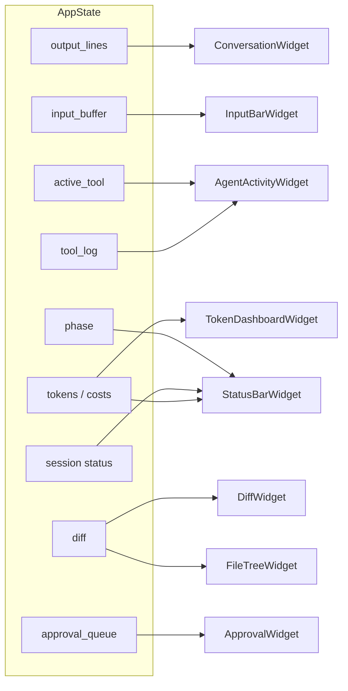

# TUI Widget System

The xaft TUI is composed of discrete widgets, each responsible for rendering a specific aspect of the application state. Widgets are pure rendering functions — they read from `AppState` and write to a `ratatui::Frame` — and they do not own state or handle input directly. This separation of rendering from state management ensures that widgets are easy to test, compose, and reorder. Each widget is associated with a `PaneType` that determines its position in the layout, and the user can cycle focus between widgets to interact with them.

## Widget Catalog

### ConversationWidget

The `ConversationWidget` is the primary output display, rendering the agent's responses, user messages, and system notifications in a scrollable list. It reads from `AppState::output_lines`, a `VecDeque` with a maximum capacity of 2000 entries. When the deque exceeds this limit, the oldest entries are evicted. This cap prevents unbounded memory growth during long sessions while preserving enough context for the user to review recent output.

Each output line is rendered with a role-based color scheme: user messages in one color, agent responses in another, and system messages (errors, warnings, status updates) in a third. The widget supports scrolling via keyboard (Page Up/Page Down) and mouse wheel, with the scroll position stored in `AppState`. When a new message arrives, the widget auto-scrolls to the bottom unless the user has explicitly scrolled up, in which case it preserves the current position and shows a "new messages" indicator.

The conversation widget also hosts the `TokenStreamRenderer`, which handles real-time streaming of LLM tokens. As tokens arrive via `TuiEvent::AgentOutput`, they are appended to the current stream buffer and rendered incrementally. The stream renderer supports cursor animations (a blinking block cursor at the end of the stream) and handles the transition from streaming to final text when the LLM call completes.

### InputBarWidget

The `InputBarWidget` renders the text input area at the bottom of the screen where the user types messages. It reads from `AppState::input_buffer` and displays the current text with a cursor. The input bar supports basic editing operations: character insertion, backspace/delete, cursor movement (left/right arrows, Home/End), and clipboard paste. Multi-line input is supported via Shift+Enter, which inserts a newline without submitting the message.

When the user presses Enter (without Shift), the input buffer's contents are sent through `AppState::user_message_tx`, which delivers the message to the runtime's event loop. The input bar is disabled during agent execution (when the phase is not `Idle`) to prevent the user from submitting overlapping tasks. A visual indicator (dimmed text, "waiting for agent..." placeholder) communicates the disabled state.

### AgentActivityWidget

The `AgentActivityWidget` displays real-time information about the currently active agent and its tool usage. It reads from `AppState::active_tool` and `AppState::tool_log` to show which tool is running, its parameters, and its execution status. The widget presents a timeline of tool calls for the current turn, with each entry showing the tool name, start time, duration, and result status (success/failure/pending).

The agent activity widget is particularly useful during the `Coding` and `Fixing` phases, where the agent may invoke multiple tools in sequence. It provides visibility into what the agent is doing at all times, which is critical for debugging and trust. The widget also displays the current `WorkflowPhase`, inferred from the agent name, as a colored badge at the top of the panel.

### TokenDashboardWidget

The `TokenDashboardWidget` provides a live view of token consumption and cost. It reads from `AppState::tokens` and `AppState::costs` for the current task, and from `AppState::agent_tokens` and `AppState::agent_costs` for per-agent breakdowns. The widget displays the following metrics:

- **Total tokens**: Cumulative input and output tokens for the session
- **Current task tokens**: Tokens consumed by the current task
- **Cost (USD)**: Estimated cost based on the model's pricing
- **Per-agent breakdown**: Tokens and cost for each named agent (planner, coder, qa, fixer)

The token dashboard updates in real time as `TuiEvent::LlmCallComplete` events arrive with token counts from the LLM API response. It also displays the configured cost limit from `GuardrailConfig` and a progress bar showing how close the session is to hitting the limit. When the cost limit is approached, the bar changes color from green to yellow to red, providing a visual warning.

### DiffWidget

The `DiffWidget` renders file diffs in a side-by-side or unified format, depending on the available terminal width. It reads from `AppState::diff`, which contains the accumulated file changes for the current task. The diff is updated in real time as `TuiEvent::FileEditsCommitted` events arrive, so the user can watch changes appear as the agent modifies files.

The widget supports syntax highlighting for common programming languages (when the `syntect` feature is enabled) and displays line numbers for both the old and new versions of each file. The diff viewer is scrollable and can be navigated with keyboard shortcuts to jump between changed hunks. When the terminal width is too narrow for side-by-side display, the widget automatically switches to unified diff format.

### FileTreeWidget

The `FileTreeWidget` displays a hierarchical tree of files that have been modified during the current task. It reads from the same diff data as `DiffWidget` but presents it as a navigable tree rather than a textual diff. Each file node shows the filename, the number of lines added (green) and removed (red), and an expand/collapse indicator. Directories that contain modified files are shown with an aggregated change count.

The file tree widget supports keyboard navigation (arrow keys to move, Enter to expand/collapse) and mouse interaction (click to expand/collapse, double-click to open in the diff viewer). When a file is selected in the tree, the diff viewer scrolls to show that file's changes, creating a linked navigation experience between the two widgets.

### StatusBarWidget

The `StatusBarWidget` renders a compact status bar at the bottom of the screen that shows the current session state at a glance. It displays:

- **Session status**: Active/Suspended/Completed/Failed/Cancelled with color coding
- **Workflow phase**: Current phase name with a spinner animation for active phases
- **Token count**: Brief token usage summary
- **Cost**: Current session cost in USD
- **Duration**: Elapsed time since the session started
- **Active agent**: Name of the currently running agent
- **Key hints**: Context-sensitive keyboard shortcut hints

The status bar is always visible regardless of which panel is focused, providing a persistent overview of the session's health. It is rendered last (on top of other content) and occupies a single terminal row.

### ApprovalWidget (Overlay)

The `ApprovalWidget` is an overlay widget that appears when a tool requires user approval. It reads from `AppState::approval_queue`, which contains the list of pending approval requests. The widget displays the tool name, its parameters, and a risk assessment (based on `GuardrailConfig` rules). It provides two buttons — "Approve" and "Deny" — that the user can select with keyboard or mouse.

When multiple approvals are pending, the widget shows them in a stack, with the most recent request on top. The user can navigate between pending requests using Tab. Each approval request has a 120-second timeout; if the user does not respond within this window, the request is automatically denied. The timeout countdown is displayed as a progress bar in the approval widget, creating urgency for the user to make a decision.

## Data Flow from AppState to Widgets

## Widget Rendering Order

Widgets are rendered in a specific order to ensure correct visual layering. The base layer widgets (Conversation, AgentActivity, TokenDashboard, DiffViewer, FileTree) are rendered first, followed by the input bar and status bar. The ApprovalWidget overlay is rendered last, ensuring it appears on top of all other content. This layering is managed by the layout solver, which computes the rectangular area for each widget based on the current terminal size and the configured layout proportions.

## Focus Management

Only one widget can have focus at a time, tracked by `AppState::focused_panel`. The focused widget receives keyboard input events (character keys, arrows, etc.), while other widgets receive only mouse events. Focus is cycled using Tab (forward) and Shift+Tab (backward), following the order defined by the layout. The focused widget is visually distinguished with a highlighted border or a different color scheme. When the approval overlay is active, focus is automatically moved to the approval widget, and the previous focus is restored when the overlay is dismissed.
