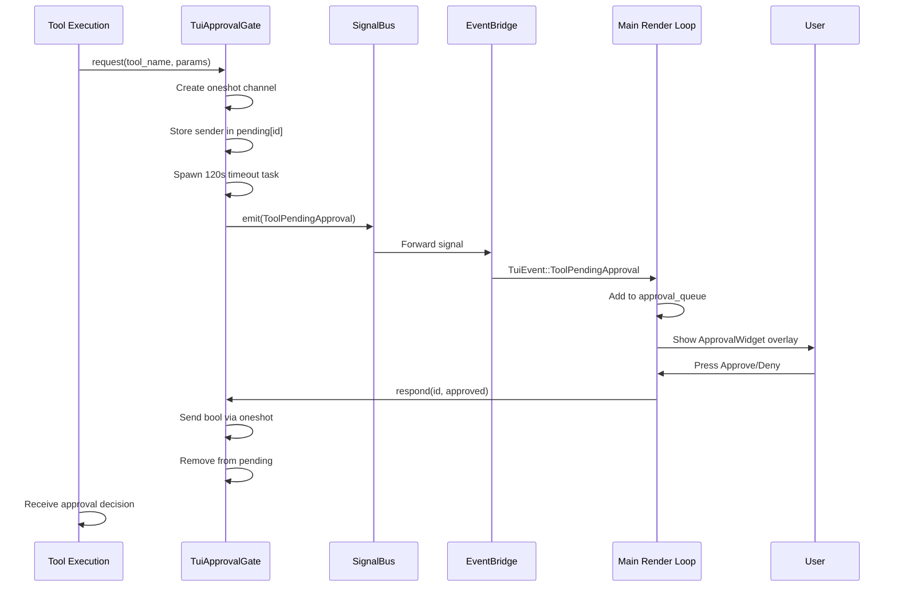

# TUI Approval System

The TUI approval system is the user-facing component of xaft's safety architecture, providing an interactive mechanism for reviewing and approving or denying tool executions that require explicit user consent. It bridges the runtime's `ApprovalGate` trait with the TUI's event loop, translating approval requests into visual overlays and user actions into oneshot responses. The system is designed to be non-blocking — the TUI remains responsive while an approval request is pending — and time-bounded — all requests expire after 120 seconds if not answered.

## TuiApprovalGate

`TuiApprovalGate` implements the `ApprovalGate` trait for the TUI context. It maintains a `HashMap<String, oneshot::Sender<bool>>` of pending approval requests, where the key is a unique request identifier and the value is a oneshot channel that will carry the user's decision back to the waiting tool.

### Request Lifecycle

When a tool requires approval, the runtime calls `TuiApprovalGate::request()`. This method performs the following steps:

1. **Generate Request ID**: A unique identifier is created for the approval request, typically a UUID or a combination of the tool name and a timestamp.

2. **Create Oneshot Channel**: A `oneshot::channel<bool>()` is created. The sender is stored in the pending hashmap under the request ID, and the receiver is returned to the caller (the tool execution context).

3. **Spawn Timeout**: A `tokio::spawn` task is created that sleeps for 120 seconds and then sends `false` (deny) through the oneshot sender if it hasn't already been consumed. This ensures that the tool doesn't block indefinitely if the user is away from the terminal.

4. **Emit Signal**: A `ToolPendingApproval` signal is emitted on the `SignalBus`, which the `EventBridge` converts to a `TuiEvent::ToolPendingApproval` and forwards to the main event loop.

5. **Await Response**: The tool execution context awaits the oneshot receiver. This is an async operation that yields to the tokio runtime, allowing other tasks (including the TUI render loop) to continue running.



### request() Implementation Details

The `request()` method is async and designed to be called from within the tool execution context. It does not block the TUI's render loop because the oneshot receiver is awaited in the tool's task, not on the main thread. The method signature is approximately:

```rust
async fn request(&self, tool_name: &str, params: &Value) -> Result<bool> {
    let (tx, rx) = oneshot::channel();
    let id = generate_request_id(tool_name);
    self.pending.lock().await.insert(id.clone(), tx);
    // Spawn timeout
    let pending = self.pending.clone();
    let id_clone = id.clone();
    tokio::spawn(async move {
        tokio::time::sleep(Duration::from_secs(120)).await;
        let mut map = pending.lock().await;
        if let Some(sender) = map.remove(&id_clone) {
            let _ = sender.send(false); // Timeout = deny
        }
    });
    // Emit signal
    self.signal_bus.emit(ToolPendingApproval { id, tool_name, params }).await;
    // Wait for response
    rx.await.map(|approved| approved).map_err(|_| false.into())
}
```

### respond() Implementation

When the user approves or denies a request through the TUI, `respond()` is called with the request ID and the boolean decision. The method removes the sender from the pending hashmap and sends the decision through the oneshot channel. If the request has already been answered (e.g., by a timeout or by `cancel_all()`), the oneshot sender will have already been consumed, and the method is a no-op. This idempotency is important because both the timeout task and the user's action may race to respond.

### cancel_all() Implementation

The `cancel_all()` method is called during session cancellation (see [Cancellation](../state-machines/03-cancellation.md)). It iterates over all entries in the pending hashmap, sends `false` through each oneshot sender, and clears the map. This ensures that every tool waiting for approval receives a denial and can exit cleanly. The method acquires a lock on the pending hashmap, which is held only briefly (for the iteration and send operations), minimizing the risk of blocking other approval operations.

## ApprovalQueue (TUI State)

The `ApprovalQueue` is the TUI-side representation of pending approvals. It is stored in `AppState` and contains a `Vec<ApprovalRequest>` with the following fields:

- **id**: The unique request identifier (matching the `TuiApprovalGate`'s pending hashmap key)
- **tool_name**: The name of the tool requesting approval
- **params**: The tool's parameters as a JSON value
- **risk_level**: A computed risk assessment (low/medium/high) based on guardrail rules
- **received_at**: The timestamp when the request was received

When a `TuiEvent::ToolPendingApproval` event arrives, the main render loop pushes the request onto the approval queue. When the user makes a decision, the render loop calls `TuiApprovalGate::respond()` with the request ID and the user's choice, then removes the request from the queue. The `ApprovalWidget` overlay reads from this queue and displays the current request.

The queue is ordered by arrival time, with the most recent request displayed first. The user can navigate between pending requests using Tab, which cycles through the queue. This design handles the case where multiple tools request approval simultaneously (e.g., during a parallel tool execution phase), presenting them sequentially rather than requiring the user to process all requests at once.

## Approval Flow End-to-End

The complete approval flow, from tool invocation to user decision, involves multiple subsystems working in concert:

1. **Tool Execution**: The agent invokes a tool that has the `requires_approval` flag set (determined by `ToolConfig` and `GuardrailConfig`).

2. **Pre-Execution Check**: Before executing the tool, the runtime checks whether the tool requires approval. If it does, the runtime calls `ApprovalGate::request()`.

3. **Signal Emission**: The `TuiApprovalGate` emits a `ToolPendingApproval` signal, which the `EventBridge` converts to a `TuiEvent`.

4. **TUI Display**: The main render loop receives the event and adds the request to `AppState::approval_queue`. The `ApprovalWidget` overlay appears.

5. **User Decision**: The user reviews the tool name, parameters, and risk assessment, then presses a key to approve or deny.

6. **Response Delivery**: The render loop calls `TuiApprovalGate::respond()`, which sends the decision through the oneshot channel.

7. **Tool Continuation**: The tool execution context receives the decision. If approved, execution proceeds. If denied, the tool returns an error indicating lack of approval.

8. **Error Handling**: If the tool was denied (or timed out), the agent receives a tool error and must decide how to proceed — typically by trying an alternative approach or asking the user for clarification.

## Timeout Behavior

The 120-second timeout is a critical safety feature. Without it, a tool waiting for approval would block indefinitely if the user steps away from the terminal or doesn't notice the approval overlay. The timeout is implemented as a `tokio::spawn` task that sleeps for the specified duration and then attempts to send `false` through the oneshot sender. If the user has already responded, the sender will have been consumed and the timeout task's send will fail silently. This race is benign because the oneshot channel guarantees that only the first send succeeds.

The timeout duration is configurable through the `TuiConfig::approval_timeout_secs` setting, defaulting to 120 seconds. A shorter timeout increases the risk of accidental denials during brief absences, while a longer timeout increases the risk of tools blocking for extended periods. The default of 120 seconds strikes a balance between these concerns.

## Interaction with Guardrails

The approval system works in tandem with the guardrail system to provide layered safety. The `GuardrailConfig` defines which tools require approval and under what conditions. For example, file deletion tools might always require approval, while file read tools might never require it. The `command_approval` guardrail allows configuration of shell command approval on a per-pattern basis — commands matching safe patterns (e.g., `ls`, `cat`) can be auto-approved, while commands matching dangerous patterns (e.g., `rm -rf`, `sudo`) require explicit user approval.

When a tool request arrives, the guardrail engine evaluates the tool's parameters against the configured rules and computes a risk level. This risk level is displayed in the `ApprovalWidget` as a color-coded badge (green for low, yellow for medium, red for high), helping the user make an informed decision quickly. High-risk operations may require an additional confirmation step (e.g., typing "yes" or pressing the approve key twice) to prevent accidental approvals.
