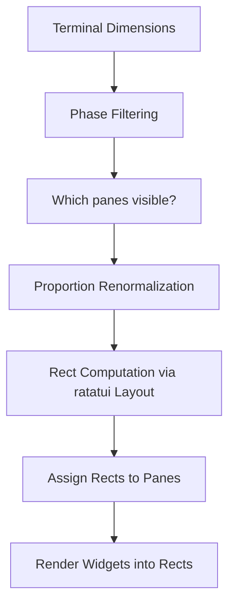

# TUI Layout System

The xaft TUI layout system is responsible for partitioning the terminal screen into rectangular regions for each widget, managing focus across those regions, and adapting the layout dynamically as the terminal is resized or as different phases require different panels. The layout is computed on every render frame from the current `AppState` and terminal dimensions, ensuring that the display always reflects the latest configuration and available space.

## PaneType Enumeration

The `PaneType` enum defines the set of possible panels that can appear in the TUI. Each variant corresponds to a widget and a rectangular area in the layout:

| PaneType | Widget | Description |
|----------|--------|-------------|
| `Chat` | ConversationWidget | Primary agent output and conversation history |
| `InputBar` | InputBarWidget | User text input area |
| `AgentActivity` | AgentActivityWidget | Current tool execution and agent status |
| `TokenDashboard` | TokenDashboardWidget | Token usage and cost metrics |
| `DiffViewer` | DiffWidget | File change diffs |
| `FileTree` | FileTreeWidget | Modified files tree |
| `StatusBar` | StatusBarWidget | Session status, phase, and metrics |

Not all panes are visible at all times. The layout solver selects which panes to display based on the current `WorkflowPhase`, the terminal dimensions, and the user's configuration. For example, the `DiffViewer` and `FileTree` panes are hidden during the `Idle` and `Planning` phases (when no files have been modified), and the `ApprovalWidget` overlay appears only when there are pending approval requests.

## Dynamic Layout Solver

The layout solver is the algorithm that computes the position and size of each visible pane. It runs on every render frame, taking the terminal dimensions, the current phase, and the configured layout proportions as inputs. The solver produces a set of `Rect` values — one per visible pane — that partition the screen without overlap.

### Layout Configuration

The layout is configured through `TuiConfig::layout`, which specifies the relative widths and heights of each panel. The configuration uses percentage-based proportions that sum to 100. For example, a default layout might allocate:

- **Left column (60%)**: Chat pane (top), InputBar pane (bottom)
- **Right column (40%)**: AgentActivity pane (top), TokenDashboard pane (middle), DiffViewer pane (bottom)

The `StatusBar` pane spans the full width at the bottom of the screen and is not part of the percentage allocation — it always occupies exactly one row.

### Solver Algorithm

The solver works in three passes:

1. **Phase Filtering**: Determine which panes are relevant for the current `WorkflowPhase`. During `Idle`, only `Chat`, `InputBar`, and `StatusBar` are shown. During `Coding`, all panes are shown. During `QaReview`, the `DiffViewer` is given extra space.

2. **Proportion Validation**: Ensure that the configured proportions for visible panes sum to 100. If they don't (e.g., because a hidden pane's proportion is unaccounted for), the proportions are renormalized. The `validate()` function in the configuration system checks that all configured widths sum to 100, but runtime hiding of panes requires dynamic renormalization.

3. **Rect Computation**: Using `ratatui::layout` constraints, compute the `Rect` for each pane. The solver uses `Layout::default().direction(Vertical).split(terminal_area)` to create the major rows, then `Layout::default().direction(Horizontal).split(row_area)` to create columns within each row.



### Example Layouts

**Idle Phase Layout (3 panes)**:
```
+------------------------------------------+
|                                          |
|              Chat (100%)                 |
|                                          |
+------------------------------------------+
|            InputBar (3 rows)             |
+------------------------------------------+
|            StatusBar (1 row)             |
+------------------------------------------+
```

**Coding Phase Layout (7 panes)**:
```
+---------------------------+---------------+
|                           | AgentActivity |
|      Chat (60%)           |    (40%)      |
|                           +---------------+
|                           | TokenDashboard|
|                           |    (40%)      |
+---------------------------+---------------+
|      InputBar (3 rows)    | DiffViewer    |
+---------------------------+    (40%)      |
|      StatusBar (1 row)    | FileTree      |
+---------------------------+---------------+
```

**Approval Overlay**:
```
+---------------------------+---------------+
|                           | AgentActivity |
|      Chat (60%)           |    (40%)      |
|                           +-------+-------+
|                    +------+-------+       |
|                    | APPROVAL WIDGET |     |
|                    +------+-------+       |
+---------------------------+-------+-------+
|      InputBar (3 rows)    | DiffViewer    |
+---------------------------+    (40%)      |
|      StatusBar (1 row)    | FileTree      |
+---------------------------+---------------+
```

## Focus Management

Focus determines which widget receives keyboard input events. The `AppState::focused_panel` field stores the currently focused `PaneType`, and keyboard events are routed exclusively to that widget. Focus management follows these rules:

### Focus Cycling

The user cycles focus forward with `Tab` and backward with `Shift+Tab`. The focus order follows the visual layout: left-to-right, top-to-bottom. Only visible panes are included in the cycle — hidden panes are skipped. When the user presses `Tab` on the last visible pane, focus wraps around to the first visible pane.

### Focus Stealing

Certain events cause focus to be automatically redirected:

- **Approval Request**: When a `ToolPendingApproval` event arrives, focus is moved to the `ApprovalWidget` overlay. The previous focus is saved and restored when the last pending approval is resolved.
- **Task Completion**: When a task completes (`RunComplete` or `TaskComplete` event), focus is moved to the `InputBar` so the user can immediately type a follow-up message.
- **Error**: When a `RuntimeError` event arrives, focus is moved to the `Chat` pane so the user can see the error message.

### Visual Focus Indicators

The focused widget is visually distinguished with a highlighted border. The highlight color is drawn from the active `Theme`, typically a bright accent color (cyan in the dark theme, blue in the light theme). Unfocused widgets have a dim border or no border at all, depending on the theme. The `InputBar` widget also shows a blinking cursor when focused and a static cursor when unfocused, providing an additional visual cue for text input readiness.

## Resize Handling

When the terminal is resized (detected via `TuiEvent::Resize`), the layout solver recomputes all pane dimensions. Widgets must handle arbitrary `Rect` sizes gracefully — the conversation widget wraps text, the diff widget switches between side-by-side and unified format, and the token dashboard reflows its metrics. If the terminal becomes too small to display all configured panes (below a minimum width of 80 columns or height of 24 rows), the solver falls back to a minimal layout showing only the `Chat`, `InputBar`, and `StatusBar` panes, ensuring that the user can always interact with the agent even in severely constrained terminals.

The minimum layout also suppresses the right column entirely, giving the `Chat` pane the full terminal width. This "compact mode" is indicated by a "Terminal too small for full layout" message in the status bar. When the terminal is resized back above the minimum threshold, the full layout is restored automatically.

## Theme Integration

The layout system is closely tied to the theme system, which provides the colors and styles used to render pane borders, backgrounds, and text. The `Theme` enum supports four built-in themes:

- **Dark**: Dark backgrounds with light text, optimized for low-light environments
- **Light**: Light backgrounds with dark text, optimized for bright environments
- **Solarized**: The Solarized color palette, popular among developers
- **Custom**: User-defined colors loaded from a theme file

Each theme defines a comprehensive set of color roles — primary, secondary, accent, error, warning, success — that widgets use consistently. The theme is selected via `TuiConfig::theme` and can be changed at runtime through a keybinding (default: `Ctrl+T`), which cycles through the available themes. Theme changes take effect immediately on the next render frame without requiring a restart.
