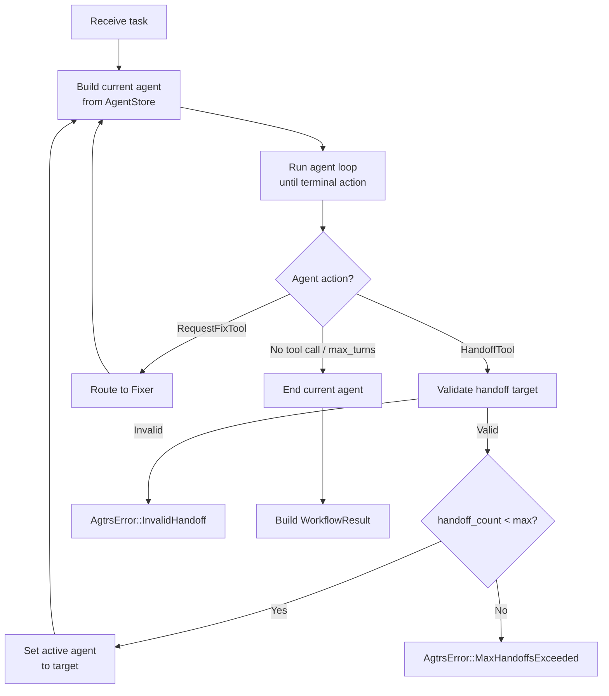

# Workflow System Overview

The xaft workflow system orchestrates multi-agent collaboration through a handoff-based architecture. Rather than a single monolithic agent attempting every task, xaft decomposes work into specialized agent roles — Planner, Coder, QA, Fixer — that cooperate by passing control to one another via structured handoff messages. The `HandoffOrchestrator` manages this coordination, enforcing limits, routing messages, and ensuring that every agent operates within its defined capabilities.

---

## Why Handoff-Based Orchestration?

Single-agent architectures suffer from several well-known limitations: context window pollution (the agent's conversation grows until it forgets early instructions), role confusion (the agent tries to plan, code, and verify simultaneously), and error amplification (a mistake in one phase propagates unchecked into the next). Handoff-based orchestration addresses these problems by:

1. **Isolating context**: Each agent starts with a clean, role-appropriate prompt and only sees the conversation history relevant to its task. The planner never sees the coder's tool invocations, and the coder never sees the planner's internal reasoning.

2. **Enforcing separation of concerns**: Each agent has a specific role with a specific tool set. The planner cannot write files; the coder cannot approve its own work. This prevents the common failure mode where an LLM "approves" its own output without genuine verification.

3. **Enabling targeted recovery**: When QA rejects code, only the Fixer re-engages — the Planner's original plan is preserved and the Fixer works within its scope. There is no need to restart the entire workflow from scratch.

4. **Bounding execution**: The orchestrator tracks handoff count and enforces a maximum (default: 14). This prevents infinite loops where agents pass a problem back and forth indefinitely.

---

## `HandoffOrchestrator`

The `HandoffOrchestrator` is the central coordinator that drives the entire workflow:

```rust
pub struct HandoffOrchestrator {
    max_handoffs: usize,
    conv_store: Arc<dyn ConversationStore>,
    agent_store: Arc<AgentStore>,
    prompt_fn: Box<dyn Fn(&str) -> String>,
    approval_gate: Arc<dyn ApprovalGate>,
}
```

### Construction via `orchestrator::run_workflow()`

The primary entry point is the free function `run_workflow()`, which constructs the orchestrator and begins execution:

```rust
pub async fn run_workflow(
    task: String,
    conv_store: Arc<dyn ConversationStore>,
    agent_store: Arc<AgentStore>,
    prompt_fn: Box<dyn Fn(&str) -> String>,
    approval_gate: Arc<dyn ApprovalGate>,
) -> Result<WorkflowResult, AgtrsError>
```

This function:

1. Creates a `HandoffOrchestrator` with `max_handoffs = 14`.
2. Initializes the `AgentStore` with the standard agent definitions (Planner, Coder, QA, Fixer).
3. Sets the initial agent to "planner" and injects the user's task as the first message.
4. Enters the handoff loop.

### The Handoff Loop

The orchestrator runs a loop that continues until one of three termination conditions is met:



Each iteration of the loop:

1. Reads the active agent name from the `AgentStore`.
2. Calls `agent_store.build_agent(active_name)` to construct the agent with its tool set and system prompt.
3. Runs the agent loop, which lets the agent invoke tools and generate text until it either calls a handoff tool or exhausts its `max_turns` budget.
4. If the agent called `HandoffTool`, validates the target agent name against the source agent's `can_handoff_to` list and increments the handoff counter.
5. If the handoff counter exceeds `max_handoffs`, returns `AgtrsError::MaxHandoffsExceeded`.
6. If the agent finished without a handoff (text-only response or max turns reached), the loop terminates.

---

## Handoff Semantics

A handoff is more than a function call — it is a structured transfer of control that carries context between agents:

### What Gets Transferred

| Data | Description |
|------|-------------|
| **Task summary** | The originating agent produces a summary of what it accomplished and what the next agent should do. This summary becomes the first message in the receiving agent's conversation. |
| **Pending summary** | For `RequestFixTool`, the QA agent sets a `pending_summary` that describes what needs to be fixed. The Fixer reads this summary as its task. |
| **Conversation context** | The receiving agent does NOT see the originating agent's full conversation. It only sees the task summary, its own system prompt, and any conversation history from previous turns in its own context. |

### What Does NOT Get Transferred

- Tool invocation results from the originating agent (these are private to that agent's context).
- The originating agent's system prompt (the receiving agent has its own).
- The originating agent's internal reasoning (only the summary is shared).

This isolation is deliberate. It prevents context pollution and ensures that each agent reasons from its own perspective rather than being influenced by the internal deliberations of a different role.

---

## `HandoffTool`

The `HandoffTool` is the mechanism by which agents transfer control:

```rust
pub struct HandoffTool {
    store: Arc<AgentStore>,
    allowed_targets: Vec<String>,
}
```

### Input Schema

```json
{
  "type": "object",
  "properties": {
    "target_agent": {
      "type": "string",
      "description": "Name of the agent to hand off to"
    },
    "summary": {
      "type": "string",
      "description": "Summary of what was accomplished and what the next agent should do"
    }
  },
  "required": ["target_agent", "summary"]
}
```

### Validation

When `HandoffTool.call()` is invoked, it performs three checks:

1. **Target existence**: The `target_agent` must be a registered agent name in the `AgentStore`. Unknown names produce `ToolResult::error("unknown agent: <name>")`.

2. **Target authorization**: The `target_agent` must appear in the originating agent's `allowed_targets` list (set from `can_handoff_to` in the `AgentDefinition`). Unauthorized handoffs produce `ToolResult::error("not authorized to hand off to: <name>")`. This prevents an agent from routing to an unexpected role — e.g., the Planner cannot hand off directly to QA, bypassing the Coder.

3. **Handoff count**: The orchestrator checks the global handoff counter after the tool returns. If the count exceeds `max_handoffs`, the workflow terminates with `AgtrsError::MaxHandoffsExceeded`.

When all checks pass, `HandoffTool` writes the handoff record to the `HandoffAgentStore`, which the orchestrator reads on the next loop iteration to determine the active agent.

---

## `RequestFixTool`

The `RequestFixTool` is a specialized handoff variant used by the QA agent to route work to the Fixer:

```rust
pub struct RequestFixTool {
    store: Arc<AgentStore>,
}
```

### Input Schema

```json
{
  "type": "object",
  "properties": {
    "summary": {
      "type": "string",
      "description": "Description of what needs to be fixed and why"
    }
  },
  "required": ["summary"]
}
```

Unlike `HandoffTool`, `RequestFixTool` does not accept a `target_agent` — it always routes to the "fixer" agent. This is intentional: the QA agent's only escalation path is to the Fixer. It cannot skip to the Planner or any other agent. This constraint keeps the QA→Fixer→QA loop tight and prevents the workflow from degenerating into unstructured agent hopping.

When invoked, `RequestFixTool` sets two values in the `AgentStore`:

- `active_agent` → `"fixer"`
- `pending_summary` → the provided summary string

The Fixer reads the `pending_summary` as its task on the next loop iteration.

---

## `AgentStore` and Conversation Storage

The `AgentStore` maintains runtime state for the workflow:

```rust
pub trait AgentStore: Send + Sync {
    fn active_agent(&self) -> String;
    fn set_active_agent(&self, name: &str);
    fn pending_summary(&self) -> Option<String>;
    fn set_pending_summary(&self, summary: &str);
    fn agent_names(&self) -> Vec<String>;
    fn build_agent(&self, name: &str) -> Result<Agent, AgtrsError>;
}
```

The `HandoffAgentStore` is the standard implementation, backed by an in-memory `RwLock` for thread-safe access. It is created during `run_workflow()` and shared across all agents and the orchestrator via `Arc`.

The `ConversationStore` manages per-agent conversation history:

```rust
pub trait ConversationStore: Send + Sync {
    fn messages(&self, agent_name: &str) -> Vec<Message>;
    fn add_message(&self, agent_name: &str, message: Message);
    fn clear(&self, agent_name: &str);
}
```

Each agent has its own conversation history, isolated from other agents. When a handoff occurs, the receiving agent's conversation is initialized with a single user message containing the handoff summary. The originating agent's conversation is preserved (for potential post-hoc analysis) but not shared with the receiving agent.

---

## Termination and Post-Orchestration

When the handoff loop terminates, the orchestrator performs post-processing to produce a user-facing result. The logic varies based on which agent was last active:

- **Planner was the last agent**: The planner's final text output is returned directly as the workflow result. This is the "informational task" path — the user asked a question and got an answer, no code changes needed.

- **Any other agent was the last agent**: The orchestrator checks the agent's output for the "APPROVED" signal (indicating QA approval). If found, it parses `EditSummary` records from the conversation to enumerate what files were changed and how. Finally, it uses `OneShotPlanner` to generate a concluding summary that synthesizes the plan, the changes made, and the QA verdict into a cohesive result.

This dual-path termination ensures that informational queries return immediately without unnecessary orchestration overhead, while coding workflows always conclude with a verified, summarized result.
