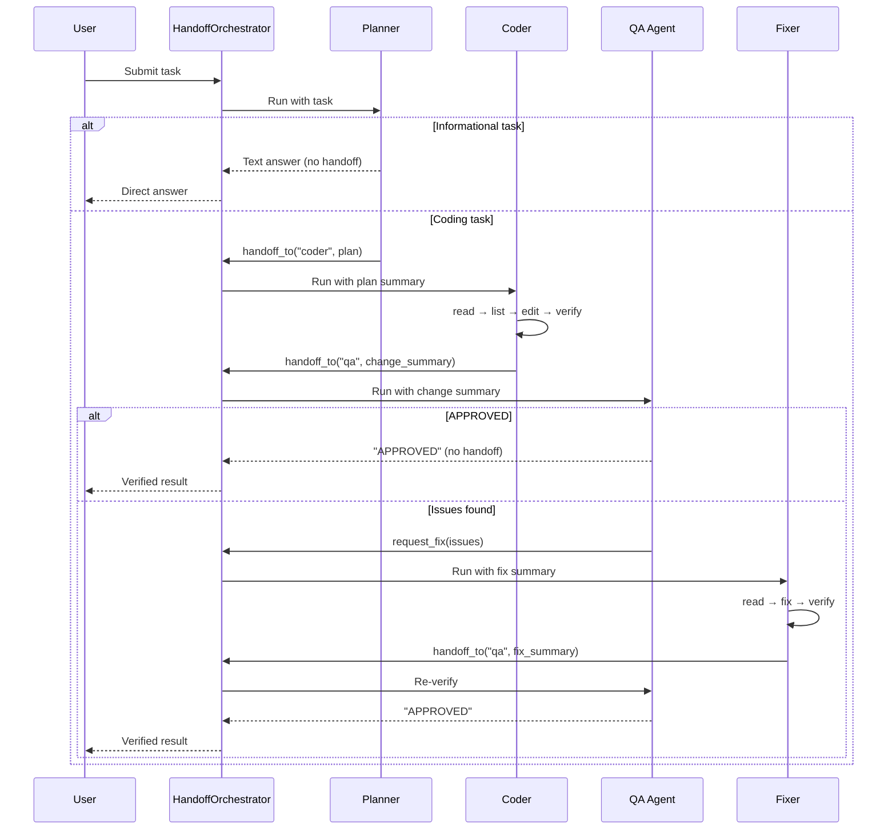

# Standard Workflow: Planner → Coder → QA → Fixer

The standard workflow is xaft's default multi-agent pipeline for coding tasks. It implements a plan-code-verify-fix loop that mirrors how a human software team operates: a planner decides what to do, a coder implements it, a QA reviewer verifies it, and a fixer addresses any issues — with the QA↔Fixer cycle repeating until the code is approved. This page provides a detailed walkthrough of each agent's responsibilities, the handoff protocol between them, and the termination conditions that produce the final result.

---

## Pipeline Overview



---

## Agent 1: Planner

### Role

The Planner is the first agent in the pipeline. It receives the user's raw task description and produces either a direct answer (for informational queries) or a structured coding plan (for implementation tasks). The planner's primary skill is classification — it must determine whether the task requires code changes and, if so, decompose it into actionable steps.

### Tool Set

The Planner uses the **reader registry**: `list_files`, `read_file`, `grep`, plus optional git tools. It has no write or shell capabilities, which forces it to focus on analysis and planning rather than jumping ahead to implementation. The `HandoffTool` is added with `allowed_targets: ["coder"]`, enabling the planner to delegate coding work.

### Decision Logic

The planner classifies tasks using its system prompt and LLM reasoning:

- **Informational tasks** (e.g., "explain how the tool registry works", "what does this function do?"): The planner answers directly with a text response. No handoff occurs, and the orchestrator terminates immediately, returning the planner's answer as the workflow result.

- **Coding tasks** (e.g., "add a new tool", "fix the bug in edit_file", "refactor the registry builder"): The planner formulates a `CodingPlan` and hands off to the Coder via `HandoffTool`. The plan includes the files to modify, the changes to make, and any constraints or considerations.

### Coding Plan Structure

The planner's handoff summary follows a semi-structured format:

```
Task: Add a cache tool that stores key-value pairs in memory

Files to modify:
- src/tools/mod.rs (register CacheTool)
- src/tools/cache.rs (new file: implement CacheTool)

Changes:
1. Create src/tools/cache.rs with a CacheTool struct that uses a DashMap
2. Implement the Tool trait with name "cache", schema for get/set operations
3. Register CacheTool in src/tools/mod.rs

Constraints:
- Thread-safe: use DashMap, not HashMap+Mutex
- Support get, set, and delete operations
- Max value size: 10KB
```

This format is consumed by `parse_plan_result()`, which extracts structured data from the planner's natural language output. The parser uses a heuristic strategy: first try JSON parsing, then numbered-list pattern matching, then fall back to treating the entire output as a `CodingPlan` with the raw text as the description.

---

## Agent 2: Coder

### Role

The Coder receives the planner's coding plan and implements it. It reads relevant files, makes the specified changes, verifies that they compile or are syntactically correct, and then hands off to QA for review.

### Tool Set

The Coder uses the **coder registry**: `list_files`, `read_file`, `grep`, `write_file`, `edit_file`, plus optional `bash_exec` and git tools. This is the broadest tool set in the standard workflow, reflecting the coder's need to both understand and modify the codebase.

### Implementation Pattern

The Coder follows a consistent read→list→edit→verify pattern:

1. **Read**: Use `read_file` to examine the files identified in the plan. The coder reads the full context around the modification sites, not just the lines it plans to change. This prevents the common LLM failure mode of making changes that are syntactically valid but semantically incorrect because they don't account for surrounding code.

2. **List**: Use `list_files` to discover any additional files that the plan didn't mention but that are relevant (e.g., a module's `mod.rs` that needs to be updated to expose a new submodule).

3. **Edit**: Use `edit_file` for targeted changes and `write_file` for new files. The coder prefers `edit_file` because it is less error-prone — it preserves the untouched portions of the file and uses fuzzy matching to handle minor discrepancies between the LLM's mental model and the actual file content.

4. **Verify**: Use `bash_exec` to run compile checks (`cargo check`), lint passes (`cargo clippy`), or test suites. Verification is optional but strongly recommended — a coder that verifies its work catches syntax errors, type mismatches, and import problems before they reach QA, reducing the number of fix cycles.

### Handoff to QA

After completing the implementation and verification, the Coder calls `HandoffTool` with `target_agent: "qa"` and a summary of changes:

```
Completed implementation of CacheTool.

Changes made:
- Created src/tools/cache.rs: implemented CacheTool with DashMap backend
  - get, set, delete operations with JSON schema
  - 10KB value size limit enforced
  - Thread-safe via DashMap
- Modified src/tools/mod.rs: added mod cache and registered CacheTool

Verification:
- cargo check: passed
- cargo clippy: no warnings
```

This summary gives the QA agent enough context to begin its review without needing to read every file from scratch.

---

## Agent 3: QA Agent

### Role

The QA agent is the quality gate. It reviews the Coder's changes, verifies correctness, and either approves the work or requests fixes. The QA agent has read-only tools, which is critical — it cannot modify the code it is reviewing, ensuring genuine independence between implementation and verification.

### Tool Set

The QA agent uses the **reader registry**: `list_files`, `read_file`, `grep`, plus optional git tools. It also has `RequestFixTool`, which enables it to escalate issues to the Fixer. Notably, the QA agent does NOT have `HandoffTool` — it cannot hand off to any agent other than the Fixer. This constraint prevents the QA agent from shortcutting back to the Planner or Coder, which would bypass the review process.

### Review Process

The QA agent follows a systematic review protocol:

1. **Read changed files**: Using `read_file`, the QA agent reads each file mentioned in the Coder's handoff summary. It reads the full file, not just the diff, to evaluate the changes in context.

2. **Cross-reference the plan**: The QA agent compares the implementation against the original coding plan from the Planner. Any discrepancy — missing features, extra changes, deviations from constraints — is flagged.

3. **Verify correctness**: The QA agent uses `grep` to check for consistency (e.g., are all references to a renamed function updated?), `read_file` to inspect edge cases, and `bash_exec` (if available) to run tests.

4. **Render verdict**: The QA agent produces one of two outcomes:
   - **"APPROVED"**: The implementation is correct, complete, and consistent with the plan. The QA agent's final message contains the string "APPROVED" (case-sensitive), which the orchestrator detects as a termination signal.
   - **`request_fix(summary)`**: The implementation has issues. The QA agent invokes `RequestFixTool` with a detailed description of the problems.

### Fix Request Format

```
Issues found in CacheTool implementation:

1. Missing error handling: When the value exceeds 10KB, the tool panics
   instead of returning ToolResult::error(). Expected: graceful error
   message like "value exceeds 10KB limit".

2. The delete operation returns ToolResult::ok("deleted") even when
   the key doesn't exist. Expected: ToolResult::error("key not found").

3. The schema says "delete" but the tool name uses "remove" in the
   description. Please make them consistent.

Files to check:
- src/tools/cache.rs (lines 34-56 for error handling, line 78 for delete)
```

The fix request is specific: it identifies exact problems, references line numbers, and states the expected behavior. This specificity is crucial for the Fixer, which relies on the QA agent's description rather than independently discovering the issues.

---

## Agent 4: Fixer

### Role

The Fixer receives the QA agent's fix request and makes the necessary corrections. It is essentially a specialized Coder that operates within a narrower scope — it only fixes what QA flagged, rather than implementing an entire plan from scratch.

### Tool Set

The Fixer uses the **coder registry** (same as the Coder): `list_files`, `read_file`, `grep`, `write_file`, `edit_file`, plus optional `bash_exec` and git tools. It also has `HandoffTool` with `allowed_targets: ["qa"]`, enabling it to send its fixes back for re-review.

### Fix-Verify-Handoff Cycle

The Fixer follows a streamlined workflow:

1. **Read**: Examine the files identified in the QA fix request, focusing on the flagged lines.
2. **Fix**: Apply targeted edits using `edit_file`, addressing each issue from the fix request.
3. **Verify**: Run compile checks or tests to confirm the fixes don't introduce new problems.
4. **Handoff**: Call `HandoffTool` with `target_agent: "qa"` and a summary of fixes applied.

```
Fixed issues in CacheTool:

1. Added size check with ToolResult::error for values exceeding 10KB
2. Changed delete to return ToolResult::error when key not found
3. Updated description to use "delete" consistently

All changes in src/tools/cache.rs.
Verification: cargo check passed.
```

After the handoff, the QA agent re-reviews the code. If the fixes are satisfactory, it approves. If new issues are found (or the original issues weren't fully resolved), it sends another fix request. This QA→Fixer→QA loop continues until either:

- The QA agent approves the code.
- The handoff count exceeds `max_handoffs` (14), at which point the orchestrator terminates with an error.

The handoff limit is a safety valve. In practice, most coding tasks complete within 2–4 handoffs (Planner→Coder→QA, or Planner→Coder→QA→Fixer→QA). The 14-handoff limit accommodates complex tasks that require multiple fix cycles while preventing pathological cases where agents loop indefinitely.

---

## Post-Orchestration Processing

When the handoff loop terminates, the orchestrator examines the last active agent and produces a `WorkflowResult`:

### Case 1: Planner Terminated (Informational Task)

If the planner produced a text answer without handing off, the orchestrator returns the planner's final message directly:

```rust
WorkflowResult {
    answer: planner_output,
    files_changed: vec![],
    approved: true,  // informational tasks are always "approved"
}
```

### Case 2: QA Approved (Coding Task)

If the last agent was QA and its output contains "APPROVED", the orchestrator:

1. Parses `EditSummary` records from the Coder and Fixer conversations to enumerate all file changes.
2. Calls `OneShotPlanner` to generate a concluding summary that synthesizes the original plan, the changes made, and the QA verdict.

```rust
WorkflowResult {
    answer: concluding_summary,
    files_changed: edit_summaries,
    approved: true,
}
```

### Case 3: Max Handoffs Exceeded

If the handoff count reached `max_handoffs`, the orchestrator returns:

```rust
WorkflowResult {
    answer: "Workflow exceeded maximum handoffs. Last agent: <name>.".to_string(),
    files_changed: parse_partial_changes(),
    approved: false,
}
```

The partial changes are included so the user can assess what was accomplished before the limit was hit.

---

## Handoff Count Budget

Understanding the handoff budget helps when designing workflows and diagnosing failures:

| Handoff | From | To | Typical Trigger |
|---------|------|----|-----------------|
| 1 | Planner | Coder | Coding task identified |
| 2 | Coder | QA | Implementation complete |
| 3 | QA | Fixer | Issues found |
| 4 | Fixer | QA | Fixes applied |
| 5 | QA | Fixer | More issues found (rare) |
| 6 | Fixer | QA | Second round of fixes |
| ... | ... | ... | Additional fix cycles |
| 14 | — | — | Max reached, workflow terminates |

Most tasks complete within 4 handoffs. If you find workflows routinely approaching the limit, it may indicate that the Coder's system prompt needs refinement (producing lower-quality initial code) or that the QA agent's fix requests are too vague (causing the Fixer to miss issues).
