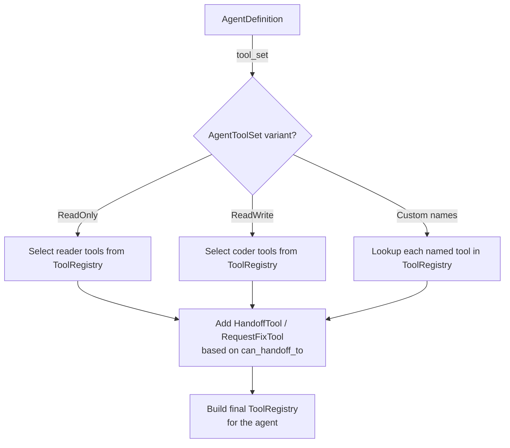
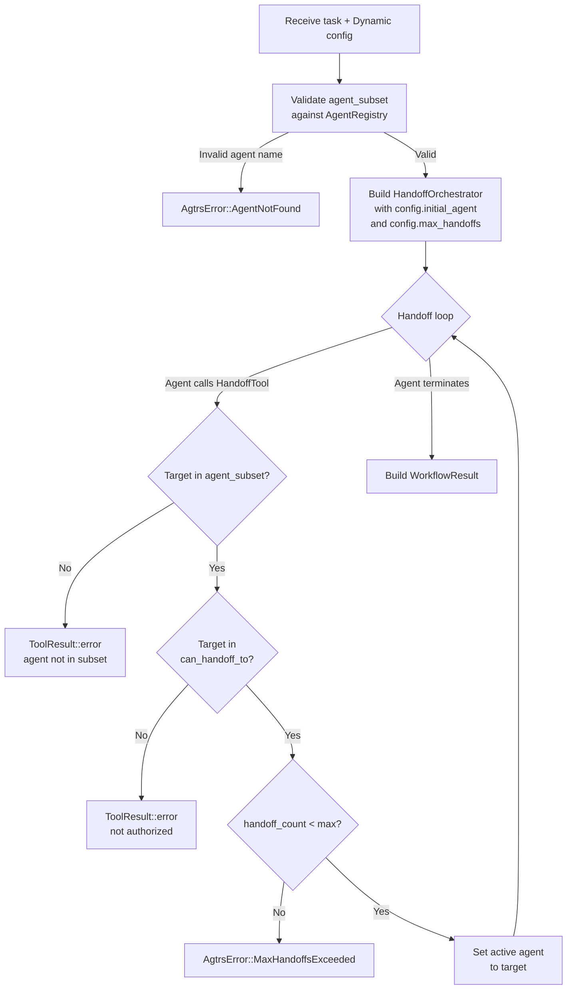

# Dynamic Handoff & Agent Registry

While the standard workflow provides a fixed Planner→Coder→QA→Fixer pipeline, many real-world scenarios demand more flexible agent topologies. You might need a specialized database agent, a security reviewer, or a documentation writer — agents that don't fit into the four-role standard model. The dynamic handoff system, built on top of `AgentRegistry` and `WorkflowConfig::Dynamic`, enables exactly this kind of extensible, role-agnostic orchestration.

---

## `AgentDefinition`

The `AgentDefinition` is the blueprint for constructing an agent at runtime:

```rust
pub struct AgentDefinition {
    pub name: String,
    pub system_prompt_fn: Box<dyn Fn(&str) -> String + Send + Sync>,
    pub tool_set: AgentToolSet,
    pub max_turns: usize,
    pub can_handoff_to: Vec<String>,
}
```

### Fields

| Field | Type | Purpose |
|-------|------|---------|
| `name` | `String` | Unique identifier for the agent. Used for registry lookup, handoff targeting, and logging. Must be a valid Rust identifier (snake_case) to ensure compatibility with the tool system's naming conventions. |
| `system_prompt_fn` | `Box<dyn Fn(&str) -> String>` | A closure that generates the agent's system prompt given a task description. The closure pattern (rather than a static string) allows prompts to be dynamically constructed based on workspace context, configuration, or the current task. The input parameter is the task or handoff summary. |
| `tool_set` | `AgentToolSet` | Declares which tools the agent should receive. See below for details. |
| `max_turns` | `usize` | Maximum number of tool-call + response cycles the agent may execute before being terminated. This prevents runaway agents from consuming unbounded resources. Typical values: 10 for simple agents, 20 for complex coding agents. |
| `can_handoff_to` | `Vec<String>` | List of agent names that this agent is authorized to hand off to. This is enforced by `HandoffTool` at runtime — attempting to hand off to an agent not in this list produces a `ToolResult::error(...)`. |

### System Prompt Function

The `system_prompt_fn` is the most nuanced field. It receives the task description (or handoff summary) and returns the full system prompt for the agent. This allows prompts to be context-aware:

```rust
let planner_def = AgentDefinition {
    name: "planner".to_string(),
    system_prompt_fn: Box::new(|task| {
        format!(
            "You are a planning agent. Analyze the task and decide whether it requires \
             code changes or is purely informational.\n\n\
             Available agents you can hand off to: coder\n\n\
             Task: {}", task)
    }),
    tool_set: AgentToolSet::ReadOnly,
    max_turns: 10,
    can_handoff_to: vec!["coder".to_string()],
};
```

The function is called once per agent activation — each time the orchestrator hands off to this agent, a fresh prompt is generated with the current context.

---

## `AgentToolSet`

The `AgentToolSet` enum declaratively specifies which tools an agent should receive, without requiring the caller to manually construct a `ToolRegistry`:

```rust
pub enum AgentToolSet {
    ReadOnly,
    ReadWrite,
    Custom(Vec<String>),
}
```

### Variants

- **`ReadOnly`**: The agent receives the reader registry — `list_files`, `read_file`, `grep`, and optional git tools. This is appropriate for agents that analyze, review, or plan without making changes.

- **`ReadWrite`**: The agent receives the coder registry — all reader tools plus `write_file`, `edit_file`, and optional `bash_exec` and git tools. This is appropriate for agents that implement changes.

- **`Custom(Vec<String>)`**: The agent receives only the tools named in the vector. This is the most flexible option, allowing you to create agents with precisely tailored capabilities. The names must match tools registered in the `ToolRegistry`.

### Tool Set Resolution

When the `AgentRegistry` builds an agent, it resolves the `AgentToolSet` against the shared `ToolRegistry`:



If a `Custom` tool set references a tool name that doesn't exist in the shared `ToolRegistry`, the build fails with `AgtrsError::ToolNotFound`. This fail-fast behavior catches configuration errors at workflow initialization rather than at runtime.

---

## `AgentRegistry`

The `AgentRegistry` is a centralized catalog of all agent definitions available to a workflow:

```rust
pub struct AgentRegistry {
    order: Vec<String>,
    definitions: HashMap<String, AgentDefinition>,
}
```

Like the `ToolRegistry`, the `AgentRegistry` uses a dual-index structure: a `HashMap` for O(1) lookup by name and an `order` vector for deterministic iteration. The order vector determines the order in which agents are listed in workflow initialization logs and debugging output.

### Methods

| Method | Signature | Description |
|--------|-----------|-------------|
| `new()` | `-> Self` | Creates an empty registry. |
| `default_xaft()` | `-> Self` | Creates a registry pre-populated with the standard four agents: Planner, Coder, QA, Fixer. This is the convenience constructor for the standard workflow. |
| `register(&mut self, def: AgentDefinition)` | `-> &mut Self` | Adds an agent definition. If a definition with the same name already exists, it is replaced. Returns `&mut Self` for chaining. |
| `agent_names(&self)` | `-> Vec<&str>` | Returns all registered agent names in insertion order. |
| `get(&self, name: &str)` | `-> Option<&AgentDefinition>` | Looks up a definition by name. Returns `None` for unknown agents. |
| `build_agent(&self, name: &str, ...)` | `-> Result<Agent, AgtrsError>` | Constructs a concrete `Agent` from the definition, resolving the tool set and injecting handoff tools. |

### `default_xaft()` Agent Definitions

The `default_xaft()` constructor creates these four agents:

| Name | Tool Set | max_turns | can_handoff_to |
|------|----------|-----------|----------------|
| `planner` | ReadOnly | 10 | `["coder"]` |
| `coder` | ReadWrite | 20 | `["qa"]` |
| `qa` | ReadOnly | 10 | (uses `RequestFixTool`) |
| `fixer` | ReadWrite | 15 | `["qa"]` |

---

## `WorkflowConfig`

`WorkflowConfig` determines how the orchestrator selects and sequences agents:

```rust
pub enum WorkflowConfig {
    Standard,
    Dynamic {
        initial_agent: String,
        max_handoffs: usize,
        agent_subset: Vec<String>,
    },
}
```

### `WorkflowConfig::Standard`

Uses the full four-agent pipeline starting from the Planner. This is the default and is equivalent to calling `run_workflow()` directly. All four standard agents are available, and the handoff topology is fixed: Planner→Coder→QA, with QA↔Fixer loops.

### `WorkflowConfig::Dynamic`

Configures a custom workflow with a subset of agents and a configurable starting point:

| Field | Type | Purpose |
|-------|------|---------|
| `initial_agent` | `String` | The name of the first agent to activate. This replaces the fixed "planner" start of the standard workflow. You might start with "coder" if the task description is already a detailed implementation spec, or with a custom "security_auditor" agent. |
| `max_handoffs` | `usize` | Overrides the default handoff limit of 14. Lower values create tighter execution bounds; higher values accommodate more complex topologies. |
| `agent_subset` | `Vec<String>` | Only the agents named in this vector are included in the workflow. Agents in the `AgentRegistry` that are not in this subset are unavailable for handoff, even if another agent's `can_handoff_to` references them. |

---

## `run_dynamic_handoff()`

The `run_dynamic_handoff()` function is the entry point for dynamic workflows:

```rust
pub async fn run_dynamic_handoff(
    task: String,
    config: WorkflowConfig::Dynamic,
    agent_registry: Arc<AgentRegistry>,
    conv_store: Arc<dyn ConversationStore>,
    prompt_fn: Box<dyn Fn(&str) -> String>,
    approval_gate: Arc<dyn ApprovalGate>,
) -> Result<WorkflowResult, AgtrsError>
```

### Execution Flow



The key difference from the standard workflow is the validation layer: `run_dynamic_handoff()` checks both the `agent_subset` constraint and the `can_handoff_to` authorization before allowing a handoff. This double-gate ensures that even if an agent's definition lists an authorized target, that target must also be in the active subset for the workflow to reach it.

### Subset Isolation

The `agent_subset` is more than a filter — it creates an isolation boundary. Consider a scenario where the `AgentRegistry` contains 10 agents, but the dynamic config specifies a subset of only 3:

```
Registry: planner, coder, qa, fixer, db_admin, security_auditor, doc_writer, perf_tester, deployer, monitor
Subset:   coder, security_auditor, qa
```

In this workflow, the coder can only hand off to `security_auditor` or `qa` (if its `can_handoff_to` includes them), and the other 7 agents are completely inaccessible. This is useful for:

- **Scoped deployments**: Running a security-only workflow that doesn't need the full pipeline.
- **A/B testing**: Comparing different agent configurations by running them as separate dynamic workflows with different subsets.
- **Least-privilege execution**: Giving the workflow only the agents it needs, reducing the attack surface if an LLM generates unexpected handoff targets.

---

## Building a Custom Dynamic Workflow

Here is a complete example of a custom workflow with a database migration agent:

```rust
// 1. Define custom agents
let db_migrator = AgentDefinition {
    name: "db_migrator".to_string(),
    system_prompt_fn: Box::new(|task| {
        format!(
            "You are a database migration agent. Generate and apply schema changes.\n\
             Task: {}", task)
    }),
    tool_set: AgentToolSet::ReadWrite,
    max_turns: 15,
    can_handoff_to: vec!["qa".to_string()],
};

let migration_qa = AgentDefinition {
    name: "migration_qa".to_string(),
    system_prompt_fn: Box::new(|task| {
        format!(
            "You are a database QA agent. Verify migration scripts for safety and correctness.\n\
             Task: {}", task)
    }),
    tool_set: AgentToolSet::ReadOnly,
    max_turns: 10,
    can_handoff_to: vec!["db_migrator".to_string()],
};

// 2. Build the agent registry
let mut registry = AgentRegistry::new();
registry.register(db_migrator);
registry.register(migration_qa);

// 3. Configure the dynamic workflow
let config = WorkflowConfig::Dynamic {
    initial_agent: "db_migrator".to_string(),
    max_handoffs: 8,
    agent_subset: vec!["db_migrator".to_string(), "migration_qa".to_string()],
};

// 4. Run
let result = run_dynamic_handoff(
    "Add a 'created_at' timestamp column to the users table".to_string(),
    config,
    Arc::new(registry),
    conv_store,
    prompt_fn,
    approval_gate,
).await?;
```

This workflow starts with `db_migrator`, which generates the migration SQL and applies it. It then hands off to `migration_qa`, which verifies the migration is safe (e.g., checks for NOT NULL constraints without defaults, verifies indexes). If QA finds issues, it can hand off back to `db_migrator` for fixes. The handoff limit of 8 accommodates up to 3 fix cycles.

---

## Combining Standard and Dynamic Agents

The `AgentRegistry::default_xaft()` constructor provides the four standard agents, but you can extend it with custom agents:

```rust
let mut registry = AgentRegistry::default_xaft();
registry.register(my_custom_agent);

let config = WorkflowConfig::Dynamic {
    initial_agent: "planner".to_string(),
    max_handoffs: 14,
    agent_subset: vec![
        "planner".to_string(),
        "coder".to_string(),
        "my_custom_agent".to_string(),
        "qa".to_string(),
    ],
};
```

This gives you the standard agents plus your custom one, with the Planner able to hand off to either the Coder or your custom agent (assuming the Planner's `can_handoff_to` is updated to include it). This composability means you don't have to choose between the standard workflow and a fully custom one — you can start with the standard pipeline and incrementally add specialized agents as your needs evolve.
